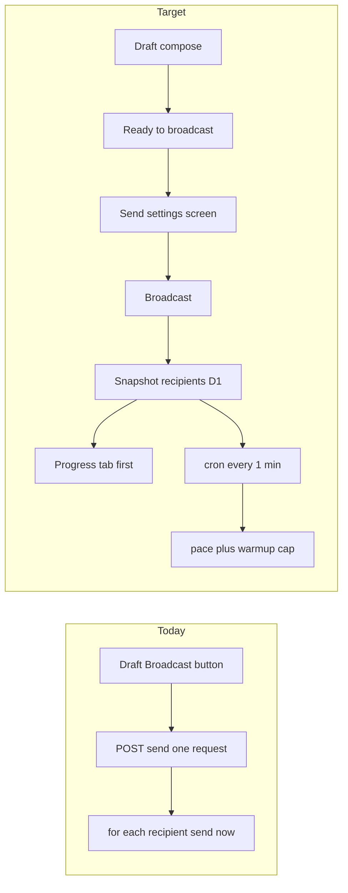

# Broadcast 분할 발송 (pacing + ESP)

## 현재의 문제점 (크리티컬)

- `sendBroadcast()`가 `POST /send` **한 요청** 안에서 수신자마다 `sendOutboundEmail`을 딜레이 없이 순차 호출한다.
- 큐, cron, 재개 커서, 분당 캡이 없다. “순차”일 뿐 paced가 아니다.
- Progress는 5명마다 D1에 쓰지만 `estimatedRemainingMs`는 루프 중 계산하지 않는다.
- 발송 중 row status를 `sending`으로 바꾸지 않고, 끝나면 `sent`/`failed`로 점프한다.
- 1000건이면 통당 I/O 0.3–1초 × 1000 + send/ops 로그 → 한 요청이 수 분 붙는다.
- Worker `cpu_ms` 5분, 클라이언트 fetch 타임아웃, CF Email Sending 일일 쿼터/rate-limit에 잘린다.
- isolate가 중간에 죽으면 `catch`가 안 돌아 `draft` + `sendProgress=running`으로 남을 수 있다.
- 죽은 지점부터 이어서 보내는 커서가 없어, 재전송은 처음부터(또는 실패로 끝)다.
- 같은 본문을 짧은 시간에 대량 투입하면 Gmail/Outlook 스팸·신규 도메인 평판이 깨진다.
- 개별 실패는 카운트만 하고 계속한다. 플랜/쿼터 에러만 그 자리에서 `failed`로 끊는다.
- 중단은 Broadcast 후 **5초 Unsend 전에만** 된다. `/pause` `/cancel` 라우트가 없다.
- Progress를 닫거나 앱을 꺼도 Worker 루프는 요청이 살아있는 한 계속된다.
- 이미 나간 메일은 회수되지 않는다. 루프는 abort 시그널을 보지 않는다.

---

## 지금 왜 막히는가

[`sendBroadcast()`](server/src/lib/catalog-broadcasts.ts)가 `POST /console/broadcasts/:id/send` 한 요청 안에서 수신자마다 `sendOutboundEmail()`을 **딜레이 없이 순차 호출**한다. 큐, cron, 재개 커서, 속도 캡이 없다.

막힘의 층이 두 개다.

- **인프라:** Worker 한 요청/CPU 한도, Cloudflare Email Sending **계정 일일 쿼터**(신규는 보수적, 평판에 따라 자동 상향). 한도 초과 시 queued/rejected.
- **평판:** Gmail/Outlook은 같은 본문을 짧은 시간에 대량으로 보면 스팸 처리한다. 신규 도메인은 특히 취약하다.

추가로 Cloudflare FAQ는 Email Service를 **트랜잭셔널 전용**으로 명시한다. pacing은 ISP/쿼터 폭주를 줄이지만, CF가 뉴스레터를 공식 지원한다는 뜻은 아니다. BYO-CF라 정지 범위는 그 고객 계정으로 한정된다.

**쓰지 않을 것:** 요청 안 `sleep`(대량이면 그대로 타임아웃), Cloudflare Queues(고객 install wrangler/바인딩 추가), To/Bcc 묶음 발송(프라이버시 + CF 메시지당 50명 한도 + 전달률 악화).

기존 D1 큐 패턴([`inbound-events`](server/src/lib/inbound-events.ts))과 이미 있는 Progress 탭을 재사용한다.

---

## 목표 동작

1. Draft 푸터는 **Ready to broadcast** (더 이상 여기서 바로 보내지 않음). 다음 화면에서 기본값이 채워진 세부 설정을 미세 조정한 뒤 **Broadcast**로 시작.
2. 시작 후 수신자 스냅샷 → 즉시 `sending` 반환 → **Progress 탭**으로 이동.
3. Worker가 **분당 N통**만 보낸다. 중단돼도 커서로 재개.
4. 도메인 **warmup 일일 캡**이 그날 pace를 한 번 더 자른다. 남은 분은 다음날 cron이 이어서 보낸다.
5. 메일마다 **List-Unsubscribe** (HTTPS one-click). 이전 hard bounce / 구독해지는 skip.
6. 이번 run 반송률이 임계치를 넘으면 **자동 pause**.

상태: `draft` | `scheduled` | `sending` | `paused` | `sent` | `failed` | `cancelled`. 지금은 타입이 `sending`을 말하지만 코드가 그 값을 쓰지 않는다.

---

## 데이터 (D1 `RELAYBASE_DB`)

새 마이그레이션 `0004_broadcast_pacing.sql` + [`server/db/migrations.ts`](server/db/migrations.ts) + Drizzle [`server/db/app/schema.ts`](server/db/app/schema.ts). 이미 배포된 SQL은 수정하지 않는다. 절차는 [docs/d1-migrations-and-init-db.md](docs/d1-migrations-and-init-db.md).

**`broadcasts` 컬럼 추가**

- `scheduled_at` — ISO, cron이 `scheduled` → 스냅샷 시작
- `pace_mode` — `careful` | `standard` | `fast` | `custom` | `spread`
- `pace_per_minute` — 정수 (spread면 수신자/시간으로 계산해 저장)
- `warmup_exempt` — 기본 0. 쓰지 않거나 숨김. 실수 폭주 방지.

**`broadcast_recipients`**

- `broadcast_id`, `email`, `name`, `status` (`pending` | `sent` | `failed` | `skipped`)
- `skip_reason` (`suppressed` | `bounced` | `unsubscribed` | `cancelled`)
- `error`, `message_id`, `sent_at`, `attempt`
- index: `(broadcast_id, status)`, unique `(broadcast_id, email)`

**`audience_suppressions`**

- `domain`, `email`, `reason` (`unsubscribed` | `bounced`), `created_at`, `broadcast_id?`
- unique `(domain, email)`

**`domain_send_warmup`** (또는 ops_log에서 파생)

- `domain`, `first_sent_at`, `sent_today`, `day_key`
- cron 시작 시 오늘 카운트 보정. 첫 성공 발송일 = warmup day 0.

속도 기본값 (분당, 하드캡 60 — cron 한 번의 Worker 시간에 맞춤):

- careful: 10
- standard: 25
- fast: 50
- custom: 1–60
- spread: `ceil(recipients / (hours * 60))`, 최소 1

Warmup 일일 캡 (해당 도메인 누적 발송일 기준, 보수적):

- day 0–1: 50
- 2–3: 100
- 4–6: 200
- 7–13: 500
- 14+: pace만 (일일 캡 없음)

CF 계정 쿼터는 우리가 모르므로, 429 / rate-limit 응답이면 이번 슬롯을 멈추고 다음 분에 재시도.

---

## Worker 엔진

핵심은 [`sendBroadcast()`](server/src/lib/catalog-broadcasts.ts)를 **시작 + 드레인**으로 쪼개는 것.

**`POST /console/broadcasts/:id/send`**

1. draft/failed/paused만 허용 (이미 sending이면 그대로 반환).
2. 그룹 연락처 union → suppress 제외 → `broadcast_recipients` 스냅샷.
3. `status=sending`, `sendProgress` preparing→sending, `recipientCount` 기록.
4. `waitUntil(drainBroadcastSlice)` 로 첫 슬라이스 즉시 시작.
5. HTTP는 broadcast + progress만 반환. 클라이언트가 전원 완료를 기다리지 않음.

**`POST /console/broadcasts/:id/schedule`**

- `scheduledAt` + pace 저장, `status=scheduled`. 시각이 되면 cron이 send와 같은 스냅샷을 연다.

**`POST .../pause` | `resume` | `cancel`**

- pause: `paused`, cron skip
- resume: `sending`
- cancel: 남은 `pending` → `skipped/cancelled`, `status=cancelled`

**cron** — [`server/wrangler.toml`](server/wrangler.toml) + [`server/customer-install/wrangler.toml`](server/customer-install/wrangler.toml)를 `* * * * *`로 바꾼다. [`scheduled()`](server/src/index.ts)에 `drainDueBroadcasts()`를 추가. audience sync / mailbox reconcile은 기존처럼 내부에서 15분 게이트.

매 분 `drainBroadcastSlice(broadcast)`:

1. warmup 남은 일일 쿼터와 `pace_per_minute` 중 작은 값만큼 `pending`을 가져온다.
2. 한 명씩 `sendOutboundEmail` + send/ops log. 진행은 지금처럼 5명마다 D1.
3. 쿼터 0이면 progress에 “continues tomorrow”를 쓰고 슬라이스를 끝낸다.
4. `pending`이 없으면 `sent` 또는 `failed`(전원 실패).
5. 처리 샘플 ≥ 20 이고 hard bounce율 ≥ 5%면 `paused` + 에러 메시지.

`estimatedRemainingMs`를 pace 기준으로 채운다 (Progress UI가 이미 표시함).

실패한 수신자는 다음 분에 재시도하지 않는다 (`failed` 유지). 같은 broadcast를 다시 보내면 새 run + 새 스냅샷 (지금 failed 재전송과 같음).

---

## 전달률

**List-Unsubscribe** — [`email-send.ts`](server/src/lib/email-send.ts) `SendOutboundParams`에 커스텀 헤더를 열고, broadcast만 넣는다.

- `List-Unsubscribe: <https://{worker}/mail/unsubscribe?t=...>`
- `List-Unsubscribe-Post: List-Unsubscribe=One-Click`
- 토큰: `AUTH_PEPPER` HMAC(`broadcastId`, `email`, `domain`)

공개 라우트 (owner auth 없음): `POST /mail/unsubscribe` (Gmail one-click), `GET`은 확인 후 POST. 성공 시 `audience_suppressions` insert.

**Bounce → suppress** — inbound [`bounce-detect.ts`](server/src/lib/bounce-detect.ts)가 `Final-Recipient`를 이미 파싱한다. hard bounce(`5.x.x`)면 같은 도메인 suppress + 해당 `broadcast_recipients`를 `skipped/bounced`로 갱신. 회로 차단기가 다음 슬라이스에서 비율을 본다.

**구독해지 UI (최소):** Audience 연락처에 suppressed 표시. 관리자가 suppress를 지우는 액션은 Settings/시트에 한 줄. 뉴스레터 랜딩 페이지는 만들지 않는다.

---

## 데스크톱 UI

### Draft → Ready → 발송 설정 → Broadcast

초안에 pace/schedule을 넣지 않는다. 작성만 하고, 보내기 직전 화면에서 고른다.

1. [`BroadcastComposeForm`](app/src/console/pages/broadcasts/BroadcastComposeForm.tsx) 푸터 **Broadcast** → **Ready to broadcast**. ⌘Enter도 같은 동작. 검증(From/subject/groups) 후 초안을 저장하고 `/broadcasts?id=&tab=ready`로 이동.
2. 새 [`BroadcastReadyView`](app/src/console/pages/broadcasts/BroadcastReadyView.tsx) (`tab=ready`, draft만). 제목 예: “Ready to broadcast”. 뒤로 가면 compose.
3. 이 화면에 **세부 설정**이 기본값으로 채워져 있고, 사용자가 미세 조정한 뒤 **Broadcast**를 누른다.

설정 기본값 (서버가 계산해 내려주거나 클라이언트가 동일 규칙으로 채움):

- Pace: **standard** (25/min). Select: careful / standard / fast / custom / spread
- Schedule: **Send now** (예약 시각 비움)
- Warmup: 켜짐(숨김 토글 없음). 도메인이 warmup 중이면 “오늘 남은 N통 · 예상 소요”를 읽기 전용으로 표시
- 수신자 수 / From / subject 요약 (읽기 전용)

Broadcast(설정 화면):

- Send now → 5초 Unsend 토스트(메일 Send와 동일) → `queueBroadcast` → Progress
- 예약 → Unsend 없이 `POST /schedule` → 목록/`scheduled` 배지. Progress는 “starts at …”

### 보낸 뒤 탭 (Overview 제거)

[`BroadcastDetailShell`](app/src/console/pages/broadcasts/BroadcastDetailShell.tsx) NAV를 **Progress → Audience → Content** 순으로 고정. Overview 탭과 [`BroadcastOverviewView`](app/src/console/pages/broadcasts/BroadcastOverviewView.tsx)는 삭제.

[`paths.ts`](app/src/console/lib/paths.ts):

- `BroadcastDetailTab`: `progress` | `audience` | `content` | `ready` (ready는 draft 전용, 셸 탭에 안 넣음)
- `broadcastDetailHref(id)`는 탭 쿼리 생략. `broadcastDetailHref(id, "progress")` / `"ready"`는 명시
- `broadcastDetailFromSearch`: `overview`는 레거시로 취급. 탭 없음/`overview` → Switch가 draft면 compose, 아니면 Progress
- 목록 행 클릭(draft 아님) / send 후 이동 = Progress

[`BroadcastDetailSwitch`](app/src/console/pages/broadcasts/BroadcastDetailSwitch.tsx): draft + (탭 없음 | `overview`) → compose. draft + `ready` → Ready 화면. 그 외 셸.

[`BroadcastProgressView`](app/src/console/pages/broadcasts/BroadcastProgressView.tsx):

- Pause / Resume / Cancel
- “25/min · ~12m left · warmup 80 left today”
- 실패/skip 건수. 수신자 전체 테이블은 넣지 않고, 실패 샘플만

[`BroadcastStore`](app/src/lib/dashboard/broadcast-store.ts): `POST /send`가 바로 반환하므로 job을 “업로드 완료”로 두고, 이후는 기존 2초 progress 폴링.

목록 배지: `scheduled`, `paused`, `sending`.

---

## 문서 / 번들

- [docs/audience-and-broadcasts.md](docs/audience-and-broadcasts.md) — Ready 화면, 탭 순서(Progress 먼저), Overview 제거, 상태/cron/pace/unsubscribe/warmup
- [docs/storage-architecture.md](docs/storage-architecture.md) — 새 테이블
- [docs/d1-migrations-and-init-db.md](docs/d1-migrations-and-init-db.md) — `0004`가 있으면 한 줄
- Worker 변경 후 `cd server && pnpm run build:bundle`. 고객 ZIP은 `pnpm pack:worker-install` 전까지 Settings → Update Worker에 안 실림.

---

## 검증

브라우저에서 초안 → Ready to broadcast → 설정 기본값/미세 조정 → Broadcast → Progress가 첫 탭인지, Overview가 없는지, pause/resume/cancel·예약 시각을 확인한다. 레거시 `?tab=overview`는 draft면 compose, 보낸 건이면 Progress로 떨어지게 한다.

실제 CF 발송은 dogfood Worker가 있어야 한다. 없으면 드레인 단위 테스트(스냅샷, 커서, warmup 캡, suppress skip)로 엔진을 검증하고, 라이브 대량은 번들 배포 후 소수 수신자로 확인한다고 명시한다.
