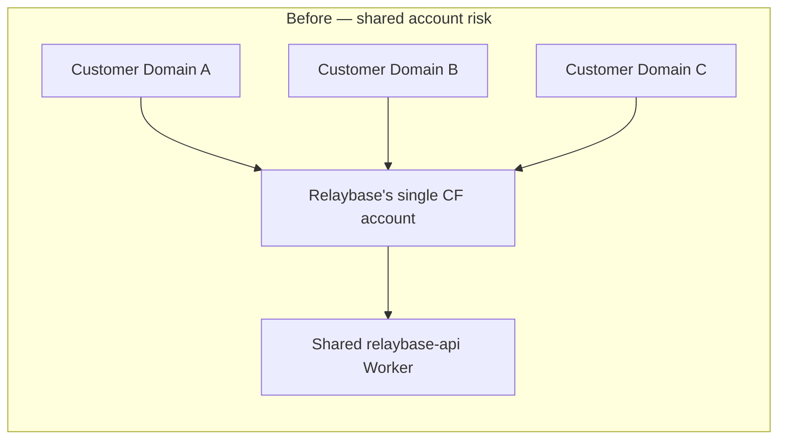
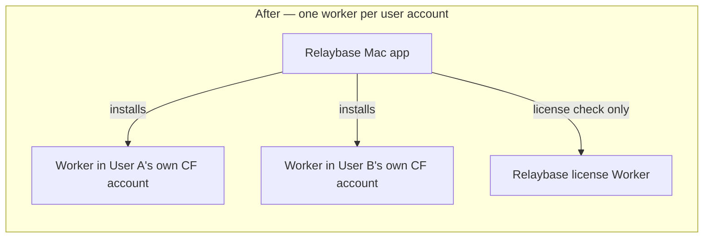

# Relaybase 피봇 전략 — CF 종속 Mac/Windows 앱으로 리포지셔닝

## 1. 왜 지금 피봇해야 하는가 (근거)

현재 구조의 핵심 문제는 `app/src/relaybase-email/components/ConnectDomainDialog.tsx`에 그대로 드러난다:

```121:127:app/src/relaybase-email/components/ConnectDomainDialog.tsx
<DialogTitle className="font-mono">Connect {domain}</DialogTitle>
...
<p className="text-xs text-muted-foreground">
  Point this domain at Relaybase Cloudflare nameservers, then
  continue setup.
</p>
```

이는 사용자가 넘겨준 규정 조사 내용의 "금지되는 방식"과 정확히 일치한다 — 고객 도메인의 네임서버를 Relaybase(운영자)의 단일 Cloudflare 계정으로 위임시키고, 그 계정 하나로 다수 고객 도메인을 관리하는 구조. `server/src/lib/cloudflare-config.ts`도 이를 뒷받침한다: CF `accountId`/`apiToken`이 KV에 **전역 단일 설정**으로 저장되고 모든 테넌트가 이를 공유한다.

```44:55:server/src/lib/cloudflare-config.ts
export async function createCloudflareClient(env: Env): Promise<CloudflareClient> {
  const config = await readCloudflareRuntimeConfig(env);
  ...
  return new CloudflareClient({ accountId: config.accountId, apiToken: config.apiToken });
}
```

이미 `docs/business-plan-risk-and-market.md`가 같은 구조를 "단일 실패점(SPOF)" 리스크로 지적했다. 이번 피봇은 그 리스크와 사용자가 조사한 ToS 리스크를 **동시에 구조적으로 해소**한다: 테넌트마다 자기 자신의 Cloudflare 계정 + 자기 자신의 워커 인스턴스를 갖게 되므로, "제3자 도메인을 자기 계정 아래 관리"하는 상황 자체가 사라진다.

## 2. 새 모델 요약

- 제품 형태: Tauri 기반 네이티브 앱 (Mac 우선 출시, Windows는 Tauri로 후속).
- 가격: 월 구독 폐지 → **$39 1회 결제**.
- 핵심 가치: Cloudflare Email Sending/Routing을 "직접 세팅하면 며칠 걸리고 UX도 없는" 기능을 Spark 수준 UX로 감싸는 wrapper. 사용자의 CF 계정에 종속적임을 숨기지 않고 그대로 드러낸다 ("Built for your own Cloudflare account" — 중개서비스가 아님을 명시).
- 인프라 소유권: 앱이 사용자의 CF 계정에 **라우팅 전용 워커**(현재 `server/`)를 1클릭 설치. Relaybase는 이 워커를 운영하지 않고 빌드만 제공 — 사용자 계정 안에서 사용자 소유로 동작.







## 3. 컴포넌트별 변경 범위 (유지 vs 변경)

### `server/` — 유지, 코드 거의 그대로

현재 워커는 "글로벌 CF 설정 1개"를 가정하는데, 앞으로는 **설치당 1개 CF 계정**이 되므로 오히려 지금 구조가 정확히 맞는 모양이 된다. 이미 배포 후 부트스트랩하는 라우트가 존재한다:

```8:38:server/src/routes/admin-bootstrap.ts
/** One-time or recovery setup using wrangler-deployed secrets. */
adminBootstrap.put("/", async (c) => {
  ...
  await writeCloudflareRuntimeConfig(c.env.KEYS, { accountId, apiToken });
  await setAdminToken(c.env.KEYS, adminToken);
  return c.json({ configured: true, accountId });
});
```

앱의 "설치 마법사"가 할 일: (1) 사용자 CF 계정에 KV 네임스페이스 2개 + R2 버킷 생성, (2) `server/`를 빌드한 스크립트를 `PUT /accounts/:id/workers/scripts/:name`으로 업로드, (3) 라우트/커스텀 도메인 연결, (4) 위 `/admin/bootstrap`을 호출해 계정 정보를 주입. 인바운드 라우팅 자동화도 이미 구현되어 있어 그대로 재사용:

```46:56:server/src/lib/inbound-routing.ts
export async function ensureInboundWorkerRouting(
  cf: CloudflareClient,
  domain: string,
  addresses: string[],
  workerScriptName: string,
): Promise<InboundRoutingResult> {
  const zoneId = await resolveZoneId(cf, domain);
  const routing = await cf.getEmailRoutingSettings(zoneId);
  if (!routing.enabled) { await cf.enableEmailRouting(zoneId); }
  ...
```

추가로 필요한 것: 워커 빌드 산출물을 앱에 내장(또는 릴리스 채널에서 다운로드)하고, `PUT workers/scripts`를 호출하는 설치 스크립트/CLI 얇은 레이어 하나.

### `admin/` — 유지, 역할 재정의

운영자(Isaac)가 사업을 운영하는 수단으로 계속 사용. 단, 대상이 바뀐다:

- 기존 "Users"(`data/users.json`) → **라이선스 구매자/설치 현황** 관리로 재정의 (누가 $39 결제했는지, 라이선스 키 상태, 버전).
- 기존 "Keys/Settings"(공유 CF 계정 크리덴셜, 도메인 키 발급)는 더 이상 고객 도메인을 위해 쓰이지 않음 — 이 부분은 Isaac 자신의 도메인(relaybase.xyz 자체의 billing@/support@ 등, 라이선스 키 발송용) 운영에만 남는다. 이것 자체는 "자기 도메인을 자기 계정에서 관리"하는 정상적인 단일 테넌트 사용이라 ToS 리스크가 없다.
- 새 섹션 필요: 워커 빌드/앱 릴리스 버전 관리, 집계(옵트인) 설치 텔레메트리, 환불/라이선스 회수.

### `app/` — UI/IA 그대로 재사용, 데이터 레이어만 교체

사용자 지시대로 메뉴 구성 변경 없음. `app/src/relaybase-email/panel.tsx`의 기존 라우팅(Dashboard, Domains, Accounts, Emails inbox/sent/compose, Audience, Broadcasts, Metrics, Settings)이 정확히 "12개 도메인 × 도메인당 6개 이상 계정을 관리하는 솔로빌더" 시나리오에 맞는 구조이므로 그대로 Tauri 셸 안에 이식한다.

바뀌는 것은 백엔드 연결 대상뿐이다. 크리덴셜 주입 지점은 두 곳으로 확인된다 — `app/src/lib/relaybase/worker-client.ts`(설치된 Worker용 `baseUrl` + `adminToken`)와 `app/src/lib/cloudflare/email-client.ts`(플랫폼 CF 계정용 `Bearer` 토큰):

```21:36:app/src/lib/relaybase/worker-client.ts
export async function readRelaybaseWorkerConfig(): Promise<RelaybaseWorkerConfig | null> {
  // ...
  const adminToken = stored.adminToken?.trim() ?? "";
  if (!baseUrl || !adminToken) return null;
  return { baseUrl, adminToken };
}
```

- 오늘: 로그인한 "유저"가 Relaybase가 운영하는 공유 워커를 호출 (`data/users/<id>.json` 기반 쿠키 인증), 도메인 온보딩은 **운영자(플랫폼) CF 계정**으로 실행됨.
- 앞으로: 위 두 클라이언트 모두 "설치된, 사용자 소유의 워커/CF 계정"을 가리키도록 교체. `baseUrl`/`adminToken`은 OS 키체인에서 읽고, Relaybase 서버는 평상시 트래픽 경로에 전혀 개입하지 않음.

**교체 대상 리스크 코드 — 우선순위 순:**

1. `ConnectDomainDialog.tsx`의 "Relaybase 네임서버로 위임하라" 플로우 → 사용자 자신의 CF 계정에 이미 있는 zone 목록을 불러오는 "내 도메인에서 선택" 플로우로 교체. 가장 먼저 없애야 할 리스크 코드.
2. `app/src/lib/relaybase/domain-onboard.ts`의 전체 온보딩 파이프라인(`resolve_zone` → `inbound_r2` → `sending_onboard` → `sending_dns` → `sending_enabled` → `routing_enable` → `ready`)이 지금은 전부 **플랫폼 CF 계정**을 대상으로 동작한다 — 이 파이프라인 자체(단계 구조)는 그대로 재사용 가능하지만, 각 단계가 호출하는 CF 계정을 "사용자가 연결한 자신의 계정"으로 바꿔야 한다.
3. `app/src/lib/relaybase/provision-domain-r2.ts`가 만드는 R2 버킷은 현재 "공유(shared) 버킷"(`admin`의 `EmailSenderSettingsView.tsx`에도 "Inbound R2 bucket (shared)"로 라벨링되어 있음) — 설치형 모델에서는 계정당 전용 버킷이 되므로 이 가정도 제거.

### `website/` — 메시지 전면 재작성

`website/src/components/hero.tsx`의 "Every standard product email. One flat $10/month."와 "Built on Cloudflare" 트러스트 배지 등은 "우리가 대신 운영해준다"는 인상을 준다. 신규 카피 방향:

- 헤드라인: "당신의 Cloudflare 계정에서 동작하는 제품 이메일 — 한 번만 결제, $39."
- 신뢰 메시지: "우리는 당신의 이메일을 처리하지 않습니다 — 워커는 당신의 계정 안에서 당신 소유로 실행됩니다."
- 가격 섹션: 월 구독 → 1회 결제로 전면 교체. `website/src/components/pricing-comparison.tsx`("$X/month per domain"), `cloudflare-trust.tsx`("Powered by Cloudflare — built for reliability" 섹션 전체), `footer.tsx`("$10/month, powered by Cloudflare") 모두 대상.
- 법률 문서: `website/content/legal/terms.md` §4는 현재 고객 도메인이 **"our managed Cloudflare account"** 하에 있고 Relaybase가 DNS/발송/라우팅을 대신 구성할 권한을 갖는다고 명시하고 있다 — 이 조항이 사용자가 조사한 ToS 리스크와 정확히 충돌하는 지점이므로 최우선 수정 대상. §6("relaying an outbound send" 등 중개자 표현)도 함께 손질. "이메일 서비스 제공자/중개자"가 아니라 "당신 소유의 Cloudflare 계정에서 동작하는 소프트웨어 판매자"로 스코프를 명확히 한다 (법률 자문 재확인 권장, 블로킹 아님).

## 4. 신규로 필요한 것

### 4.1 `desktop/` 패키지 (형제 프로젝트 패턴)

레이아웃은 형제 프로젝트 `../reola/desktop`를 따른다 — Tauri를 `app/` 안에 넣지 않고 **repo root의 `desktop/`** 로 분리:

```
relaybase/
├── app/                 # 기존 UI 소스 (relaybase-email IA 유지)
├── server/              # 사용자 CF에 설치할 Worker
├── admin/               # 운영자 대시보드 (라이선스/릴리스)
├── website/
└── desktop/             # NEW — Tauri 셸 (reola 패턴)
    ├── package.json     # @tauri-apps/cli, prepare/ensure scripts
    ├── scripts/         # ensure-dev / prepare-production / cleanup-dmg
    │   └── deploy/      # kloy에서 이식할 signing/notarize 스크립트
    └── src-tauri/       # Cargo.toml, tauri.conf.json, icons, capabilities
```

참고 포인트 (`../reola/desktop` 레이아웃, `../kloy` 의 `devUrl`/`frontendDist` 이원화):

- `pnpm-workspace.yaml`에 `desktop` 패키지 등록
- Overlay title bar 등 셸 UX는 reola `tauri.conf.json`을 템플릿으로 시작
- **로드 전략은 kloy식 dual-mode** (아래 4.1.1) — reola의 Next standalone sidecar + 내장 Node는 채택하지 않는다

### 4.1.1 확정: Dev = Next.js 라이브 / Prod = static export → Tauri

**결론: 가능하고, Tauri 표준 패턴이다.** 일상 개발에서 static을 매번 빌드할 필요는 없다.


| 모드         | 명령                                                                      | 무엇이 뜨는가                          | HMR          |
| ---------- | ----------------------------------------------------------------------- | -------------------------------- | ------------ |
| UI 개발 (주력) | `cd app && pnpm dev` → 브라우저 `:32830`                                    | Next.js 풀 서버 (기존과 동일)            | 즉시           |
| 셸 확인 (선택)  | `cd desktop && pnpm tauri dev`                                          | webview가 같은 Next `devUrl`을 로드    | Next HMR 그대로 |
| 배포 빌드만     | `tauri build` → `beforeBuildCommand`가 `next build`(+`output: "export"`) | `frontendDist`(예: `app/out`)를 번들 | 해당 없음        |


`desktop/src-tauri/tauri.conf.json` 골격 (kloy와 동일 이원화):

```json
"build": {
  "beforeDevCommand": "pnpm --dir ../app dev",
  "devUrl": "http://127.0.0.1:32830",
  "beforeBuildCommand": "pnpm --dir ../app run build:desktop",
  "frontendDist": "../app/out"
}
```

즉 **한 줄 고칠 때마다 export를 기다릴 필요가 없다.** export는 릴리스/패키징 검증 시에만 돈다. 형제 프로젝트 중 kloy가 이미 이 패턴(`devUrl`=Vite 라이브, `frontendDist`=`../dist`)을 쓰고 있다. Relaybase는 Vite 대신 Next `dev`를 `devUrl`에 꽂으면 된다.

**static export가 통과하려면 (피봇 데이터레이어 교체와 동일 작업):**

현재 `app/`은 static export와 호환되지 않는다. 블로커:

1. `app/src/app/api/**` — Route Handlers 약 24개 (`/api/email/*`, `/api/auth`). Next `output: "export"`는 API routes와 공존 불가.
2. RSC에서 `cookies()` + `redirect()` — `(dashboard)/layout.tsx`, `page.tsx`. 데스크톱에서는 클라이언트 세션/키체인 게이트로 교체.
3. `export const dynamic = "force-dynamic"` — `[...path]/page.tsx`.
4. catch-all 라우트 — static export 시 `generateStaticParams` 또는 클라이언트 라우팅 셸로 정리.

이 블로커 제거는 이미 계획된 **데이터레이어 스왑**(브라우저 → 설치된 Worker 직접 호출)과 한 줄로 맞물린다. 목표 상태:

- 클라이언트 `getApiBase()` → 설치된 Worker URL (+ admin/API key). `/api/email` 프록시 불필요.
- 데스크톱 인증 = CF 토큰/라이선스(키체인). `relaybase_user` 쿠키 로그인 폐기.
- `app/package.json`에 `build:desktop`: `NEXT_OUTPUT=export` (또는 `next.config`에서 `process.env.DESKTOP_BUILD === "1"`일 때만 `output: "export"`).
- 이행 중에는 **dev에서만** `/api/`*를 남겨 브라우저 개발을 유지하고, `build:desktop` 경로에서는 API 트리가 없어야 한다(삭제·이동, 또는 desktop 전용 app 엔트리). 최종적으로는 API routes 자체를 제거하는 쪽이 피봇 모델과 일치.

**권장 일상 워크플로:**

1. UI/도메인 로직: 브라우저에서 `pnpm --dir app dev`만 사용 (가장 빠름).
2. 윈도우 크롬·키체인·워커 설치 UI: 필요할 때만 `tauri dev` (같은 Next 서버를 webview로).
3. DMG/노터라이즈: `build-macos.sh` → 이때만 static export.

### 4.2 코드사이닝 / 노터라이제이션 (형제 프로젝트 `kloy`)

Apple signing·notarization은 `../kloy/app/scripts/deploy`에 이미 검증된 스크립트가 있으므로 **복사·적응**한다:

- `load-apple-signing.sh` — `apple-signing.env` / env 로드, identity·notary 자격 검증
- `apple-signing.env.example` — `APPLE_SIGNING_IDENTITY`, App Store Connect API key (`APPLE_API_*`) 템플릿
- `notarize-dmg.sh` — Tauri가 `.app`을 노터라이즈한 뒤 **DMG 별도** `notarytool submit` + staple
- `build-macos.sh` — toolchain + signing load + `tauri build` 오케스트레이션

`tauri.conf.json` macOS 블록(`hardenedRuntime`, entitlements, `minimumSystemVersion`)도 kloy `app/src-tauri/tauri.conf.json`을 기준으로 맞춘다. Apple Developer Program은 kloy에서 이미 세팅되어 있으므로 동일 Team/identity 재사용 + Relaybase용 bundle id(`com.relaybase.desktop` 등) 추가가 기본 가정.

### 4.3 나머지 신규 기능

1. **CF 연결 — 1단계는 API 토큰**: 필요한 권한(Workers Scripts:Edit, Workers KV Storage:Edit, Workers R2 Storage:Edit, Zone:Email Routing Rules:Edit, Account:Email Routing Addresses:Edit, Account:Email Sending:Edit) 체크리스트와 토큰 생성 딥링크. OAuth는 2단계.
2. **워커 설치 마법사**: zone 목록 조회 → KV/R2 생성 → 워커 스크립트 업로드 → `/admin/bootstrap` 호출 → 도메인별 Email Routing 활성화. `server/src/lib/inbound-routing.ts` / `cloudflare-client.ts` 재사용. 워커 빌드 산출물은 `desktop/` 리소스 또는 릴리스 채널에서 제공.
3. **로컬 보안 저장소**: CF API 토큰 + admin 토큰을 macOS 키체인에 저장 (Relaybase 서버로 전송하지 않음). Tauri plugin / Rust command.
4. **라이선싱 — Stripe 1회 결제 + 경량 라이선스 워커**: Stripe 웹훅 → 서명된 라이선스 토큰 → 이메일 발송(`admin/` 재사용) → 앱 오프라인 서명 검증 + 주기적 온라인 재확인.
5. **워커 자동 업데이트**: 앱에서 "Update Worker"로 최신 빌드 재배포.

## 5. 단계별 로드맵

- **Phase 0 (1~2주, 즉시)**: `ConnectDomainDialog`의 NS 위임 플로우를 신규 고객에게 즉시 중단(리스크 코드 동결). `website/` 메시지/가격 전면 교체. `docs/business-plan-risk-and-market.md`의 Phase 0~2 로드맵은 이번 피봇으로 SPOF 리스크가 구조적으로 해소되므로 "테넌트별 방어장치"는 급한 순위에서 내려가고, 대신 이번 계획으로 대체됨을 문서에 반영.
- **Phase 1 (Tauri MVP)**:
  1. `desktop/` 스캐폴드 + dual-mode `tauri.conf` (`devUrl`→`:32830`, `frontendDist`→`app/out`)
  2. 데이터레이어를 Worker 직접 호출로 교체 → `build:desktop` static export가 통과하도록 API routes / cookies RSC 제거
  3. API 토큰 연결 + zone 자동 탐색 + 워커 설치 마법사
  4. Stripe 라이선싱
  5. kloy deploy 스크립트 이식 → 서명/노터라이즈된 macOS DMG
- **Phase 2**: Audience/Broadcasts/Metrics 화면 이식 완료, 워커 자동 업데이트, 온보딩 "몇 분 안에 완료" UX 다듬기, CF OAuth 리서치.
- **Phase 3**: Windows 빌드 (Tauri 특성상 아키텍처 변경 없이 크로스 빌드), 코드사이닝/MSI.

## 6. 열려있는 결정 사항 (실행 전 확인 필요)

- ~~로드 방식 A vs B~~ → **확정: dual-mode (dev=Next 라이브, prod=static export)**. reola sidecar는 쓰지 않음.
- Apple Developer Program: kloy와 동일 Team/identity 재사용 + Relaybase bundle id(`com.relaybase.desktop` 등)만 추가할지.
- CF API 토큰이 요구하는 정확한 권한 스코프 목록 확정 및 온보딩 화면에 반영.
- 이행 기간 동안 `app/src/app/api/**`를 브라우저 전용으로 잠시 남겨둘지, 아니면 바로 Worker-direct만 남기고 stub/mock으로 dev할지 (속도 vs 이중 경로 유지 비용).

[{"id": "phase0-freeze-risk-flow", "content": "ConnectDomainDialog의 NS 위임(신규 고객 온보딩) 플로우 동결"}, {"id": "phase0-website-copy", "content": "website hero/features/pricing/legal 카피를 1회결제·BYO-CF 메시지로 재작성"}, {"id": "desktop-scaffold", "content": "reola 패턴으로 desktop/ 패키지 스캐폴드 (src-tauri, pnpm workspace, prepare scripts)"}, {"id": "desktop-load-app", "content": "dual-mode 확정: tauri.devUrl→next dev(:32830), build:desktop=static export→frontendDist; API routes/cookies RSC 제거로 export 통과"}, {"id": "cf-token-onboarding", "content": "CF API 토큰 연결 UI + 필요 권한 체크리스트/딥링크 구현"}, {"id": "worker-install-wizard", "content": "워커 설치 마법사(zone 조회, KV/R2 생성, 스크립트 업로드, /admin/bootstrap 호출) 구현"}, {"id": "swap-data-layer", "content": "app/의 /api/email/* 라우트 호출을 설치된 워커 직접 호출로 교체"}, {"id": "keychain-storage", "content": "CF 토큰/admin 토큰 macOS 키체인 저장 구현"}, {"id": "licensing-stripe", "content": "Stripe 1회결제 + 경량 라이선스 워커 + 오프라인 검증 구현"}, {"id": "admin-repurpose", "content": "admin/ Users 섹션을 라이선스 구매자/설치 현황 관리로 재정의"}, {"id": "worker-auto-update", "content": "설치된 워커 원클릭 업데이트 기능 구현"}, {"id": "mac-signing", "content": "kloy deploy 스크립트(load-apple-signing / notarize-dmg / build-macos)를 desktop/에 이식하고 Relaybase bundle id로 서명·노터라이즈"}]