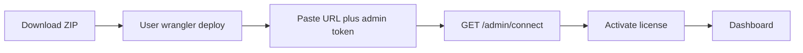

# User self-install Worker setup

## Decisions (locked)

- **Connect Cloudflare removed** — setup is Install → License only.
- **Package = ZIP** — sanitized `wrangler.toml` + built Worker assets + README (user runs `wrangler deploy`).
- Desktop app **never** requests Account Workers/KV/R2 API permissions for install.

## Target setup UX

Rewrite `[WorkerInstallPanel.tsx](app/src/relaybase-email/components/WorkerInstallPanel.tsx)` into a guide + link form:

1. **Download** — primary button opens install ZIP URL via existing `desktopOpenExternal`.
2. **Steps** — short numbered guide: unzip → create KV/R2 (commands in README) → set `ADMIN_TOKEN` secret → `npx wrangler deploy` → copy `*.workers.dev` URL.
3. **Connect form** — `Worker URL` + `Admin token` (the same value they set as Wrangler secret).
4. **Verify & continue** — call new connect API; on success save to `~/.relaybase/credentials.json` and route to `/setup/license`.

Remove from primary UI: probe/adopt/approve-install, CF permission lists, “Install routing Worker” via Tauri CF API.

## Gate / credentials

Update `[DesktopDashboardGate.tsx](app/src/app/(dashboard)`/DesktopDashboardGate.tsx) and setup pages:

- Ready path: `workerUrl` + `adminToken` + `licenseKey` only (no `accountId`/`apiToken` required).
- Delete or stop linking `[/setup/connect](app/src/app/setup/connect/page.tsx)`; license page must not redirect to connect.
- Keep `accountId`/`apiToken` fields optional/empty in `[secrets.rs](desktop/src-tauri/src/secrets.rs)` for a later Zone-assist feature — do not collect them now.
- Add bridge helpers: `desktopSaveWorkerConnection({ workerUrl, adminToken })`, `desktopVerifyWorkerConnection` (HTTP from Rust or frontend `fetch` to Worker — prefer Rust `reqwest` so CORS is irrelevant).

Tauri CF install commands (`probe_routing_worker`, `install_routing_worker`, `adopt_routing_worker`) stay in code unused or get thin wrappers removed from UI; no need to delete Rust in this pass unless it blocks compile.

## Connect verification API (server)

Add authenticated probe used only after user deploy:

- `**GET /admin/connect**` in `[server/src/](server/src/)` (new small route, mount in `[app.ts](server/src/app.ts)`).
- Auth: existing `requireAdmin` (Bearer = Worker `ADMIN_TOKEN` / KV admin config).
- Response (stable, user-facing):  
`{ ok: true, product: "relaybase", workerScriptName, inbound: { r2Configured } }`  
Reuse the same R2 check pattern as `[GET /health](server/src/app.ts)`.
- Desktop verify: `GET {workerUrl}/admin/connect` with `Authorization: Bearer {adminToken}`; require `ok: true`. Friendly errors via existing `DesktopErrorBanner` (wrong URL, 401 → bad admin token, network).

Public `GET /health` alone is **not** enough (anyone can hit it; does not prove admin control).

## Install ZIP package

Add a customer-facing pack (not the production `[server/wrangler.toml](server/wrangler.toml)` as-is — that file hardcodes Relaybase `account_id`, KV ids, and `api.relaybase.xyz`).

New folder e.g. `[server/customer-install/](server/customer-install/)` (or `packages/worker-install/`):

| Artifact                     | Purpose                                                                                                                              |
| ---------------------------- | ------------------------------------------------------------------------------------------------------------------------------------ |
| `wrangler.toml`              | `name = "relaybase-api"`, bindings `KEYS` / `RELAYBASE_API` / `INBOUND`, **no** account_id, **no** custom domain, **no** D1 waitlist |
| Built Worker                 | output of existing server build / wrangler deployable entry                                                                          |
| `README.md`                  | KV create commands, R2 bucket name `relaybase-inbound`, `wrangler secret put ADMIN_TOKEN`, deploy, copy URL                          |
| Optional `.dev.vars.example` | document secrets only                                                                                                                |

Build script (e.g. `server/scripts/pack-customer-install.mjs` + root/package script `pack:worker-install`) produces `dist/relaybase-worker-install.zip`.

**Hosting for the download button:** publish zip to a stable HTTPS URL used by the app, e.g. `https://relaybase.xyz/downloads/relaybase-worker-install.zip` (commit built zip under `[website/public/downloads/](website/public/)` for v1, or CI artifact later). App reads `NEXT_PUBLIC_WORKER_INSTALL_ZIP_URL` with that default.

## Copy / docs

- Update `[docs/pivot-byo-cloudflare.md](docs/pivot-byo-cloudflare.md)`: install = user Wrangler; app only verifies URL+admin.
- Soften website/trust lines that still say “API token in keychain” if they claim app-side token install (`[cloudflare-trust.tsx](website/src/components/cloudflare-trust.tsx)`) — one pass aligned with self-install.
- Install page explains **why** names `relaybase-api` / `relaybase-keys` / `relaybase-inbound` (same naming story, but user creates them).

## Out of scope (explicit)

- Cloudflare OAuth Integration.
- In-app one-click Worker upload via API token.
- Zone/Email Routing automation that needs a CF token (domains stay manual / existing UI until a later optional connect).

