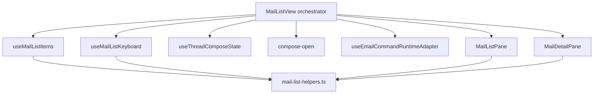

# MailListView

Inbox / Drafts / Sent / Trash list + detail UI. **Public entry point:** `@/email/components/MailListView` (single file export — do not import panes/hooks from routes).

## Role

`MailListView` is a **thin orchestrator** (~200 lines). It wires hooks and renders two panes. It does not contain list derivation, keyboard policy, or detail branching logic.

| Concern | Owner |
|---------|--------|
| Pure formatting / href helpers | `mail-list-helpers.ts` |
| Store → list model (`items`, `selected`, threads) | `useMailListItems.ts` |
| Mail keyboard layer (implementation) | `useMailListKeyboard.ts` |
| Inline thread reply/forward panel state | `useThreadComposeState.ts` |
| Standalone compose open/resume/new | `compose-open.ts` |
| Cmd+K + row context menu runtime | `useEmailCommandRuntimeAdapter.ts` |
| List toolbar + rows + empty state | `MailListPane.tsx` |
| Draft / thread / single-message detail | `MailDetailPane.tsx` |

Shortcut and compose-open **policy** is not documented here. Source of truth: [docs/email-command-system.md](../../../../docs/email-command-system.md).

## Architecture



## File map

```text
app/src/email/components/
  MailListView.tsx              # orchestrator (this folder's parent file)
  MailListView/README.md        # this document
  mail-list-helpers.ts          # formatDate, messageHref, previewText, …
  useMailListItems.ts           # threads, items, selected, detail loading
  useMailListKeyboard.ts        # mail keyboard layer (see email-command-system.md)
  MailListPane.tsx              # list column UI
  MailDetailPane.tsx            # detail column UI
  useThreadComposeState.ts      # inline compose on open thread (related)
```

## Data flow

1. **Props:** `folder` (`inbox` | `drafts` | `sent` | `trash`) + optional `messageId` from the route.
2. **`useMailListItems`** reads the MobX mailbox store and returns `items`, `selected`, `selectedThread`, `listHref`, etc. Search string is owned by the orchestrator and passed in.
3. **`useThreadComposeState`** manages inline reply/forward when a thread is open (`?reply=` URL params are consumed here).
4. **`useEmailCommandRuntimeAdapter`** builds per-row command runtimes for context menu + palette scope.
5. **`useMailListKeyboard`** registers the mail keyboard layer (behavior defined in [email-command-system.md](../../../../docs/email-command-system.md)).
6. **Panes** are presentational: props in, JSX out. No direct store reads in panes.

## Split-pane layout

- No `messageId`: list fills the view.
- With `messageId`: list column narrows on `md+`; detail column shows on the right (mobile hides list when detail is open).

## Adding features

| Change | Where to edit |
|--------|----------------|
| New list column / row badge | `MailListPane.tsx` |
| New detail view for a message kind | `MailDetailPane.tsx` |
| New shortcut or compose-open rule | [email-command-system.md](../../../../docs/email-command-system.md) (+ `useMailListKeyboard.ts` / `compose-open.ts` as needed) |
| New mail command (Cmd+K / context menu) | `app/src/email/commands/` — not MailListView |
| Thread grouping / selection logic | `useMailListItems.ts` |

**Do not** re-grow `MailListView.tsx` with business logic. Add a hook or pane module instead.

## Verification checklist

- [ ] List navigation and selection across inbox / drafts / sent / trash
- [ ] Draft detail edit + discard
- [ ] Trash restore / empty trash
- [ ] Mail shortcuts and compose policy per [email-command-system.md](../../../../docs/email-command-system.md)
- [ ] `pnpm exec tsc --noEmit` (from `app/`)
