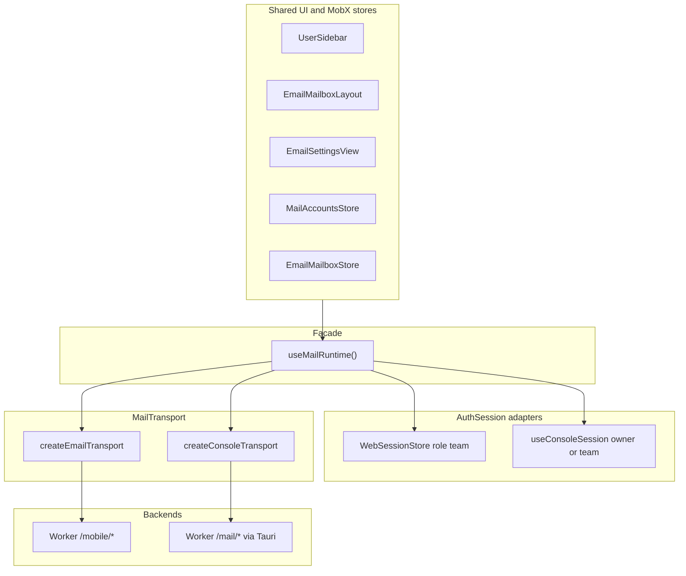

# Mail platform — web vs desktop auth and runtime

**Audience:** humans and coding agents changing the team web mail app (`relaybase.email`), desktop mail UI, session/login, Worker `/mobile/*` vs `/mail/*` routing, or MobX mail stores.

The Next.js app ships **one** mail UI (`app/src/email/*`) in two runtimes:

| Runtime | Route shell | Session adapter | Worker API surface |
|---------|-------------|-----------------|-------------------|
| **Web mail** | `app/(email-app)/*` | `WebSessionStore` | `/mobile/*` (Bearer + `X-Account-Email`) |
| **Desktop** | `app/(shell)/*` + `DesktopDashboardGate` | `useConsoleSession()` | `/mail/*` via Tauri `desktopAwareFetch` |

Shared UI and stores should depend on **`useMailRuntime()`** and **`AuthSession`**, not on `isDesktopRuntime()` or `useDesktop()` for identity/team mode.

**Primary code:**

| Area | Paths |
|------|------|
| Ports + `AuthSession` | `app/src/mail-platform/types.ts` |
| Web session | `app/src/mail-platform/session/email-session.ts` (`WebSessionStore`) |
| Desktop session | `app/src/mail-platform/session/console-session.ts` |
| Web transport | `app/src/mail-platform/transport/email-transport.ts`, `map-email-mobile.ts` |
| Desktop transport | `app/src/mail-platform/transport/console-transport.ts` |
| Runtime hook | `app/src/mail-platform/runtime/MailRuntimeContext.tsx` |
| Web provider tree | `app/src/mail-platform/runtime/EmailAppProviders.tsx`, `app/(email-app)/layout.tsx` |
| Desktop provider tree | `app/src/mail-platform/runtime/ConsoleAppProviders.tsx`, `app/_shell/DesktopDashboardGate.tsx` |
| Account seeding (team) | `app/src/email/stores/mail-accounts-store.ts` |
| Worker mobile routes | `relaybase-worker/src/routes/mobile.ts` |
| Package overview | `app/src/mail-platform/README.md` |

---

## Why this exists

Before the facade, mail code mixed three concerns:

1. **Who is signed in** (owner keyring, desktop team login, web `sessionStorage`).
2. **How HTTP reaches the Worker** (browser `fetch` to `/mobile/*` vs Tauri IPC to `/mail/*`).
3. **What the UI should show** (owner “add domain in console” vs single team mailbox).

Scattering `if (!isDesktop)` across sidebar, stores, and layout produced web bugs such as “No mail accounts” and “Worker is not connected” even after a valid web login — because `MailAccountsStore` waited on desktop readiness and called owner-only `/api/email/addresses`.

The **Auth Strategy / Adapter** pattern fixes this by injecting one **`AuthSession`** at the root of each runtime. Stores read `session.isTeamMode` and seed the logged-in account without console setup flows.

---

## Layered architecture



**Rule of thumb:** UI and stores use `runtime.session` for identity/role and `runtime.transport.fetch` for `/api/email/*` paths. Avoid new direct imports of `desktopAwareFetch` or `getWebTeamAuth()` from `email/*` unless you are implementing an adapter.

---

## `AuthSession` port

Defined in `app/src/mail-platform/types.ts`. This is the contract both adapters implement.

| Field / method | Purpose |
|----------------|---------|
| `role` | `"owner"` (console operator) or `"team"` (mail-only login) |
| `isDesktop` | `true` in Tauri; `false` on `relaybase.email` |
| `isTeamMode` | Single-account mailbox UX; skip owner empty states |
| `ready` | Session hydrated (web: after `sessionStorage` read) |
| `accountEmail`, `workerUrl` | Active Worker + mailbox identity |
| `accountScopeId` | Cache key scope (web: account email; desktop: opaque scope id) |
| `mobilePassword` | Web team Bearer secret (memory + `sessionStorage`); desktop team only when applicable |
| `getAuthHeaders()` | `Authorization` + `X-Account-Email` for `/mobile/*` |
| `login()` / `logout()` | Web: `/sign-in` form + clear storage; desktop: existing unlock/team flows |
| `subscribe()` | MobX-friendly change notifications (web store) |

`MailSession` is a legacy alias for `AuthSession`.

---

## Web adapter (`WebSessionStore`)

**File:** `app/src/mail-platform/session/email-session.ts`

- Always `role: "team"`, `isTeamMode: true`, `isDesktop: false`.
- Login: `POST` verification via `GET {workerUrl}/mobile/config` with Bearer + `X-Account-Email`.
- Persistence: identity + password in `sessionStorage` key `relaybase:email-session`; mirrored globals `__RELAYBASE_TEAM_AUTH__` / `__RELAYBASE_WORKER_URL__` for legacy `desktopAwareFetch` paths still on the web build.
- Logout: clears memory, storage, and globals; UI redirects to `/sign-in`.

**Provider:** `EmailAppProviders` creates one `WebSessionStore` and passes it as `runtime.session`. Used only under `app/(email-app)/layout.tsx` (no `AppSessionProvider` gate for mail-only routes).

**Deployed hosts:** static export + Workers assets (`hq-relaybase-web-app`, `relaybase.email`). Routes use top-level folders (`/inbox`, `/sign-in`, …) with `trailingSlash: true`.

---

## Desktop adapter (`useConsoleSession`)

**File:** `app/src/mail-platform/session/console-session.ts`

- `role`: `"team"` when `DesktopContext.teamLogin` is set; otherwise `"owner"`.
- `isTeamMode`: `Boolean(teamLogin)`.
- Identity from `teamLogin` or owner `credentials.workerUrl` + `relaybaseEmail`.
- `login()` throws — Touch ID / team dialog / setup flows own sign-in.
- `logout()` is a stub at the adapter layer; sidebar still calls `signOutRelaybase` + `AppSessionStore` on desktop.

**Provider:** `ConsoleAppProviders` wraps `DesktopDashboardGate` and composes `useConsoleSession()` with `createConsoleTransport()`, desktop storage, and `useDesktopChromeAdapter()`.

The root layout still mounts `AppProviders` (`DesktopProvider`, `AppSessionProvider`) for the whole app; `ConsoleAppProviders` adds **`MailRuntimeProvider`** so mail subtrees can use the same `useMailRuntime()` API as web.

---

## `MailRuntime` bundle

```ts
type MailRuntime = {
  session: AuthSession;
  transport: MailTransport;  // maps /api/email/* → Worker
  storage: MailStorage;
  platform: MailPlatform;
  chrome: MailShellChrome;
  features: MailFeatures;
  accountScopeId: string;
};
```

Access in React:

```ts
import { useMailRuntime } from "@/mail-platform/runtime";

const { session, transport, accountScopeId } = useMailRuntime();
```

`features.console` is `false` on web (`EmailAppProviders`); `true` on desktop (`ConsoleAppProviders`).

---

## Transport and API mapping

Callers keep using **UI-relative** paths such as `/api/email/inbox?domain=example.com`.

| Build | Implementation | Worker path |
|-------|----------------|-------------|
| Web | `createEmailTransport` | `/api/email/*` → `/mobile/*` (`map-email-mobile.ts`) |
| Desktop | `createConsoleTransport` → `desktopAwareFetch` | `/api/email/*` → `/mail/*` (and team shortcuts when session exists) |

Web transport attaches headers from the session identity and `mobilePassword`. It normalizes `/mobile/config` responses for `EmailMailboxStore` (`relaybaseConfigured`, `email`).

Console-only routes (domains, keys, broadcasts, …) return `API_NOT_WIRED` in email/web transport — by design.

**Worker reference:** team/mobile behavior is documented in the product Worker (`relaybase-worker`) under `/mobile` — see `src/routes/mobile.ts` and `docs/features/mobile-companion.md` if present in your checkout.

---

## How stores use the session

### `MailAccountsStore`

Configured from `MailAccountsProvider` with `{ userId, apiBase, session }` from `useMailRuntime()`.

When `session.isTeamMode` and `session.accountEmail` are set:

1. **Bootstrap** skips disk catalog + owner `addresses?all=1` wait.
2. **Seeds** `availableAddresses` and `enabledAccounts` to the single logged-in email.
3. Sets `phase: "done"` immediately so `EmailMailboxLayout` does not show `OwnerNoMailAccountsView`.

Owner desktop path still hydrates from local catalog and fetches `/api/email/addresses?all=1` when `session.workerUrl` is available.

### `EmailMailboxStore`

Still uses `desktopAwareFetch` internally today; domain list comes from enabled addresses in `EmailMailboxProvider.configure()`. `accountScopeId` is taken from `useMailRuntime().accountScopeId`.

**Ongoing migration:** prefer `runtime.transport.fetch` for new mail API calls in stores (see `app/src/mail-platform/README.md`).

---

## UI behavior (team vs owner)

| Component | Team / web | Owner desktop |
|-----------|------------|----------------|
| `EmailMailboxLayout` | Renders inbox chrome when `isTeamMode` | Shows `OwnerNoMailAccountsView` if no enabled addresses |
| `UserSidebar` | `teamMode` prop or `session.isTeamMode`; web sign-out via `session.logout()` | Dashboard switcher, `AddEmailAccountDialog`, `signOutRelaybase` |
| `EmailSettingsView` | Single account; profile via `/mobile/profile` | Multi-account colors/signatures from console data |

Web `(email-app)` layout passes `teamMode` to `UserSidebar` and gates routes on `session.ready` / `session.identity` in `WebMailShellInner`.

---

## Provider trees (simplified)

**Web (`(email-app)`):**

```
RootLayout → AppProviders (desktop globals still exist but Tauri absent)
  → EmailAppProviders (MailRuntimeProvider + WebSessionStore)
    → WebMailShellInner
      → MailAccountsProvider / EmailMailboxProvider / …
```

**Desktop (`(shell)`):**

```
RootLayout → AppProviders (DesktopProvider, AppSessionProvider, …)
  → DesktopDashboardGate → DesktopShell
    → ConsoleAppProviders (MailRuntimeProvider + useConsoleSession)
      → MailAccountsProvider / EmailMailboxProvider / …
```

---

## Security notes (web)

- Mobile password is stored in **`sessionStorage`** (and memory) so refresh keeps the session; treat XSS on `relaybase.email` as credential exposure.
- CORS on the customer Worker must allow `relaybase.email` and include `Authorization`, `X-Account-Email` in preflight (see Worker `cors.ts`).
- Do not commit Cloudflare API tokens; deploy via CI or local env vars.

---

## Verification checklist

1. Web: `/sign-in` → login with Worker URL, account email, mobile password.
2. Web: `/inbox/` shows sidebar folders and loads mail (no “No mail accounts” / “Worker is not connected”).
3. Web: `/sent`, `/drafts`, `/trash`, `/compose`, `/mail-settings` navigate with trailing slashes.
4. Desktop: owner mail under `/email/*` and invited team session unchanged.
5. `pnpm run build:cf` in `app/` succeeds (static export for Workers).

---

## Related docs

- Package layout and migration backlog: [`app/src/mail-platform/README.md`](../../app/src/mail-platform/README.md)
- Mailbox data plane: [mailbox-d1.md](./mailbox-d1.md), [mailbox-r2.md](./mailbox-r2.md)
