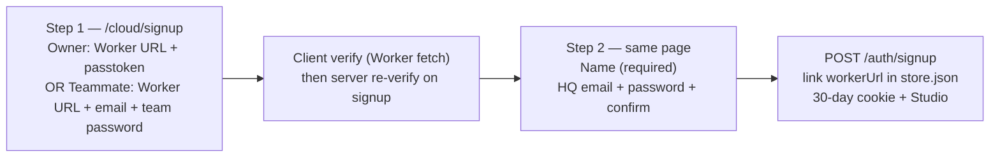
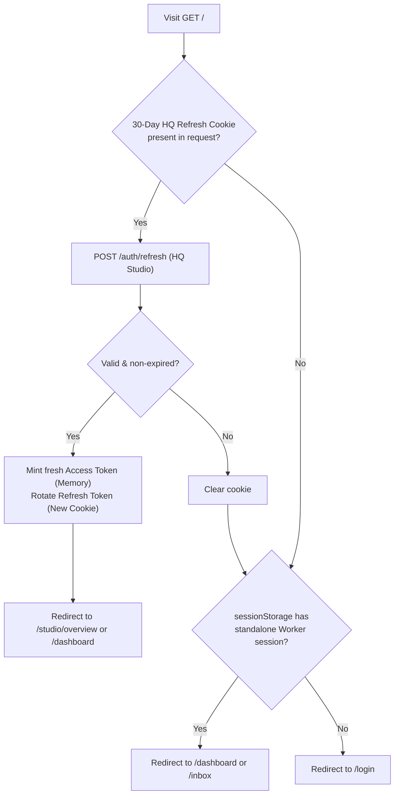
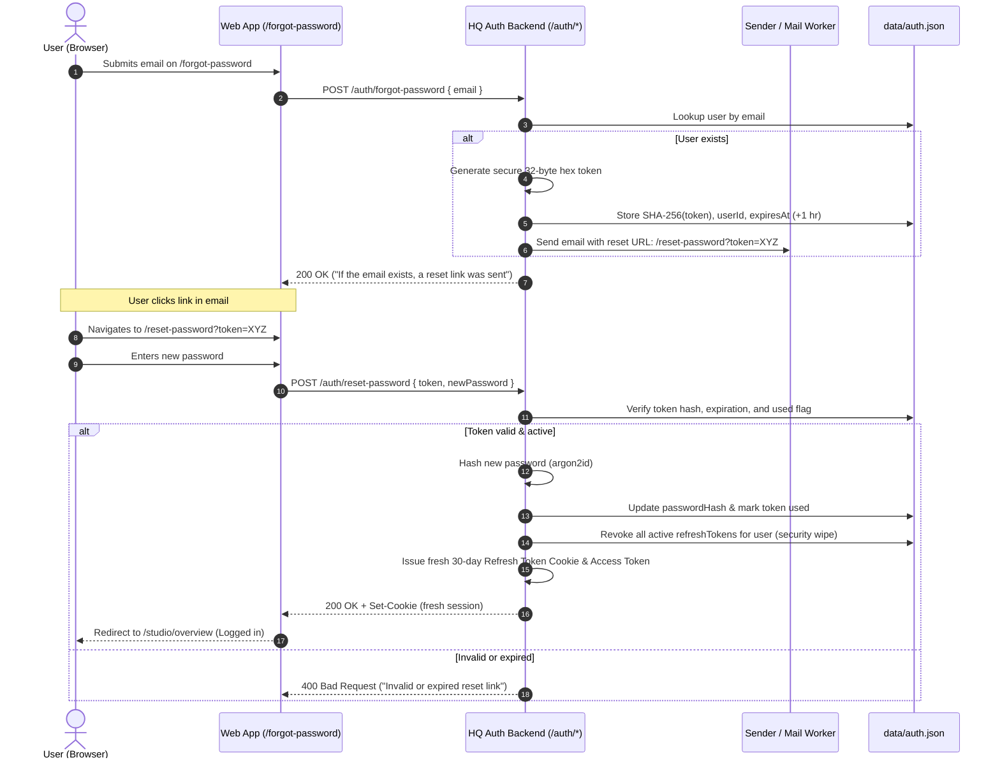
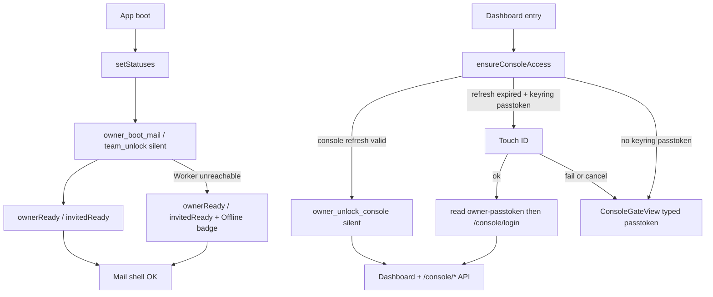

# Authentication architecture

**Audience:** humans and coding agents changing owner login, invited (team)
login, Worker auth middleware, desktop unlock, or mobile companion auth.

**Related docs:**

- Phase machine + console gate: **[desktop-session-machine.md](./desktop-session-machine.md)**
- Local secrets: **[home-storage.md](../desktop/home-storage.md)** → *OS keyring* (`owner-session:{workerUrl}` + `owner-passtoken:{workerUrl}`)
- Remote owner model: **[storage-architecture.md](../architecture/storage-architecture.md)** → *Owner auth*
- Archived pre–console-gate docs: **[legacy/](../archive/legacy/)**

---

## Summary

Four auth surfaces on the product Worker, plus **HQ Cloud Web Auth** for central web services, and **Cloudflare OAuth** for install / recovery only (not daily mail).

| Actor | Credential | Target routes | Authentication / Unlock |
|-------|------------|---------------|-------------------------|
| **HQ Cloud Web User** | **Email + Password** | HQ Studio (`/studio/*`, `/auth/*`) | Web: 30-day HttpOnly cookie session (RTR Refresh Token) + in-memory Access JWT. Required for Studio. Password reset via secure email tokens |
| **Owner (Worker Direct)** | **Passtoken** → scoped mail + console sessions | `/console/*`, `/mail/*` | Desktop: silent boot from mail refresh. When a **new login** is needed: Touch ID reads the keyring passtoken. Typed form only if bio fails / is declined or the keyring item is missing. Web: standalone login without HQ account |
| **Invited teammate** | Per-account **mobile password** | `/mobile/*` (one email) | Silent `team_unlock` from keyring (no biometry) |
| **Flutter mobile** | Same mobile password | `/mobile/*` | Secure storage per launch |
| **API integrator** | Product API key (`rb-…`) | `/v1/*` | Domain-scoped send key for broadcasts and triggers |

Desktop entry is unified in **`AppSessionStore`** + **`DesktopDashboardGate`**.
Web browser authentication is explained below in **[Web & HQ Cloud authentication](#web--hq-cloud-authentication)**. Everything else in this doc regarding the OS keyring, Touch ID, and Rust is **desktop** policy.

---

## Owner passtoken in the keyring

**Rule:** After first enrollment on a machine, the owner passtoken plaintext
lives in the OS keyring. The user types it at first install / first login, and
only again if biometry fails or is declined, or the keyring item is missing.
Daily use **must not** ask for the passtoken.

The one-time download still exists (backup / another Mac). It is not the daily
credential surface.

### What Touch ID does

Touch ID / Windows Hello has **one** job: decide whether the app may **read**
the stored passtoken from the keyring.

| Biometry result | What happens |
|-----------------|--------------|
| Success | Rust reads `owner-passtoken` (JS never sees it) → `POST /console/login` → mint mail + console sessions |
| Fail or user cancel | The keyring item is **not** read. Show the typed passtoken form. |
| No biometry (Linux / unsigned `tauri dev`) | Read the keyring item without a prompt if it exists; otherwise typed form. |

Touch ID does **not** unlock refresh tokens, does **not** run on silent mail
boot, and is **not** a separate “console privilege” check. If a scoped refresh
can still mint access, do that silently — no Touch ID, no passtoken.

A failed or cancelled bio **must not** proceed to a keyring passtoken read.
Rust never returns the passtoken to JS.

### Why a separate keyring item

Silent mail boot must not load the passtoken. Put refresh tokens and the
passtoken in **different** keyring accounts:

| Keyring account | Contents | Read gate |
|-----------------|----------|-----------|
| `owner-session:{workerUrl}` | `workerUrl`, `refreshToken`, `mailRefreshToken` | Silent |
| `owner-passtoken:{workerUrl}` | passtoken plaintext | Touch ID / Windows Hello |

Service for both: `com.relaybase.desktop`. Account names are **per Worker URL** so two installs on the same Mac do not overwrite each other. Legacy unscoped `owner-session` / `owner-passtoken` items migrate on first matching read. Prefer an OS user-presence /
biometry ACL on `owner-passtoken:{url}` so the platform itself refuses the read
without bio.

On desktop, still never: `~/.relaybase`, cookies, localStorage, sessionStorage.
The Worker stores only `sha256(AUTH_PEPPER || salt || passtoken)`. (Web has no
keyring; its policy is in [Web owner session](#web-owner-session).)

### Write vs read

| Direction | When | Touch ID? |
|-----------|------|-----------|
| **Write** | `setup-admin` reveal, first `/console/login`, rotate, `reset-admin`, typed fallback | No — the user just created or typed the secret |
| **Read** | Any later login that needs the passtoken (console refresh expired, mail refresh expired or failed, re-login after logout cleared refreshes) | Yes |

Successful typed entry **writes** `owner-passtoken` so the next time is Touch
ID, not typing.

### When the typed form is allowed

- First enrollment on this Mac (no `owner-passtoken` item yet)
- Biometry failed or declined
- Keyring item missing or corrupt
- After `rotate-passtoken` / `reset-admin`, until the new token is written back

Those are the **only** times. Expired console refresh (30 days) or expired mail
refresh (90 days) is **not** a reason to type — Touch ID reads the stored
passtoken and logs in again.

### Sign out

Logout clears in-memory access and may clear refresh tokens.
**`owner-passtoken` stays.** Next launch can Touch ID instead of typing.
Clearing the passtoken item is an explicit “remove this Mac” action, not
ordinary sign-out.

---

## Scoped owner sessions (mail vs console)

Login mints **two refresh tokens** and two in-memory access tokens:

| Scope | Refresh TTL | Access TTL | Worker routes | Desktop command |
|-------|-------------|------------|---------------|-------------------|
| `mail` | 90 days | 60 min | `/mail/*` (inbox, sent, send, favicon, **GET `/mail/addresses`**) | `owner_boot_mail_cmd` (silent, no bio) |
| `console` | 30 days | 30 min | `/console/*` | `owner_unlock_console_cmd` when console refresh is still valid (silent). If expired: Touch ID → keyring passtoken → `/console/login` |

D1 `owner_sessions.label` uses `mail:` / `console:` prefixes.
`POST /console/refresh` body: `{ refreshToken, scope: "mail" | "console" }`.

Middleware: `requireMailSession` on `/mail/*`, `requireConsoleSession` on
`/console/*` (`../relaybase-worker/src/lib/auth.ts`).

---

## Layer diagram

```mermaid
flowchart TB
  subgraph ui [app/]
    Gate[DesktopDashboardGate]
    Store[AppSessionStore]
    Unlock[UnlockView / TeamLoginView]
    ConsoleGate[ConsoleGateView]
    Bridge[bridge/owner · bridge/team]
    Fetch[desktopAwareFetch]
  end

  subgraph tauri [desktop/src-tauri]
    Owner[owner_session.rs]
    Team[team_session.rs]
    KR[OS keyring]
    Mem[split mail/console memory]
    WR[worker_request / team_worker_request]
  end

  subgraph worker [Product Worker]
    Auth[requireOwnerSession scope]
    Routes[/console/* /mail/* /mobile/* /v1/*]
    D1[(RELAYBASE_DB)]
  end

  Gate --> Store
  Store --> Unlock
  Store --> ConsoleGate
  Bridge --> Owner
  Bridge --> Team
  Fetch --> WR
  Owner --> KR
  Owner --> Mem
  Team --> KR
  WR --> Routes
  Routes --> Auth
  Auth --> D1
```

**Rule:** On desktop, JS never sees owner tokens, the keyring passtoken, or
teammate mobile passwords. Rust attaches Bearer headers in `worker_request` /
`team_worker_request`. The typed passtoken field is handed to Rust immediately
and is not kept in JS after submit.

---

## Secret storage (short)

### Owner

| Secret | Where |
|--------|-------|
| Passtoken plaintext | OS keyring `owner-passtoken:{workerUrl}` (Touch ID to **read**). Also the one-time user download. Never `~/.relaybase` |
| Passtoken hash | D1 `owner_config` |
| `mailRefreshToken` + console `refreshToken` | OS keyring `owner-session:{workerUrl}` JSON (silent read) |
| Mail / console access JWT | Tauri process memory (split) |
| `AUTH_PEPPER` | Worker wrangler secret |
| Worker URL | Keyring first, `workspace.json` mirror |

### Invited teammate

| Secret | Where |
|--------|-------|
| Mobile password | OS keyring `team-session:{email}` |
| URL + email identity | `~/.relaybase/team-login.json` (no password) |

Full layout: **[home-storage.md](../desktop/home-storage.md)**.

---

## Web & HQ Cloud authentication

The web version features a **two-tier authentication model**:

1. **HQ Cloud Account (Email + Password)**: Centralized identity managed by HQ Studio backend (`hq/studio/data/auth.json`). **Required for Studio** because studio newsletters, triggers, layouts, and tracking rely on cloud backend services.
2. **Direct Worker Authentication (Passtoken / Mobile Password)**: Decentralized connection to the customer's Cloudflare Worker. Users can still access **Mailbox and Console independently** without signing up for an HQ Cloud account.

### Passtoken isolation policy

**HQ Studio and HQ Cloud never persist the customer's Worker passtoken.**

- Passtoken is a master secret for customer Worker D1/R2 administration.
- During **signup only**, the HQ server accepts passtoken (or teammate mobile password) in the `POST /auth/signup` body, calls the customer Worker to verify ownership, then **discards** the secret immediately. Nothing is written to `auth.json` except the HQ email/password hash and display name.
- HQ Studio only needs permission to dispatch broadcast/newsletter emails (`POST /v1/send`), which uses a domain-scoped `sendApiKey` (`rb_live_...`).

### Web entry URLs (autofill separation)

| Flow | URL |
|------|-----|
| HQ Cloud sign-in | `/cloud/login` |
| HQ Cloud sign-up (2-step) | `/cloud/signup` |
| Worker passtoken / teammate | `/worker/login` |
| Legacy | `/login` redirects to cloud or worker |

Login and signup use **separate routes** so browsers do not mix Worker URL/passtoken autofill with HQ email/password fields.

### HQ Cloud sign-up (2 steps)



| Step | UI | Server |
|------|-----|--------|
| 1 | `verifyWorkerForCloudSignup()` — `POST /console/login` or `GET /mobile/config` | — |
| 2 | `hqSignup()` — no autofill on profile form | `signupUser()` re-runs `verifyWorkerSignupProof()`, writes user to `auth.json`, sets `store.json` `account.workerUrl` |

Teammate sign-up may pre-fill the Step 2 email from the verified account email; the user may change it to any HQ Cloud login email.

**`POST /auth/signup` body** (Step 2 submit; server re-verifies Worker proof):

```json
{
  "name": "Alex Owner",
  "email": "alex@example.com",
  "password": "long-hq-password",
  "confirmPassword": "long-hq-password",
  "workerUrl": "https://relay.example.workers.dev",
  "workerProof": {
    "kind": "owner",
    "passtoken": "rb_pass_…"
  }
}
```

Teammate proof uses `"kind": "team"` with `"accountEmail"` and `"teamPassword"` instead of `passtoken`. Response matches login: access JWT in JSON + `Set-Cookie` refresh (30 days).

---

### Storage and token lifecycle

| Secret / Token | Location | Lifetime | Notes |
|----------------|----------|----------|-------|
| HQ Password Hash | `hq/studio/data/auth.json` | Persistent | `argon2id` (or `scrypt`) one-way salted hash |
| HQ Refresh Token | `HttpOnly`, `Secure`, `SameSite=Lax` Cookie | 30 days | Scoped to `/auth` (or `/api/auth`). Rotated on every refresh (RTR) |
| HQ Access Token | Client JS memory | 15 minutes | Scoped JWT attached as `Authorization: Bearer <token>` for `/studio/*` API |
| Reset Password Token Hash | `hq/studio/data/auth.json` | 1 hour (single-use) | SHA-256 hash of random 32-byte hex token sent via email |
| Worker Send Key (`sendApiKey`) | `hq/studio/data/store.json` | Persistent | Domain-scoped API key (`rb_live_...`) for email dispatch only |
| Standalone Worker Refresh | Tab `sessionStorage` (`relaybase:owner-session`) | Tab lifetime | Used only for unlinked standalone Worker web access |

---

### Centralized auth schema (`data/auth.json`)

```json
{
  "version": 1,
  "users": [
    {
      "id": "usr_01j8abc123def456",
      "email": "owner@yourdomain.com",
      "passwordHash": "$argon2id$v=19$m=65536,t=3,p=4$...",
      "name": "Isaac",
      "accountLinkId": "acc_01j8xyz789",
      "createdAt": "2026-09-16T10:00:00.000Z",
      "updatedAt": "2026-09-16T10:00:00.000Z"
    }
  ],
  "refreshTokens": [
    {
      "id": "rft_01j8token999",
      "tokenHash": "e3b0c44298fc1c149afbf4c8996fb92427ae41e4649b934ca495991b7852b855",
      "userId": "usr_01j8abc123def456",
      "expiresAt": "2026-10-16T10:00:00.000Z",
      "createdAt": "2026-09-16T10:00:00.000Z",
      "userAgent": "Mozilla/5.0 ...",
      "ip": "127.0.0.1"
    }
  ],
  "passwordResetTokens": [
    {
      "id": "prt_01j8reset123",
      "tokenHash": "5e884898da28047151d0e56f8dc6292773603d0d6aabbdd62a11ef721d1542d8",
      "userId": "usr_01j8abc123def456",
      "expiresAt": "2026-09-16T11:00:00.000Z",
      "createdAt": "2026-09-16T10:00:00.000Z",
      "used": false
    }
  ]
}
```

---

### Root (`/`) navigation and 30-day session restoration

When navigating to `http://localhost:32830/`:



---

### Password reset flow (Forgot password)

For users who lose their HQ Cloud account password:



#### Password reset security guarantees:
1. **Timing & enumeration resistance**: `POST /auth/forgot-password` returns generic `200 OK` regardless of whether the email is registered.
2. **Single-use tokens**: Tokens are immediately marked `used: true` upon successful password update.
3. **Session revocation**: Changing the password invalidates all existing 30-day refresh tokens for that account across all devices.
4. **Expiry**: Reset tokens expire strictly after 1 hour.

---

## Desktop boot and console gate



Enrolled owner and teammate users who cannot reach the Worker stay in the
mailbox (`workerUnreachable` + sidebar Offline badge). `UnlockView` is
first-login / bio-declined only — not an offline screen.

**Dashboard entry points** (call `ensureConsoleAccess()`):

- `UserSidebar.switchMode("dashboard")` — stays on mail if Touch ID is dismissed (cannot read keyring passtoken) or the Worker is unreachable
- `ConsoleRouteGate` on dashboard pathname

Touch ID is invoked **only** to authorize a read of `owner-passtoken`.
`ensureConsoleAccess()` is the usual call site; mail refresh expiry / 401
that cannot be repaired with `owner_boot_mail` uses the same gate.

---

## 401 handling

| Worker path | DOM event | Store action |
|-------------|-----------|--------------|
| `/mail/*` | `relaybase:unauthorized` | `handleWorkerUnauthorized()` — retry `owner_boot_mail`; if refresh expired/invalid, Touch ID → keyring passtoken → login; if still unauthenticated, immediately transitions to `UnlockView` (never enters or remains in mailbox shell) |
| `/console/*` | `relaybase:console-unauthorized` | `handleConsoleUnauthorized()` — same console-gate flow (silent refresh, else Touch ID → keyring passtoken, else typed form) |

Neither path wipes Worker URL or keyring (`owner-session` / `owner-passtoken`).
Implemented in `api-base.ts` + `context.tsx`.

**DMG Reinstall / Session Invalidation Rule:**
If the app binary or DMG is replaced or reinstalled and the Worker returns 401 Unauthorized for mail requests, the app strictly transitions to `UnlockView` (or `/setup`). The mailbox (`/email/inbox`) is inaccessible without valid `hasMailAccess`. Offline status (`workerUnreachable`) is strictly limited to network transport failures, never 401/403/session-expired responses.

---

## Endpoint auth classification

### Public

| Endpoint | Purpose |
|----------|---------|
| `GET /health` | Health probe |
| `GET /console/auth-status` | `{ ownerConfigured, passtokenPrefix? }` |
| `POST /console/login` | Passtoken |
| `POST /auth/signup` | HQ Cloud registration: Worker proof + profile (name, email, password); links `workerUrl` in `store.json` |
| `POST /auth/login` | HQ Cloud account login → 30-day HttpOnly cookie + Access JWT |
| `POST /auth/refresh` | 30-day Refresh Token rotation (RTR) → fresh cookie + Access JWT |
| `POST /auth/logout` | Revoke active refresh token + clear cookie |
| `POST /auth/forgot-password` | Request password reset email |
| `POST /auth/reset-password` | Validate reset token & update password |

### Pepper bootstrap (`X-Auth-Pepper`)

Install / reinstall bootstrap: `setup-admin`, `init-db`, `migrate-db`. Proving `AUTH_PEPPER` in `setup-admin` always resets D1 `owner_config` and issues a fresh passtoken (overwriting any previous owner and invalidating old sessions), guaranteeing new installs/reinstalls never fail with `OWNER_ALREADY_CONFIGURED`.

### Cloudflare OAuth account proof (`X-Cf-Access-Token`)

`init-db` and `migrate-db` also accept a Cloudflare OAuth access token that can prove the install account (install client): env `CF_ACCOUNT_ID`, D1 `owner_config.cf_account_id`, or `GET /accounts`. Desktop install and Worker upgrade already hold this token — an existing owner must not block migrate-db. `POST /console/reset-admin` uses the narrower passtoken-updater client (`secrets-store.write`) and proves Secrets Store access on that account. Worker `CF_ACCOUNT_ID` is optional — **[cf-oauth-install-token.md](./cf-oauth-install-token.md)**.

### Owner session (scoped Bearer)

| Route group | Scope |
|-------------|-------|
| `/console/*` | `console` access JWT |
| `/mail/*` | `mail` access JWT (includes read-only `GET /mail/addresses`) |

Handlers: `../relaybase-worker/src/routes/console/owner-auth.ts`.

### HQ Studio session (Access JWT Bearer)

| Route group | Scope |
|-------------|-------|
| `/studio/*` | HQ Access JWT Bearer (or `STUDIO_API_SECRET` server-to-server) |

Handlers: `hq/studio/src/lib/auth/studio-api-auth.ts`.

### Mobile password

`/mobile/*` — `Authorization: Bearer <password>` + `X-Account-Email`.

### API key

`/v1/*` — plaintext in `~/.relaybase/{scopeId}/api-keys.json`; hash in D1.

---

## Use case index

| ID | Use case | Mechanism |
|----|----------|-----------|
| O1 | Owner first install | CF OAuth + pepper + setup-admin |
| O2 | Owner first login | `/console/login` → write `owner-passtoken` + dual refresh → `ownerReady` |
| O3 | Owner mail boot | Silent `owner_boot_mail` → `ownerReady` |
| O3b | Owner console gate | Valid console refresh → silent unlock. Else Touch ID → keyring passtoken → login |
| O4 | Owner passtoken fallback | Typed form **only** if no keyring item or bio fail / decline |
| O5 | Owner sign out | Logout + clear memory / refreshes; **`owner-passtoken` stays** |
| O6 | Owner mail 401 | Silent mail refresh retry |
| O6b | Owner console 401 | Console gate overlay |
| O7 | Rotate passtoken | Logged-in owner; revokes all sessions; write new `owner-passtoken` |
| O8 | Forgot passtoken | CF OAuth (Secrets Store) → `/console/reset-admin` → write new `owner-passtoken` |
| W1 | HQ Web Sign Up | `/cloud/signup` Step 1 Worker proof → Step 2 profile → `POST /auth/signup` → 30-day cookie + `store.json` worker link |
| W2 | HQ Web Login | `POST /auth/login` (Email + Password) → 30-day cookie + Access JWT |
| W3 | HQ Web 30-day auto-login | `GET /` → `POST /auth/refresh` (Cookie) → mint Access JWT + rotate cookie |
| W4 | HQ Web Forgot/Reset Password | `POST /auth/forgot-password` (Email) + `POST /auth/reset-password` (Token) |
| W5 | HQ Web Logout | `POST /auth/logout` → revoke DB refresh token + clear cookie |
| T1 | Provision mobile password | Owner → `/console/addresses/mobile-password` |
| T2 | Teammate first login | `/mobile/config` → keyring → `invitedReady` |
| T3 | Teammate daily boot | Silent `team_unlock` → `invitedReady` |
| T4 | Teammate sign out / switch owner | `team_logout` / `switchToOwnerLogin` |
| T5 | Flutter login | Secure storage → `/mobile/*` |
| A1 | API key call | `/v1/*` |

Detailed phase transitions: **[desktop-session-machine.md](./desktop-session-machine.md)**.

---

## File map (auth touchpoints)

### HQ Studio Backend (`hq/studio/`)

| File | Role |
|------|------|
| `src/routes/auth.ts` | `/auth` endpoints: signup, login, refresh (RTR), logout, forgot-password, reset-password |
| `src/lib/auth/verify-worker-proof.ts` | Server-side Worker proof on signup (passtoken / team password discarded after verify) |
| `src/lib/auth/hq-auth-service.ts` | `signupUser`, login, refresh rotation, password reset |
| `src/lib/auth/studio-api-auth.ts` | Validates HQ Access JWT Bearer on `/studio/*` routes |
| `src/lib/auth/password.ts` | `argon2id` / `scrypt` password hashing and verification |
| `src/lib/auth/jwt.ts` | Access token JWT signing and verification |
| `data/auth.json` | Persistent HQ user records, password hashes, 30-day refresh tokens, reset tokens |

### Worker

| File | Role |
|------|------|
| `../relaybase-worker/src/lib/auth.ts` | `requireConsoleSession`, `requireMailSession`, API key, pepper |
| `../relaybase-worker/src/lib/owner-auth.ts` | Login, scoped refresh, logout, rotate, reset |
| `../relaybase-worker/src/lib/owner-tokens.ts` | Passtoken format, scoped access JWT, TTL constants |
| `../relaybase-worker/src/lib/mobile-auth.ts` | `/mobile/*` password check |
| `../relaybase-worker/src/routes/console/owner-auth.ts` | HTTP auth routes |
| `../relaybase-worker/src/routes/console/*.ts` | Console scope |
| `../relaybase-worker/src/routes/mail/*.ts` | Mail scope |

### Tauri

| File | Role |
|------|------|
| `auth/owner_session.rs` | Dual keyring refresh **per Worker URL**, `owner_login_from_keyring`, split memory, boot/unlock/logout, scoped `worker_request` |
| `auth/owner_passtoken.rs` | `owner-passtoken:{url}` exists/store/load-after-auth |
| `auth/worker_accounts.rs` | Worker URL → keyring account names + `owner-workers` index |
| `auth/team_session.rs` | Team keyring, silent unlock, `team_worker_request` |
| `keyring_store.rs` | OS secret store |
| `secrets.rs` | `workspace.json`, `team-login.json` |

### App

| File | Role |
|------|------|
| `lib/desktop/app-session/store.ts` | Phase machine, `bootFromKeyring`, `ensureConsoleAccess` |
| `lib/desktop/app-session/tests/` | Session store / error / Worker-URL unit tests |
| `lib/desktop/app-session/context.tsx` | Boot hydrate, scoped 401 listeners |
| `lib/desktop/bridge/owner.ts` | `desktopOwnerBootMail`, `desktopOwnerUnlockConsole`, `desktopOwnerLoginFromKeyring`, `desktopOwnerTouchId` |
| `lib/desktop/api/api-base.ts` | Scoped 401 dispatch |
| `console/components/setup/ConsoleGateView.tsx` | Touch ID (read keyring passtoken) + typed fallback |
| `console/components/setup/ConsoleRouteGate.tsx` | Dashboard route blocker |
| `console/components/setup/UnlockView.tsx` | First-login / bio-declined typed form |
| `lib/desktop/auth/owner-session.ts` | Web owner session: memory access, `restoreWebOwnerSession()` |
| `lib/desktop/auth/web-owner-persist.ts` | Web-only `relaybase:owner-session` refresh storage |
| `console/components/setup/HqCloudLoginView.tsx` | HQ Cloud sign-in — `/cloud/login` |
| `console/components/setup/HqCloudSignupView.tsx` | HQ Cloud 2-step sign-up — `/cloud/signup` |
| `console/components/setup/AccountLoginView.tsx` | Worker sign-in — `/worker/login` (passtoken / teammate, `WorkerUrlPicker`) |
| `lib/hq-auth/session.ts` | HQ access JWT memory + `hqSignup` / `hqLogin` / refresh cookie client |
| `lib/hq-auth/verify-worker-signup.ts` | Step 1 client Worker verify before signup profile step |
| `lib/hq-auth/HqStudioGate.tsx` | Studio layout gate (refresh cookie → access token) |

After Worker auth changes: **`cd ../relaybase-worker && pnpm run build:bundle`** (see **AGENT.md**).

---

## Agent checklist

1. Read this doc + **desktop-session-machine.md** before changing unlock flow.
2. Desktop: persist owner passtoken plaintext **only** in OS keyring `owner-passtoken:{workerUrl}`. Never `~/.relaybase`, cookies, localStorage, or sessionStorage. JS never reads it from the keyring. Web: never persist the passtoken anywhere; only owner refresh tokens go to tab `sessionStorage` ([Web owner session](#web-owner-session)).
3. `/console/*` → console scope; `/mail/*` → mail scope.
4. Touch ID **only** authorizes a read of `owner-passtoken`. Not on silent mail boot, not on teammate flows, not as a generic console privilege check.
5. After first enrollment, do not show the typed passtoken form unless bio failed / was declined or the keyring item is missing.
6. New desktop entry paths → `AppSessionStore` actions, not bypass routes.
7. Rebuild Worker bundle after `../relaybase-worker/` auth changes.
8. Web owner changes stay behind `!isDesktopRuntime()` — a desktop user must see the same screens, boot, and sign-out destination.
