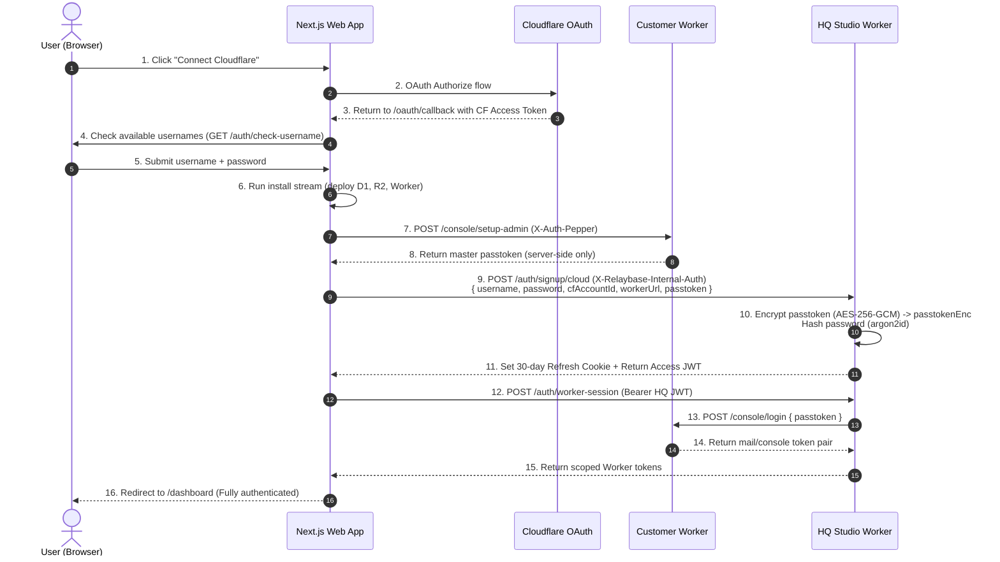
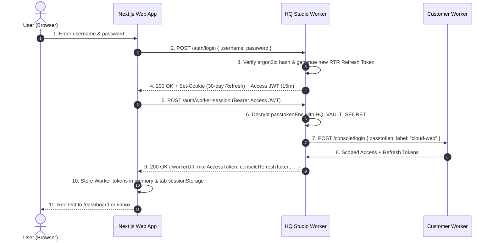
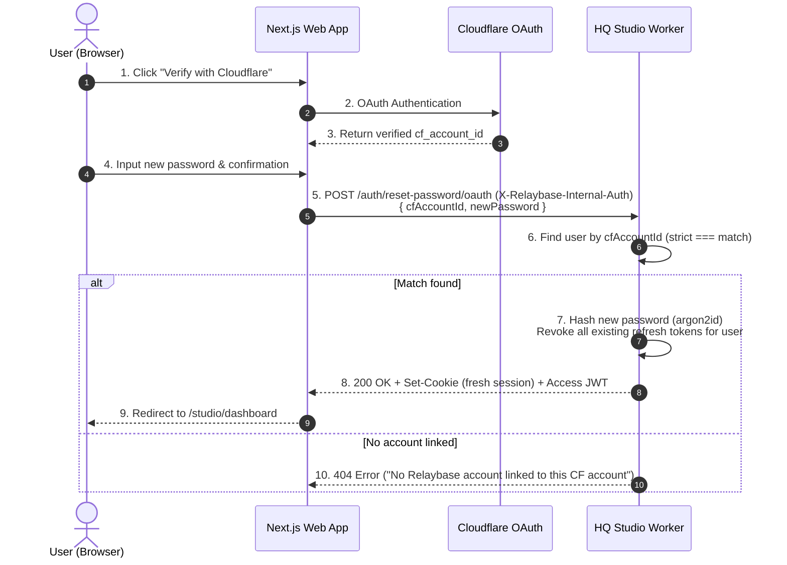
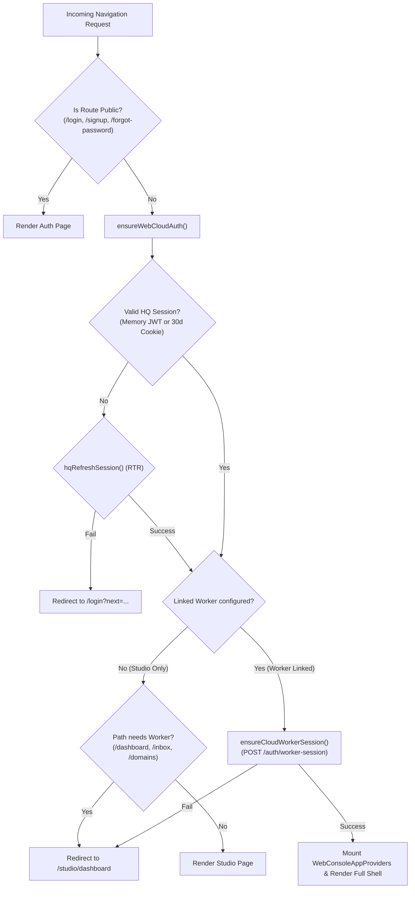
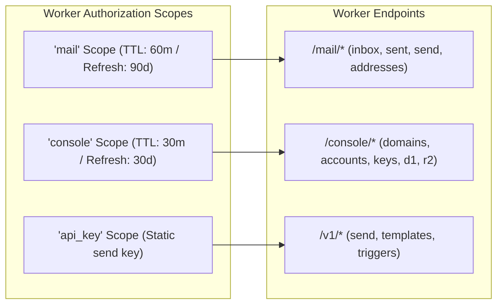
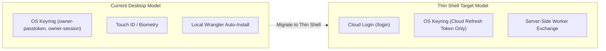

# Authentication Architecture & Specification

**Audience:** Engineers and AI agents designing, building, or modifying authentication, session gates, Cloudflare Worker access, Studio backend services, or desktop/mobile clients.

---

## 1. Architectural Overview & Core Principles

Relaybase implements a **Cloud-Unified Entry Authentication Model**. All web surfaces (HQ Studio, Console Dashboard, and Mailbox Client) share a single primary identity rooted in **Username + Password**, with **Cloudflare OAuth** acting as the hardware-level ownership and recovery anchor.

```mermaid
flowchart TB
  subgraph Client [Browser Client (app/)]
    AuthUI["(auth) UI (/login, /signup, /forgot-password)"]
    CloudSession["cloud-session.ts (HQ JWT + 30-Day Cookie)"]
    WorkerBridge["cloud-worker-session.ts (Scoped Worker Bearer)"]
    Gates["DesktopDashboardGate / HqStudioGate"]
  end

  subgraph CloudHQ [Cloud HQ Studio (hq-relaybase-studio)]
    AuthRoutes["/auth/* (login, signup/cloud, worker-session)"]
    AuthStore[("PostgreSQL hq_auth_users (Users, Passwords, RefreshTokens)")]
    Vault["passtoken-vault.ts (AES-256-GCM KMS)"]
  end

  subgraph Worker [Customer Cloudflare Worker (relaybase-worker)]
    WorkerAuth["/console/login & Scoped Bearer Validation"]
    WorkerDB[("Customer D1 & R2")]
  end

  AuthUI -->|1. ID + Password| CloudSession
  CloudSession -->|2. POST /auth/login| AuthRoutes
  AuthRoutes -->|3. Validate argon2id & RTR| AuthStore
  CloudSession -->|4. Bearer HQ JWT| WorkerBridge
  WorkerBridge -->|5. POST /auth/worker-session| AuthRoutes
  AuthRoutes -->|6. Decrypt passtokenEnc| Vault
  AuthRoutes -->|7. POST /console/login| WorkerAuth
  WorkerAuth -->|8. Mail & Console Tokens| WorkerBridge
  Gates -->|9. Direct Scoped Access| Worker
  WorkerAuth --> WorkerDB
```

### Core Security Principles

1. **Zero-Knowledge Passtoken for Users & Browsers:**
   - The master Worker `passtoken` is generated server-side during the initial Cloudflare installation flow (`setup-admin`).
   - It is encrypted via AES-256-GCM using `HQ_VAULT_SECRET` (`passtokenEnc`) and stored exclusively in Cloud HQ backend storage.
   - **Browsers and end-users never see, handle, download, or copy passtokens.**
2. **Single Identity, Unified Access:**
   - Users sign up with an ID (`username`) and password.
   - Logging in unlocks HQ Studio (`/studio/*`), Cloud Console (`/dashboard`, `/domains`, `/accounts`, etc.), and Mailbox (`/inbox`, `/sent`, `/compose`) simultaneously.
3. **Automated Server-Side Worker Exchange:**
   - When a browser logs in or restores a session, Cloud HQ validates the session and mints scoped Worker tokens (`mail` + `console`) on the user's behalf via `POST /auth/worker-session`.
   - The client uses short-lived scoped Bearer tokens to communicate with the customer Worker.
4. **Ownership-Proof Password Recovery:**
   - Password resets do not rely on unauthenticated email magic links.
   - The user re-authenticates via Cloudflare OAuth. If the authorized Cloudflare Account ID strictly matches the account's registered `cfAccountId`, the password hash is updated immediately and existing sessions are invalidated across all devices.

---

## 2. Actor & Route Authentication Taxonomy

| Actor | Credential | Primary Target Routes | Protocol & Token Lifetime |
|---|---|---|---|
| **Cloud Web User** | `username` + `password` | `/studio/*`, `/auth/*` | 30-day `HttpOnly`, `Secure`, `SameSite=Lax` cookie (RTR) + in-memory 15-min Access JWT |
| **Worker Proxy (Client)** | Server-minted scoped access JWT | `/mail/*`, `/console/*` | Scoped Bearer JWT (`mail`: 60m / 90d refresh, `console`: 30m / 30d refresh) |
| **Cloud Server-to-Server** | `X-Relaybase-Internal-Auth` | `/auth/signup/cloud`, `/auth/reset-password/oauth` | HMAC-SHA256 signature / pre-shared `HQ_INTERNAL_AUTH_SECRET` |
| **OAuth Install / Recovery** | Cloudflare OAuth Token | `/api/install/*`, `/api/auth/reset-password-oauth` | Bearer CF Access Token verified against Cloudflare API (`/accounts`) |
| **API Integrator** | Product API Key (`rb_live_…`) | `/v1/*` (Send, Triggers) | Static Bearer key stored hashed in customer D1 `api_keys` table |
| **Flutter Mobile Companion** | Account Mobile Password | `/mobile/*` | Basic / Bearer auth with `X-Account-Email` |

---

## 3. End-to-End Authentication Workflows

### 3.1. Sign-Up & Automated Provisioning (`/signup`)



### 3.2. Daily Sign-In & Worker Session Exchange (`/login`)



### 3.3. Password Reset via Cloudflare Ownership Proof (`/forgot-password`)



---

## 4. Backend Data Schema & Vault Cryptography

### 4.1. Central Identity Schema (`authStore` / `hq_auth_users`)

```typescript
export interface HqAuthUser {
  id: string;                         // e.g. "usr_01j8abc123def456"
  email: string;                      // Generated as "${username}@users.relaybase"
  passwordHash: string;               // $argon2id$v=19$m=65536,t=3,p=4$...
  name: string;                       // Display name
  accountLinkId: string;              // Linked workspace ID
  username: string;                   // Unique handle (e.g. "john-82")
  cfAccountId: string;                // Cloudflare Account ID hash/ID
  workerUrl: string;                  // Customer Worker URL (e.g. "https://api.domain.workers.dev")
  passtokenEnc?: string;              // AES-256-GCM encrypted vault string
  createdAt: string;                  // ISO 8601
  updatedAt: string;                  // ISO 8601
}

export interface HqRefreshTokenRecord {
  id: string;                         // e.g. "rft_01j8token999"
  tokenHash: string;                  // SHA-256(refreshToken)
  userId: string;
  expiresAt: string;                  // ISO 8601 (30 days)
  createdAt: string;
  userAgent: string | null;
  ip: string | null;
}
```

### 4.2. Passtoken Vault Encryption Specification

Defined in `hq/studio/src/lib/vault/passtoken-vault.ts`:
- **Algorithm:** AES-256-GCM authenticated symmetric encryption.
- **Key Derivation:** `SHA-256(HQ_VAULT_SECRET || HQ_JWT_SECRET)`.
- **Payload Format:** `v1:<iv_base64url>:<authTag_base64url>:<cipherText_base64url>`.
- **Properties:**
  - 96-bit cryptographically random IV generated per encryption operation.
  - 128-bit authentication tag prevents ciphertext tampering.
  - Decryption failure immediately rejects authentication with status `503`.

---

## 5. Client Gate Architecture & Route Resolution

Web client routing is enforced through layered React gates rather than multiple disconnected login views.



### Core Gate Components

1. **`DesktopDashboardGate` (`app/src/app/_shell/DesktopDashboardGate.tsx`):**
   - Covers all console shell routes (`/dashboard`, `/domains`, `/accounts`, `/keys`, `/logs`, `/studio/*`).
   - Resolves `ensureWebCloudAuth()`.
   - Mounts `WebConsoleAppProviders` with in-memory scoped Worker tokens.
2. **`EmailAppLayout` (`app/src/app/(email-app)/layout.tsx`):**
   - Covers standalone mailbox routes (`/inbox`, `/sent`, `/drafts`, `/compose`, `/mail-settings`).
   - Ensures Worker owner session is primed before rendering mailbox stores.
3. **`HqStudioGate` (`app/src/lib/hq-auth/HqStudioGate.tsx`):**
   - Specifically protects HQ Studio routes and automatically synchronizes Worker tokens in the background.
4. **Root Router (`app/src/app/page.tsx`):**
   - Evaluates session state immediately on `/` visit:
     - Unauthenticated $\rightarrow$ `/login`
     - Authenticated + Worker Linked $\rightarrow$ `/dashboard`
     - Authenticated + Studio Only $\rightarrow$ `/studio/dashboard`

---

## 6. Worker Scoped Token Architecture

The customer Worker enforces fine-grained authorization scopes on incoming Bearer tokens:



- A `console`-scoped token returns `401 Unauthorized` on `/mail/*` routes.
- A `mail`-scoped token returns `401 Unauthorized` on `/console/*` routes.
- The web client (`workerFetch` in `api-base.ts`) automatically attaches and refreshes the appropriate token based on the requested endpoint URL prefix.

---

## 7. Threat Model & Security Guarantees

| Threat Vector | Mitigation & Architectural Guarantee |
|---|---|
| **Credential Interception (Browser)** | Master `passtoken` is never transmitted to or held in browser storage (`localStorage`, `sessionStorage`, or cookies). Browsers only hold short-lived access JWTs. |
| **Cross-Site Scripting (XSS)** | Primary 30-day session token is stored in an `HttpOnly`, `SameSite=Lax`, `Secure` cookie inaccessible to JavaScript. |
| **User Enumeration** | `/auth/forgot-password` and `/auth/login` return generic error responses with consistent timing. |
| **Replay & Stolen Refresh Tokens** | Refresh Token Rotation (RTR) ensures every refresh request invalidates the old refresh token and issues a new one. Stale token usage invalidates the entire session chain. |
| **Unauthorized Password Reset** | Resets require proving cryptographic ownership of the linked Cloudflare Account ID via live OAuth challenge. Email link hijacks are impossible. |
| **Session Invalidation on Credential Change** | Changing a password immediately purges all active `refreshTokens` across all devices in `authStore`. |

---

## 8. Desktop Migration Roadmap (Thin Shell Strategy)

Currently, the Tauri desktop client uses a local OS keyring machine (`owner_session.rs`, `owner_passtoken.rs`, `team_session.rs`).



1. **Phase 1 (Completed):** Unify web application completely on Cloud authentication root.
2. **Phase 2 (In Progress):** Replace desktop `owner_passtoken.rs` and local Wrangler auto-install with Cloud OAuth install stream.
3. **Phase 3:** Desktop OS Keyring stores only the Cloud 30-day session token for silent boot, delegating Worker authentication entirely to Cloud HQ Studio.

---

## 9. File Map & Code Locations

| Component | Path | Responsibility |
|---|---|---|
| **Web Auth Pages** | `app/src/app/(auth)/*` | Unified `/login`, `/signup`, `/forgot-password` routes |
| **Auth UI Components** | `app/src/features/auth/components/*` | `LoginForm.tsx`, `SignupWizard.tsx`, `ResetPasswordOAuthForm.tsx` |
| **ID Availability Hook** | `app/src/features/auth/hooks/useIdAvailability.ts` | Real-time username validation and conflict resolution |
| **Cloud Session Port** | `app/src/lib/auth/cloud-session.ts` | High-level login, logout, registration client interface |
| **Worker Session Bridge** | `app/src/lib/auth/cloud-worker-session.ts` | Automated `POST /auth/worker-session` exchange & state maintenance |
| **Shell Gates** | `app/src/app/_shell/DesktopDashboardGate.tsx` | Main unified gate for console and mailbox routes |
| **Internal App Route Handlers** | `app/src/app/api/auth/*` | Next.js API route handlers for cloud registration and OAuth password reset |
| **HQ Auth Routes** | `hq/studio/src/routes/auth.ts` | Hono router handling signup, login, refresh, worker-session, and check-username |
| **HQ Auth Service** | `hq/studio/src/lib/auth/hq-auth-service.ts` | argon2id verification, session lifecycle, and user CRUD |
| **Worker Session Minting** | `hq/studio/src/lib/auth/worker-owner-session.ts` | Server-side `passtokenEnc` decryption and Worker `POST /console/login` execution |
| **Passtoken Vault** | `hq/studio/src/lib/vault/passtoken-vault.ts` | AES-256-GCM symmetric encryption/decryption module |
| **Internal Auth Guard** | `hq/studio/src/lib/auth/internal-auth.ts` | Pre-shared secret / header validation for inter-service communication |
