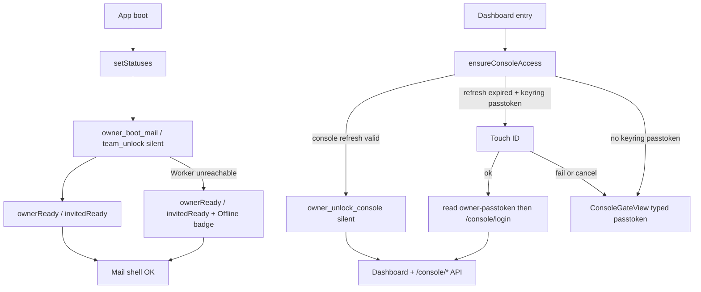

# Authentication architecture

**Audience:** humans and coding agents changing owner login, invited (team)
login, Worker auth middleware, desktop unlock, or mobile companion auth.

**Related docs:**

- Phase machine + console gate: **[desktop-session-machine.md](./desktop-session-machine.md)**
- Local secrets: **[relaybase-home-storage.md](./relaybase-home-storage.md)** → *OS keyring* (`owner-session` + `owner-passtoken`)
- Remote owner model: **[storage-architecture.md](./storage-architecture.md)** → *Owner auth*
- Archived pre–console-gate docs: **[legacy/](./legacy/)**

---

## Summary

Four auth surfaces on the product Worker, plus **Cloudflare OAuth** for install
/ recovery only (not daily mail).

| Actor | Credential | Worker routes | Desktop unlock |
|-------|------------|---------------|----------------|
| **Owner** | **Passtoken** → scoped mail + console sessions | `/console/*`, `/mail/*` | Mail: silent boot from mail refresh. When a **new login** is needed: Touch ID reads the keyring passtoken. Typed form only if bio fails / is declined or the keyring item is missing |
| **Invited teammate** | Per-account **mobile password** | `/mobile/*` (one email) | Silent `team_unlock` from keyring (no biometry) |
| **Flutter mobile** | Same mobile password | `/mobile/*` | Secure storage per launch |
| **API integrator** | Product API key (`rb-…`) | `/v1/*` | N/A |

Desktop entry is unified in **`AppSessionStore`** + **`DesktopDashboardGate`**.

---

## Owner passtoken in the keyring

**Rule:** After first enrollment on a machine, the owner passtoken plaintext
lives in the OS keyring. The user types it at first install / first login, and
only again if biometry fails or is declined, or the keyring item is missing.
Daily use **must not** ask for the passtoken.

The one-time download still exists (backup / another Mac). It is not the daily
credential surface.

### What Touch ID does

Touch ID / Windows Hello has **one** job: decide whether the app may **read**
the stored passtoken from the keyring.

| Biometry result | What happens |
|-----------------|--------------|
| Success | Rust reads `owner-passtoken` (JS never sees it) → `POST /console/login` → mint mail + console sessions |
| Fail or user cancel | The keyring item is **not** read. Show the typed passtoken form. |
| No biometry (Linux / unsigned `tauri dev`) | Read the keyring item without a prompt if it exists; otherwise typed form. |

Touch ID does **not** unlock refresh tokens, does **not** run on silent mail
boot, and is **not** a separate “console privilege” check. If a scoped refresh
can still mint access, do that silently — no Touch ID, no passtoken.

A failed or cancelled bio **must not** proceed to a keyring passtoken read.
Rust never returns the passtoken to JS.

### Why a separate keyring item

Silent mail boot must not load the passtoken. Put refresh tokens and the
passtoken in **different** keyring accounts:

| Keyring account | Contents | Read gate |
|-----------------|----------|-----------|
| `owner-session` | `workerUrl`, `refreshToken`, `mailRefreshToken` | Silent |
| `owner-passtoken` | passtoken plaintext | Touch ID / Windows Hello |

Service for both: `com.relaybase.desktop`. Prefer an OS user-presence /
biometry ACL on `owner-passtoken` so the platform itself refuses the read
without bio.

Still never: `~/.relaybase`, cookies, localStorage, sessionStorage. The Worker
stores only `sha256(AUTH_PEPPER || salt || passtoken)`.

### Write vs read

| Direction | When | Touch ID? |
|-----------|------|-----------|
| **Write** | `setup-admin` reveal, first `/console/login`, rotate, `reset-admin`, typed fallback | No — the user just created or typed the secret |
| **Read** | Any later login that needs the passtoken (console refresh expired, mail refresh expired or failed, re-login after logout cleared refreshes) | Yes |

Successful typed entry **writes** `owner-passtoken` so the next time is Touch
ID, not typing.

### When the typed form is allowed

- First enrollment on this Mac (no `owner-passtoken` item yet)
- Biometry failed or declined
- Keyring item missing or corrupt
- After `rotate-passtoken` / `reset-admin`, until the new token is written back

Those are the **only** times. Expired console refresh (30 min) or expired mail
refresh (90 days) is **not** a reason to type — Touch ID reads the stored
passtoken and logs in again.

### Sign out

Logout clears in-memory access and may clear refresh tokens.
**`owner-passtoken` stays.** Next launch can Touch ID instead of typing.
Clearing the passtoken item is an explicit “remove this Mac” action, not
ordinary sign-out.

---

## Scoped owner sessions (mail vs console)

Login mints **two refresh tokens** and two in-memory access tokens:

| Scope | Refresh TTL | Access TTL | Worker routes | Desktop command |
|-------|-------------|------------|---------------|-------------------|
| `mail` | 90 days | 60 min | `/mail/*` (inbox, sent, send, favicon, **GET `/mail/addresses`**) | `owner_boot_mail_cmd` (silent, no bio) |
| `console` | 30 min | 30 min | `/console/*` | `owner_unlock_console_cmd` when console refresh is still valid (silent). If expired: Touch ID → keyring passtoken → `/console/login` |

D1 `owner_sessions.label` uses `mail:` / `console:` prefixes.
`POST /console/refresh` body: `{ refreshToken, scope: "mail" | "console" }`.

Middleware: `requireMailSession` on `/mail/*`, `requireConsoleSession` on
`/console/*` (`server/src/lib/auth.ts`).

---

## Layer diagram

```mermaid
flowchart TB
  subgraph ui [app/]
    Gate[DesktopDashboardGate]
    Store[AppSessionStore]
    Unlock[UnlockView / TeamLoginView]
    ConsoleGate[ConsoleGateView]
    Bridge[bridge/owner · bridge/team]
    Fetch[desktopAwareFetch]
  end

  subgraph tauri [desktop/src-tauri]
    Owner[owner_session.rs]
    Team[team_session.rs]
    KR[OS keyring]
    Mem[split mail/console memory]
    WR[worker_request / team_worker_request]
  end

  subgraph worker [Product Worker]
    Auth[requireOwnerSession scope]
    Routes[/console/* /mail/* /mobile/* /v1/*]
    D1[(RELAYBASE_DB)]
  end

  Gate --> Store
  Store --> Unlock
  Store --> ConsoleGate
  Bridge --> Owner
  Bridge --> Team
  Fetch --> WR
  Owner --> KR
  Owner --> Mem
  Team --> KR
  WR --> Routes
  Routes --> Auth
  Auth --> D1
```

**Rule:** On desktop, JS never sees owner tokens, the keyring passtoken, or
teammate mobile passwords. Rust attaches Bearer headers in `worker_request` /
`team_worker_request`. The typed passtoken field is handed to Rust immediately
and is not kept in JS after submit.

---

## Secret storage (short)

### Owner

| Secret | Where |
|--------|-------|
| Passtoken plaintext | OS keyring `owner-passtoken` (Touch ID to **read**). Also the one-time user download. Never `~/.relaybase` |
| Passtoken hash | D1 `owner_config` |
| `mailRefreshToken` + console `refreshToken` | OS keyring `owner-session` JSON (silent read) |
| Mail / console access JWT | Tauri process memory (split) |
| `AUTH_PEPPER` | Worker wrangler secret |
| Worker URL | Keyring first, `credentials.json` mirror |

### Invited teammate

| Secret | Where |
|--------|-------|
| Mobile password | OS keyring `team-session:{email}` |
| URL + email identity | `~/.relaybase/team-login.json` (no password) |

Full layout: **[relaybase-home-storage.md](./relaybase-home-storage.md)**.

---

## Desktop boot and console gate



Enrolled owner and teammate users who cannot reach the Worker stay in the
mailbox (`workerUnreachable` + sidebar Offline badge). `UnlockView` is
first-login / bio-declined only — not an offline screen.

**Dashboard entry points** (call `ensureConsoleAccess()`):

- `UserSidebar.switchMode("dashboard")` — stays on mail if Touch ID is dismissed (cannot read keyring passtoken) or the Worker is unreachable
- `ConsoleRouteGate` on dashboard pathname

Touch ID is invoked **only** to authorize a read of `owner-passtoken`.
`ensureConsoleAccess()` is the usual call site; mail refresh expiry / 401
that cannot be repaired with `owner_boot_mail` uses the same gate.

---

## 401 handling

| Worker path | DOM event | Store action |
|-------------|-----------|--------------|
| `/mail/*` | `relaybase:unauthorized` | `handleWorkerUnauthorized()` — retry `owner_boot_mail`; Worker unreachable stays in the mailbox; if refresh is truly expired, Touch ID → keyring passtoken → login |
| `/console/*` | `relaybase:console-unauthorized` | `handleConsoleUnauthorized()` — same console-gate flow (silent refresh, else Touch ID → keyring passtoken, else typed form) |

Neither path wipes Worker URL or keyring (`owner-session` / `owner-passtoken`).
Implemented in `api-base.ts` + `context.tsx`.

---

## Endpoint auth classification

### Public

| Endpoint | Purpose |
|----------|---------|
| `GET /health` | Health probe |
| `GET /console/auth-status` | `{ ownerConfigured, passtokenPrefix? }` |
| `POST /console/login` | Passtoken |

### Pepper bootstrap (`X-Auth-Pepper`)

While no owner exists: `setup-admin`, `init-db`, `migrate-db`.

### Cloudflare OAuth account proof (`X-Cf-Access-Token`)

`init-db` and `migrate-db` also accept a Cloudflare OAuth access token that can prove the install account (install client): env `CF_ACCOUNT_ID`, D1 `owner_config.cf_account_id`, or `GET /accounts`. Desktop install and Worker upgrade already hold this token — an existing owner must not block migrate-db. `POST /console/reset-admin` uses the narrower passtoken-updater client (`secrets-store.write`) and proves Secrets Store access on that account. Worker `CF_ACCOUNT_ID` is optional — **[cf-oauth-install-token.md](./cf-oauth-install-token.md)**.

### Owner session (scoped Bearer)

| Route group | Scope |
|-------------|-------|
| `/console/*` | `console` access JWT |
| `/mail/*` | `mail` access JWT (includes read-only `GET /mail/addresses`) |

Handlers: `server/src/routes/console/owner-auth.ts`.

### Mobile password

`/mobile/*` — `Authorization: Bearer <password>` + `X-Account-Email`.

### API key

`/v1/*` — plaintext in `~/.relaybase/{scopeId}/api-keys.json`; hash in D1.

---

## Use case index

| ID | Use case | Mechanism |
|----|----------|-----------|
| O1 | Owner first install | CF OAuth + pepper + setup-admin |
| O2 | Owner first login | `/console/login` → write `owner-passtoken` + dual refresh → `ownerReady` |
| O3 | Owner mail boot | Silent `owner_boot_mail` → `ownerReady` |
| O3b | Owner console gate | Valid console refresh → silent unlock. Else Touch ID → keyring passtoken → login |
| O4 | Owner passtoken fallback | Typed form **only** if no keyring item or bio fail / decline |
| O5 | Owner sign out | Logout + clear memory / refreshes; **`owner-passtoken` stays** |
| O6 | Owner mail 401 | Silent mail refresh retry |
| O6b | Owner console 401 | Console gate overlay |
| O7 | Rotate passtoken | Logged-in owner; revokes all sessions; write new `owner-passtoken` |
| O8 | Forgot passtoken | CF OAuth (Secrets Store) → `/console/reset-admin` → write new `owner-passtoken` |
| T1 | Provision mobile password | Owner → `/console/addresses/mobile-password` |
| T2 | Teammate first login | `/mobile/config` → keyring → `invitedReady` |
| T3 | Teammate daily boot | Silent `team_unlock` → `invitedReady` |
| T4 | Teammate sign out / switch owner | `team_logout` / `switchToOwnerLogin` |
| T5 | Flutter login | Secure storage → `/mobile/*` |
| A1 | API key call | `/v1/*` |

Detailed phase transitions: **[desktop-session-machine.md](./desktop-session-machine.md)**.

---

## File map (auth touchpoints)

### Worker

| File | Role |
|------|------|
| `server/src/lib/auth.ts` | `requireConsoleSession`, `requireMailSession`, API key, pepper |
| `server/src/lib/owner-auth.ts` | Login, scoped refresh, logout, rotate, reset |
| `server/src/lib/owner-tokens.ts` | Passtoken format, scoped access JWT, TTL constants |
| `server/src/lib/mobile-auth.ts` | `/mobile/*` password check |
| `server/src/routes/console/owner-auth.ts` | HTTP auth routes |
| `server/src/routes/console/*.ts` | Console scope |
| `server/src/routes/mail/*.ts` | Mail scope |

### Tauri

| File | Role |
|------|------|
| `owner_session.rs` | Dual keyring refresh, `owner_login_from_keyring`, split memory, boot/unlock/logout, scoped `worker_request` |
| `owner_passtoken.rs` | `owner-passtoken` exists/store/load-after-auth |
| `team_session.rs` | Team keyring, silent unlock, `team_worker_request` |
| `keyring_store.rs` | OS secret store |
| `secrets.rs` | `credentials.json`, `team-login.json` |

### App

| File | Role |
|------|------|
| `lib/desktop/app-session/store.ts` | Phase machine, `bootFromKeyring`, `ensureConsoleAccess` |
| `lib/desktop/app-session/context.tsx` | Boot hydrate, scoped 401 listeners |
| `lib/desktop/bridge/owner.ts` | `desktopOwnerBootMail`, `desktopOwnerUnlockConsole`, `desktopOwnerLoginFromKeyring`, `desktopOwnerTouchId` |
| `lib/desktop/api/api-base.ts` | Scoped 401 dispatch |
| `console/components/setup/ConsoleGateView.tsx` | Touch ID (read keyring passtoken) + typed fallback |
| `console/components/setup/ConsoleRouteGate.tsx` | Dashboard route blocker |
| `console/components/setup/UnlockView.tsx` | First-login / bio-declined typed form |

After Worker auth changes: **`cd server && pnpm run build:bundle`** (see **AGENTS.md**).

---

## Agent checklist

1. Read this doc + **desktop-session-machine.md** before changing unlock flow.
2. Persist owner passtoken plaintext **only** in OS keyring `owner-passtoken`. Never `~/.relaybase`, cookies, localStorage, or sessionStorage. JS never reads it from the keyring.
3. `/console/*` → console scope; `/mail/*` → mail scope.
4. Touch ID **only** authorizes a read of `owner-passtoken`. Not on silent mail boot, not on teammate flows, not as a generic console privilege check.
5. After first enrollment, do not show the typed passtoken form unless bio failed / was declined or the keyring item is missing.
6. New desktop entry paths → `AppSessionStore` actions, not bypass routes.
7. Rebuild Worker bundle after `server/` auth changes.
