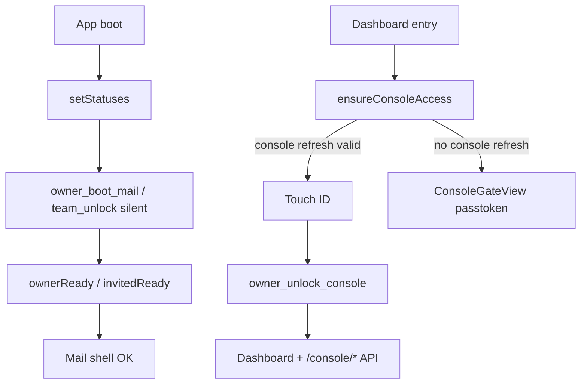

# Authentication architecture

**Audience:** humans and coding agents changing owner login, invited (team)
login, Worker auth middleware, desktop unlock, or mobile companion auth.

**Related docs:**

- Phase machine + console gate: **[desktop-session-machine.md](./desktop-session-machine.md)**
- Local secrets: **[relaybase-home-storage.md](./relaybase-home-storage.md)** → *OS keyring*
- Remote owner model: **[storage-architecture.md](./storage-architecture.md)** → *Owner auth*
- Archived pre–console-gate docs: **[legacy/](./legacy/)**

---

## Summary

Four auth surfaces on the product Worker, plus **Cloudflare OAuth** for install
/recovery only (not daily mail).

| Actor | Credential | Worker routes | Desktop unlock |
|-------|------------|---------------|----------------|
| **Owner** | Username + **passtoken** → scoped mail + console sessions | `/console/*`, `/mail/*` | Mail: silent boot (`owner_boot_mail`). Console: Touch ID at **dashboard entry only** |
| **Invited teammate** | Per-account **mobile password** | `/mobile/*` (one email) | Silent `team_unlock` from keyring (no biometry) |
| **Flutter mobile** | Same mobile password | `/mobile/*` | Secure storage per launch |
| **API integrator** | Product API key (`rb-…`) | `/v1/*` | N/A |

Desktop entry is unified in **`AppSessionStore`** + **`DesktopDashboardGate`**.

---

## Scoped owner sessions (mail vs console)

Login mints **two refresh tokens** and two in-memory access tokens:

| Scope | Refresh TTL | Access TTL | Worker routes | Desktop command |
|-------|-------------|------------|---------------|-------------------|
| `mail` | 90 days | 60 min | `/mail/*` | `owner_boot_mail_cmd` (silent, no bio) |
| `console` | 30 min | 30 min | `/console/*` | `owner_unlock_console_cmd` (after Touch ID) |

D1 `owner_sessions.label` uses `mail:` / `console:` prefixes.
`POST /console/refresh` body: `{ refreshToken, scope: "mail" | "console" }`.

Middleware: `requireMailSession` on `/mail/*`, `requireConsoleSession` on
`/console/*` (`server/src/lib/auth.ts`).

---

## Layer diagram

```mermaid
flowchart TB
  subgraph ui [app/]
    Gate[DesktopDashboardGate]
    Store[AppSessionStore]
    Unlock[UnlockView / TeamLoginView]
    ConsoleGate[ConsoleGateView]
    Bridge[bridge/owner · bridge/team]
    Fetch[desktopAwareFetch]
  end

  subgraph tauri [desktop/src-tauri]
    Owner[owner_session.rs]
    Team[team_session.rs]
    KR[OS keyring]
    Mem[split mail/console memory]
    WR[worker_request / team_worker_request]
  end

  subgraph worker [Product Worker]
    Auth[requireOwnerSession scope]
    Routes[/console/* /mail/* /mobile/* /v1/*]
    D1[(RELAYBASE_DB)]
  end

  Gate --> Store
  Store --> Unlock
  Store --> ConsoleGate
  Bridge --> Owner
  Bridge --> Team
  Fetch --> WR
  Owner --> KR
  Owner --> Mem
  Team --> KR
  WR --> Routes
  Routes --> Auth
  Auth --> D1
```

**Rule:** On desktop, JS never sees owner tokens or teammate mobile passwords.
Rust attaches Bearer headers in `worker_request` / `team_worker_request`.

---

## Secret storage (short)

### Owner

| Secret | Where |
|--------|-------|
| Passtoken plaintext | User download only |
| Passtoken hash | D1 `owner_config` |
| `mailRefreshToken` + console `refreshToken` | OS keyring `owner-session` JSON |
| Mail / console access JWT | Tauri process memory (split) |
| `AUTH_PEPPER` | Worker wrangler secret |
| Worker URL | Keyring first, `credentials.json` mirror |

### Invited teammate

| Secret | Where |
|--------|-------|
| Mobile password | OS keyring `team-session:{email}` |
| URL + email identity | `~/.relaybase/team-login.json` (no password) |

Full layout: **[relaybase-home-storage.md](./relaybase-home-storage.md)**.

---

## Desktop boot and console gate



**Dashboard entry points** (all call `ensureConsoleAccess()`):

- `UserSidebar.switchMode("dashboard")`
- `RestoreLastRoute` when saved path is dashboard
- `ConsoleRouteGate` on dashboard pathname

Touch ID is invoked only from `ensureConsoleAccess()` → `desktopOwnerTouchId`.

---

## 401 handling

| Worker path | DOM event | Store action |
|-------------|-----------|--------------|
| `/mail/*` | `relaybase:unauthorized` | `handleWorkerUnauthorized()` — retry `owner_boot_mail` |
| `/console/*` | `relaybase:console-unauthorized` | `handleConsoleUnauthorized()` — open console gate |

Neither path wipes Worker URL or keyring. Implemented in `api-base.ts` +
`context.tsx`.

---

## Endpoint auth classification

### Public

| Endpoint | Purpose |
|----------|---------|
| `GET /health` | Health probe |
| `GET /console/auth-status` | `{ ownerConfigured }` |
| `POST /console/login` | Username + passtoken |

### Pepper bootstrap (`X-Auth-Pepper`)

While no owner exists: `setup-admin`, `init-db`, `migrate-db`.

### Owner session (scoped Bearer)

| Route group | Scope |
|-------------|-------|
| `/console/*` | `console` access JWT |
| `/mail/*` | `mail` access JWT |

Handlers: `server/src/routes/console/owner-auth.ts`.

### Mobile password

`/mobile/*` — `Authorization: Bearer <password>` + `X-Account-Email`.

### API key

`/v1/*` — plaintext in `~/.relaybase/{scopeId}/api-keys.json`; hash in D1.

---

## Use case index

| ID | Use case | Mechanism |
|----|----------|-----------|
| O1 | Owner first install | CF OAuth + pepper + setup-admin |
| O2 | Owner first login | `/console/login` → dual refresh in keyring → `ownerReady` |
| O3 | Owner mail boot | Silent `owner_boot_mail` → `ownerReady` |
| O3b | Owner console gate | Touch ID → `owner_unlock_console` or `ConsoleGateView` |
| O4 | Owner passtoken fallback | `UnlockView` secret form |
| O5 | Owner sign out | Logout + clear memory; keyring may remain |
| O6 | Owner mail 401 | Silent mail refresh retry |
| O6b | Owner console 401 | Console gate overlay |
| O7 | Rotate passtoken | Logged-in owner; revokes all sessions |
| O8 | Forgot passtoken | CF OAuth → `/console/reset-admin` |
| T1 | Provision mobile password | Owner → `/console/addresses/mobile-password` |
| T2 | Teammate first login | `/mobile/config` → keyring → `invitedReady` |
| T3 | Teammate daily boot | Silent `team_unlock` → `invitedReady` |
| T4 | Teammate sign out / switch owner | `team_logout` / `switchToOwnerLogin` |
| T5 | Flutter login | Secure storage → `/mobile/*` |
| A1 | API key call | `/v1/*` |

Detailed phase transitions: **[desktop-session-machine.md](./desktop-session-machine.md)**.

---

## File map (auth touchpoints)

### Worker

| File | Role |
|------|------|
| `server/src/lib/auth.ts` | `requireConsoleSession`, `requireMailSession`, API key, pepper |
| `server/src/lib/owner-auth.ts` | Login, scoped refresh, logout, rotate, reset |
| `server/src/lib/owner-tokens.ts` | Passtoken format, scoped access JWT, TTL constants |
| `server/src/lib/mobile-auth.ts` | `/mobile/*` password check |
| `server/src/routes/console/owner-auth.ts` | HTTP auth routes |
| `server/src/routes/console/*.ts` | Console scope |
| `server/src/routes/mail/*.ts` | Mail scope |

### Tauri

| File | Role |
|------|------|
| `owner_session.rs` | Dual keyring refresh, split memory, boot/unlock/logout, scoped `worker_request` |
| `team_session.rs` | Team keyring, silent unlock, `team_worker_request` |
| `keyring_store.rs` | OS secret store |
| `secrets.rs` | `credentials.json`, `team-login.json` |

### App

| File | Role |
|------|------|
| `lib/desktop/app-session/store.ts` | Phase machine, `bootFromKeyring`, `ensureConsoleAccess` |
| `lib/desktop/app-session/context.tsx` | Boot hydrate, scoped 401 listeners |
| `lib/desktop/bridge/owner.ts` | `desktopOwnerBootMail`, `desktopOwnerUnlockConsole`, `desktopOwnerTouchId` |
| `lib/desktop/api/api-base.ts` | Scoped 401 dispatch |
| `console/components/setup/ConsoleGateView.tsx` | Console Touch ID + passtoken |
| `console/components/setup/ConsoleRouteGate.tsx` | Dashboard route blocker |
| `console/components/setup/UnlockView.tsx` | Secret-form unlock (no bio) |

After Worker auth changes: **`cd server && pnpm run build:bundle`** (see **AGENTS.md**).

---

## Agent checklist

1. Read this doc + **desktop-session-machine.md** before changing unlock flow.
2. Never persist passtoken, access, refresh, or mobile password outside keyring / memory rules.
3. `/console/*` → console scope; `/mail/*` → mail scope.
4. Touch ID only in `ensureConsoleAccess` — not on mail boot or teammate flows.
5. New desktop entry paths → `AppSessionStore` actions, not bypass routes.
6. Rebuild Worker bundle after `server/` auth changes.
