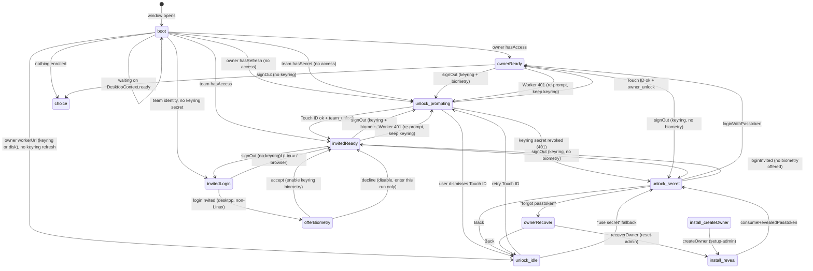

# Desktop session state machine

Daily launch shows `UnlockView` first. The passtoken form is a fallback —
see **[desktop-unlock-unresolved.md](./desktop-unlock-unresolved.md)** for
the race that used to skip it.

**Audience:** humans and coding agents changing the desktop app's
authentication / unlock flow, the owner or invited (team) session, or anything
that decides "who can enter the app right now".

For where the secrets live (keyring, `~/.relaybase`), see
**[relaybase-home-storage.md](./relaybase-home-storage.md)** → *OS keyring*.
For the remote owner auth model (passtoken + sessions, `AUTH_PEPPER`), see
**[storage-architecture.md](./storage-architecture.md)** → *Owner auth*.

---

## Why a state machine

The desktop app has three entry stories — **owner daily unlock**,
**invited (team) login/unlock**, and **first-time install** — that used to be
spread across `DesktopDashboardGate`, `OwnerUnlockPanel`, the setup layout,
`hasOwnerSession()` checks, and a 401 handler that wiped credentials. The
result was the reported bug: **Touch ID did not appear on launch** because a
waterfall of sequential checks and component mounts ran before the biometric
prompt.

Everything now flows through one MobX store, **`AppSessionStore`**
(`app/src/lib/desktop/app-session/store.ts`), exposed via
**`AppSessionProvider`** (`app/src/lib/desktop/app-session/context.tsx`). The
store is the single source of truth for the current **phase**; the dashboard
gate is a pure `switch` over that phase.

## The phases

`AppSessionPhase` (discriminated union on `kind`):

| Phase | Meaning |
|-------|---------|
| `boot` | Window just opened; keyring status not yet fetched. |
| `choice` | Nothing enrolled (no worker URL, no keyring secret) → welcome. |
| `install` | First-time install: `oauth` → `progress` → `createOwner` → `revealPasstoken`. |
| `invitedLogin` | Invited teammate, no keyring secret yet → enter account email + mobile password. |
| `offerBiometry` | Invited teammate just verified; offer to enable Touch ID once. |
| `unlock` | A keyring secret exists but no in-memory access. `role: owner \| invited`, `mode: prompting \| idle \| secret`. |
| `invitedReady` | Invited session unlocked — render the team (mailbox-only) shell. |
| `ownerReady` | Owner session unlocked — render the admin shell. |
| `ownerRecover` | Owner forgot passtoken → CF OAuth + `/console/reset-admin`. |

## Boot — why Touch ID is instant

`AppSessionProvider` mounts at the **root layout** (see `AppProviders` /
`app/src/app/layout.tsx`), so it runs the moment the window opens — before any
gate or unlock panel mounts. Its boot effect fetches **owner and team keyring
status in parallel**:

```ts
const [ownerStatus, teamStatus] = await Promise.all([
  desktopOwnerSessionStatus(),
  desktopTeamSessionStatus(),
]);
store.setStatuses(ownerStatus, teamStatus);
```

`setStatuses` → `reconcileFromStatuses` decides the phase. If a keyring secret
exists and there is no in-memory access, the phase becomes
`unlock { mode: "prompting" }` and `maybeAutoPrompt()` fires
`promptUnlock()` **synchronously** — which calls `desktopAuthenticateBiometry`
(Touch ID / Windows Hello) and then `owner_unlock` / `team_unlock`. No plugin
status pre-check, no waiting on `DesktopContext.ready`, no panel mount in
between. That is the fix: the biometric prompt is triggered directly from the
boot effect.

`DesktopContext` (credentials, scope id, mail-cache migration) still loads in
parallel; the store waits for it only to resolve the **non-prompt** branches
(`choice` / `invitedLogin` / owner UnlockView), which need a resolved Worker
URL (`resolveWorkerUrl`: keyring first, then `credentials.json` / `team-login.json`).
A worker URL with no keyring secret opens `unlock { mode: "idle" }` — the
fingerprint surface — not the passtoken form. Keyring-only `workerUrl` (no
`credentials.json`) is enough for idle unlock; the URL field is hidden.

## State diagram



## Owner vs invited — same machine, different secret

| | Owner daily | Invited daily |
|---|---|---|
| Keyring account | `owner-session` | `team-session:{email}` |
| Keyring secret | `refreshToken` | `mobilePassword` |
| Unlock action | `owner_unlock` (rotates refresh) | `team_unlock` (loads password to memory) |
| Worker calls | `desktopWorkerRequest` (admin token in memory) | `team_worker_request` (`Bearer <mobilePassword>` + `X-Account-Email` from memory) |
| First-time | install → `setup-admin` → reveal passtoken | `invitedLogin` → verify `/mobile/config` → `offerBiometry` |
| Recover | `ownerRecover` → CF OAuth → `/console/reset-admin` | n/a (admin re-issues mobile password) |

Both roles use the same `unlock` phase and the same `UnlockView`; the store
drives the difference via `role`.

## 401 handling

A Worker 401 used to clear credentials and redirect to `/setup`. Now
`AppSessionProvider` listens for `relaybase:unauthorized` and calls
`store.handleWorkerUnauthorized()`, which re-fetches keyring status and
re-prompts unlock — **without wiping the worker URL or keyring**. If the
refresh was revoked, the store falls back to the secret form so the user can
re-authenticate in place.

## Gate

`app/src/app/_shell/DesktopDashboardGate.tsx` is now a `switch` over
`store.phase`:

- `boot` / `choice` / `install` / `ownerRecover` → `BootScreen` (and a
  deferred redirect to `/setup` for choice/install/recover, which own their
  chrome under `app/src/app/setup/`).
- `invitedLogin` → `TeamLoginView`
- `offerBiometry` → `OfferBiometryView`
- `unlock` → `UnlockView` (prompting / idle / secret)
- `invitedReady` → team (mailbox-only) `DashboardShell`
- `ownerReady` → admin `DashboardShell`

There is no longer a `hasOwnerSession()` / `ownerAccess` check scattered
across the shell. The last-route restore (`app/src/app/page.tsx`) waits for
`store.canShowApp` before restoring, so the window no longer redirects into
the shell and then back out to Touch ID.

**Entry trampolines:** `/setup/connect` calls `openAlreadyInstalled()` then
`router.replace("/")` so UnlockView renders via `SessionPhaseScreen` on `/`.
`/login` does the same for invited login via `openInvitedLogin()` — the form
and post-login biometry offer must not render on a standalone route that ignores
the phase machine.

From invited unlock (`UnlockView` with `role: invited`), **Log in as owner**
calls `switchToOwnerLogin()` — it drops the team keyring + `team-login.json`
and enters the owner unlock / passtoken flow without wiping the owner keyring.

## Files

| File | Role |
|------|------|
| `app/src/lib/desktop/app-session/` | MobX store, phases, provider, 401 listener |
| `app/src/lib/desktop/app-session/store.test.ts` | Transition tests (injected Tauri mock) |
| `app/src/lib/desktop/biometry/` | Touch ID / Windows Hello prompt, label, dismiss detection |
| `app/src/lib/desktop/shell/AppProviders.tsx` | Root `DesktopProvider` + `AppSessionProvider` |
| `app/src/app/_shell/DesktopDashboardGate.tsx` | Phase `switch` gate |
| `app/src/console/components/setup/UnlockView.tsx` | Common owner/invited unlock surface |
| `app/src/console/components/setup/OfferBiometryView.tsx` | One-time invited biometry offer |
| `app/src/console/components/setup/TeamLoginView.tsx` | Invited login form |
| `app/src/console/components/setup/RecoverAdminPanel.tsx` | CF OAuth → `/console/reset-admin` |
| `desktop/src-tauri/src/owner_session.rs` | Owner keyring (`owner-session`) |
| `desktop/src-tauri/src/team_session.rs` | Team keyring (`team-session:{email}`) + legacy migration |
| `desktop/src-tauri/src/secrets.rs` | `team-login.json` identity-only writes |

## Adding to the machine

1. Add the new `kind` to `AppSessionPhase` and the `role` derivation.
2. Add a transition in `reconcileFromStatuses` or a store action — never mutate
   `phase` from a view; call an action (e.g. `requestPrompt()`).
3. Add a `case` to the gate `switch` and a view that only renders.
4. If it ships in the Worker, rebuild the bundle (see `AGENTS.md` → *Worker
   bundle*).
5. Add a transition test in `app/src/lib/desktop/app-session/store.test.ts` (inject `AppSessionDeps`).
