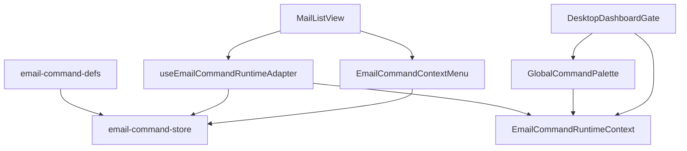

# Email Command System

**Audience:** humans and coding agents changing mail actions, shortcuts, Cmd+K, or row context menus.

**Source of truth:** `app/src/email/commands/`

If you add or change an email action (reply, trash, mark read, copy, compose, etc.), read this document first and follow the rules below.

---

## Purpose

Relaybase mail actions must behave like a Superhuman-style command system:

1. **One definition** of each command (label, icon, shortcut, availability).
2. **One execution path** shared by:
   - Cmd+K / Ctrl+K palette
   - Row right-click context menu
   - Mail keyboard shortcuts that map to commands (`c`, `r`, `a`, …)
3. **Selection-filtered lists** — show only commands that apply to the current folder + selected item. Do **not** show disabled gray rows for unavailable actions.
4. **Layered keyboard handling** — app-level ⌘K must not also fire mail-layer `k` (previous message).

Do **not** reintroduce dashboard “Open Dashboard / Open Domains / …” navigation into the mail Cmd+K palette. That palette is mail-command only.

The `GlobalCommandPalette` *may* host a separate **App-level group** (heading “App”, rendered above the mail groups) for global navigation such as “Go to settings” (`⌘,` / `Ctrl+,`). App commands are defined locally in `GlobalCommandPalette.tsx` — they are **not** added to `EMAIL_COMMAND_DEFS` / `email-command-store.ts`, are not selection-filtered, and are always available (even when no mailbox scope is published). The mail command registry remains mail-action only. The shared settings-URL logic lives in `app/src/lib/navigation/open-settings.ts` (`useOpenSettings`), reused by the `AppHotkeys` (`⌘,`) listener.

---

## Folder structure

```text
app/src/email/commands/
  email-command-defs.ts           # Static metadata (id, label, icon, shortcut, requires)
  email-command-store.ts          # resolve + run (availability + runners)
  EmailCommandRuntimeContext.tsx  # paletteOpen + published selection scope
  useEmailCommandRuntimeAdapter.ts# Binds mailbox/router into EmailCommandRuntime
  EmailCommandContextMenu.tsx     # Row context menu UI
  GlobalCommandPalette.tsx        # Cmd+K UI (consumes scope.commands)
  index.ts                        # Public barrel — external imports use this
```

Related (outside the module, thin consumers):

| File | Role |
|------|------|
| `app/src/email/lib/compose/compose-open.ts` | Compose open/resume/force-new policy + adapter hooks |
| `app/src/email/components/reply/useThreadComposeState.ts` | Inline thread compose panel state |
| `app/src/app/_shell/DesktopDashboardGate.tsx` | Mounts `EmailCommandRuntimeProvider` + `GlobalCommandPalette` |
| `app/src/email/components/mailbox/MailListView/MailListView.tsx` | **Orchestrator** only: list/detail hooks + pane assembly. No direct store logic. |
| `app/src/email/components/mailbox/MailListView/mail-list-helpers.ts` | Pure mail list helpers (formatting, href, preview, account matching) |
| `app/src/email/components/mailbox/MailListView/useMailListItems.ts` | Derives `items`, `selected`, thread maps, detail loading from store |
| `app/src/email/components/mailbox/MailListView/useMailListKeyboard.ts` | Bubble-phase mail shortcuts (`j`/`k`/`Esc`/`c`/`r`/`a`/`f`) |
| `app/src/email/components/mailbox/MailListView/MailListPane.tsx` | List pane UI (toolbar + rows + empty state) |
| `app/src/email/components/mailbox/MailListView/MailDetailPane.tsx` | Detail pane UI (draft / thread / single message) |
| `app/src/email/components/compose/ComposeView.tsx` | Renders compose from URL only (no open policy) |
| `app/src/components/ui/command.tsx` | Generic cmdk primitives |
| `app/src/components/ui/context-menu.tsx` | Generic context-menu primitives |
| `app/src/email/stores/email-mailbox-store.ts` | Data actions (`markRead`, `moveToTrash`, …) |



---

## Data flow

1. **Static defs** declare what a command *is* (`EMAIL_COMMAND_DEFS`).
2. **Adapter** builds an `EmailCommandRuntime` for a target row/selection (hrefs, unread, store callbacks).
3. **`resolveEmailCommands(runtime)`** returns **available-only** commands.
4. Adapter **publishes** `{ title, targetId, targetKind, commands }` into runtime context (`setScope`).
5. **Palette** and **context menu** render that list (or resolve from a row-specific runtime).

Clear scope only on mailbox view unmount. Do not clear-then-set on every selection update (that briefly emptied Cmd+K).

---

## Keyboard layers (mandatory)

| Layer | Where | Behavior |
|-------|--------|----------|
| **App** | `GlobalCommandPalette` | Capture-phase listener for `meta/ctrl + k`. `preventDefault` + `stopImmediatePropagation`. Toggles `paletteOpen`. |
| **Mail** | `MailListView` | Bubble-phase. If `paletteOpen` **or** `meta/ctrl/alt` → return immediately. Then handle `j/k`, arrows, `u/esc`, `e/Delete`, and command keys via `runSelectedCommand`. |

Rules:

- Never handle bare `k` without checking modifiers.
- Never let mail shortcuts run while the palette is open.
- List navigation (`j`/`k`/arrows/`u`/`esc`) stays in the mail view.
- Standalone `c` / `⇧C` go through `useStandaloneComposeOpener`. Inbox-thread `r`/`a`/`f` use `useThreadComposeState` + `resumeOrNewDraftId`. Cmd+K / context-menu reply and forward use that same inline opener when the target thread is already open; otherwise they navigate with `?reply=` / compose URL. Other command keys go through `runSelectedCommand`.
- Trash `e` / Delete may keep next-item navigation in `MailListView` (view concern, not command metadata).

---

## Compose open / Esc / draft resume

**Source of truth:** [`app/src/email/lib/compose/compose-open.ts`](../app/src/email/lib/compose/compose-open.ts)

Callers must **not** call `emailComposeHref`, `forceNew`, or `findResumableComposeDraft` directly. Consume adapter hooks / helpers only:

| Export | Use for |
|--------|---------|
| `useStandaloneComposeOpener()` | `openCompose` / `openComposeNew` / `composeNewHref` / `hasResumableDraft` |
| `useThreadComposeOpener()` | URL reply/forward + `resumeOrNewDraftId` for inline keyboard |
| `composeNewHref(account?)` | Sidebar / account nav Link hrefs (always new) |
| `exactDraftComposeHref(id)` | Open a specific standalone draft |
| `resolveReplyOpenDraftId(...)` | `?reply=` / Unsend panel restore |

Inline thread compose state (mode / draft id / Esc dismiss) lives in [`useThreadComposeState`](../app/src/email/components/reply/useThreadComposeState.ts). `ComposeView` only renders from URL — no resume policy.

Esc in compose (standalone, inline reply, inline forward) **closes the composer without discarding**. Drafts autosave; recovery is reopen, not Undo. Esc/back must `flushNow()` before navigate so the just-edited draft wins `updatedAt`.

| Entry | Intent | Draft behavior |
|-------|--------|----------------|
| Per-message UI Reply / Reply all / Forward | “Compose **here**” (quote stack depends on which message) | **Always new** draft id |
| Toolbar **Compose** / sidebar Compose nav (incl. per-account) | Explicit new message | **Always new** (`composeNewHref` → `?new=1`) |
| Keyboard `r` / `a` / `f` (inbox thread) | Continue at **default target** (latest inbound) | **Resume** via `resumeOrNewDraftId` (inline) |
| Keyboard `c` / Cmd+K **Continue draft** / **Compose email** | Continue standalone compose | **Resume** via `openCompose()` |
| Keyboard `⇧C` / Cmd+K **Compose new** | Leave existing draft; start blank | **Always new** via `openComposeNew()`; Cmd+K lists only when a resumable draft exists |
| Cmd+K / context-menu reply (`?reply=` / `?replyAll=`) | Same as keyboard when that thread is already open; else navigate with `?reply=` | **Resume** matching draft if any, else new |
| Thread draft row click / Unsend with `draftId` | Exact draft | Open that id |
| Esc / `u` while compose open | Hide composer | Keep draft; do not discard |

Resume match (inside `compose-open` → `EmailMailboxStore.findResumableComposeDraft`):

- `reply` / `replyAll` / `forward`: same mode + same inbound key (`replyKey` / `forwardKey`)
- `compose`: standalone drafts only (no `replyKey`, no `forwardKey`)
- If several match → most recently `updatedAt`

Cmd+K labels for compose:

- No standalone draft → only **Compose email** (`compose`, shortcut `C`)
- Standalone draft exists → **Continue draft** (`compose`, `C`) + **Compose new** (`composeNew`, `⇧C`)

Mid-thread UI drafts are **not** resumed by `r`/`a`/`f` (those keys always target latest). Reopen them via the thread draft row.

Do **not** make per-message UI buttons call resume — stack/source differs by message.

---

## How to add a new command

Follow this order. Skip nothing.

### 1. Static definition — `email-command-defs.ts`

Add to `EmailCommandId` and `EMAIL_COMMAND_DEFS`:

- `id`, `label`, `group` (`navigation` \| `actions` \| `copy`)
- `keywords` (Cmd+K search)
- `icon` (Lucide)
- `shortcut` when there is a discoverable key (shown in UI)
- `requires` for declarative filtering:
  - `target`: `"any"` \| `"inbox"` \| `"sent"` \| `"draft"`
  - `folders`: e.g. `["inbox"]`
  - `unread`: `true` / `false` for mark read/unread

Use `trashLabel` / `trashIcon` only for folder-dependent presentation (e.g. trash vs restore).

### 2. Runtime availability + runner — `email-command-store.ts`

In the same change:

- Extend `isRuntimeAvailable` (edge cases defs cannot express, e.g. empty subject).
- Extend `buildRunner` to call the right `EmailCommandRuntime` callback.

`resolveEmailCommands` must keep returning **available-only** (filter out, do not return `disabled: true` for the UI to gray out).

### 3. Adapter callbacks — `useEmailCommandRuntimeAdapter.ts`

If the action needs new mailbox/router behavior, add a field on `EmailCommandRuntime` and wire it in the adapter (navigate, store method, clipboard, etc.). Prefer calling existing `EmailMailboxStore` methods over new ad-hoc fetch in the UI.

### 4. Do **not** fork UI lists

- Do not hardcode the new action only in `MailListView` buttons or only in the palette.
- Context menu and Cmd+K must pick it up via `resolveEmailCommands`.
- Detail-pane buttons may call the same store methods for discoverability, but the **command registry** remains the shared contract for palette/menu/shortcuts.

### 5. Public API

External packages/components import from `@/email/commands` (barrel). Do not deep-import internals from outside the module unless necessary inside `commands/` itself.

---

## Rules (do / don’t)

### Do

- Keep static metadata in `email-command-defs.ts` only.
- Keep resolve/run logic in `email-command-store.ts`.
- Keep Cmd+K and context menu as thin consumers.
- Filter by selection; omit unavailable commands.
- Guard mail hotkeys against modifiers and `paletteOpen`.
- Put new command UI pieces under `app/src/email/commands/` and export via `index.ts`.
- Update this doc when you change module boundaries or keyboard-layer contracts.

### Don’t

- Don’t add dashboard/settings “Open …” navigation back into mail Cmd+K. (A separate App-level group in the palette is allowed — see the note above; the mail command registry itself stays mail-only.)
- Don’t duplicate command labels/shortcuts in three places.
- Don’t show unavailable commands as disabled rows in palette/menu.
- Don’t put `commandRuntimeFor` / scope publish / context-menu rendering back into a growing god-component; use the adapter + `EmailCommandContextMenu`.
- Don’t handle ⌘K only in the bubble phase without capture + `stopImmediatePropagation`.
- Don’t clear command scope on every selection tick (unmount-only clear).
- Don’t call `emailComposeHref` / `forceNew` / `findResumableComposeDraft` from UI — use `compose-open` adapters.

---

## Testing checklist (manual)

After changing commands:

1. Inbox message selected → Cmd+K shows reply / trash / mark / copy (as applicable), not dashboard links.
2. Sent message selected → no reply/reply-all; trash/copy/open still appear when valid.
3. No selection → only global-safe commands (e.g. compose).
4. ⌘K does **not** move selection up (`k`).
5. Palette open → `j`/`k`/`r` do not move mail.
6. Right-click a row → same available set as Cmd+K for that row.
7. Shortcut letters in defs still match mail-layer handlers where intended.
8. Inbox thread: type in reply → Esc → `r` reopens the same draft (not a blank new one).
9. Inbox thread: UI Reply on an older message → always a new draft; `r` still targets latest only.
10. Compose: type → Esc → `c` reopens the same standalone draft.
11. With a standalone draft parked: Cmd+K shows Continue draft (`C`) and Compose new (`⇧C`); `⇧C` / toolbar Compose opens blank without touching the parked draft.

---

## Quick file map for agents

| Task | Touch |
|------|--------|
| New mail action in Cmd+K / menu / shortcut | `email-command-defs.ts` → `email-command-store.ts` → adapter if new runtime callback |
| Change when a command appears | `requires` and/or `isRuntimeAvailable` |
| Change palette chrome only | `GlobalCommandPalette.tsx` |
| Change row menu chrome only | `EmailCommandContextMenu.tsx` |
| Wire provider / mount palette | `DesktopDashboardGate.tsx` |
| List navigation keys only | `MailListView.tsx` |
| Compose open / resume / force-new | **`compose-open.ts`** (hooks + `composeNewHref`); Cmd+K via adapter; inline thread via `useThreadComposeState`; `ComposeView` renders URL only |
| Per-message UI always-new Reply/Forward | `ConversationThreadView` (`startReply` / `startForward`) |
