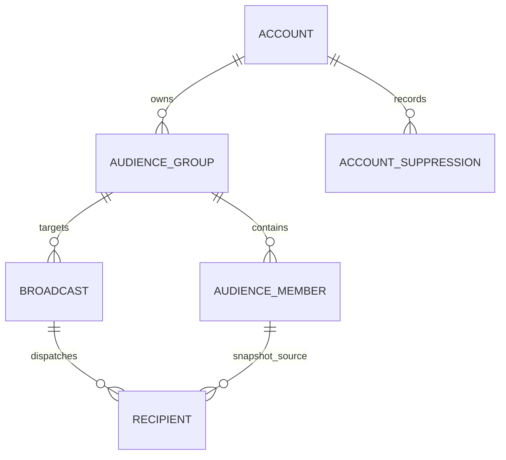

# Scale Audience Group & Broadcast Architecture

**Status:** Approved (canonical, reduced scope)  
**Supersedes:** campaign/subscriber layers in [`crm-campaign-broadcast-subscriber-model.md`](./crm-campaign-broadcast-subscriber-model.md) (historical)  
**Engine:** `hq/scale` (dev: `data/store.json` → prod: tenant-local Scale service on customer Cloudflare / BYO deploy)  
**App:** `app/src/scale/*`  
**Date:** 2026-09-15  

---

## 1. Why this model

Relaybase Scale targets solo founders and small teams. A separate **Campaign** entity plus **Subscriber** membership duplicated what **Audience Groups** already express in the product Worker console.

**Intentional reduction:**

```text
Account (account link / tenant)
 ├── compliance settings (legal footer defaults)
 ├── accountSuppressions[] (durable bounce / complaint / unsubscribe ledger)
 ├── audienceGroups[] (domain-scoped lists — consent scope)
 │     ├── contacts[] (manual + synced)
 │     └── optional JSON data source + cron sync
 └── broadcasts[] (one email send: subject, body, schedule)
       └── recipients[] (queue + engagement at send time)
```



---

## 2. Terminology

| Concept | Role |
|---------|------|
| **Audience Group** | Consent scope for a domain/list (e.g. “Product newsletter”). Holds contacts and default sender. |
| **Audience Member** | `(groupId, email)` with `sendStatus`: `active` \| `unsubscribed` \| `bounced`. |
| **Broadcast** | Single send event linked to one `audienceGroupId`. Owns content, template, schedule. |
| **Recipient** | Row created when dispatch starts; tracks delivery/opens/clicks for that send. |
| **Account suppression** | **Durable** ledger row. Survives contact delete/resync. Group-scoped or account-wide. |

### Consent & unsubscribe (two layers)

1. **Group unsubscribe** — `AudienceMember.sendStatus = unsubscribed` for that group only.  
2. **Suppression ledger** — `accountSuppressions` with `reason: unsubscribe` and optional `audienceGroupId`.  
   - `audienceGroupId = <id>` → do not send broadcasts for that group.  
   - `audienceGroupId = null` → account-wide block (complaint, hard bounce, global opt-out).

Unsubscribe links use `(broadcastId, unsubscribeToken)` but **apply** to the broadcast’s linked audience group.

---

## 3. Send-time rules (late binding)

1. Scheduled broadcasts do **not** freeze recipients at schedule time.  
2. At dispatch (`runAt` or Send Now), resolve:  
   - Contacts in linked group where `sendStatus === active`  
   - Email **not** blocked by suppression for that group or account-wide  
3. Enqueue `recipients`, then batch-send via customer Worker `POST /v1/send`.  
4. Mid-batch: re-check `sendStatus`; skip if unsubscribed.

---

## 4. Data source sync

- GET JSON endpoint → replace **synced** contacts; keep **manual** contacts.  
- **Never** revive `unsubscribed` / `bounced` status from feed alone.  
- Before inserting synced row, check suppression ledger → force `unsubscribed` if blocked.

---

## 5. Public endpoints (no Scale session)

| Path | Purpose |
|------|---------|
| `GET/POST /scale/unsubscribe/:broadcastId/:token` | Confirm + RFC 8058 unsubscribe |
| `GET /scale/t/o/...` | Open pixel |
| `GET /scale/t/c/...` | Click redirect (http/https only) |
| `GET /scale/assets/...` | Campaign images CDN |

All other `/scale/*` routes require API auth in production.

---

## 6. Compliance hooks

- Outbound headers: `List-Unsubscribe`, `List-Unsubscribe-Post`.  
- Templates: `{{unsubscribe_url}}`, `{{organization_name}}`, `{{postal_address}}`, `{{compliance_contact_email}}`.  
- See [`crm-compliance-improvements.md`](./crm-compliance-improvements.md) for P0/P1 checklist.

---

## 7. UI map (app)

| Route | Purpose |
|-------|---------|
| `/scale/audience` | Groups, contacts, settings, data source |
| `/scale/broadcasts` | Broadcast list + detail (content, publish, stats, settings) |

Campaign routes are **not** used in this model.
