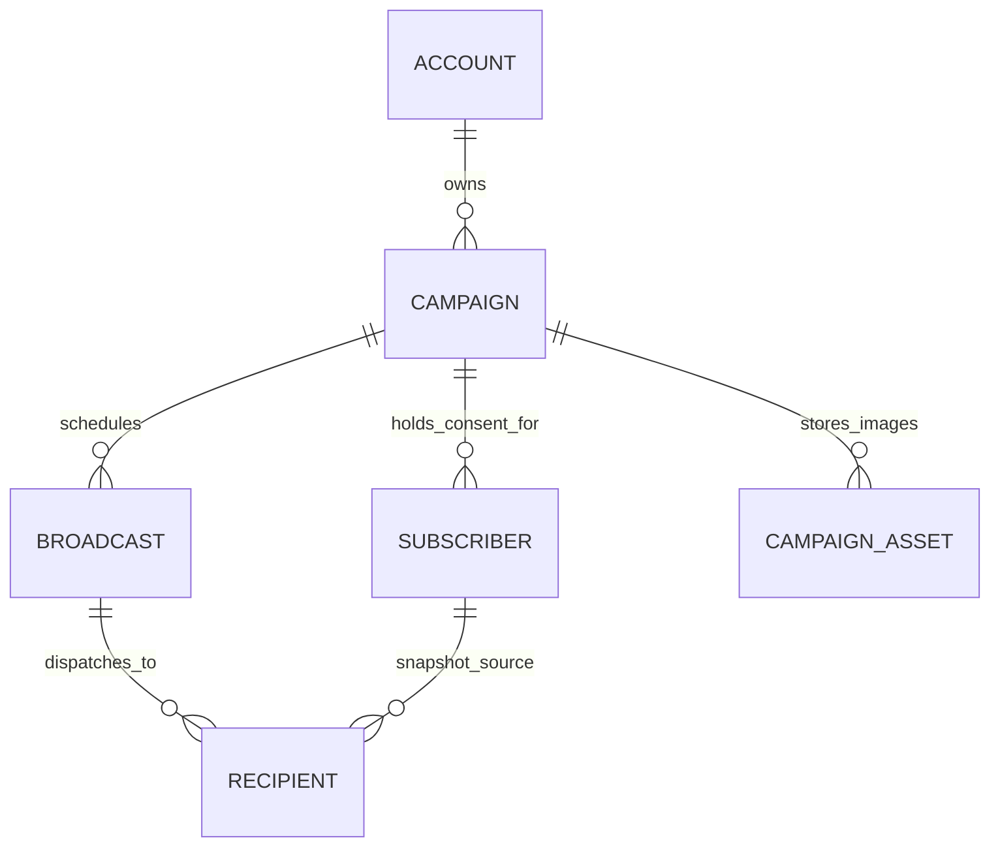

# CRM Campaign, Broadcast & Subscriber Architecture Specification

**Status:** Approved Architecture Draft  
**Target Engine:** `hq/crm` (Cloudflare Workers + D1 / local SQLite)  
**App UI:** `app/src/crm/*` (Next.js App Router + shadcn/ui)  
**Language:** English  
**Date:** 2026-09-14  

---

## 1. Executive Summary & Conceptual Grounding

### 1.1 The Fundamental Conceptual Shift

In earlier drafts, terminology was conflated: `AudienceGroup` was treated as an account-wide static pool of contacts, `Campaign` was modeled as a single email send with content and delivery status combined in one record, and dispatches simply unioned all audience groups across the entire account.

This design introduces the canonical, scalable hierarchy:

```text
Account (Workspace / Tenant)
 └── Campaign (The persistent newsletter/topic/list container; scope of consent)
      ├── Campaign Settings (Default From, Default Template, Timezone, Fallback Sender)
      ├── Subscriber[] (Campaign-scoped consent & member records; holds unsubscribe state)
      └── Broadcast[] (Atomic email delivery events; 1:1 subject, body, and schedule)
            ├── Content & Template (bodyMarkdown, subject, templateId)
            ├── Delivery Schedule (draft | scheduled | sending | sent | failed)
            └── Recipient[] (Send-time immutable snapshot & sequential queue)
```



### 1.2 Terminology Matrix & Boundaries

| Concept | Definition | Scope | Lifecycle & State |
|---|---|---|---|
| **Account** | The top-level tenant / workspace link (`accounts_link`). | Global | Persistent |
| **Campaign** | A long-running publication, newsletter, or marketing stream (e.g., *"Engineering Weekly"*, *"Product Launches"*). It is the **system of record for consent**. | Account | `active` \| `archived` |
| **Subscriber** | A person's explicit opt-in membership **to a specific Campaign**. Identified by `(campaignId, email)`. | Campaign | `subscribed` \| `unsubscribed` \| `pending` \| `bounced` |
| **Source / Audience Source** | An external origin or import pipeline (e.g. JSON endpoint, CSV import, webhook) used to populate Subscribers. | Campaign / Account | Configuration & sync history |
| **Broadcast** | A single scheduled or immediate delivery event with dedicated content within a Campaign (e.g., *"Release 2.4 Notes"*, *"Midweek Update"*). | Campaign | `draft` \| `scheduled` \| `sending` \| `sent` \| `failed` |
| **Recipient** | An immutable delivery snapshot created at the moment a Broadcast transitions to `sending`. Represents the unit of queue dispatch, retry, and engagement tracking. | Broadcast | `queued` \| `sending` \| `sent` \| `skipped` \| `failed` |

### 1.3 Key Architectural Principles

1. **Campaign = Consent Scope**: Unsubscribing from *"Product Updates"* flips `Subscriber.status = 'unsubscribed'` on that campaign only. The user remains `subscribed` in *"Security Advisories"* and retains their CRM Lead/Customer Pipeline status.
2. **Broadcasts are Calendar Events, Not Sequences**: Creating Broadcast A for Tuesday 08:00 and Broadcast B for Wednesday 12:00 schedules two independent calendar events. They are not relative drip delays (drip sequences are a separate entity).
3. **Send-Time Resolution (Late Binding)**: Scheduled broadcasts do **not** freeze their recipient list at the moment of scheduling. They resolve active `subscribed` members at the precise execution timestamp (`runAt`). Subscribers who opt out prior to `runAt` are excluded automatically; new subscribers joining before `runAt` are included.
4. **Separation of Content and Container**: A Campaign never contains `bodyMarkdown` or `subject`. All copywriting, rich media, and layout templates belong strictly to individual Broadcasts.

---

## 2. TypeScript Data Model for JSON File Store (Development Phase)

> **Development Policy:** No database schemas or SQL tables (D1/SQLite) are created during this active development phase. All CRM state is persisted in a local JSON document store (`data/store.json`). Database schemas and migrations will be introduced only after the TypeScript object model and end-to-end workflows are fully validated.

```typescript
// ============================================================================
// Core Tenant & Settings
// ============================================================================

export type AccountLink = {
  id: string;
  workerUrl: string | null;
  domain: string | null;
  createdAt: string;
};

// ============================================================================
// 1. Campaigns (Persistent Stream & Consent Scope)
// ============================================================================

export type CampaignStatus = "active" | "archived";

export type CampaignDataSource = {
  type: "generic_json";
  endpointUrl: string;
  credential?: string;
  credentialHeader?: string;
  cronEnabled?: boolean;
  cronIntervalMinutes?: number;
  lastSyncAt?: string | null;
  lastSyncStatus?: "success" | "error" | null;
  lastSyncError?: string | null;
  lastSyncCount?: number | null;
};

export type Campaign = {
  id: string;
  accountLinkId: string;
  name: string;
  slug: string;
  description?: string | null;
  fromName?: string | null;
  fromEmail?: string | null;
  replyTo?: string | null;
  defaultTemplateId?: string | null;
  status: CampaignStatus;
  dataSource?: CampaignDataSource | null;
  createdAt: string;
  updatedAt: string;
};

// ============================================================================
// 2. Subscribers (Campaign-Scoped Membership & Consent)
// ============================================================================

export type SubscriberStatus = "subscribed" | "unsubscribed" | "pending" | "bounced";
export type SubscriberSource = "manual" | "sync" | "csv" | "webhook";

export type Subscriber = {
  id: string;
  accountLinkId: string;
  campaignId: string;
  email: string;
  name?: string | null;
  status: SubscriberStatus;
  source: SubscriberSource;
  unsubscribeToken: string;            // Unguessable 32-byte secret token
  unsubscribedAt?: string | null;
  bouncedAt?: string | null;
  bounceReason?: string | null;
  customFields?: Record<string, unknown>;
  createdAt: string;
  updatedAt: string;
};

// ============================================================================
// 3. Broadcasts (Atomic Email Content & Schedule Events)
// ============================================================================

export type BroadcastStatus = "draft" | "scheduled" | "sending" | "sent" | "failed";

export type BroadcastStats = {
  sent: number;
  opened: number;
  clicked: number;
  failed: number;
};

export type Broadcast = {
  id: string;
  accountLinkId: string;
  campaignId: string;
  subject: string;
  previewText?: string | null;
  bodyMarkdown: string;
  templateId?: string | null;
  status: BroadcastStatus;
  scheduledAt?: string | null;
  sentAt?: string | null;
  targetFilter?: Record<string, unknown>; // Optional sub-segment filter
  stats: BroadcastStats;
  createdAt: string;
  updatedAt: string;
};

// ============================================================================
// 4. Recipients (Send-Time Immutable Queue & Engagement Ledger)
// ============================================================================

export type RecipientStatus = "queued" | "sending" | "sent" | "skipped" | "failed";

export type Recipient = {
  id: string;
  broadcastId: string;
  subscriberId: string;
  campaignId: string;
  email: string;
  name?: string | null;
  status: RecipientStatus;
  errorMessage?: string | null;
  sentAt?: string | null;
  openedAt?: string | null;
  clickedAt?: string | null;
  openCount: number;
  clickCount: number;
  createdAt: string;
};

// ============================================================================
// 5. Account Suppression (Global Opt-Outs & Hard Bounces)
// ============================================================================

export type AccountSuppressionReason = "complaint" | "hard_bounce" | "manual_suppression";

export type AccountSuppression = {
  id: string;
  accountLinkId: string;
  email: string;
  reason: AccountSuppressionReason;
  createdAt: string;
};

// ============================================================================
// 6. Shared CRM & System Support Types
// ============================================================================

export type PipelineCard = {
  id: string;
  memberEmail: string;
  memberName: string | null;
  stage: string;
  note: string | null;
  updatedAt: string;
};

export type Activity = {
  id: string;
  memberEmail: string;
  type: string;
  payload: unknown;
  occurredAt: string;
};

export type Template = {
  id: string;
  accountLinkId: string | null;
  name: string;
  htmlSource: string;
  isBuiltin: boolean;
  createdAt: string;
};

export type ScheduledJob = {
  id: string;
  accountLinkId: string;
  kind: "broadcast" | "sync";
  refId: string;
  runAt: string;
  status: "pending" | "done" | "failed";
  createdAt: string;
};

export type TrackingEvent = {
  id: string;
  broadcastId: string;
  recipientId: string;
  memberEmail: string;
  type: "open" | "click";
  url?: string | null;
  occurredAt: string;
};

export type CampaignAsset = {
  id: string;
  key: string;
  campaignId: string;
  filename: string;
  mimeType: string;
  contentBase64: string;
  createdAt: string;
};

// ============================================================================
// Root Dev Document Store (`data/store.json`)
// ============================================================================

export type CrmDataStore = {
  account: AccountLink;
  campaigns: Campaign[];
  subscribers: Subscriber[];
  broadcasts: Broadcast[];
  recipients: Recipient[];
  accountSuppressions: AccountSuppression[];
  pipelineCards: PipelineCard[];
  activities: Activity[];
  templates: Template[];
  scheduledJobs: ScheduledJob[];
  trackingEvents: TrackingEvent[];
  campaignAssets: CampaignAsset[];
};
```
```

---

## 3. Detailed Use Case Specification (with UI/UX Directives)

Every use case is formally specified below with system behavior, exact text copy, and concrete UI/UX presentation components (Toast, Inline Form Error, Modal Alert Dialog, Banner, Empty State, Badge, Disabled Tooltip).

```
UI COMPONENT REFERENCE MATRIX:
- [Toast]: Ephemeral notification in bottom/top corner (sonner). Auto-dismisses in 4s unless error.
- [Inline Field]: Red text directly beneath the offending form field with input border error highlight.
- [Dialog Modal]: Centered modal interrupting flow requiring explicit user acknowledgment/dismissal.
- [Status Badge]: Inline colored pill badge ('outline', 'secondary', 'default', 'destructive').
- [Table Empty State]: Centered descriptive card with icon and primary call-to-action button.
- [Banner]: Full-width persistent alert bar at top of page or section with action link.
- [Action Tooltip]: Gray hover popover explaining why a disabled action button cannot be clicked.
```

---

### 3.1 Campaign Management Use Cases (`C1` - `C5`)

#### UC-C1: Create New Campaign
* **Trigger:** User clicks *"New Campaign"* in the `/crm/campaigns` header toolbar.
* **System Logic:** Opens create dialog. User provides `name`, optional `slug`, optional `fromName`, `fromEmail`. Generates UUID, sets `status = 'active'`.
* **Success Presentation:**
  * **UI/UX:** [Dialog Modal] closes automatically. [Toast] appears: `"Campaign 'Engineering Updates' created"`.
  * **View Transition:** User is redirected directly to `/crm/campaigns/:id?tab=subscribers`.
* **Failure / Edge Cases:**
  * *Empty Campaign Name:* [Inline Field] beneath name input: `"Campaign name is required"`. Save button remains disabled.
  * *Duplicate Slug / Name:* [Inline Field] beneath name/slug input: `"A campaign with this identifier already exists in this account"`.
  * *Network Failure:* [Toast] (Destructive): `"Failed to create campaign. Check your connection and retry."`

#### UC-C2: Update Campaign Settings & Sender Identity
* **Trigger:** User modifies default From Name, From Email, or Default Layout Template in `/crm/campaigns/:id?tab=settings`.
* **System Logic:** Validates email format, saves to `crm_campaigns`. Future broadcasts inherit these defaults automatically.
* **Success Presentation:**
  * **UI/UX:** [Toast]: `"Campaign settings saved successfully"`. Settings card displays subtle green checkmark icon for 2 seconds.
* **Failure / Edge Cases:**
  * *Invalid From Email:* [Inline Field] beneath email input: `"Enter a valid sender email (e.g., newsletter@yourdomain.com)"`.
  * *Sender Domain Mismatch:* If the domain has no verified DKIM/SPF on the worker: [Banner] inside Settings: `"Sender domain '@other.com' is not verified on your Worker. Deliverability may be degraded."`

#### UC-C3: Archive Campaign
* **Trigger:** User selects *"Archive Campaign"* from the campaign actions dropdown.
* **System Logic:** Sets `status = 'archived'`. Cancels any pending scheduled jobs for child broadcasts. Retains all historical subscriber and recipient logs.
* **Success Presentation:**
  * **UI/UX:** [Dialog Modal] confirmation: `"Archive 'Product Weekly'? Pending scheduled broadcasts will be cancelled, but all delivery history and subscriber records are preserved."` -> User confirms -> [Toast]: `"Campaign archived"`.
  * **List Presentation:** Campaign appears with [Status Badge] `"Archived"` (muted gray).
* **Failure / Edge Cases:**
  * *Active Sending In Flight:* If a child broadcast has `status = 'sending'`: [Dialog Modal] alert: `"Cannot archive campaign while Broadcast 'Release 2.4' is currently sending. Wait for send completion or abort the broadcast first."`

#### UC-C4: Isolation Between Multiple Campaigns
* **Trigger:** Account creates two distinct campaigns: *"Dev Weekly"* and *"Special Offers"*.
* **System Logic:** Database indexes enforce `(campaign_id, email)` uniqueness. Subscribers in *"Dev Weekly"* do not receive *"Special Offers"* unless explicitly subscribed to both.
* **Presentation:**
  * **UI/UX:** Each campaign detail view displays isolated metrics: [Status Badge] `"1,420 Active Subscribers"` on Dev Weekly vs `"410 Active Subscribers"` on Special Offers.

---

### 3.2 Subscriber & Consent Lifecycle Use Cases (`S1` - `S7`)

#### UC-S1: Manual Single Subscriber Add
* **Trigger:** User clicks *"Add Subscriber"* on `/crm/campaigns/:id?tab=subscribers`.
* **System Logic:** Checks email against `crm_account_suppressions` and existing `crm_subscribers` for this campaign. Generates cryptographically secure `unsubscribe_token`.
* **Success Presentation:**
  * **UI/UX:** [Dialog Modal] closes. [Toast]: `"Added alex@example.com to subscribers"`. Subscriber row inserted optimistically at top of table with [Status Badge] `"Subscribed"` (emerald green).
* **Failure / Edge Cases:**
  * *Email Already Subscribed:* [Inline Field] in dialog: `"alex@example.com is already subscribed to this campaign"`.
  * *Email Previously Unsubscribed (Resubscribe Policy):* [Dialog Modal] confirmation warning: `"This contact unsubscribed on Aug 12, 2026. Manually resubscribing requires explicit recipient consent. Resubscribe now?"` -> If confirmed, flips `status = 'subscribed'` and logs audit note.
  * *Global Account Suppression:* [Dialog Modal] blocked: `"Cannot add alex@example.com: This address hard-bounced previously or is globally suppressed across your domain."`

#### UC-S2: Bulk CSV / Source Import to Campaign
* **Trigger:** User clicks *"Import CSV"* or triggers *"Sync Now"* from an external JSON data source.
* **System Logic:** Parses records. Validates syntax. Upserts names. **Crucial Rule:** If an incoming record matches an existing `unsubscribed` or `bounced` subscriber, the status **remains unchanged**.
* **Success Presentation:**
  * **UI/UX:** Import completion sheet displays summary breakdown:
    * Card 1: `"342 Added"`
    * Card 2: `"18 Updated"`
    * Card 3: `"4 Skipped (Previously Unsubscribed)"`
  * [Toast]: `"Import finished: 342 subscribers enrolled"`.
* **Failure / Edge Cases:**
  * *Malformed CSV Headers:* [Dialog Modal]: `"Missing required 'email' column header. Check your CSV format."`
  * *File Exceeds Size Limit (>5,000 rows in sync mode):* [Inline Field]: `"File contains 8,200 rows. Maximum synchronous import limit is 5,000 rows. Please split the file."`

#### UC-S3: Recipient One-Click Unsubscribe via Web Link
* **Trigger:** Recipient clicks `{{unsubscribe_url}}` rendered as `https://crm.relaybase.xyz/crm/unsubscribe/:campaignId/:token`.
* **System Logic:** Look up subscriber by `(campaignId, unsubscribe_token)`. Sets `status = 'unsubscribed'`, records `unsubscribed_at = now()`.
* **Success Presentation (Public Web View):**
  * **UI/UX:** Dedicated minimal public landing page (`/crm/unsubscribe/confirmed`):
    * Heading: `"You have been unsubscribed"`
    * Subtext: `"alex@example.com will no longer receive emails from 'Engineering Weekly'."`
    * Re-subscribe safety button: `"Unsubscribed by mistake? Click here to resubscribe."`
* **Failure / Edge Cases:**
  * *Invalid or Expired Token:* Public landing page displays: `"Invalid or expired unsubscribe link. If you continue to receive unwanted emails, please contact the sender directly."`

#### UC-S4: Hard Bounce Ingestion
* **Trigger:** Customer Cloudflare Worker webhook reports permanent SMTP bounce (550 / 5.1.1 User Unknown).
* **System Logic:** Sets `Subscriber.status = 'bounced'`, records `bounced_at = now()`, adds email to `crm_account_suppressions`.
* **Presentation:**
  * **UI/UX:** In subscriber table, row displays [Status Badge] `"Bounced"` (destructive red). Hovering displays [Action Tooltip]: `"550 5.1.1 Recipient address rejected: User unknown"`.

---

### 3.3 Broadcast Composition & Scheduling Use Cases (`B1` - `B12`)

#### UC-B1: Create Broadcast Draft
* **Trigger:** User clicks *"New Broadcast"* inside `/crm/campaigns/:id?tab=broadcasts`.
* **System Logic:** Inserts `crm_broadcasts` row with `status = 'draft'`, sets `subject = ''`, assigns `campaign.default_template_id`.
* **Success Presentation:**
  * **UI/UX:** Seamless navigation to `/crm/campaigns/:id/broadcasts/:broadcastId/content`. Editor mounts ready for input with [Status Badge] `"Draft"`.

#### UC-B2: Rich Content Autosave
* **Trigger:** User edits subject, BlockNote markdown body, or swaps template wrapper.
* **System Logic:** Debounced autosave (3000ms). Updates `crm_broadcasts` `updated_at`.
* **Success Presentation:**
  * **UI/UX:** Top header indicator displays: `"Saving..."` (subtle pulse) -> `"Saved"` with timestamp (`"Saved at 10:42 AM"`).
* **Failure / Edge Cases:**
  * *Network Disconnect during Edit:* Top indicator flips to [Banner] (amber): `"Offline — changes saved locally. Reconnecting..."`.

#### UC-B3: Send Test Email
* **Trigger:** User enters personal address into *"Send test email"* modal and clicks *"Send Test"`.
* **System Logic:** Renders current draft with template, substitutes mock tags `{{contact.name}} = "Test Recipient"`, and dispatches via Worker `/v1/send` with `[Test]` prefix. Does not write to `crm_recipients` or affect open/click counters.
* **Success Presentation:**
  * **UI/UX:** [Toast]: `"Test email sent to dev@company.com"`. Modal closes.
* **Failure / Edge Cases:**
  * *Invalid Test Address:* [Inline Field]: `"Please enter a valid email address"`.
  * *Worker Send Rejection:* [Toast] (Destructive): `"Worker rejected test send: Rate limit exceeded or invalid API key"`.

#### UC-B4: Immediate Broadcast Send
* **Trigger:** User navigates to *"Publish"* tab and clicks *"Send Now"*.
* **System Logic:**
  1. Validates subject and body presence.
  2. Resolves `crm_subscribers` for this campaign `WHERE status = 'subscribed' AND email NOT IN (SELECT email FROM crm_account_suppressions)`.
  3. If count = 0: aborts send.
  4. Flips `crm_broadcasts.status = 'sending'`, sets `sent_at = now()`.
  5. Bulk inserts `crm_recipients` with `status = 'queued'`.
  6. Hands off execution to background dispatch loop.
* **Success Presentation:**
  * **UI/UX:** [Dialog Modal] confirmation: `"Send 'Release 2.4' immediately to 1,240 subscribers?"` -> Confirm -> [Toast]: `"Broadcast send started"`.
  * **View Transition:** Redirects to Live Progress View showing animated progress bar and live counters: `"Sending: 420 / 1,240 sent"`.
* **Failure / Edge Cases:**
  * *Empty Subject:* [Dialog Modal] blocked: `"Subject is required before sending. Enter a subject in the Content tab."`
  * *Zero Subscribed Recipients:* [Dialog Modal] alert: `"Cannot send broadcast: This campaign has 0 active subscribers. Add subscribers before sending."`

#### UC-B5: Schedule Future Broadcast (Calendar Scheduling)
* **Trigger:** User chooses *"Schedule"*, selects a future timestamp (e.g., `2026-09-16T08:00:00Z`), and clicks *"Schedule Broadcast"*.
* **System Logic:** Validates `scheduled_at > now()`. Sets `crm_broadcasts.status = 'scheduled'`. **Does NOT freeze recipients yet.**
* **Success Presentation:**
  * **UI/UX:** [Toast]: `"Broadcast scheduled for Wednesday, Sep 16 at 8:00 AM"`.
  * Broadcast row in table displays [Status Badge] `"Scheduled"` (indigo/purple) and shows: `"Scheduled for Sep 16, 08:00 AM"`.

#### UC-B6: Cancel Scheduled Broadcast
* **Trigger:** User clicks *"Cancel Schedule"* on a scheduled broadcast.
* **System Logic:** Verifies `status === 'scheduled'`. If dispatch cron has not locked the row: updates `status = 'draft'`, clears `scheduled_at`.
* **Success Presentation:**
  * **UI/UX:** [Dialog Modal] confirmation -> [Toast]: `"Schedule cancelled. Broadcast reverted to draft."`
* **Failure / Edge Cases:**
  * *Race Condition — Broadcast Already In Flight:* If cron worker just claimed the broadcast: [Dialog Modal] error: `"Cannot cancel: Broadcast dispatch has already begun."`

#### UC-B7: Editing a Sent Broadcast (Immutable Protection)
* **Trigger:** User navigates to an already `sent` broadcast and attempts to edit subject or markdown body.
* **System Logic:** API rejects `PATCH /crm/broadcasts/:id` with HTTP 409 Conflict.
* **Presentation:**
  * **UI/UX:** Content editor is completely read-only. All formatting tools are disabled.
  * Top banner displays: [Banner] (neutral gray): `"This broadcast was sent on Sep 14, 2026 and is locked. To reuse this content, click 'Duplicate as New Draft'."`
  * Header displays primary button: `[Duplicate as New Draft]`.

---

### 3.4 Delivery Dispatch & Real-Time Tracking Use Cases (`D1` - `D5`)

#### UC-D1: Late-Binding Send-Time Resolution
* **Scenario:** User schedules Broadcast A (Tuesday 08:00) and Broadcast B (Wednesday 12:00) on Monday.
  * Subscriber `bob@example.com` unsubscribes on Tuesday at 07:30.
  * Subscriber `dan@example.com` joins on Wednesday at 10:00.
* **System Logic:**
  * **Tuesday 08:00 (Broadcast A):** Query resolves subscribers at 08:00: `bob@` is `unsubscribed` and **excluded**.
  * **Wednesday 12:00 (Broadcast B):** Query resolves subscribers at 12:00: `bob@` is **excluded**, `dan@` is `subscribed` and **included**.
* **Presentation:**
  * Broadcast A overview stats: `"Recipients: 1,420"`.
  * Broadcast B overview stats: `"Recipients: 1,421"`.

#### UC-D2: Rate-Limited Sequential Dispatch
* **System Logic:** Background Worker loops over `crm_recipients WHERE broadcast_id = :id AND status = 'queued'`:
  1. Checks if subscriber flipped to `unsubscribed` mid-batch. If so, updates `recipient.status = 'skipped'`.
  2. Renders recipient HTML (injecting tracking pixel and unique unsubscribe URL).
  3. Invokes Worker `POST /v1/send`.
  4. On 200 OK: updates `recipient.status = 'sent'`, `sent_at = now()`.
  5. On 4xx/5xx: updates `recipient.status = 'failed'`, `error_message = err.message`.
  6. Increments `crm_broadcasts.stats_sent` or `stats_failed`.

#### UC-D3: Engagement Tracking (Opens & Clicks)
* **System Logic:**
  * Open Tracking: `GET /crm/t/o/:broadcastId/:recipientId` returns 1x1 transparent GIF; records unique open.
  * Click Tracking: `GET /crm/t/c/:broadcastId/:recipientId?u=:targetUrl` records click timestamp and returns 302 redirect.
* **Presentation:**
  * In `/crm/campaigns/:id/broadcasts/:broadcastId/stats`:
    * Metric Card 1: `"Sent: 1,240 (100%)"`
    * Metric Card 2: `"Opens: 496 (40.0% Unique Open Rate)"`
    * Metric Card 3: `"Clicks: 124 (10.0% Click-Through Rate)"`
    * Metric Card 4: `"Bounces: 2 (0.16%)"`

---

## 4. End-to-End Concrete Execution Walkthrough

### 4.1 Chronological Scenario Timeline

```text
========================================================================================
TIMELINE WALKTHROUGH: Multi-Broadcast Calendar Scheduling & Dynamic Unsubscribe
========================================================================================

[DAY 0 - Monday 10:00]
  1. User creates Campaign: "Engineering Updates" (slug: "eng-updates")
  2. Enrolls 3 initial subscribers:
     - ana@example.com  (status: subscribed, token: tok_ana_01)
     - bob@example.com  (status: subscribed, token: tok_bob_02)
     - cam@example.com  (status: subscribed, token: tok_cam_03)

[DAY 0 - Monday 11:00]
  3. User creates Broadcast 1: "v2.4 Release Notes"
     - Status: scheduled -> runAt = Tuesday 08:00 AM
     - NOTE: No rows created in crm_recipients yet!

[DAY 0 - Monday 11:30]
  4. User creates Broadcast 2: "Midweek Architecture Deep-Dive"
     - Status: scheduled -> runAt = Wednesday 12:00 PM
     - NOTE: Independent calendar sibling; no recipients frozen!

[DAY 1 - Tuesday 07:45] (15 mins prior to Broadcast 1)
  5. bob@ clicks unsubscribe link from a prior newsletter:
     POST /crm/unsubscribe/eng-updates/tok_bob_02
     -> crm_subscribers for bob@ set to: status = 'unsubscribed', unsubscribed_at = 07:45

[DAY 1 - Tuesday 08:00] (Broadcast 1 Dispatch Triggered by Cron)
  6. Cron Worker executes send job for Broadcast 1:
     - Query: SELECT * FROM crm_subscribers WHERE campaign_id = 'eng-updates' AND status = 'subscribed'
     - Results returned: [ana@, cam@]  (bob@ is automatically excluded!)
     - Inserts 2 crm_recipients rows:
       * Recipient 1: ana@ (status: queued)
       * Recipient 2: cam@ (status: queued)
     - Worker dispatches mail sequentially.
     - Broadcast 1 finishes: status = 'sent', stats_sent = 2, stats_failed = 0.

[DAY 2 - Wednesday 09:30]
  7. dan@ signs up via webhook or website form:
     POST /crm/campaigns/eng-updates/subscribers { email: "dan@example.com", name: "Dan" }
     -> crm_subscribers creates dan@: status = 'subscribed', token: tok_dan_04

[DAY 2 - Wednesday 12:00] (Broadcast 2 Dispatch Triggered by Cron)
  8. Cron Worker executes send job for Broadcast 2:
     - Query: SELECT * FROM crm_subscribers WHERE campaign_id = 'eng-updates' AND status = 'subscribed'
     - Results returned: [ana@, cam@, dan@]  (bob@ excluded; new subscriber dan@ included!)
     - Inserts 3 crm_recipients rows.
     - Worker dispatches mail sequentially.
     - Broadcast 2 finishes: status = 'sent', stats_sent = 3, stats_failed = 0.
========================================================================================
```

---

## 5. Architectural Gap Analysis & System Mitigations

To ensure long-term stability and compliance, the following edge cases and safeguards are designed into the engine:

### 5.1 Send-Lock & Concurrency Guarding (File Store & Worker Execution)
* **Risk:** Concurrent scheduler polls or multiple processes attempting to process the same scheduled broadcast simultaneously, causing duplicate sends.
* **Mitigation:** Synchronous atomic claim on the document store:
  ```typescript
  let claimed = false;
  store.update((draft) => {
    const idx = draft.broadcasts.findIndex(
      (b) => b.id === broadcastId && b.status === "scheduled" && b.scheduledAt && b.scheduledAt <= now
    );
    if (idx >= 0) {
      draft.broadcasts[idx] = { ...draft.broadcasts[idx]!, status: "sending", updatedAt: now };
      claimed = true;
    }
  });
  if (!claimed) return; // Another worker instance or loop claimed it
  ```

### 5.2 Scoped Unsubscribe Token Security
* **Risk:** Predictable or numeric IDs allow malicious actors to brute-force unsubscribe random email addresses.
* **Mitigation:** Unsubscribe URLs utilize a high-entropy 32-byte cryptographically random token (`newId("tok")` / CSPRNG) bound to the `(campaignId, subscriberId)` tuple. Unsubscribe endpoints require zero authentication but validate token matching.

### 5.3 Global Suppression vs Campaign Unsubscribe
* **Distinction:**
  * **Campaign Unsubscribe:** Recipient does not want *"Weekly Tech News"* but continues to receive *"Billing Invoices"* or 1:1 Quote emails. Recorded in `subscribers` with `status = 'unsubscribed'`.
  * **Global Account Suppression:** Recipient issued a Spam Complaint (RFC 8058 / FBL) or generated a Hard Bounce. Recorded in `accountSuppressions`. The dispatch engine unconditionally checks this suppression list on every broadcast dispatch regardless of campaign membership.

### 5.4 Outbound Rate Limiting & Worker Throttling
* **Mitigation:** To preserve sender domain reputation and adhere to Cloudflare Worker subrequest limits, the dispatch runner throttles outbound SMTP requests at a configurable rate (default: 10 emails/second) with exponential backoff on transient 429/503 worker responses.

---

## 6. Frontend Navigation & Screen Hierarchy

```text
/crm
 ├── /pipeline                     (Sales pipeline Kanban — shared CRM entity)
 ├── /quotes                       (Quote composition & e-signature audit)
 └── /campaigns                    (Top-level Campaign List View)
      ├── /new                     (Create Campaign Modal Dialog)
      └── /:campaignId             (Campaign Shell with Tab Navigation)
           ├── ?tab=subscribers    (Subscriber Table, Add Dialog, CSV Import, Sync)
           ├── ?tab=broadcasts     (Broadcast List: Drafts, Scheduled, Sent)
           ├── ?tab=settings       (Sender Identity, Defaults, Data Source, Archive)
           └── /broadcasts/:broadcastId
                ├── /content       (BlockNote Markdown Editor + Template Picker)
                ├── /publish       (Send Now, Schedule Date Picker, Test Send)
                └── /stats         (Delivery Progress, Opens, Clicks, Recipient Log)
```

---

## 7. Migration Plan (File Store Transition)

1. **JSON Document Store Migration:**
   * Transition `data/store.json` arrays to `campaigns`, `subscribers`, `broadcasts`, `recipients`, and `accountSuppressions`.
   * Existing `audienceGroups` in dev stores can be transformed into `campaigns` + `subscribers` rows.
2. **API Routing Cutover:**
   * `/crm/campaigns` endpoints updated to serve the Campaign -> Broadcast hierarchy.
   * Deprecate global `fetchAllAudienceRecipients()` in frontend code in favor of campaign-scoped subscriber resolution.
3. **Future Production D1 Database Schema:**
   * Once the TypeScript types, UI flows, and edge cases are validated in real usage, matching Cloudflare D1 SQL schemas and migrations will be synthesized directly from these TypeScript models.
