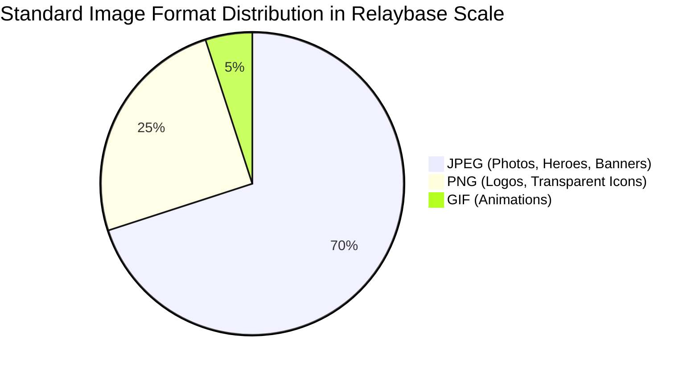
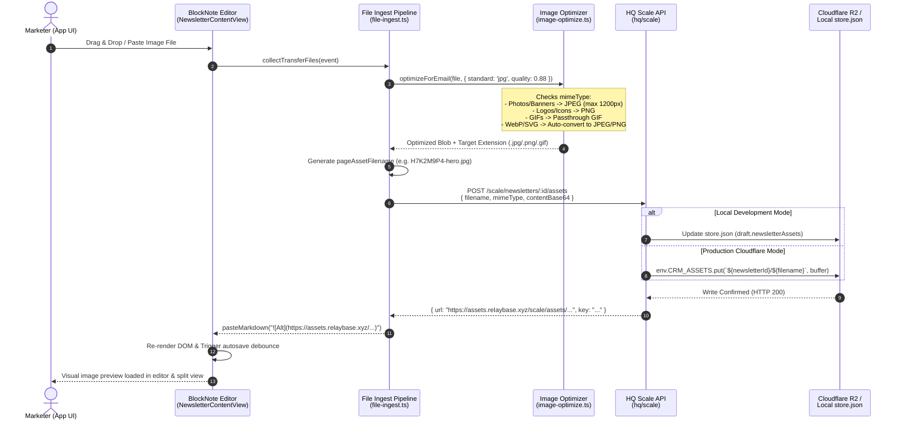
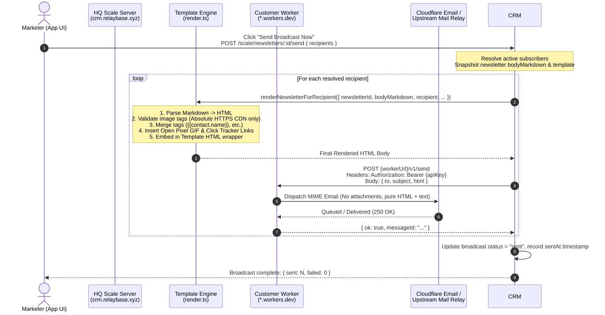
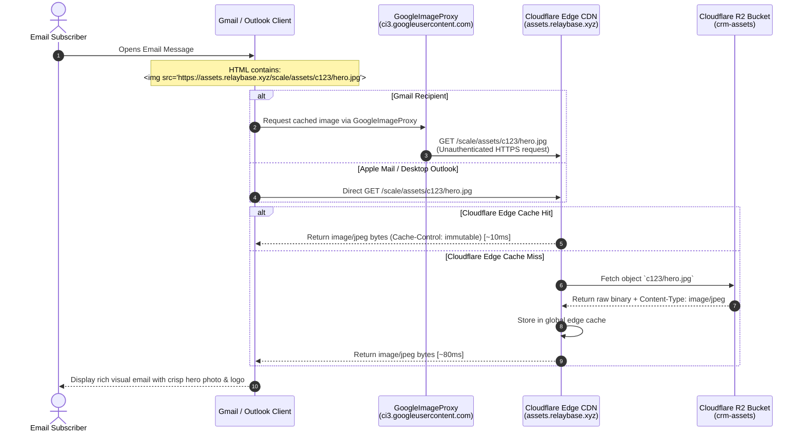

# Scale Newsletter Image Assets & Cloudflare R2 CDN Specification

**Status:** Approved Architecture Draft  
**Target Engine:** `hq/scale` (Cloudflare Workers + R2 CDN / Local JSON Store)  
**App Editor:** `app/src/lib/markdown-editor/*` & `app/src/scale/pages/newsletters/*`  
**Storage Target:** Cloudflare R2 Bucket `crm-assets` (Public CDN domain)  
**Language:** English  
**Date:** 2026-09-14  

---

## 1. Executive Summary & Objective

### 1.1 The Challenge of Email Image Delivery
In web development, modern image formats such as WebP, AVIF, and inline Base64 data URIs are widely praised for compression and zero-roundtrip performance. **In email marketing, however, these exact formats trigger rendering failures, security sanitization, and spam penalties across major inbox providers:**

1. **Gmail strips Base64 data URIs completely:** Any `` is purged by Google's HTML sanitizer, leaving empty space or broken image icons.
2. **Classic Outlook (Windows) does not support WebP or SVG:** Outlook's Microsoft Word-based HTML rendering engine fails to decode WebP and SVG images, displaying an empty red "X" box.
3. **Gmail converts WebP and strips transparency:** When Gmail fetches remote WebP images via `GoogleImageProxy`, its backend transcoder silently converts them to JPEG, converting alpha transparency channels into solid black or miscolored backgrounds.
4. **GoogleImageProxy requires stable, public, unauthenticated HTTPS endpoints:** Time-limited signed URLs, session cookies, local URLs (`localhost`), or firewall-blocked endpoints fail silently when Google's crawler fetches the asset.
5. **Base64 inflates email body size by ~33%:** Emails exceeding ~102 KB trigger Gmail's `[Message clipped] View entire message` warning, cutting off footer unsubscribe links and open tracking pixels.

### 1.2 Core Policy Decisions

To guarantee **100% universal rendering, inbox deliverability, and optimal visual fidelity**, Relaybase Scale establishes the following strict image standards:

| Image Use Case | Standard Format | Fallback / Alternative | Forbidden Formats in Email Body |
|---|---|---|---|
| **Newsletter Body Images** (Hero photos, screenshots, banners, illustrations) | **JPEG (`.jpg` / `.jpeg`)** | PNG (if high-contrast text) | WebP, AVIF, SVG, Base64 data URI |
| **Brand Logos & Template Icons** (Logos, badges, social icons with transparency) | **PNG (`.png`)** | JPEG (if opaque background) | SVG, WebP with transparency, Base64 data URI |
| **Animated Demonstrations** | **GIF (`.gif`)** | Static JPEG poster image | Animated WebP, Video tags (`<video>`) |

### 1.3 Storage & CDN Strategy
All newsletter assets are hosted externally on a high-speed, globally distributed **Cloudflare R2 Bucket (`crm-assets`)** mapped to a public CDN custom domain (e.g., `https://assets.relaybase.xyz` or development host). 

- **Local Dev Phase:** Assets are received via `POST /scale/newsletters/:id/assets` and stored in `hq/scale/data/store.json` under the key `{newsletterId}/{filename}`.
- **Cloudflare Production Phase:** The exact same key layout `{newsletterId}/{filename}` is written directly to the R2 bucket `crm-assets` with public read access and cached at Cloudflare edge nodes with `public, max-age=31536000, immutable`.

---

## 2. Image Format Policy & Email Client Compatibility Matrix



### 2.1 Detailed Client Support Matrix

| Email Client | JPEG (`.jpg`) | PNG (`.png`) | GIF (`.gif`) | WebP (`.webp`) | SVG (`.svg`) | Base64 Data URI |
|---|---|---|---|---|---|---|
| **Gmail (Web & Mobile Apps)** | ✅ Full | ✅ Full | ✅ Full | ⚠️ Converted to JPEG (transparency lost) | ❌ Stripped | ❌ Stripped completely |
| **Outlook for Windows (Classic)** | ✅ Full | ✅ Full | ⚠️ First frame only | ❌ Broken box | ❌ Broken box | ❌ Blocked |
| **Outlook (Mac & Web 365)** | ✅ Full | ✅ Full | ✅ Full | ✅ Full | ⚠️ Inconsistent | ❌ Blocked |
| **Apple Mail (iOS & macOS)** | ✅ Full | ✅ Full | ✅ Full | ✅ Full | ✅ Full | ✅ Full (Rare) |
| **Yahoo! Mail / AOL** | ✅ Full | ✅ Full | ✅ Full | ⚠️ Inconsistent | ❌ Stripped | ❌ Blocked |

### 2.2 Client-Specific Failure Modes & Safeguards

1. **GoogleImageProxy Caching:**
   - Gmail caches every remote image URL on the first open. Senders must never mutate an image in place under the same URL filename. Every revision generates a new unique asset identifier (`{shortId}-{slug}.jpg`).
2. **Apple Mail Privacy Protection (MPP):**
   - Apple Mail pre-fetches all hosted images in the background upon delivery. Hosted CDN endpoints must be optimized for fast, unauthenticated global edge delivery without dynamic session middleware.
3. **Outlook High-DPI (Retina) Scaling:**
   - Outlook desktop scales images according to display DPI. Images must contain explicit HTML attributes (`width="600" style="max-width: 100%; height: auto;"`) rather than relying purely on CSS layout properties.

---

## 3. Storage Architecture: Local Development to Cloudflare R2

### 3.1 Key Path & URL Scheme

Assets are organized deterministically under each newsletter ID to ensure isolation, collision resistance, and clean lifecycle management:

```text
Storage Key:  {newsletterId}/{assetShortId}-{slugifiedName}.{ext}
Public CDN:   https://assets.relaybase.xyz/scale/assets/{newsletterId}/{assetShortId}-{slugifiedName}.{ext}
```

```text
Example Keys:
├── newsletter_9f8a1c2b/
│   ├── H7K2M9P4-summer-sale-hero.jpg
│   ├── B3N8Q1X5-relaybase-logo-white.png
│   └── F2L6V0R9-dashboard-demo.gif
```

### 3.2 Storage Parity Matrix

The transition from local development store to Cloudflare R2 preserves exact route, key, and URL signatures:

| Dimension | Local Development Store (`hq/scale`) | Production Cloudflare R2 (`strum-relaybase-scale`) |
|---|---|---|
| **Storage Engine** | Synchronous file store (`hq/scale/data/store.json`) | Cloudflare R2 (`env.CRM_ASSETS` bucket binding) |
| **Ingestion Handler** | `POST /scale/newsletters/:id/assets` | `POST /scale/newsletters/:id/assets` (Worker route) |
| **Retrieval Handler** | `GET /scale/assets/:newsletterId/:filename` | Public R2 Custom Domain / Worker Cache API |
| **URL Base** | `process.env.SCALE_PUBLIC_BASE_URL` (`http://localhost:32831`) | `https://assets.relaybase.xyz` (Cloudflare CDN) |
| **Cache Headers** | `public, max-age=31536000, immutable` | `public, max-age=31536000, immutable` |
| **Security** | Unauthenticated public GET for image assets | Unauthenticated public GET (GoogleImageProxy allowed) |

---

## 4. Comprehensive Use-Case Scenarios

### UC-1: Drag-and-Drop / Paste Newsletter Hero Photo (JPEG Standard)
- **Actor:** Marketer / Founder creating a newsletter broadcast in `NewsletterContentView`.
- **Precondition:** Newsletter is in `draft` state; BlockNote markdown editor is focused.
- **Trigger:** User drags a high-resolution 4K photo (`summer-launch.png` or `summer-launch.heic`, 8 MB) into the editor.
- **Execution Flow:**
  1. `collectTransferFiles` catches the dropped file before clipboard/drag event invalidation.
  2. `ingestNewsletterFile` classifies the file as an image.
  3. Client-side compression (`optimizeImageToJpeg`):
     - Resizes max width to `1200px` (2x Retina for standard 600px email body container).
     - Compresses quality to `85%` JPEG.
     - Strips heavy EXIF/metadata.
  4. Generates unique asset key: `H7K2M9P4-summer-launch.jpg`.
  5. POSTs Base64 payload to `/scale/newsletters/:id/assets`.
  6. Server commits asset to storage (local JSON / R2) and returns public CDN URL.
  7. Editor pastes markdown token: ``.
- **Postcondition:** The image renders instantly in the editor and right-side mobile/desktop preview; outbound HTML is guaranteed compliant with all email clients.

---

### UC-2: Template Logo Insertion with Transparency (PNG Standard)
- **Actor:** Marketing designer configuring an email template header/footer.
- **Precondition:** User is adding a corporate logo with an alpha transparency layer.
- **Trigger:** User uploads `company-logo-dark.png` with transparent background into the template editor or newsletter body.
- **Execution Flow:**
  1. File detector detects PNG format with transparency.
  2. Optimization pipeline preserves PNG format to maintain crisp vector-like edges and alpha channel.
  3. Resizes dimensions to max width `600px` (or 2x `400px` for header logos) using lossless/high-quality PNG compression.
  4. Uploads to R2 as `L9X2P1A4-company-logo-dark.png` with `Content-Type: image/png`.
  5. HTML template embeds ``.
- **Postcondition:** When viewed in dark mode or on colored template background cards (`#f8fafc`), the logo renders seamlessly without black artifacts in Gmail or Outlook.

---

### UC-3: Animated GIF Insertion for Product Demonstrations
- **Actor:** Product manager announcing a new feature with a 3-second animated UI workflow.
- **Precondition:** User drops `feature-demo.gif` (1.5 MB) into the editor.
- **Trigger:** Drop event processed by `file-ingest.ts`.
- **Execution Flow:**
  1. System detects MIME `image/gif`.
  2. Client-side WebP/JPEG re-encoders bypass the file to protect the animation frames.
  3. Uploads raw GIF to `/scale/newsletters/:id/assets` with `image/gif` MIME type.
  4. Markdown editor inserts ``.
- **Postcondition:**
  - Modern webmail (Gmail, Apple Mail, Outlook Mac/Web) loops the animation smoothly.
  - Classic Outlook Desktop automatically renders the first frame as a static poster image without breaking the email layout.

---

### UC-4: Legacy / WebP / SVG Input Handling & Automatic Normalization
- **Actor:** User pasting an image copied from a modern website or Figma (often WebP or SVG format).
- **Trigger:** Clipboard contains a WebP screenshot or SVG vector graphic.
- **Execution Flow:**
  1. `classifyPageFile` flags the input.
  2. If format is **WebP**:
     - Client canvas converter decodes WebP bitmap and re-encodes to **JPEG (Quality 0.88)** (or **PNG** if transparent pixels are detected).
     - File extension changes from `.webp` to `.jpg` or `.png`.
  3. If format is **SVG**:
     - Client rasterizes SVG onto an offscreen canvas at 2x target resolution and exports high-density **PNG**.
  4. Ingested asset is uploaded as a compliant JPEG/PNG.
- **Postcondition:** Zero WebP/SVG files reach the newsletter markdown body or outbound email MIME payload.

---

### UC-5: Test Send & Live Dispatch Sanitization (Send-Time Safety Guards)
- **Actor:** Sender clicking "Send Test Email" or executing a scheduled broadcast dispatch.
- **Trigger:** `POST /scale/newsletters/:id/send` or `POST /scale/newsletters/:id/test-send`.
- **Execution Flow:**
  1. `renderNewsletterForRecipient` compiles `bodyMarkdown` to HTML via `marked`.
  2. **Sanitization Pass (`normalizeNewsletterAssetUrlsInHtml` & Email Sanitizer):**
     - Checks all `` tags.
     - Any relative path `./.newsletter/...` is converted to absolute public CDN URL.
     - Any accidental Base64 data URI `src="data:image/..."` is flagged with a build error or safely stripped.
     - Adds mandatory email HTML attributes: `style="display:block; max-width:100%; height:auto;"` and default `alt=""`.
  3. Embeds 1x1 transparent GIF open-tracking pixel (`/scale/t/o/:newsletterId/:memberKey`).
  4. Wraps inside recipient's selected template.
  5. Dispatches payload to Customer Worker `/v1/send`.
- **Postcondition:** Outbound email payload is strictly standard HTML with absolute HTTPS CDN image links.

---

### UC-6: Recipient Inbox Opening & Proxy Caching
- **Actor:** Subscriber opens the received newsletter email in Gmail Web or Mobile App.
- **Execution Flow:**
  1. Gmail's sanitizer scans HTML and replaces image URLs with `https://ci3.googleusercontent.com/proxy/...#https://assets.relaybase.xyz/scale/assets/...`.
  2. `GoogleImageProxy` sends an asynchronous HTTPS GET request to `assets.relaybase.xyz`.
  3. Cloudflare Edge CDN checks cache:
     - *Cache Hit:* Returns image bytes directly from Cloudflare Edge in < 15ms.
     - *Cache Miss:* Pulls from R2 bucket `crm-assets`, caches at edge, and returns HTTP 200 with `Content-Type: image/jpeg` and `Cache-Control: public, max-age=31536000, immutable`.
  4. Gmail proxies image to subscriber's viewport.
- **Postcondition:** Image renders instantly; subsequent opens across thousands of subscribers hit Cloudflare CDN cache with zero load on central Scale compute.

---

## 5. Architectural Sequence Diagrams

### Sequence 1: Client Ingestion, Local/R2 Storage & Editor Hydration



---

### Sequence 2: Newsletter Dispatch, HTML Assembly & Worker Mail Pipeline



---

### Sequence 3: Recipient Inbox Fetch, GoogleImageProxy & Edge CDN Caching



---

## 6. Implementation Contracts & API Specifications

### 6.1 Asset Upload Endpoint

- **Method:** `POST`
- **Path:** `/scale/newsletters/:id/assets`
- **Request Body (JSON):**
  ```json
  {
    "filename": "H7K2M9P4-summer-launch.jpg",
    "mimeType": "image/jpeg",
    "contentBase64": "/9j/4AAQSkZJRgABAQEASABIAAD..."
  }
  ```
- **Response Body (JSON, 200 OK):**
  ```json
  {
    "url": "https://assets.relaybase.xyz/scale/assets/newsletter_123/H7K2M9P4-summer-launch.jpg",
    "key": "newsletter_123/H7K2M9P4-summer-launch.jpg"
  }
  ```

### 6.2 Asset Retrieval Endpoint

- **Method:** `GET`
- **Path:** `/scale/assets/:newsletterId/:filename`
- **Response Headers:**
  ```http
  HTTP/1.1 200 OK
  Content-Type: image/jpeg
  Cache-Control: public, max-age=31536000, immutable
  Access-Control-Allow-Origin: *
  ```
- **Response Body:** Raw binary image stream.

### 6.3 Client Optimization Contract (`image-optimize.ts`)

```typescript
export type SupportedEmailImageFormat = "jpeg" | "png" | "gif";

export interface EmailImageOptimizeOptions {
  /** Target container max width in px (default 1200 for 2x retina display in 600px email) */
  maxWidth: number;
  /** Compression quality (0.0 to 1.0) for JPEG */
  quality: number;
  /** Force PNG format for transparent logos */
  preserveTransparency: boolean;
}

export const DEFAULT_EMAIL_IMAGE_SETTINGS: EmailImageOptimizeOptions = {
  maxWidth: 1200,
  quality: 0.88,
  preserveTransparency: true,
};
```

---

## 7. Migration & Rollout Checklist

| Phase | Milestone | Deliverable | Status |
|---|---|---|---|
| **Phase 1: Format Standardization** | Switch client optimizer from WebP default to **JPEG default** (`.jpg`) and **PNG for transparency** (`.png`). | `app/src/lib/markdown-editor/utils/file-ingest.ts`<br/>`app/src/lib/markdown-editor/utils/image-optimize.ts` | Done |
| **Phase 2: Sanitization Pipeline** | Add strict HTML image validation in `hq/scale/src/lib/render.ts` to ensure no relative paths, Base64 strings, or unhosted media reach outbound mail. | `hq/scale/src/lib/render.ts` | Done |
| **Phase 3: Storage Bridge Parity** | Maintain local JSON store structure in `hq/scale/data/store.json` with exact key parity to Cloudflare R2 bucket (`crm-assets`). | `hq/scale/src/routes/assets.ts` | Active (Dev) |
| **Phase 4: Cloudflare R2 Production Binding** | Attach Cloudflare R2 bucket `crm-assets` and custom edge domain (`assets.relaybase.xyz`) to production Worker deployment. | `hq/scale/wrangler.jsonc` | Target (Prod) |

---

## 8. Summary of Rules for AI Agents & Developers

1. **NEVER export or upload WebP / AVIF / SVG images for email newsletter bodies.** Convert all general photos, heroes, and screenshots to high-quality JPEG (`.jpg`).
2. **ALWAYS use PNG (`.png`) for logos, badges, and template graphics** requiring alpha transparency or high-contrast typography.
3. **NEVER embed Base64 data URIs (`data:image/...`) inside email HTML.** All images must resolve to public, absolute HTTPS URLs.
4. **NEVER use CID (`cid:...`) attachments for marketing newsletters or broadcasts.** CID attachments bloat MIME size and break in webmail.
5. **ALWAYS preserve immutable file naming (`{shortId}-{slug}.{ext}`).** Never overwrite an existing asset key in place, preventing stale cache poisoning across GoogleImageProxy and Cloudflare edge caches.
