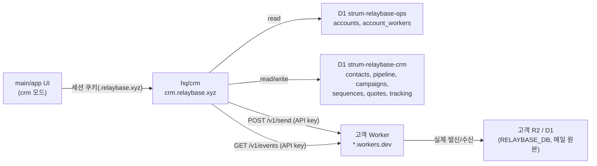

# CRM Mode — v0.2 기획서

**Status:** Proposed (설계 확정, 구현 전)
**Audience:** humans and coding agents building the third product mode (`email` / `console` / `crm`)
**작성일:** 2026-09-14

이 문서는 Relaybase에 세 번째 모드인 **CRM**을 추가하기 위한 v0.2 기획서다. 기능 목록·우선순위·기능별 제공 범위(scope)와, 가장 중요한 **아키텍처 결정**(CRM은 고객의 Cloudflare Worker가 아니라 Relaybase가 운영하는 중앙 클라우드 서비스로 만든다)을 확정한다.

관련 기존 문서: [`decisions/pivot-byo-cloudflare.md`](../decisions/pivot-byo-cloudflare.md), [`architecture/storage-architecture.md`](../architecture/storage-architecture.md), [`architecture/hq-ops-d1.md`](../architecture/hq-ops-d1.md), [`features/audience-and-broadcasts.md`](./audience-and-broadcasts.md).

---

## 0. 왜 CRM인가

Relaybase는 product builder / 1인 창업자를 위한 제품이다. 지금까지는 "메일함(email)"과 "운영 콘솔(console: 도메인/계정/Audience/Broadcast/키/로그)" 두 모드였다. 그러나 솔로 파운더에게 실제로 필요한 것은 받은 메일함 그 이상이다 — 뉴스레터로 시장을 개척하고, 리드를 놓치지 않고 팔로우업하고, 견적을 보내고, 예약 발송으로 시간을 아끼는 것. 이걸 위해 **CRM**을 세 번째 모드로 분리하고, 기존 console의 Audience/Broadcast를 이곳으로 이전한다.

```
email  — 받은편지함/보낸편지함, 계정, 컴포즈
console — 도메인, 계정, API 키, 로그, 설정 (운영/인프라)
crm     — 연락처, 파이프라인, 뉴스레터/시퀀스, 견적, 예약발송 (성장/영업)
```

---

## 1. 핵심 아키텍처 결정 (가장 중요)

### 1.1 기존 원칙과의 관계

Relaybase의 근본 원칙은 **BYO Cloudflare**다: 제품 데이터(메일, 도메인, Audience, Broadcast, API 키…)는 전부 고객 자신의 Cloudflare 계정에 배포된 Worker의 D1(`RELAYBASE_DB`)에 저장되고, Relaybase는 그 데이터를 호스팅하지 않는다 (`storage-architecture.md`, `hq-ops-d1.md`의 "Forbidden" 항목: *product mailbox/audience/broadcast catalog를 `strum-relaybase-ops`에 두지 말 것*).

**CRM은 이 원칙의 의도적인 예외다.** 사용자 지시 원문: *"CRM 기능은 사용자 worker에 포함되지 않는다. 이것은 우리가 운영하는 중앙형 클라우드 서버로 관리된다. 중앙형 클라우드 서버는 개별 사용자 워커에 요청과 조회를 하는 방식으로 운영된다."*

즉:

| 레이어 | 소유자 | 저장 데이터 |
|---|---|---|
| **고객 Worker** (기존, BYO) | 고객의 Cloudflare 계정 | 실제 메일 발신/수신(R2), 도메인/DKIM, `RELAYBASE_DB` 카탈로그 |
| **CRM 중앙 서버** (신규) | Relaybase 운영 | 연락처, 파이프라인, 캠페인/시퀀스 정의, 견적, 예약 큐, 오픈/클릭 통계 |

CRM 중앙 서버는 메일을 직접 발신하지 않는다 — 발신 도메인 평판, SPF/DKIM, 실제 SMTP 경로는 여전히 고객 Worker 소관이다. 중앙 서버는 "무엇을 언제 누구에게 보낼지"를 결정하고 조립할 뿐, 실제 전송은 항상 고객 Worker에 **요청**한다. 답장 여부 같은 신호는 고객 Worker에 **조회**한다.

> 이 문서를 승인하면 `storage-architecture.md` / `hq-ops-d1.md`에 "CRM은 의도적 예외"라는 상호참조 한 줄을 추가하는 것을 권장한다(이번 문서 범위에는 포함하지 않음).

### 1.2 통신 모델 — 신규 Worker 라우트는 목표 0개

기존 Worker에는 이미 서드파티가 "도메인 스코프 API 키"로 호출할 수 있는 `/v1/*` 표면이 있다 (`domain-scoped-api-keys-multi-product` 정책 — 키 하나당 도메인 하나, `from`이 그 도메인과 일치해야 발송 허용). CRM 중앙 서버를 "그 API 키를 가진 또 하나의 외부 소비자"로 취급하면 **Worker 쪽 신규 코드 없이** 아래 3개의 기존 엔드포인트만으로 v0.2 전체가 동작한다:

| 기존 엔드포인트 | 인증 | CRM에서의 용도 |
|---|---|---|
| `POST /console/keys` (`worker/src/routes/console/keys.ts`) | owner 세션 | CRM 활성화 시 `label: "CRM"` 도메인 스코프 키 1개 발급 |
| `POST /v1/send` (`worker/src/routes/send.ts`) | API 키 (`requireApiKey`) | 뉴스레터/시퀀스/견적 메일의 **실제 발신 위임** |
| `GET /v1/events` + `POST /v1/events/ack` (`worker/src/routes/v1-inbox.ts`) | API 키 | 인바운드 이벤트 폴링 → 답장 감지 (팔로우업/파이프라인용) |

추가로, 최초 CRM 활성화 시의 **Audience 1회성 이전**은 Worker API를 새로 만들 필요 없이 클라이언트(데스크톱/웹 앱)가 이미 가진 owner 세션으로 `GET /console/audience-groups` 등을 읽어 CRM 활성화 API에 그대로 전달하는 방식으로 처리한다 (클라이언트 중계, 아래 §7 참고).

**결론: v0.2에서 `worker/` 레포에 필요한 변경은 0줄(신규 라우트 기준)이다.** 오픈율/클릭률 트래킹 픽셀·리다이렉트 엔드포인트도 CRM 중앙 서버 도메인(`crm.relaybase.xyz`)에 두므로 Worker와 무관하다.

### 1.3 신규 배포 유닛 — `main/hq/crm`

기존 `hq/console`, `hq/admin`, `hq/website`와 동일한 패턴(Next.js + OpenNext + Cloudflare Workers)으로 새 앱을 추가한다.

| 항목 | 값 (제안) |
|---|---|
| 경로 | `main/hq/crm/` |
| 배포 | Cloudflare Worker `strum-relaybase-crm`, 도메인 `crm.relaybase.xyz` |
| DB (신규) | D1 `strum-relaybase-crm` — binding `DB`. CRM 전용 테이블만 (§3) |
| DB (참조) | D1 `strum-relaybase-ops` — binding `OPS_DB`, **읽기 위주**. `accounts` / `account_workers`로 로그인 계정 ↔ Worker URL 매핑 확인 |
| 인증 | `console.relaybase.xyz`와 동일한 세션 쿠키 재사용 — 쿠키 도메인을 `.relaybase.xyz`(상위 도메인)로 지정하고 동일한 `CONSOLE_SESSION_SECRET`으로 검증. **별도 회원가입/로그인 화면을 만들지 않는다.** |
| 비밀 저장 | 고객 Worker용 도메인 스코프 API 키(평문 사용 필요 — Worker에 매 요청 Bearer로 보내야 함)는 `strum-relaybase-crm`에 **암호화하여** 저장 (HQ ops의 "해시만 저장" 원칙과 다름 — §8 리스크 참고) |
| Queue (신규) | Cloudflare Queue `crm-tracking-events` — 오픈/클릭 트래킹 이벤트를 버퍼링해 D1 배치 insert (P0-2) |
| R2 (신규) | 버킷 `crm-assets` — 캠페인 에디터에 붙여넣은 이미지 저장(P0-6). 고객 Worker의 `relaybase-mailbox` R2와 무관한 별도 버킷 |

### 1.4 핵심 플로우 3가지

**A. 뉴스레터/캠페인 발송**
1. CRM UI에서 캠페인 작성(제목/본문/대상 세그먼트) → `strum-relaybase-crm.campaigns`에 저장
2. 발송 시각 도달(즉시 또는 예약) → hq/crm의 Cron Trigger가 대상 Contact를 순회
3. 각 수신자용 HTML을 렌더링하며 오픈 픽셀 + 클릭 리다이렉트 링크(`crm.relaybase.xyz/t/...`)를 삽입
4. 저장된 도메인 스코프 키로 고객 Worker `POST {workerUrl}/v1/send` 호출 (배치, 초당 발송량 제한)
5. Worker는 기존 로직대로 실제 발신 + 자체 R2/sendlog 기록 (변경 없음)
6. hq/crm은 자신의 `tracking_events` / 캠페인 통계만 갱신

**B. 답장 감지 (팔로우업 리마인더 / 파이프라인 갱신)**
1. hq/crm 백그라운드 잡(예: 5분 주기)이 활성 계정마다 저장된 API 키로 `GET /v1/events?limit=50` 폴링
2. 인바운드 이벤트의 `from_email`이 CRM Contact와 일치하면 해당 Contact의 `lastReplyAt` 갱신, "답장 대기" 목록에서 제거
3. 처리한 이벤트는 `POST /v1/events/ack`로 확인 처리

**C. CRM 활성화 (온보딩 / 최초 마이그레이션)**
1. 사용자가 앱에서 "CRM 모드 켜기" 클릭 (이미 Worker owner 세션 + console 세션 보유 상태)
2. 클라이언트가 Worker `POST /console/keys`로 `label: "CRM"` 키 발급
3. 클라이언트가 Worker `GET /console/audience-groups` + 그룹별 contacts를 읽음
4. 클라이언트가 hq/crm `POST /crm/enable`에 `{ workerUrl, domain, apiKey, importedContacts }` 전달
5. hq/crm이 계정↔Worker↔API키 레코드 저장 + Contacts 테이블에 1회성 임포트



---

## 2. 프론트엔드 구조 변경

### 2.1 Sidebar mode 3분할

`main/app/src/lib/navigation/sidebar-mode.ts` / `sidebar-paths.ts`가 현재 내부적으로 `SidebarMode = "email" | "dashboard"` (UI 라벨 "Console" = 내부 값 `"dashboard"`)로 이진 구조다. 기존 저장값과의 하위호환을 위해 `"dashboard"` 토큰은 유지하고, 신규 값 `"crm"`을 추가한다.

- `SidebarMode`: `"email" | "dashboard" | "crm"`
- `DEFAULT_CRM_PATH` 추가 (예: `/crm/contacts`)
- `SidebarUiState.lastCrmPath` 필드 추가, `LAST_CRM_PREFIX` localStorage 키 추가
- `isRestorablePath` / `modeFromPathname` (`sidebar-paths.ts`)에 `crm` 분기 추가
- `account_state` (D1, namespace `ui`) 쪽 사이드바 상태 스키마도 `lastCrmPath`를 포함하도록 확장 (`account-state-d1.md` 영향)

### 2.2 console에서 CRM으로 이전

`main/app/src/console/lib/paths.ts`의 `useDashboardPaths()` 탭 목록에서 **Audience**, **Broadcasts** 항목을 제거한다. 해당 페이지 트리(`main/app/src/console/pages/audience/*`, `main/app/src/console/pages/broadcasts/*`)는 `main/app/src/crm/pages/*`로 이동/재작성하고, 라우팅은 `main/app/src/app/(shell)/crm/*` 라우트 그룹을 신설한다.

제안 라우트:

| 경로 | 화면 |
|---|---|
| `/crm/contacts` | 연락처 리스트 (태그/세그먼트 필터) |
| `/crm/pipeline` | 파이프라인 칸반 |
| `/crm/campaigns` | 뉴스레터/캠페인 리스트 (구 Broadcasts) |
| `/crm/campaigns/:id` | 캠페인 작성/발송/통계 |
| `/crm/sequences` | 드립 시퀀스 리스트·편집 |
| `/crm/quotes` | 견적 리스트·작성 |
| `/crm/quotes/:id` | 견적 상세/추적 |

### 2.3 신규 클라이언트 계층

`main/app/src/lib/desktop/api/email-api-map.ts`가 `/api/email/*` → Worker로 매핑하는 것과 동일한 패턴으로, `main/app/src/lib/crm/api-map.ts`를 신설해 `/api/crm/*` → `crm.relaybase.xyz`로 매핑한다. `desktopAwareFetch`를 그대로 재사용한다.

---

## 3. 데이터 모델 (D1 `strum-relaybase-crm`, 신규)

Drizzle 스키마 초안 (필드 개요만; 실제 타입/인덱스는 구현 시 확정):

```
accounts_link   { id, opsAccountId, workerUrl, domain, apiKeyEncrypted, createdAt,
                  followupThresholdDays(default 3), lastEventPollAt?, lastEventCursor? }

contacts        { id, accountLinkId, email, name?, status(lead|customer|subscriber|churned),
                  source(manual|import|webhook|audience_migration), tags[], createdAt,
                  lastActivityAt?, lastReplyAt?, followupSnoozed(default false) }

pipeline_cards  { id, contactId(UNIQUE), stage(lead|contacted|quoted|won|lost), note?, updatedAt }

activities      { id, contactId, type(note|sent|opened|clicked|replied|quote_sent|quote_approved),
                  payloadJson, occurredAt }

campaigns       { id, accountLinkId, subject, bodyMarkdown, templateId, segmentJson,
                  status(draft|scheduled|sending|sent|failed), scheduledAt?, sentAt?, stats{sent,opened,clicked} }

templates       { id, accountLinkId?(null=기본 제공, 전 계정 공유), name, htmlSource, isBuiltin, createdAt }

sequences       { id, accountLinkId, trigger(contact_created|tag_added), tagFilter?, active }
sequence_steps  { id, sequenceId, order, waitDays, subject, body }
sequence_runs   { id, sequenceId, contactId, currentStep, status(active|done|stopped), startedAt, nextStepDueAt }

quotes          { id, accountLinkId, contactId, itemsJson, total, status(draft|sent|approved|rejected),
                  publicToken, sentAt?, respondedAt?, respondedIp?, respondedUa?, stripePaymentLinkUrl? }

scheduled_jobs  { id, accountLinkId, kind(campaign|sequence_step), refId, runAt, status(pending|done|failed) }

tracking_events { id, campaignId, contactId, type(open|click), url?, occurredAt }

webhooks_inbound{ id, accountLinkId, token, createdAt }  -- 리드 캡처용 수신 웹훅
```

`pipeline_cards.contactId`의 UNIQUE 제약은 P0-4에서 확정한 "Contact당 다중 딜 제외(v0.2)" 결정을 스키마 레벨에서 강제한다. `tracking_events`는 고빈도 쓰기이므로 Cloudflare Queue `crm-tracking-events`를 경유해 배치 insert한다(§1.3, P0-2 참고). `campaigns.bodyMarkdown`(내용)과 `campaigns.templateId → templates.htmlSource`(디자인)가 분리되어 있는 것은 의도된 구조다 — 상세는 P0-6 참고.

기존 Worker 쪽 `audience_groups` / `audience_contacts` / `broadcasts` (`RELAYBASE_DB`)는 **삭제하지 않는다** — 레거시 read-only로 유지 (§8).

---

## 4. 기능 명세 (우선순위 · 범위)

우선순위는 이전 조사(라이트 CRM/이메일 자동화/견적 툴/GTM 스택 벤치마크)를 근거로 확정한 순서를 유지한다. **13개 기능 모두 v0.2 문서 범위에 포함하되, 각 기능은 아래처럼 "포함/제외"를 명확히 그어 과대 개발을 막는다.**

### P0 — 기반 기능 (M1)

#### P0-1. 연락처 통합 (Contacts)

**목적**
Audience를 대체하는 CRM의 기본 단위. 파이프라인·캠페인·시퀀스·견적이 전부 Contact를 참조하므로, 이 기능 없이는 다른 어떤 기능도 동작하지 않는다.

- **v0.2 포함**: `contacts` 테이블(§3), 수동 추가/수정/삭제, 태그 CRUD, 이메일/이름/태그/상태 검색·필터, 기존 Audience 데이터소스(Generic JSON) 이전 시 1회성 스냅샷 임포트
- **v0.2 제외**: Company(조직) 엔티티, 커스텀 필드, 중복 연락처 자동 병합, Audience의 "외부 JSON 소스 cron 재동기화" 기능 자체(재구현은 후순위 — 이전 당시 스냅샷만 가져오고 이후엔 CRM이 유일한 갱신 경로)

**데이터·캐시 구조**
- 테이블: `contacts` (§3). `email`은 `accountLinkId` 범위 내 UNIQUE(대소문자 무시, 저장 시 lowercase 정규화)
- 목록 캐시: 데스크톱 `~/.relaybase/cache/crm/contacts-{accountLinkId}.json` (TTL 60초, stale-while-revalidate — 기존 `cache/dashboard/**` 패턴과 동일), 웹은 localStorage 미러
- 검색: `email`/`name` prefix `LIKE` 쿼리(수천 건 규모 가정; 1만 건 초과 시 FTS 검토 각주)
- 페이지네이션: `createdAt DESC, id` 커서 기반, 페이지당 50건

**화면 구조**
- `/crm/contacts` — 리스트(테이블), 상단 검색창 + 태그 다중 필터 + 상태 필터 + 우상단 "추가" 버튼
- 행 클릭 → 우측 Sheet `?id=<contactId>` (탭: 프로필 / 타임라인 / 노트) — 기존 `AudienceGroupDetailSheet` 패턴 재사용
- "추가"는 Dialog(이메일*, 이름, 태그, 상태) — 워크스페이스 규칙 `dashboard-add-dialog` 준수
- 태그 관리는 Sheet 내 인라인 생성(입력 후 Enter로 신규 태그 즉시 생성)

**성공 플로우**
1. `/crm/contacts` → "추가" 클릭 → Dialog
2. 이메일 입력(필수, 실시간 형식 검증) → 이름/태그 선택(선택) → "저장"
3. `POST /crm/contacts` → 201 → Dialog 닫힘 → 리스트 최상단에 optimistic 삽입 → 토스트 "연락처가 추가되었습니다"

**Use Cases**

| UC | 유형 | 트리거/조건 | 시스템 동작 | 사용자 표시 |
|---|---|---|---|---|
| UC-1 | 성공 | 이메일만 입력 후 저장 | Contact 생성, status=lead | 토스트 "연락처가 추가되었습니다" |
| UC-2 | 예외 | 이미 존재하는 이메일 | 409 Conflict | Dialog 내 인라인 에러 "이미 등록된 연락처입니다" + "기존 연락처 보기" 링크(해당 Sheet로 이동) |
| UC-3 | 예외 | 이메일 형식 오류(`@` 없음 등) | 클라이언트 검증, 요청 미전송 | 인풋 하단 빨간 텍스트 "올바른 이메일 주소를 입력하세요" |
| UC-4 | 예외 | 이메일 필드 비움 | 클라이언트 검증 | "저장" 버튼 비활성화 |
| UC-5 | 성공 | 태그/상태로 필터링 | 서버 쿼리 필터 적용 | 리스트 즉시 갱신 + 활성 필터 배지 표시 |
| UC-6 | 예외 | 검색·필터 결과 0건 | — | 빈 상태 "일치하는 연락처가 없습니다" |
| UC-7 | 예외 | 목록 로드 중 네트워크 실패 | fetch 실패 | 리스트 영역 "연락처를 불러오지 못했습니다 [다시 시도]" — 캐시가 있으면 stale 데이터를 먼저 보여주고 상단에 "오프라인 · 마지막 동기화 3분 전" 배너 |
| UC-8 | 성공 | Contact 삭제 | hard delete + `activities`/`pipeline_cards` cascade | 확인 Dialog "연락처를 삭제하면 파이프라인/타임라인 기록도 함께 삭제됩니다" → 완료 후 토스트 "삭제되었습니다" |
| UC-9 | 예외 | 삭제하려는 Contact가 활성 시퀀스에 포함됨 | 서버 409 | Dialog 에러 "진행 중인 시퀀스가 있어 삭제할 수 없습니다. 시퀀스에서 먼저 제외하세요" |
| UC-10 | 성공 | Audience 마이그레이션으로 최초 유입 | `source=audience_migration` | 리스트에 "이전됨" 배지, 상세 Sheet에 "Audience에서 이전됨 · 2026-09-14" 안내 |

#### P0-2. 오픈율/클릭률 트래킹

**목적**
현재 제품에 전무한 기능. 발신 성과를 눈으로 확인해야 팔로우업 리마인더·시퀀스 자동 중단 같은 다른 자동화가 의미를 갖는다.

- **v0.2 포함**: 발신 HTML에 1x1 픽셀 + 링크 리다이렉트 삽입(`crm.relaybase.xyz/t/o/:campaignId/:contactId`, `/t/c/...?u=`), 캠페인 단위 오픈/클릭 집계, Contact별 마지막 오픈일
- **v0.2 제외**: 봇/이미지 프리페치 오픈 필터링, 디바이스·지역·클라이언트 분석, 히트맵

> 삽입 시점: P0-6 렌더링 파이프라인의 마지막 단계(마크다운→HTML 조립, 템플릿 삽입, CSS 인라인 이후) — 상세는 P0-6 참고.

**데이터·캐시 구조**
- 테이블: `tracking_events` (§3). 고빈도 쓰기이므로 D1 직접 insert 대신 **Cloudflare Queue** `crm-tracking-events`로 버퍼링 후 배치 insert(피크 시 D1 쓰기 폭주 방지) — hq/crm 신규 인프라 구성 요소로 §1.3에 추가
- 픽셀 요청은 큐잉과 무관하게 즉시 200 + 1x1 GIF 응답, 클릭 리다이렉트는 즉시 302 응답(사용자 체감 지연 없음이 최우선)
- 집계: `campaigns.stats`(sent/opened/clicked)는 5분 주기 배치 잡이 `tracking_events`를 롤업 — **실시간 카운트 아님**을 UI에 명시
- 캐시: 캠페인 통계는 Cloudflare Cache API로 60초 캐시(캠페인별 key)

**화면 구조**
- `/crm/campaigns/:id` "통계" 탭 — 발신수/오픈수(오픈율%)/클릭수(클릭률%) 카드 3개(차트는 v0.2 선택 사항)
- Contact 상세 Sheet 타임라인에 "오픈함 · {캠페인명} · 2026-09-14 10:32" 이벤트 라인

**성공 플로우**
1. 캠페인 발송 완료 → 수신자 메일 클라이언트가 이미지 로드 → 픽셀 요청 도달
2. hq/crm이 즉시 1x1 GIF 응답 + 큐에 이벤트 push
3. 5분 배치가 `tracking_events` 반영 → `campaigns.stats.opened` 증가
4. `/crm/campaigns/:id` 통계 탭 새로고침 시 갱신된 수치 표시

**Use Cases**

| UC | 유형 | 트리거/조건 | 시스템 동작 | 사용자 표시 |
|---|---|---|---|---|
| UC-1 | 성공 | 수신자가 메일을 열어 이미지 로드 | open 이벤트 기록 | (수신자에겐 무표시 — 발신자 통계에만 반영) |
| UC-2 | 성공 | 수신자가 본문 링크 클릭 | click 이벤트 기록 후 원래 URL로 302 | 수신자는 정상적으로 목적 페이지 이동(체감 지연 <100ms 목표) |
| UC-3 | 예외 | 캠페인 작성 시 링크 오탈자로 대상 URL이 깨짐 | 리다이렉트는 그대로 시도 | Relaybase가 대신 에러 페이지를 만들지 않음(브라우저 표준 에러) — 대신 저장 시 사전 검증(UC-6)으로 예방 |
| UC-4 | 예외 | 동일 수신자가 같은 캠페인을 여러 번 열람(메일 클라이언트 프리페치 포함) | 이벤트는 모두 기록하되 통계는 **유니크 Contact 수** 기준 | "오픈 12명 / 발신 50명 (24%)" — 총 오픈 이벤트 수는 툴팁에서만 노출 |
| UC-5 | 예외 | 이미지 로딩을 차단하는 메일 클라이언트(Outlook 기본값 등) | 오픈 이벤트 미수신 | 통계 카드 하단 고정 안내 "오픈율은 이미지 로드 여부로 집계되어 실제보다 낮게 나올 수 있습니다" |
| UC-6 | 성공 | 캠페인 저장 시 본문 링크 형식 자동 점검 | `http(s)://`가 아닌 링크 감지 | 인라인 경고(저장은 막지 않음) "링크 형식을 확인하세요: {url}" |
| UC-7 | 예외 | 큐 처리 지연/실패 | 이벤트 유실 가능(내부 모니터링 대상, 사용자 에러 노출 안 함) | 통계 탭에 "마지막 갱신: 5분 전" 타임스탬프로 실시간이 아님을 항상 명시 |

#### P0-3. 팔로우업 리마인더

**목적**
"누구에게 답장이 안 왔는지"를 놓치지 않는 것 — 1인 창업자가 리드를 잃는 가장 흔한 원인을 막는다.

- **v0.2 포함**: Contact별 "마지막 발신일"과 "마지막 회신일" 추적(플로우 B), 회신 없이 N일(기본 3일, 설정 가능) 경과 시 "답장 대기" 리스트 뷰에 노출
- **v0.2 제외**: 이메일/푸시/슬랙 알림 자체 발송, 스누즈 세분화, 사용자별 우선순위 커스터마이징

**데이터·캐시 구조**
- `contacts.lastActivityAt`(마지막 발신), `contacts.lastReplyAt`(마지막 회신), `contacts.followupSnoozed`(수동 제외 플래그) 활용 — 파생 쿼리: `WHERE followupSnoozed=false AND lastActivityAt > COALESCE(lastReplyAt, 0) AND lastActivityAt < now() - N days`
- 폴링 커서: `accounts_link.lastEventPollAt`, `lastEventCursor` (§3에 반영)
- 임계일 N: `accounts_link.followupThresholdDays`(기본 3)

**화면 구조**
- CRM 홈 대시보드 위젯 "답장 대기 (N)" — 클릭 시 `/crm/contacts?view=followup`(해당 필터 적용된 리스트)
- 리스트 각 행에 "마지막 발신 5일 전 · 회신 없음" 보조 텍스트 + "리마인드 발송" 퀵액션

**성공 플로우**
1. hq/crm 백그라운드 잡이 5분마다 폴링(§1.4 플로우 B)
2. 회신 없이 임계일 경과한 Contact 발견 → 위젯 카운트 반영
3. 사용자가 위젯 클릭 → 필터된 리스트 → "리마인드 발송" → 간단 컴포즈(수동 작성) → 발송
4. `lastActivityAt` 갱신 → 리스트에서 자동 제외

**Use Cases**

| UC | 유형 | 트리거/조건 | 시스템 동작 | 사용자 표시 |
|---|---|---|---|---|
| UC-1 | 성공 | 3일 내 회신 없음 | 위젯 카운트 +1 | 대시보드 "답장 대기 (N)" |
| UC-2 | 성공 | 리마인드 발송 후 Contact가 실제 회신 | 폴링이 감지 → `lastReplyAt` 갱신 | 위젯에서 자동 제거, 타임라인에 "회신함" 이벤트 |
| UC-3 | 예외 | 폴링 대상 계정의 API 키가 Worker에서 rotate/revoke됨 | `/v1/events` 401 | CRM 상단 영구 배너 "Worker 연결이 끊어졌습니다. CRM 설정에서 다시 연결하세요" — 클릭 시 §1.4 플로우 C(키 재발급) 재실행 |
| UC-4 | 예외 | Worker 다운/네트워크 오류로 폴링 실패 | 지수 백오프 재시도(최대 3회) | 실패 지속 시 UC-3과 동일 배너, 문구만 "일시적으로 연결이 원활하지 않습니다" |
| UC-5 | 예외 | 임계일(N) 설정을 0 이하로 입력 | 클라이언트 검증 | "1일 이상으로 설정하세요" |
| UC-6 | 성공 | 특정 Contact를 리마인더에서 수동 제외("무시") | `contacts.followupSnoozed=true` | 리스트에서 제거, Sheet에 "리마인더 해제됨" 배지 + "다시 켜기" 링크 |

#### P0-4. 파이프라인 칸반

**목적**
리드 → 계약까지의 진행 상태를 한 화면에서 파악한다.

- **v0.2 포함**: 고정 5스테이지(Lead → Contacted → Quoted → Won / Lost), 드래그 앤 드롭, 카드당 최근 노트 1개 표시, 견적 승인 시 Quoted → Won 자동 이동(P1-2와 연동)
- **v0.2 제외**: 커스텀/추가 스테이지, Contact당 다중 딜, 담당자 배정, 금액 합계·예측 리포트

**데이터·캐시 구조**
- `pipeline_cards` (§3): `contactId` UNIQUE(한 Contact당 카드 1개, 다중 딜 제외를 스키마로 강제)
- `GET /crm/pipeline`가 5개 스테이지 카운트 + 리스트를 한 번에 반환(스테이지별 최대 50개 프리뷰)
- 스테이지 내 정렬은 `updatedAt DESC` 고정(커스텀 순서 저장은 v0.2 범위 밖)

**화면 구조**
- `/crm/pipeline` — 5개 컬럼, 컬럼 상단 카운트, 카드에 이름/이메일/최근 노트 첫 줄/마지막 활동일
- 카드 클릭 → Contact 상세 Sheet(P0-1과 동일 컴포넌트)
- 카드 드래그 → 다른 컬럼으로 이동(스테이지 변경)

**성공 플로우**
1. `/crm/pipeline` 진입 → 5개 컬럼 로드
2. Lead 컬럼 카드를 Contacted로 드래그
3. `PATCH /crm/pipeline/:contactId { stage }` optimistic 반영(즉시 이동, 실패 시 롤백)
4. `activities`에 스테이지 변경 이벤트 자동 기록

**Use Cases**

| UC | 유형 | 트리거/조건 | 시스템 동작 | 사용자 표시 |
|---|---|---|---|---|
| UC-1 | 성공 | 카드를 다른 컬럼으로 드래그 | stage 갱신 + activity 기록 | 카드 즉시 이동(optimistic), 별도 토스트 없음 |
| UC-2 | 예외 | PATCH 실패(네트워크) | 서버 미반영 | 카드가 원래 컬럼으로 롤백 + 토스트 "이동에 실패했습니다. 다시 시도하세요" |
| UC-3 | 성공 | 견적 승인(P1-2) 자동 연동 | Quoted→Won 자동 전이 | 카드 자동 이동 + "견적 승인됨" 배지, Won 컬럼 헤더 하이라이트 애니메이션 |
| UC-4 | 예외 | 신규 Contact가 아직 파이프라인 카드 없음 | 최초 조회 시 lazy하게 stage=lead 카드 자동 생성 | 별도 안내 없이 Lead 컬럼에 자연스럽게 표시 |
| UC-5 | 예외 | 컬럼에 카드 50개 초과 | 51번째부터 숨김 | 컬럼 하단 "더보기 (12)" → 해당 stage로 필터된 리스트 뷰 이동 |
| UC-6 | 성공 | 카드에서 빠른 노트 추가(⌘Enter) | `activities` type=note 기록 | 카드 미리보기 텍스트 즉시 갱신 |
| UC-7 | 예외 | 두 세션이 동시에 같은 카드를 다른 컬럼으로 이동(레이스) | last-write-wins, 버전 체크 없음(v0.2 범위 밖) | 늦게 반영된 화면은 다음 새로고침 시 자동 정정, 별도 충돌 에러 없음 |

#### P0-5. 스케줄(예약) 발송

**목적**
"지금이 아니라 화/목 오전에 보내고 싶다"는 니즈를 충족한다.

- **v0.2 포함**: 캠페인에 미래 발송 시각 지정, `scheduled_jobs`를 hq/crm Cron이 폴링해 시각 도달 시 플로우 A 실행, 발송 전까지 취소/재수정 가능
- **v0.2 제외**: 수신자 타임존별 맞춤 발송 시각, 발송 속도(초당 통수) 세부 설정 UI — 안전 기본값 하드코딩

**데이터·캐시 구조**
- `campaigns.status=scheduled`, `scheduledAt` / `scheduled_jobs`(§3) — Cron Trigger(매분)가 `runAt <= now() AND status='pending'` job을 pick
- 동시성: `UPDATE ... WHERE status='pending' RETURNING` 방식의 원자적 클레임으로 중복 발송 방지(hq/crm이 여러 인스턴스로 실행돼도 안전)

**화면 구조**
- 캠페인 작성 화면 발송 버튼 옆 드롭다운: "지금 발송" / "예약 발송" → 예약 선택 시 날짜·시간 피커
- 예약된 캠페인은 리스트에서 "예약됨 · 9/16 10:00" 배지
- 캠페인 상세에 "예약 취소" / "시간 변경" 버튼(발송 전까지만 노출)

**성공 플로우**
1. 캠페인 작성 완료 → "예약 발송" → 미래 날짜·시간 지정 → "예약하기"
2. `campaigns.status=scheduled`, `scheduled_jobs` row 생성
3. 지정 시각 도달 → Cron이 job 클레임 → 플로우 A 실행 → `sending → sent`
4. 발송 완료 후 캠페인 리스트에서 "발송됨" 배지로 확인(별도 알림 없음, v0.2 범위)

**Use Cases**

| UC | 유형 | 트리거/조건 | 시스템 동작 | 사용자 표시 |
|---|---|---|---|---|
| UC-1 | 성공 | 미래 시각으로 예약 | `scheduled_jobs` 생성 | 토스트 "예약되었습니다 · 9/16(화) 10:00" |
| UC-2 | 예외 | 과거 시각 선택 | 클라이언트 검증, 요청 차단 | 날짜피커 하단 "현재 시각 이후로 선택하세요" |
| UC-3 | 성공 | 예약 취소(발송 전) | job 삭제, campaign status=draft 복귀 | 토스트 "예약이 취소되었습니다" |
| UC-4 | 예외 | 취소 시도 시점에 이미 발송 시작(Cron이 막 픽업, 레이스) | 서버 409 | "이미 발송이 시작되어 취소할 수 없습니다" |
| UC-5 | 예외 | 예약 시각에 대상 Contact 0명(그사이 전부 삭제) | job 실행하되 발신 0건으로 즉시 sent 처리 | 캠페인 상세 배너 "발신 대상이 없어 발송되지 않았습니다" |
| UC-6 | 예외 | 예약 시각에 Worker 연결 끊김(API 키 무효) | `/v1/send` 401 | `campaign.status=failed`, 리스트에 빨간 "발송 실패" 배지 + 상세에서 "Worker 연결을 확인하세요 [연결 확인]" |
| UC-7 | 예외 | 발송 도중 일부 수신자만 실패 | 성공/실패 개별 기록 | 통계에 "발신 48 / 실패 2" + 실패 목록 다운로드 링크 |
| UC-8 | 성공 | 예약 시간 변경 | `job.runAt` 갱신 | 토스트 "예약 시간이 변경되었습니다" |

#### P0-6. 콘텐츠 에디터 & 디자인 템플릿

**목적**
캠페인의 "내용"과 "디자인"을 분리한다. 내용은 매번 바뀌므로 쓰기 편한 WYSIWYG 마크다운 에디터로 다루고, 디자인은 자주 안 바뀌므로 템플릿(기본 제공 + 파일 임포트 커스텀)으로 다룬다. 제품 런칭 피드백("A decent WYSIWYG editor")과 초기 벤치마크 조사를 반영한 결정.

**구현 방식 (재사용 소스)**
직접 만들지 않고 별도 제품 **Railmark**(`/Users/isaaclee/Projects/pilots/railmark`)에서 이미 완성된 마크다운 WYSIWYG 에디터를 가져온다. Railmark는 **BlockNote**(`@blocknote/core` / `@blocknote/react` / `@blocknote/shadcn`, v0.51.4) 기반 에디터를 프로덕션 수준으로 다듬어 놓았다(`app/docs/markdown-editor.md`). 참고로 최초 지시에는 경로가 `../railmark/`로 언급되었으나 실제 위치는 `pilots/railmark`이다.

| 가져올 것 | Railmark 원본 위치 | CRM에서 바뀌는 부분 |
|---|---|---|
| 에디터 컴포넌트 | `app/src/components/content/MarkdownEditor.tsx` | Next.js 클라이언트 컴포넌트로 포팅(`"use client"` + `next/dynamic` `{ ssr: false }` — BlockNote/ProseMirror는 SSR 불가) |
| 마크다운 라운드트립·자동저장 플러시 | `app/src/lib/markdown-editor-flush.ts`, `editor-persistence/*` | 로컬 파일 저장 대신 hq/crm `PATCH /crm/campaigns/:id` 자동저장으로 교체. "안 바뀌었으면 안 쓴다" 플러시 판단 로직은 그대로 이식 |
| 에디터 CSS(타이포·리스트 마커·테이블 그리퍼) | `app/src/markdown-editor.css` | 그대로 이식(라이트/다크 대응 이미 완료) |
| 이미지·파일 붙여넣기 | `app/src/lib/page-file-ingest.ts` | 로컬 vault 저장 대신 hq/crm 신규 업로드 엔드포인트 → R2 버킷 `crm-assets`(§1.3)로 교체 |
| 테이블 그리퍼 메뉴 | `app/src/components/content/TableHandleMenu.tsx` | 그대로 이식 |
| 링크 처리(`markdown-links.ts`) | — | **가져오지 않음** — Railmark의 해시 라우터 전용 로직, CRM은 일반 Next.js 라우팅이라 불필요 |
| 벌트/스킬 라우팅/`layout.yaml` | — | **가져오지 않음** — Railmark 고유 개념, CRM과 무관 |

**렌더링 파이프라인** (발송 시점에만 실행, 편집 중에는 클라이언트 근사 미리보기만 사용):
1. `campaigns.bodyMarkdown`(BlockNote 블록의 마크다운 직렬화 결과)을 BlockNote `blocksToHTMLLossy`로 HTML 조각 변환
2. `templates.htmlSource`의 `{{content}}` 자리표시자에 그 HTML 조각을 삽입
3. `juice`(CSS 인라이너)로 `<style>` 규칙을 인라인 `style=""`로 변환 — 이메일 클라이언트는 `<style>` 블록을 신뢰할 수 없음
4. P0-2의 오픈 픽셀·클릭 리다이렉트 삽입 → 완성된 발신용 HTML
5. `/v1/send`로 위임(플로우 A)

- **v0.2 포함**: BlockNote 기반 마크다운 에디터(제목/굵게·기울임/목록/이미지/표/구분선), 이미지 붙여넣기·드래그앤드롭(R2 업로드), 3초 디바운스 자동저장, 기본 템플릿 3개(레이아웃·컬러만 다른 순수 디자인 래퍼 — ① 미니멀 중앙정렬 ② 상단 헤더 이미지형 ③ 카드형), 커스텀 템플릿 HTML 파일 임포트, 데스크톱/모바일 미리보기 토글, 테스트 메일 발송
- **v0.2 제외**: 템플릿 자체를 BlockNote로 편집(템플릿 변경은 항상 HTML 파일 임포트로만), 머지 태그의 UI "칩" 표현(v0.2는 `{{contact.name}}` 리터럴 텍스트를 발송 시 문자열 치환), 동영상/문서 첨부(이미지만 지원), 다크모드 미리보기, Railmark의 스킬 라우팅 AI 편집 기능 전체

**데이터·캐시 구조**
- `campaigns.bodyMarkdown`, `campaigns.templateId`(§3에 반영 완료)
- `templates` 테이블(§3) — `accountLinkId=null`인 3개 행이 기본 제공 템플릿(전 계정 공유, 읽기전용), 계정이 임포트한 커스텀 템플릿은 `accountLinkId`로 스코프
- R2 `crm-assets`(§1.3) — 에디터에 붙여넣은 이미지, 공개 읽기 URL 발급
- 자동저장: 3초 디바운스 `PATCH /crm/campaigns/:id { bodyMarkdown }`

**화면 구조**
- `/crm/campaigns/:id` — 좌측 상단: 템플릿 선택 드롭다운(기본 3개 + 계정 커스텀 목록 + "HTML 파일 가져오기") / 중앙: BlockNote 에디터(선택 템플릿의 여백·폭에 맞춰 렌더링) / 우측 패널: 미리보기(데스크톱·모바일 토글) + "테스트 메일 보내기" 버튼
- 템플릿 임포트 Dialog: HTML 파일 업로드 + 필수 자리표시자(`{{content}}`, 수신거부 링크) 검증 결과 표시

**성공 플로우**
1. `/crm/campaigns/:id` → 템플릿 선택(기본값: 첫 번째 기본 템플릿) → BlockNote로 본문 작성(제목, 문단, 이미지 붙여넣기)
2. 3초마다 자동저장, 우측 미리보기가 실시간 갱신(클라이언트 근사 렌더링 — 실제 발송 HTML은 서버가 발송 시점에 재조립)
3. "테스트 메일 보내기" → 본인 이메일로 실제 발신 파이프라인을 태운 HTML 수신 확인
4. "발송"(또는 P0-5 예약) → 서버가 렌더링 파이프라인 실행 후 `/v1/send`로 위임

**Use Cases**

| UC | 유형 | 트리거/조건 | 시스템 동작 | 사용자 표시 |
|---|---|---|---|---|
| UC-1 | 성공 | 이미지 붙여넣기(클립보드) | R2 업로드 후 블록에 삽입 | 업로드 중 블록에 스피너, 완료 시 이미지 표시 |
| UC-2 | 예외 | 이미지 업로드 실패(네트워크) | 블록은 남되 미해결 상태 | 이미지 블록에 "업로드 실패 [다시 시도]" 오버레이 |
| UC-3 | 예외 | 지원 안 하는 파일 붙여넣기(예: .zip, v0.2는 이미지만 지원) | 삽입 거부 | 토스트 "이미지 파일만 지원합니다" |
| UC-4 | 성공 | 작성 중 템플릿 변경 | `bodyMarkdown`은 유지, 래퍼만 교체 | 미리보기가 새 템플릿 스타일로 즉시 갱신, 본문 내용 손실 없음 |
| UC-5 | 성공 | 커스텀 템플릿 HTML 임포트 | 업로드 HTML에서 `{{content}}` 자리표시자 존재 확인 | 있으면 저장 + 템플릿 목록에 추가 |
| UC-6 | 예외 | 임포트 HTML에 `{{content}}` 자리표시자 없음 | 저장 차단 | "템플릿에 `{{content}}` 자리표시자가 없습니다. 콘텐츠가 들어갈 위치를 표시해 주세요" + 가이드 링크 |
| UC-7 | 예외 | 임포트 HTML에 수신거부 링크 자리표시자 없음 | 저장은 허용, 경고만 | 인라인 경고 "수신거부 링크가 없으면 스팸 신고 위험이 높아집니다"(차단 아님, v0.2는 권고만) |
| UC-8 | 성공 | "테스트 메일 보내기" | 현재 초안으로 렌더링 파이프라인 실행 후 본인 주소로 `/v1/send` | 토스트 "테스트 메일을 보냈습니다" |
| UC-9 | 예외 | 테스트 메일 발송 시 Worker 연결 끊김 | `/v1/send` 401 | 토스트 "발송에 실패했습니다: Worker 연결을 확인하세요" |
| UC-10 | 예외 | 편집 중 네트워크 끊김(자동저장 실패) | 로컬 편집 상태는 유지, 서버 저장만 실패 | 상단에 "저장 안 됨 · 재시도 중" 인디케이터 |
| UC-11 | 예외 | 두 탭에서 같은 캠페인 동시 편집 | 마지막 자동저장이 승리(버전 체크 없음, v0.2 범위 밖) | 별도 충돌 경고 없음 — 동시 편집 비권장을 문서화만 |
| UC-12 | 성공 | 본문에 `{{contact.name}}` 리터럴 텍스트 입력 후 발송 | 발송 시 실제 값으로 문자열 치환 | 수신자별로 실제 이름이 들어간 메일 수신 |
| UC-13 | 예외 | 머지 태그 오타(`{{contat.name}}`) | 매칭 실패, 치환 안 됨 | 발송 전 자동 검증 없음(v0.2 한계) — "테스트 메일 보내기"(UC-8)로 육안 확인을 상시 안내 문구로 권장 |

### P1 — 차별화 기능 (M2)

#### P1-1. 이벤트 기반 드립 시퀀스

**목적**
신규 리드 유입 시 몇 통의 이메일을 순서대로 자동 발송 — 수동 팔로우업의 자동화.

- **v0.2 포함**: 트리거 2종만(Contact 생성 / 태그 추가), 순차 단계 최대 5개(대기 N일 → 이메일 발송), Contact가 회신하면 시퀀스 자동 중단(토글 가능)
- **v0.2 제외**: 조건 분기(if/else), 커스텀 이벤트 API, A/B 분기, 단계 수 제한 초과

**데이터·캐시 구조**
- `sequences`, `sequence_steps`, `sequence_runs`(§3, `nextStepDueAt` 필드 포함)
- Cron이 매분 `sequence_runs WHERE status='active' AND nextStepDueAt <= now()`를 원자적으로 클레임(P0-5와 동일한 클레임 패턴 재사용)

**화면 구조**
- `/crm/sequences` 리스트(이름/트리거/활성 상태/진행 중인 Contact 수)
- `/crm/sequences/:id` 편집 — 트리거 선택(Contact 생성 / 태그 추가+태그 선택), 단계 리스트(대기일+제목+본문), "+ 단계 추가"(최대 5개), 활성/비활성 토글
- Contact 상세 Sheet 타임라인에 "시퀀스 '온보딩' 2단계 진행 중" 표시

**성공 플로우**
1. `/crm/sequences` → "새 시퀀스" → 트리거="Contact 생성" 선택
2. 1단계(대기 0일)와 2단계(대기 3일) 추가 → 저장 → 활성화
3. 신규 Contact 생성 이벤트 발생 → `sequence_runs` row 생성(`currentStep=0`, `nextStepDueAt=now`)
4. Cron이 즉시 1단계 발송(플로우 A 재사용) → `nextStepDueAt = now+3d`로 갱신
5. 3일 후 2단계 발송 → 마지막 단계면 `status=done`

**Use Cases**

| UC | 유형 | 트리거/조건 | 시스템 동작 | 사용자 표시 |
|---|---|---|---|---|
| UC-1 | 성공 | 신규 Contact 생성 + 활성 시퀀스 매칭 | `sequence_run` 생성 | 타임라인 "시퀀스 등록됨" |
| UC-2 | 성공 | Contact가 중간에 회신 | 자동 중단 토글 켜져 있으면 `status=stopped` | 타임라인 "회신으로 시퀀스 중단됨", 시퀀스 상세 진행 인원 -1 |
| UC-3 | 예외 | 진행 중인 run이 있는 상태에서 단계 삭제 | 삭제된 단계가 다음 단계였던 run은 그다음 단계로 스킵 | 저장 시 확인 Dialog "진행 중인 3명의 다음 이메일이 변경됩니다. 계속하시겠습니까?" |
| UC-4 | 예외 | 한 Contact가 서로 다른 트리거로 두 시퀀스에 동시 매칭 | 각각 독립적으로 enroll(중복 허용, 의도된 동작) | 별도 경고 없음 |
| UC-5 | 예외 | 이미 활성 run이 있는 Contact가 같은 트리거 조건을 재충족 | 중복 enroll 방지(idempotent) | UI 변화 없음 |
| UC-6 | 성공 | 시퀀스 비활성화 | 신규 enroll 중단 | 확인 Dialog "비활성화 시: [진행 중인 발송은 계속] / [즉시 모두 중단]" 라디오 선택 |
| UC-7 | 예외 | 5단계 초과 추가 시도 | 클라이언트에서 차단 | "+ 단계 추가" 버튼 비활성화 + 툴팁 "최대 5단계까지 가능합니다" |
| UC-8 | 예외 | 단계 발송 시점에 Contact가 이미 삭제됨 | `status=stopped`로 스킵 | 별도 알림 없음(시퀀스 상세 로그에만 기록) |

#### P1-2. Quote(견적) — 웹링크형

**목적**
이메일 본문에 가격을 나열하는 대신, 클릭 한 번으로 승인 가능한 견적 경험을 제공한다.

- **v0.2 포함**: 품목/수량/단가 테이블 기반 견적 템플릿 → 고유 공개 URL(`publicToken`) 생성 → 플로우 A로 이메일 발송 → 고객이 웹페이지에서 승인/거절 클릭(타임스탬프+IP 기록) → 상태 전이 + 파이프라인 자동 이동
- **v0.2 제외**: PDF 생성/다운로드, 법적 구속력 있는 전자서명, 다중 통화, 세금 계산, 품목 카탈로그 관리

**데이터·캐시 구조**
- `quotes`(§3): `itemsJson: [{ name, qty, unitPrice }]`, `total`은 서버가 재계산(클라이언트 값 신뢰 안 함)
- `publicToken`은 추측 불가능한 32바이트 랜덤값 — 공개 URL `crm.relaybase.xyz/q/:publicToken`은 토큰 자체가 접근 제어(별도 로그인 없음)
- 공개 견적 페이지는 Cloudflare Cache API로 30초 캐시, 승인/거절 액션(POST)은 캐시 우회

**화면 구조**
- `/crm/quotes` 리스트(고객명/금액/상태/발송일)
- `/crm/quotes/:id` 작성/편집 — Contact 선택, 품목 테이블(추가/삭제/합계 자동계산), "발송" 버튼
- 공개 페이지 `crm.relaybase.xyz/q/:token` — 품목 테이블(읽기전용) + 합계 + "승인"/"거절" 버튼, 이미 응답한 경우 결과만 표시(재클릭 불가)
- Quote 상세에 "고객이 2026-09-15 14:20 승인함" 타임스탬프 표시

**성공 플로우**
1. `/crm/quotes` → "새 견적" → Contact 선택 → 품목 입력(합계 자동) → "발송"
2. hq/crm이 `publicToken` 발급 + 플로우 A로 이메일 발송(본문에 견적 링크 포함)
3. 고객이 링크 클릭 → 공개 견적 페이지 → 품목/합계 확인 → "승인" 클릭
4. `POST /q/:token/respond { action: "approve" }` → `status=approved`, `respondedAt`/IP/UA 기록
5. 파이프라인 카드가 Quoted → Won으로 자동 이동, `activities`에 "견적 승인됨" 기록
6. 작성자는 다음 `/crm/quotes` 방문 시 상태 배지로 확인(실시간 알림은 v0.2 범위 밖)

**Use Cases**

| UC | 유형 | 트리거/조건 | 시스템 동작 | 사용자 표시 |
|---|---|---|---|---|
| UC-1 | 성공 | 고객이 승인 클릭 | `status=approved`, 파이프라인 자동 이동 | (고객) "승인해 주셔서 감사합니다. 곧 연락드리겠습니다" 확인 화면 / (작성자) 리스트에 초록 "승인됨" 배지 |
| UC-2 | 성공 | 고객이 거절 클릭 | `status=rejected` | (고객) "확인했습니다" 화면 / (작성자) 빨간 "거절됨" 배지, 파이프라인 자동 이동 없음(Lost 이동은 수동) |
| UC-3 | 예외 | 이미 응답한 견적 링크 재방문 | 재응답 차단(idempotent) | (고객) "이미 [승인/거절] 처리된 견적입니다" 읽기 전용 화면, 버튼 비노출 |
| UC-4 | 예외 | 존재하지 않거나 오타난 토큰으로 접근 | 404 | (고객) "견적을 찾을 수 없습니다. 링크를 다시 확인해 주세요" 전용 에러 페이지 |
| UC-5 | 예외 | 품목 0개 상태로 "발송" 시도 | 클라이언트 검증 | "최소 1개 품목을 추가하세요" |
| UC-6 | 예외 | 단가/수량에 음수 또는 문자 입력 | 클라이언트 검증(숫자 입력 필드) | 해당 셀 빨간 테두리 + "숫자만 입력하세요" |
| UC-7 | 예외 | 발송 시 대상 이메일이 유효하지 않아 Worker가 반려 | `/v1/send` 실패 | (작성자) 토스트 "발송에 실패했습니다: 수신자 주소를 확인하세요", status는 draft 유지 |
| UC-8 | 성공 | 초안 저장 후 나중에 이어서 작성 | `status=draft` 유지, 미발송 | 리스트에 회색 "초안" 배지 |
| UC-9 | 예외 | 발송된 견적(`status=sent`) 수정 시도 | 서버가 수정 차단(감사 추적 목적) | "발송된 견적은 수정할 수 없습니다. 새 견적을 만들어 보내세요" + "복제해서 새로 만들기" 버튼 |
| UC-10 | 예외 | 고객이 승인 버튼을 더블 클릭 | 서버 idempotent 처리 | 화면 변화 없음(정상 1회 처리) |

#### P1-3. 폼/웹훅 → Contact 자동 생성

**목적**
랜딩페이지나 외부 폼에서 들어오는 리드를 CRM에 자동으로 쌓는다.

- **v0.2 포함**: 계정당 고유 수신 웹훅 URL 1개(`crm.relaybase.xyz/hooks/:token`), `POST { email, name?, tags? }` → Contact 생성
- **v0.2 제외**: 임베드 가능한 호스팅 폼 빌더 UI, Zapier/Make 공식 커넥터, 랜딩페이지 빌더

**데이터·캐시 구조**
- `webhooks_inbound`(§3) — 계정당 1개 토큰(재발급 시 이전 토큰 즉시 무효화)
- Rate limit: 토큰당 분당 60회(Cloudflare Worker 표준 rate limit로 스팸/오남용 방지)

**화면 구조**
- `/crm/settings/webhook` — 웹훅 URL(복사 버튼) + "재발급" 버튼 + 읽기 전용 curl 예시(`AudienceDataSourceGuide`와 동일한 가이드 패턴)
- 최근 수신 로그 미니 테이블(최근 20건: 시각/이메일/성공·실패)

**성공 플로우**
1. 사용자가 웹훅 URL을 복사해 외부 폼/Zapier 등에 설정
2. 외부 시스템이 `POST {webhookUrl} { email, name?, tags? }` 호출
3. hq/crm이 토큰 검증 → Contact 생성(이미 존재하면 태그만 병합) → 200 반환
4. `/crm/contacts`에 새 Contact 즉시 반영(다음 리스트 새로고침 시)

**Use Cases**

| UC | 유형 | 트리거/조건 | 시스템 동작 | 사용자 표시 |
|---|---|---|---|---|
| UC-1 | 성공 | 유효한 email 포함 POST | Contact 생성(`status=lead`, `source=webhook`) | 웹훅 200 `{ ok: true, contactId }`, CRM 로그에 기록 |
| UC-2 | 예외 | `email` 필드 누락 | 400 | 웹훅 `{ error: "email is required" }`, 수신 로그에 "실패: email 누락" 빨간 행 |
| UC-3 | 예외 | 잘못된 토큰(만료/오타) | 404 | 웹훅 `{ error: "invalid webhook token" }` (토큰이 존재하지 않으므로 CRM 로그에는 남지 않음) |
| UC-4 | 예외 | 이미 존재하는 이메일로 수신 | 재생성 없이 태그만 merge | 웹훅 200(동일 계약), 로그에 "업데이트: 태그 추가됨" |
| UC-5 | 예외 | rate limit 초과(분당 60회) | 429 | 웹훅 `{ error: "rate limited, retry later" }`, 설정 화면에 "최근 요청이 많아 일부가 지연되었습니다" 배너(발생 시에만) |
| UC-6 | 성공 | "재발급" 클릭 | 기존 토큰 즉시 무효화, 신규 발급 | 확인 Dialog "기존 웹훅 URL은 더 이상 동작하지 않습니다. 계속하시겠습니까?" → 새 URL 표시 |
| UC-7 | 예외 | 페이로드가 JSON이 아님 | 400 | `{ error: "invalid JSON body" }` |
| UC-8 | 예외 | `tags`가 배열이 아닌 문자열로 전송됨 | 관대하게 단일 태그(1개짜리 배열)로 처리 | 정상 처리, 별도 에러 없음 |

#### P1-4. CSV 임포트/익스포트

**목적**
다른 툴에서 넘어오는 연락처를 한 번에 옮기고, 백업/외부 분석용으로 내보낸다.

- **v0.2 포함**: Contacts 한정. 임포트는 컬럼 매핑 UI(email/name/tags) + 이메일 기준 중복 스킵, 최대 2,000행 동기 처리. 익스포트는 현재 필터 리스트 CSV 다운로드
- **v0.2 제외**: 딜/견적/캠페인 등 다른 엔티티 임포트, 2,000행 초과 비동기 처리 파이프라인

**데이터·캐시 구조**
- 별도 테이블 없음(Contacts에 직접 insert). 동기 처리이므로 Cloudflare Workers CPU 시간 제약 내에서 2,000행 처리가 가능한지 사전 벤치마크 필요(각주)

**화면 구조**
- `/crm/contacts` → "가져오기" → Dialog 3단계: ① CSV 업로드 ② 컬럼 매핑(CSV 헤더 → email/name/tags 드롭다운, 헤더명으로 기본값 자동 추정) ③ 미리보기 5행 + "OO건 임포트"
- 임포트 결과 화면: "48건 성공, 2건 스킵(중복)" + 스킵 목록 다운로드
- "내보내기"(리스트 상단) → 현재 필터 기준 즉시 CSV 다운로드(Dialog 없음)

**성공 플로우**
1. "가져오기" → CSV 파일 선택
2. 헤더 자동 감지 + 매핑 기본값 추정 → 미리보기 확인 → "임포트" 클릭
3. 서버가 행 단위 파싱/검증 → 결과 요약 화면

**Use Cases**

| UC | 유형 | 트리거/조건 | 시스템 동작 | 사용자 표시 |
|---|---|---|---|---|
| UC-1 | 성공 | 정상 CSV, 중복 없음 | 전체 insert | "50건이 추가되었습니다" |
| UC-2 | 예외 | 이메일 컬럼 미매핑 상태로 진행 시도 | 클라이언트 검증 | "임포트" 버튼 비활성화 + "이메일 컬럼을 지정하세요" |
| UC-3 | 예외 | 일부 행의 이메일 형식 오류 | 해당 행 스킵, 나머지 계속 진행 | 결과 화면 "48건 성공, 2건 스킵" + "스킵된 행 보기"(사유: 잘못된 이메일 형식) |
| UC-4 | 예외 | 기존 Contact와 이메일 중복 | 스킵(덮어쓰지 않음, v0.2는 병합 없음) | "3건 스킵(이미 존재)" |
| UC-5 | 예외 | 2,000행 초과 파일 업로드 | 업로드 자체 거부 | "최대 2,000행까지 지원합니다. 파일을 나눠서 업로드하세요" |
| UC-6 | 예외 | CSV가 아닌 파일(xlsx 등) 업로드 | 확장자/MIME 검증 실패 | "CSV 파일만 지원합니다" |
| UC-7 | 예외 | 헤더만 있고 데이터 행이 없는 CSV | — | "가져올 데이터가 없습니다" |
| UC-8 | 예외 | 비-UTF-8 인코딩(EUC-KR 등)으로 한글 깨짐 | BOM 체크 등으로 감지 시도, 실패 시 원본 그대로 표시 | 미리보기 단계에서 깨진 문자 노출 → 사용자가 육안 확인 후 취소 가능(자동 변환은 v0.2 범위 밖) |
| UC-9 | 성공 | 내보내기 | 현재 필터 조건 그대로 CSV 생성 | 브라우저 다운로드(파일명 `contacts-2026-09-14.csv`) |
| UC-10 | 예외 | 내보내기 대상 0건(필터 결과 없음) | — | 버튼 비활성화 + 툴팁 "내보낼 연락처가 없습니다" |

### P2 — 장기 후보 (M3, 최소 슬라이스만)

#### P2-1. Stripe 결제 연동 (최소 슬라이스)

**목적**
승인된 견적이 바로 결제로 이어지게 한다(완전 자동화는 아님, 링크 첨부 수준).

- **v0.2 포함**: 견적 템플릿에 사용자가 Stripe에서 직접 발급한 **Payment Link URL을 첨부**하는 필드 하나만 제공 (정적 링크, Relaybase는 결제 상태를 모름)
- **v0.2 제외**: Stripe API 연동, 자동 인보이스 생성, 결제 상태 실시간 동기화(webhook), 세금/영수증 — v0.3 후보로 명시만

**데이터·캐시 구조**
- `quotes.stripePaymentLinkUrl` 필드 추가(§3 반영) — 단순 텍스트 URL, Relaybase는 형식 검증 외 관여 없음

**화면 구조**
- `/crm/quotes/:id` 작성 화면 하단 "결제 링크 (선택)" 입력 필드 + 도움말 "Stripe Payment Link를 만들어 붙여넣으세요 [Stripe에서 만들기 ↗]"
- 공개 견적 페이지의 승인 후 확인 화면에 링크가 있으면 "결제하기" 버튼 노출(외부 링크, 새 탭)

**성공 플로우**
1. 견적 작성 시 결제 링크 필드에 Stripe URL 붙여넣기 → 저장/발송
2. 고객이 견적 승인 후 확인 화면에서 "결제하기" 클릭 → Stripe 결제 페이지로 새 탭 이동
3. 결제 완료 여부는 Relaybase가 알 수 없음 — 파이프라인 Won 이동은 이미 P0-4 UC-3(견적 승인 시)에서 처리되며 결제 자체와는 무관

**Use Cases**

| UC | 유형 | 트리거/조건 | 시스템 동작 | 사용자 표시 |
|---|---|---|---|---|
| UC-1 | 성공 | 유효한 https URL 입력 | 저장 | "결제하기" 버튼이 공개 페이지에 노출됨 |
| UC-2 | 예외 | URL 형식이 아닌 텍스트 입력 | 클라이언트 검증 | "올바른 URL을 입력하세요(https://로 시작)" |
| UC-3 | 예외 | 필드 비움(선택 항목) | 정상 저장 | 공개 페이지에 "결제하기" 버튼이 표시되지 않음(에러 아님) |
| UC-4 | 예외 | Stripe가 아닌 임의 URL 입력(악용 가능성) | 서버는 도메인 검증 안 함(v0.2 범위 밖, 사용자 책임) | 작성 화면 도움말에 "신뢰할 수 있는 결제 링크만 사용하세요" 고정 안내 |

#### P2-2. 전자서명
- **v0.2 전체 제외.** P1-2의 "승인 버튼 클릭 + 타임스탬프/IP 기록"은 법적 전자서명이 아닌 간이 승인으로 이미 P1-2에 포함됨. SignWell 등 정식 연동은 v0.3+ 후보로만 기록.

#### P2-3. 크롬 확장 연락처 캡처 (Folk 스타일)
- **v0.2 전체 제외.** 별도 배포 파이프라인(Chrome Web Store 심사 등) 필요, ROI 대비 리소스 과다. v0.3+ 후보.

#### P2-4. AI 초안 생성 (견적 문구/뉴스레터 제목)
- **v0.2 전체 제외.** 후속 버전 후보로만 기록.

---

## 5. 요약 표

| # | 기능 | 우선순위 | 마일스톤 | v0.2 상태 |
|---|---|---|---|---|
| P0-1 | 연락처 통합 | P0 | M1 | 포함(축소) |
| P0-2 | 오픈율/클릭률 트래킹 | P0 | M1 | 포함(축소) |
| P0-3 | 팔로우업 리마인더 | P0 | M1 | 포함(축소) |
| P0-4 | 파이프라인 칸반 | P0 | M1 | 포함(축소) |
| P0-5 | 예약 발송 | P0 | M1 | 포함(축소) |
| P0-6 | 콘텐츠 에디터 & 디자인 템플릿 | P0 | M1 | 포함(축소, Railmark 재사용) |
| P1-1 | 드립 시퀀스 | P1 | M2 | 포함(축소) |
| P1-2 | Quote 웹링크형 | P1 | M2 | 포함(축소) |
| P1-3 | 웹훅 리드 캡처 | P1 | M2 | 포함(축소) |
| P1-4 | CSV 임포트/익스포트 | P1 | M2 | 포함(축소) |
| P2-1 | Stripe 결제 링크 | P2 | M3 | 포함(최소 슬라이스) |
| P2-2 | 전자서명 | P2 | — | v0.2 제외 |
| P2-3 | 크롬 확장 | P2 | — | v0.2 제외 |
| P2-4 | AI 초안 생성 | P2 | — | v0.2 제외 |

---

## 6. 마일스톤

- **M1 (P0)**: `hq/crm` 서비스 골격 + D1 + 인증(쿠키 공유) + Contacts + 트래킹 픽셀/리다이렉트 + 파이프라인 칸반 + 예약 발송 + 팔로우업 리마인더 + Railmark 기반 콘텐츠 에디터·디자인 템플릿(P0-6). CRM 모드가 처음으로 "쓸 수 있는" 상태.
- **M2 (P1)**: 드립 시퀀스, Quote, 웹훅 리드 캡처, CSV 임포트/익스포트.
- **M3 (P2 최소 슬라이스)**: 견적에 Stripe Payment Link 필드 추가. 전자서명/크롬 확장/AI는 백로그로만 존재.

각 마일스톤은 독립 배포 가능해야 한다 — M2가 늦어져도 M1만으로 CRM 모드는 정상 동작해야 한다.

---

## 7. 마이그레이션 계획 (Audience/Broadcast → CRM)

1. CRM 활성화 전까지 기존 console의 Audience/Broadcasts는 **그대로 동작** (아무것도 끊지 않는다).
2. 사용자가 "CRM 모드 켜기"를 누르면 §1.4 플로우 C로 1회성 스냅샷 임포트.
3. 임포트 완료 후 console 사이드바에서 Audience/Broadcasts 탭을 숨긴다 (계정 단위 플래그 `crmEnabled`).
4. Worker의 `audience_groups` / `audience_contacts` / `broadcasts` 테이블과 `/console/audience-groups`, `/console/broadcasts` 라우트는 **삭제하지 않고 legacy 상태로 유지** — CRM을 켜지 않은 사용자, 혹은 롤백이 필요한 사용자를 위한 안전망.
5. CRM을 껐다가 다시 켜는 케이스는 v0.2 범위 밖(재임포트는 덮어쓰기 없이 신규 Contact만 추가하는 정도로 단순 처리 — 상세 정책은 구현 시 결정).

---

## 8. 리스크 & 오픈 이슈

- **포지셔닝 재검토 (2026-09-14 업데이트)**: 초기 우려는 "We do not host your mail / Not a hosted ESP" 마케팅 문구와 CRM의 중앙 호스팅이 정면 충돌한다는 것이었다. 그러나 출시 후 확인된 실사용자 반응은 다르다 — 실제로 반응·전환한 사용자들은 BYO/보안 포지셔닝 자체에 끌린 것이 아니라 **여러 도메인을 저렴하게 쓰고 싶어서** 유입되었고, 오히려 보안 여부와 무관하게 **호스팅형 웹 버전**을 요청하는 목소리가 있었다. 즉 CRM의 중앙 호스팅 방향은 기존 마케팅 카피와는 충돌하지만 실제 시장 수요와는 충돌하지 않는다.
  - **결론**: 이 리스크는 CRM 설계를 바꿀 이유가 되지 않는다. 오히려 §1의 "중앙 클라우드 서버" 방향이 시장이 원하는 방향과 같다는 뜻이므로, `hq/crm`을 설계할 때 "CRM 데이터만 취급한다"고 하드코딩하듯 좁게 가정하지 말고, 장기적으로 email/console까지 포함하는 완전 호스팅형 웹 버전으로 확장될 가능성을 열어둔다(지금 당장 그 설계를 하지는 않는다 — 이번 문서 범위 밖).
  - **후속 조치(범위 밖, 별도 트랙 필요)**: `main/hq/website/content/resources/why-we-built-relaybase.md` 등 BYO를 핵심 셀링포인트로 내세운 마케팅 카피 재검토, `main/PRODUCT.md`의 "Not a hosted ESP" 포지셔닝 문구 업데이트, 가격/ToS 재정비.
- **비용 구조 변화**: 기존 모델은 고객이 자기 Cloudflare 비용만 내는 구조(Relaybase 한계비용 0에 가까움)였다. CRM 중앙 서버는 Relaybase가 직접 호스팅 비용을 부담한다 — **가격 정책(월 구독 등) 결정이 선행되어야** M1 착수가 안전하다. 이 문서는 가격을 다루지 않는다.
- **API 키 보관**: HQ ops D1은 "해시만 저장, 평문 자격증명 금지" 원칙인데, CRM은 발송을 대행하려면 도메인 스코프 키 **평문(또는 복호화 가능한 형태)** 을 들고 있어야 한다. 저장 시 KMS/Secrets 암호화 + 접근 로깅이 필요. 이 예외를 `hq-ops-d1.md`의 정책과 별도로 `strum-relaybase-crm`에만 한정해야 한다.
- **어뷰즈/레이트리밋**: 중앙 서버가 임의 계정 대신 대량 발송을 대행하는 최초의 사례이므로, 계정당/캠페인당 발송 상한이 v0.2부터 필요하다 (베타 Broadcast의 `BROADCAST_BETA_MAX_RECIPIENTS` 50명 제한과 유사한 안전장치를 CRM에도 이식 권장).
- **동기 실패만 기록**: `/v1/send`의 동기 실패만 반송으로 간주하고, 비동기 바운스 이벤트 파싱은 v0.2 범위 밖 — 오픈율/클릭률 통계의 정확도에 영향을 줄 수 있음을 인지하고 있어야 한다.

---

## 9. 이번 문서에서 다루지 않는 것

- 가격/과금 모델
- `hq/crm`의 정확한 Drizzle 타입/마이그레이션 SQL
- Contacts/Pipeline/Campaigns UI의 픽셀 단위 디자인
- 이메일 템플릿 에디터의 구현 방식(리치텍스트 라이브러리 선정 등)

이 문서 승인 후, M1 범위에 대한 구현 계획(파일 단위 작업 목록)은 별도로 작성한다.
