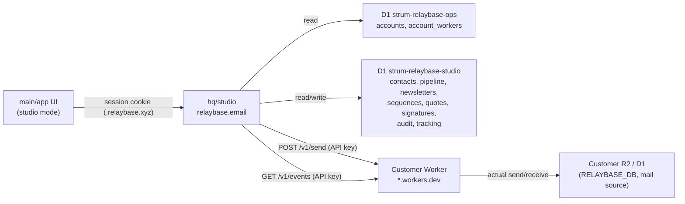

# Studio Mode — v0.2 Product Spec

**Status:** Proposed (design locked, pre-implementation) · **Revised v0.2-rev1**
**Audience:** humans and coding agents building the third product mode (`email` / `console` / `studio`)
**Date:** 2026-09-14
**Revision:** 2026-09-14 — Quote legal-grade-ready e-sign (P1-2 / P2-2 / §3 / §8)

> **Disclaimer (product design, not legal advice).** This document records product-architecture recommendations so Quote approval can approach international e-signature reliability criteria (UNCITRAL MLES Art. 6, EU eIDAS AdES-adjacent). It is **not** a legal opinion, does **not** certify enforceability in any jurisdiction, and does **not** claim Qualified Electronic Signature (QES) status. Counsel review is required before marketing “legally binding e-sign.”

This document is the v0.2 product spec for adding a third mode, **Studio**, to Relaybase. It locks the feature list, priorities, per-feature scope, and the most important **architecture decision**: Studio is not the customer’s Cloudflare Worker—it is a centrally operated cloud service run by Relaybase.

Related docs: [`decisions/pivot-byo-cloudflare.md`](../decisions/pivot-byo-cloudflare.md), [`architecture/storage-architecture.md`](../architecture/storage-architecture.md), [`architecture/hq-ops-d1.md`](../architecture/hq-ops-d1.md), [`features/audience-and-broadcasts.md`](./audience-and-broadcasts.md).

---

## 0. Why Scale

Relaybase is a product for product builders and solo founders. Until now there were two modes: mailbox (**email**) and operations console (**console**: domains, accounts, Audience, Broadcast, keys, logs). Solo founders need more than an inbox—they need to grow the market with newsletters, follow up on leads without dropping them, send quotes, and save time with scheduled sends. **Studio** is split out as the third mode, and Audience/Broadcast from the existing console move here.

```
email   — inbox/sent, accounts, compose
console — domains, accounts, API keys, logs, settings (ops/infra)
studio  — contacts, pipeline, newsletters/sequences, quotes, scheduled send (growth/sales)
```

---

## 1. Core architecture decision (most important)

### 1.1 Relationship to existing principles

Relaybase’s core principle is **BYO Cloudflare**: product data (mail, domains, Audience, Broadcast, API keys, …) lives entirely in D1 (`RELAYBASE_DB`) on a Worker deployed to the customer’s own Cloudflare account; Relaybase does not host that data (`storage-architecture.md`, `hq-ops-d1.md` “Forbidden”: *do not put product mailbox/audience/broadcast catalog in `strum-relaybase-ops`*).

**Studio is an intentional exception to that principle.** Original user direction: *“Studio features are not included in the user worker. They are managed on a centrally operated cloud server we run. That central cloud server operates by requesting and querying each user’s worker.”*

In short:

| Layer | Owner | Stored data |
|---|---|---|
| **Customer Worker** (existing, BYO) | Customer’s Cloudflare account | Actual send/receive mail (R2), domains/DKIM, `RELAYBASE_DB` catalog |
| **Studio central server** (new) | Relaybase operations | Contacts, pipeline, newsletter/sequence definitions, quotes, **quote snapshots / hashes / signatures / append-only audit**, scheduled queue, open/click stats |

The Studio central server does not send mail directly—sending domain reputation, SPF/DKIM, and the actual SMTP path remain the customer Worker’s responsibility. The central server only decides and assembles *what to send, when, and to whom*; actual delivery always **requests** the customer Worker. Signals such as whether someone replied are **queried** from the customer Worker.

> **Revised (v0.2-rev1).** The sent quote *email* still lives in the customer Worker’s R2 (unchanged). The **canonical quote snapshot, content hash, cryptographic signature, and audit trail** live only in `strum-relaybase-studio`. An auditor must be able to verify *what was approved* from the central D1 alone, even if the customer later mutates their R2 mailbox. Customer R2 is a delivery artifact, not the system of record for Quote integrity.

> After this document is approved, we recommend adding a one-line cross-reference in `storage-architecture.md` / `hq-ops-d1.md` that “Studio is an intentional exception” (out of scope for this document).

### 1.2 Communication model — target zero new Worker routes

The existing Worker already exposes `/v1/*` that third parties can call with “domain-scoped API keys” (`domain-scoped-api-keys-multi-product` policy—one key per domain, `from` must match that domain to send). Treating the Studio central server as “another external consumer with that API key” means **v0.2 works with no new Worker code** using only these three existing endpoints:

| Existing endpoint | Auth | Studio use |
|---|---|---|
| `POST /console/keys` (`worker/src/routes/console/keys.ts`) | owner session | Issue one domain-scoped key with `label: "Studio"` when Studio is enabled |
| `POST /v1/send` (`worker/src/routes/send.ts`) | API key (`requireApiKey`) | **Delegate actual send** for newsletter/sequence/quote mail |
| `GET /v1/events` + `POST /v1/events/ack` (`worker/src/routes/v1-inbox.ts`) | API key | Poll inbound events → reply detection (follow-up / pipeline) |

Additionally, the **one-time Audience migration** on first Studio enable does not require new Worker APIs: the client (desktop/web app) reads `GET /console/audience-groups` etc. with the owner session it already has and passes that payload to the Studio enable API (client relay—see §7).

**Conclusion: for v0.2, required changes in the `worker/` repo are zero lines (by new routes).** Open/click tracking pixel and redirect endpoints also live on the Studio central domain (`relaybase.email`), so they are unrelated to the Worker. Quote public pages, respond/sign, and verification endpoints likewise live on `relaybase.email` (P1-2)—still **zero new Worker routes**.

### 1.3 New deployment unit — `main/hq/studio`

Add a new app using the same pattern as existing `hq/console`, `hq/admin`, `hq/website` (Next.js + OpenNext + Cloudflare Workers).

| Item | Value (proposed) |
|---|---|
| Path | `main/hq/studio/` |
| Deploy | Cloudflare Worker `strum-relaybase-studio`, domain `relaybase.email` |
| DB (new) | D1 `strum-relaybase-studio` — binding `DB`. Studio-only tables (§3) |
| DB (reference) | D1 `strum-relaybase-ops` — binding `OPS_DB`, **read-mostly**. `accounts` / `account_workers` for login account ↔ Worker URL mapping |
| Auth | Reuse session cookies from `console.relaybase.xyz` — cookie domain `.relaybase.xyz` (parent domain), validated with the same `CONSOLE_SESSION_SECRET`. **Do not build a separate signup/login screen.** |
| Secret storage | Domain-scoped API keys for the customer Worker (plaintext required—Bearer on every request to Worker) stored **encrypted** in `strum-relaybase-studio` (differs from HQ ops “hash only” principle—see §8 risks). **Quote signing keys** (`QUOTE_SIGNING_SECRET` / Ed25519 private key) are a second decryptable secret—same KMS pattern, separate key id, access-logged. |
| Queue (new) | Cloudflare Queue `studio-tracking-events` — buffer open/click tracking events for batched D1 insert (P0-2) |
| R2 (new) | Bucket `studio-assets` — images pasted in the newsletter editor (P0-6). Separate from the customer Worker’s `relaybase-mailbox` R2. **Do not** store quote snapshots or signatures only in customer R2. |

### 1.4 Three core flows

**A. Newsletter / newsletter send**
1. User composes newsletter in Studio UI (subject/body/target segment) → saved in `strum-relaybase-studio.newsletters`
2. Send time reached (immediate or scheduled) → hq/studio Cron Trigger iterates target Contacts
3. Render per-recipient HTML, inserting open pixel + click redirect links (`relaybase.email/t/...`)
4. Call customer Worker `POST {workerUrl}/v1/send` with stored domain-scoped key (batched, rate-limited sends per second)
5. Worker sends and records to its own R2/sendlog as today (unchanged)
6. hq/studio updates only its `tracking_events` / newsletter stats

**B. Reply detection (follow-up reminder / pipeline update)**
1. hq/studio background job (e.g. every 5 minutes) polls `GET /v1/events?limit=50` per active account with stored API key
2. If inbound event `from_email` matches a Studio Contact, update that Contact’s `lastReplyAt`, remove from “awaiting reply” list
3. Ack processed events with `POST /v1/events/ack`

**C. Studio enable (onboarding / first migration)**
1. User clicks “Enable Studio mode” in the app (already has Worker owner session + console session)
2. Client issues key via Worker `POST /console/keys` with `label: "Studio"`
3. Client reads Worker `GET /console/audience-groups` + contacts per group
4. Client calls hq/studio `POST /studio/enable` with `{ workerUrl, domain, apiKey, importedContacts }`
5. hq/studio stores account↔Worker↔API key record + one-time import into Contacts table

**D. Quote send & legal-grade-ready approval** *(added v0.2-rev1; still uses flow A for delivery)*
1. Author finalizes line items → hq/studio **freezes** a canonical snapshot (`quotes.canonicalSnapshotJson`) and stores `contentHash = SHA-256(canonical)` in `strum-relaybase-studio`. After this point the quote body is immutable (edit = duplicate as new).
2. hq/studio emails the public link via flow A (`POST {workerUrl}/v1/send`). The email is a pointer; the signed object is the central snapshot, not the R2 MIME copy.
3. Customer opens `relaybase.email/q/:publicToken`, reads the frozen quote, expresses **intent** (consent checkbox + typed name), then Approve/Reject.
4. hq/studio binds `{ contentHash, action, signerEmail, occurredAt, nonce }` with HMAC-SHA256 or Ed25519 (`QUOTE_SIGNING_SECRET`, `signatureKeyId`), writes `quote_signatures` + an **append-only** `quote_audit_events` row (hash-chained). IP/UA are supporting evidence, not the signature.
5. Pipeline Quoted → Won on approve (P0-4). Author (or later auditor) verifies from D1 alone: recompute hash of snapshot, recompute MAC/signature, walk the audit chain. Customer R2 mutation cannot rewrite this record.



### 1.5 Quote integrity model (v0.2-rev1)

Informal “Approve click + timestamp/IP” is **not** treated as an electronic signature. v0.2 Quote approval targets **SES+ / AdES-adjacent** reliability (below), not QES.

**Design recommendation (not legal advice) — map to UNCITRAL Model Law on Electronic Signatures (2001) Art. 6 and eIDAS AdES:**

| Criterion | International reference | v0.2 minimum (feasible on hq/studio) | Deferred (P2-2 / v0.3+) |
|---|---|---|---|
| **Intent** | eIDAS: signature used to sign; clear act of approval | Explicit consent copy + required checkbox + typed display name before Approve/Reject | Qualified certificate “I sign” ceremony |
| **Attribution** | UNCITRAL 6(a)(b): creation data linked to, and under control of, the signatory | Unique unguessable token delivered only to `contacts.email`; recorded `signerEmail` / typed name; token is single-use | Signer-held private key, WebAuthn, national eID, OTP step-up |
| **Integrity** | UNCITRAL 6(c)(d); eIDAS AdES: subsequent change detectable | SHA-256 of frozen canonical snapshot; sent quotes immutable; signature covers the hash | PDF/A + PAdES, content timestamping authority (TSA) |
| **Independent audit trail** | eIDAS evidence / record | Append-only, hash-chained `quote_audit_events` in **central** D1 `strum-relaybase-studio` | External qualified trust service / timestamp |
| **Record retention** | Commercial practice; eIDAS evidence retention | Retain snapshot + signature + audit ≥ **7 years** (product default; account cannot hard-delete a signed quote in v0.2) | Jurisdiction-specific legal hold, customer-exportable evidence pack as a first-class product |
| **Sole control of signing key** | UNCITRAL 6(b); eIDAS AdES “sole control” | **Partial only**: inbox control of the mailed token ≈ SES+; the HMAC/Ed25519 key is Relaybase-held | QES: qualified certificate + QSCD; SignWell / DocuSign / EU QTSP |

**Why this is enough for v0.2 (and why it is not QES).** Email + frozen-hash + explicit intent + independent central audit is the usual commercial-quote pattern (clickwrap / SES+). Most B2B quote/approve flows rely on that combination. It does **not** satisfy AdES “sole control of signature-creation data” or eIDAS QES (qualified certificate + qualified device). Do not label the v0.2 button “legally binding e-signature” or “QES.” UI copy: **“Approve this quote”** plus a short evidence receipt (hash prefix, time, signer).

**Central vs customer R2.** If the only copy of “what was approved” is the email in the customer’s R2, Relaybase cannot independently prove integrity or support non-repudiation after R2 overwrite. v0.2 therefore **requires** the snapshot/hash/signature/audit in `strum-relaybase-studio`, independent of Worker R2.

---

## 2. Frontend structure changes

### 2.1 Sidebar mode split into three

`main/app/src/lib/navigation/sidebar-mode.ts` / `sidebar-paths.ts` currently use a binary `SidebarMode = "email" | "dashboard"` (UI label “Console” = internal value `"dashboard"`). Keep the `"dashboard"` token for backward compatibility with stored values; add new value `"studio"`.

- `SidebarMode`: `"email" | "dashboard" | "studio"`
- Add `DEFAULT_STUDIO_PATH` (e.g. `/studio/contacts`)
- Add `SidebarUiState.lastStudioPath`, `LAST_STUDIO_PREFIX` localStorage key
- Add `studio` branches to `isRestorablePath` / `modeFromPathname` (`sidebar-paths.ts`)
- Extend sidebar state schema in `account_state` (D1, namespace `ui`) to include `lastStudioPath` (impacts `account-state-d1.md`)

### 2.2 Move from console to Scale

Remove **Audience** and **Broadcasts** from the tab list in `main/app/src/console/lib/paths.ts` `useDashboardPaths()`. Move/rebuild those page trees (`main/app/src/console/pages/audience/*`, `main/app/src/console/pages/broadcasts/*`) under `main/app/src/studio/pages/*`, and add routing via new route group `main/app/src/app/(shell)/studio/*`.

Proposed routes:

| Path | Screen |
|---|---|
| `/studio/contacts` | Contact list (tag/segment filters) |
| `/studio/pipeline` | Pipeline kanban |
| `/studio/newsletters` | Newsletter/newsletter list (formerly Broadcasts) |
| `/studio/newsletters/:id` | Newsletter compose/send/stats |
| `/studio/sequences` | Drip sequence list & edit |
| `/studio/quotes` | Quote list & compose |
| `/studio/quotes/:id` | Quote detail/tracking **+ signature evidence** |

### 2.3 New client layer

Same pattern as `main/app/src/lib/desktop/api/email-api-map.ts` mapping `/api/email/*` → Worker: add `main/app/src/lib/studio/api-map.ts` mapping `/api/studio/*` → `relaybase.email`. Reuse `desktopAwareFetch` as-is.

---

## 3. Data model (D1 `strum-relaybase-studio`, new)

Drizzle schema draft (field overview only; exact types/indexes at implementation):

```
accounts_link   { id, opsAccountId, workerUrl, domain, apiKeyEncrypted, createdAt,
                  followupThresholdDays(default 3), lastEventPollAt?, lastEventCursor? }

contacts        { id, accountLinkId, email, name?, status(lead|customer|subscriber|churned),
                  source(manual|import|webhook|audience_migration), tags[], createdAt,
                  lastActivityAt?, lastReplyAt?, followupSnoozed(default false) }

pipeline_cards  { id, contactId(UNIQUE), stage(lead|contacted|quoted|won|lost), note?, updatedAt }

activities      { id, contactId, type(note|sent|opened|clicked|replied|quote_sent|quote_approved),
                  payloadJson, occurredAt }

newsletters       { id, accountLinkId, subject, bodyMarkdown, templateId, segmentJson,
                  status(draft|scheduled|sending|sent|failed), scheduledAt?, sentAt?, stats{sent,opened,clicked} }

templates       { id, accountLinkId?(null=built-in, shared across accounts), name, htmlSource, isBuiltin, createdAt }

sequences       { id, accountLinkId, trigger(contact_created|tag_added), tagFilter?, active }
sequence_steps  { id, sequenceId, order, waitDays, subject, body }
sequence_runs   { id, sequenceId, contactId, currentStep, status(active|done|stopped), startedAt, nextStepDueAt }

quotes          { id, accountLinkId, contactId, itemsJson, total, status(draft|sent|approved|rejected),
                  publicToken, sentAt?, respondedAt?, respondedIp?, respondedUa?, stripePaymentLinkUrl?,
                  -- legal-grade-ready (v0.2-rev1)
                  canonicalSnapshotJson?,     -- frozen at send; source of contentHash
                  contentHash?,               -- SHA-256 hex of canonical snapshot
                  contentHashAlg,             -- 'sha-256'
                  sentFromEmail?,             -- mailbox that delivered the token (attribution context)
                  retentionUntil? }           -- default sentAt + 7y; signed rows: no hard delete

quote_signatures { id, quoteId, action(approve|reject),
                   signerEmail, signerDisplayName?,
                   intentText,                -- exact consent copy shown
                   intentAcceptedAt,
                   contentHash,               -- MUST equal quotes.contentHash
                   signatureAlg,              -- 'hmac-sha256' | 'ed25519'
                   signatureKeyId,
                   signatureValue,            -- MAC/sig over (contentHash || action || signerEmail || occurredAt || nonce)
                   nonce,
                   tokenHash,                 -- hash of publicToken used (do not store raw token after respond)
                   occurredAt, clientIp, clientUa }

quote_audit_events { id, quoteId, seq,        -- append-only, hash-chained; no UPDATE/DELETE
                     type(created|sent|viewed|intent_shown|signed|rejected|verify_checked),
                     contentHash?,
                     payloadJson,
                     prevEventHash,           -- eventHash of prior row for this quote (or zeros)
                     eventHash,               -- SHA-256(seq || type || payload || contentHash || prevEventHash || occurredAt)
                     actorType(author|signer|system),
                     occurredAt }

scheduled_jobs  { id, accountLinkId, kind(newsletter|sequence_step), refId, runAt, status(pending|done|failed) }

tracking_events { id, newsletterId, contactId, type(open|click), url?, occurredAt }

webhooks_inbound{ id, accountLinkId, token, createdAt }  -- inbound webhook for lead capture
```

The UNIQUE constraint on `pipeline_cards.contactId` enforces at schema level the P0-4 decision “no multiple deals per Contact in v0.2”. `tracking_events` is high-write volume, so batch insert goes through Cloudflare Queue `studio-tracking-events` (§1.3, P0-2). Separating `newsletters.bodyMarkdown` (content) from `newsletters.templateId → templates.htmlSource` (design) is intentional—see P0-6.

> **Revised (v0.2-rev1) — Quote integrity.** `respondedAt` / `respondedIp` / `respondedUa` remain as **supporting evidence**. They are not the signature. The signature of record is `quote_signatures.signatureValue` bound to `quotes.contentHash`. `quote_audit_events` is insert-only (application + least-privilege D1 role); a later `verify_checked` row records that an author/auditor re-validated hash + MAC. Application code must refuse `UPDATE`/`DELETE` on signed `quotes` content fields and on all `quote_audit_events` rows.

Existing Worker-side `audience_groups` / `audience_contacts` / `broadcasts` (`RELAYBASE_DB`) are **not deleted**—kept legacy read-only (§8).

---

## 4. Feature spec (priority · scope)

Priority order follows prior research (light Studio / email automation / quote tools / GTM stack benchmarks). **All 13 features are in v0.2 doc scope; each has explicit in/out scope below to prevent over-building.**

### P0 — Foundation (M1)

#### P0-1. Unified contacts (Contacts)

**Purpose**
The Studio base unit replacing Audience. Pipeline, newsletters, sequences, and quotes all reference Contact—nothing else works without this.

- **In v0.2**: `contacts` table (§3), manual add/edit/delete, tag CRUD, search/filter by email/name/tags/status, one-time snapshot import when migrating from legacy Audience data source (Generic JSON)
- **Out of v0.2**: Company (organization) entity, custom fields, automatic duplicate merge, Audience “external JSON source cron re-sync” itself (reimplementation later—only snapshot at migration; Studio is sole update path afterward)

**Data · cache**
- Table: `contacts` (§3). `email` UNIQUE per `accountLinkId` (case-insensitive, normalize to lowercase on store)
- List cache: desktop `~/.relaybase/cache/studio/contacts-{accountLinkId}.json` (TTL 60s, stale-while-revalidate—same as existing `cache/dashboard/**`), web mirrors in localStorage
- Search: `email`/`name` prefix `LIKE` (assume thousands of rows; footnote: consider FTS above 10k)
- Pagination: cursor on `createdAt DESC, id`, 50 per page

**UI**
- `/studio/contacts` — table list, top search + multi-tag filter + status filter + “Add” top-right
- Row click → right Sheet `?id=<contactId>` (tabs: profile / timeline / notes)—reuse `AudienceGroupDetailSheet` pattern
- “Add” is Dialog (email*, name, tags, status)—follow workspace rule `dashboard-add-dialog`
- Tags: inline create in Sheet (Enter to create new tag)

**Happy path**
1. `/studio/contacts` → “Add” → Dialog
2. Enter email (required, live format validation) → optional name/tags → “Save”
3. `POST /studio/contacts` → 201 → Dialog closes → optimistic insert at top → toast “Contact added”

**Use cases**

| UC | Type | Trigger/condition | System behavior | User-visible |
|---|---|---|---|---|
| UC-1 | Success | Save with email only | Create Contact, status=lead | Toast “Contact added” |
| UC-2 | Error | Email already exists | 409 Conflict | Inline error in Dialog “Contact already registered” + “View existing contact” link (opens Sheet) |
| UC-3 | Error | Invalid email (no `@`, etc.) | Client validation, no request | Red text under input “Enter a valid email address” |
| UC-4 | Error | Empty email | Client validation | “Save” disabled |
| UC-5 | Success | Filter by tag/status | Server query filter | List updates + active filter badges |
| UC-6 | Error | Search/filter returns 0 | — | Empty state “No matching contacts” |
| UC-7 | Error | Network failure loading list | fetch fails | List area “Could not load contacts [Retry]”—if cache exists, show stale first + banner “Offline · last sync 3 min ago” |
| UC-8 | Success | Delete Contact | hard delete + cascade `activities`/`pipeline_cards` | Confirm Dialog “Deleting this contact also deletes pipeline/timeline records” → toast “Deleted” |
| UC-9 | Error | Contact in active sequence | Server 409 | Dialog error “Cannot delete: active sequence. Remove from sequence first.” |
| UC-10 | Success | First import via Audience migration | `source=audience_migration` | “Migrated” badge in list; Sheet note “Migrated from Audience · 2026-09-14” |

#### P0-2. Open/click rate tracking

**Purpose**
Missing in the product today. Visible send performance is required for follow-up reminders and sequence auto-stop to matter.

- **In v0.2**: 1×1 pixel + link redirect in sent HTML (`relaybase.email/t/o/:newsletterId/:contactId`, `/t/c/...?u=`), newsletter-level open/click aggregates, per-Contact last open date
- **Out of v0.2**: Bot/image-prefetch open filtering, device/geo/client analytics, heatmaps

> Insertion point: last step of P0-6 rendering pipeline (markdown→HTML assembly, template insert, CSS inline)—details in P0-6.

**Data · cache**
- Table: `tracking_events` (§3). High write rate → buffer via **Cloudflare Queue** `studio-tracking-events`, batch insert (avoid D1 write spikes)—added to hq/studio infra §1.3
- Pixel: immediate 200 + 1×1 GIF regardless of queue; click redirect: immediate 302 (user-perceived latency is top priority)
- Rollup: `newsletters.stats` (sent/opened/clicked) updated by 5-minute batch job from `tracking_events`—**not real-time**; state clearly in UI
- Cache: newsletter stats via Cloudflare Cache API, 60s TTL (per-newsletter key)

**UI**
- `/studio/newsletters/:id` “Stats” tab — three cards: sent / opens (open rate %) / clicks (click rate %) (charts optional in v0.2)
- Contact Sheet timeline line: “Opened · {newsletter name} · 2026-09-14 10:32”

**Happy path**
1. Newsletter send completes → recipient client loads images → pixel request hits hq/studio
2. hq/studio returns 1×1 GIF immediately + pushes event to queue
3. 5-minute batch writes `tracking_events` → `newsletters.stats.opened` increases
4. Refresh stats tab on `/studio/newsletters/:id` shows updated numbers

**Use cases**

| UC | Type | Trigger/condition | System behavior | User-visible |
|---|---|---|---|---|
| UC-1 | Success | Recipient opens mail, loads images | Record open event | (Hidden from recipient—sender stats only) |
| UC-2 | Success | Recipient clicks body link | Record click, then 302 to original URL | Recipient lands on target page (<100ms perceived delay goal) |
| UC-3 | Error | Broken target URL from typo when composing | Redirect still attempted | Relaybase does not show custom error page (browser default)—prevent via save-time validation (UC-6) |
| UC-4 | Error | Same recipient opens same newsletter multiple times (incl. client prefetch) | Log all events; stats use **unique Contact count** | “12 opened / 50 sent (24%)”—total open events only in tooltip |
| UC-5 | Error | Client blocks images (Outlook default, etc.) | No open events | Fixed note under stats card: “Open rate is based on image loads and may be lower than reality” |
| UC-6 | Success | Auto-check body links on newsletter save | Detect non-`http(s)://` links | Inline warning (does not block save): “Check link format: {url}” |
| UC-7 | Error | Queue delay/failure | Possible event loss (internal monitoring; no user error) | Stats tab always shows “Last updated: 5 min ago” to imply non-real-time |

#### P0-3. Follow-up reminder

**Purpose**
Don’t lose track of who hasn’t replied—the most common way solo founders lose leads.

- **In v0.2**: Per-Contact “last sent” and “last reply” (flow B); after N days (default 3, configurable) with no reply, show in “awaiting reply” list view
- **Out of v0.2**: Sending email/push/Slack notifications, snooze granularity, per-user priority customization

**Data · cache**
- Use `contacts.lastActivityAt` (last sent), `contacts.lastReplyAt` (last reply), `contacts.followupSnoozed` (manual exclude)—derived query: `WHERE followupSnoozed=false AND lastActivityAt > COALESCE(lastReplyAt, 0) AND lastActivityAt < now() - N days`
- Poll cursors: `accounts_link.lastEventPollAt`, `lastEventCursor` (§3)
- Threshold N: `accounts_link.followupThresholdDays` (default 3)

**UI**
- Studio home widget “Awaiting reply (N)” — click → `/studio/contacts?view=followup`
- Each row: secondary text “Last sent 5 days ago · no reply” + “Send reminder” quick action

**Happy path**
1. hq/studio background job polls every 5 minutes (§1.4 flow B)
2. Contacts past threshold with no reply → widget count updates
3. User clicks widget → filtered list → “Send reminder” → simple compose (manual) → send
4. `lastActivityAt` updates → auto-removed from list

**Use cases**

| UC | Type | Trigger/condition | System behavior | User-visible |
|---|---|---|---|---|
| UC-1 | Success | No reply within 3 days | Widget count +1 | Dashboard “Awaiting reply (N)” |
| UC-2 | Success | Contact replies after reminder | Poll detects → update `lastReplyAt` | Removed from widget; timeline “Replied” event |
| UC-3 | Error | API key rotated/revoked on Worker | `/v1/events` 401 | Persistent Studio banner “Worker connection lost. Reconnect in Studio settings”—click reruns §1.4 flow C (re-issue key) |
| UC-4 | Error | Worker down / network error on poll | Exponential backoff (max 3) | If persistent, same banner as UC-3 with “Connection temporarily unstable” |
| UC-5 | Error | Threshold N ≤ 0 | Client validation | “Set to at least 1 day” |
| UC-6 | Success | Manual exclude from reminder (“Ignore”) | `contacts.followupSnoozed=true` | Removed from list; Sheet badge “Reminder off” + “Turn back on” link |

#### P0-4. Pipeline kanban

**Purpose**
See lead → closed progress on one screen.

- **In v0.2**: Fixed 5 stages (Lead → Contacted → Quoted → Won / Lost), drag-and-drop, one recent note per card, quote approval auto-moves Quoted → Won (ties to P1-2)
- **Out of v0.2**: Custom/extra stages, multiple deals per Contact, assignee, amount totals/forecast reports

**Data · cache**
- `pipeline_cards` (§3): `contactId` UNIQUE (one card per Contact; schema enforces no multi-deal)
- `GET /studio/pipeline` returns all 5 stage counts + lists in one response (max 50 preview per stage)
- Sort within stage: `updatedAt DESC` fixed (custom order storage out of v0.2)

**UI**
- `/studio/pipeline` — 5 columns, count on header, card shows name/email/first line of note/last activity
- Card click → Contact detail Sheet (same as P0-1)
- Drag card → change stage

**Happy path**
1. Enter `/studio/pipeline` → load 5 columns
2. Drag card from Lead to Contacted
3. `PATCH /studio/pipeline/:contactId { stage }` optimistic (instant move, rollback on failure)
4. Auto-record stage change in `activities`

**Use cases**

| UC | Type | Trigger/condition | System behavior | User-visible |
|---|---|---|---|---|
| UC-1 | Success | Drag card to another column | Update stage + activity | Card moves immediately (optimistic), no toast |
| UC-2 | Error | PATCH fails (network) | Server unchanged | Card rolls back + toast “Move failed. Try again.” |
| UC-3 | Success | Quote approved (P1-2) | Auto Quoted→Won | Card moves + “Quote approved” badge, Won column header highlight animation |
| UC-4 | Error | New Contact with no pipeline card yet | Lazy create stage=lead on first fetch | Appears in Lead with no extra message |
| UC-5 | Error | >50 cards in column | Hide 51+ | Column footer “Show more (12)” → list view filtered by stage |
| UC-6 | Success | Quick note on card (⌘Enter) | `activities` type=note | Card preview text updates |
| UC-7 | Error | Two sessions move same card (race) | Last-write-wins, no version check (v0.2) | Stale view corrects on refresh, no conflict error |

#### P0-5. Scheduled send

**Purpose**
“I want Tue/Thu morning, not now.”

- **In v0.2**: Future send time on newsletter; hq/studio Cron polls `scheduled_jobs`, at due time runs flow A; cancel/edit until send
- **Out of v0.2**: Per-recipient timezone send, send-rate (msgs/sec) UI—safe defaults hard-coded

**Data · cache**
- `newsletters.status=scheduled`, `scheduledAt` / `scheduled_jobs` (§3)—Cron (every minute) picks `runAt <= now() AND status='pending'`
- Concurrency: atomic claim via `UPDATE ... WHERE status='pending' RETURNING` to prevent duplicate sends (safe if hq/studio runs multiple instances)

**UI**
- Newsletter compose: dropdown next to Send: “Send now” / “Schedule” → date/time picker
- Scheduled newsletters: list badge “Scheduled · 9/16 10:00”
- Detail: “Cancel schedule” / “Change time” (only before send)

**Happy path**
1. Finish newsletter → “Schedule” → pick future date/time → “Schedule”
2. `newsletters.status=scheduled`, `scheduled_jobs` row created
3. Due time → Cron claims job → flow A → `sending → sent`
4. After send, list shows “Sent” badge (no separate notification in v0.2)

**Use cases**

| UC | Type | Trigger/condition | System behavior | User-visible |
|---|---|---|---|---|
| UC-1 | Success | Schedule future time | Create `scheduled_jobs` | Toast “Scheduled · Tue 9/16 10:00” |
| UC-2 | Error | Past time selected | Client blocks | Under picker “Choose a time after now” |
| UC-3 | Success | Cancel before send | Delete job, newsletter status=draft | Toast “Schedule canceled” |
| UC-4 | Error | Cancel while send just started (race) | Server 409 | “Send already started; cannot cancel” |
| UC-5 | Error | Zero Contacts at send time (all deleted) | Job runs, 0 sends, immediate sent | Detail banner “No recipients; nothing was sent” |
| UC-6 | Error | Worker disconnected at send time (invalid key) | `/v1/send` 401 | `newsletter.status=failed`, red “Send failed” badge + “Check Worker connection [Reconnect]” |
| UC-7 | Error | Partial send failures | Per-recipient success/fail | Stats “48 sent / 2 failed” + download failed list |
| UC-8 | Success | Change scheduled time | Update `job.runAt` | Toast “Scheduled time updated” |

#### P0-6. Content editor & design templates

**Purpose**
Separate newsletter “content” from “design”. Content changes every send → comfortable WYSIWYG markdown editor; design changes rarely → templates (built-in + file import). Reflects launch feedback (“A decent WYSIWYG editor”) and initial benchmarks.

**Implementation (reuse)**
Do not build from scratch—port the finished markdown WYSIWYG from **Railmark** (`/Users/isaaclee/Projects/pilots/railmark`). Railmark production-hardens a **BlockNote** editor (`@blocknote/core` / `@blocknote/react` / `@blocknote/shadcn`, v0.51.4) (`app/docs/markdown-editor.md`). Initial directions mentioned `../railmark/`; actual path is `pilots/railmark`.

| What to port | Railmark source | Studio changes |
|---|---|---|
| Editor component | `app/src/components/content/MarkdownEditor.tsx` | Port as Next.js client component (`"use client"` + `next/dynamic` `{ ssr: false }`—BlockNote/ProseMirror cannot SSR) |
| Markdown round-trip · autosave flush | `app/src/lib/markdown-editor-flush.ts`, `editor-persistence/*` | Replace local file save with hq/studio `PATCH /studio/newsletters/:id` autosave; keep “don’t write if unchanged” flush logic |
| Editor CSS (typography, list markers, table grippers) | `app/src/markdown-editor.css` | Port as-is (light/dark done) |
| Image/file paste | `app/src/lib/page-file-ingest.ts` | Replace local vault with hq/studio upload endpoint → R2 `studio-assets` (§1.3) |
| Table gripper menu | `app/src/components/content/TableHandleMenu.tsx` | Port as-is |
| Link handling (`markdown-links.ts`) | — | **Do not port**—Railmark hash-router only; Studio uses normal Next.js routing |
| Vault/skill routing/`layout.yaml` | — | **Do not port**—Railmark-specific |

**Rendering pipeline** (only at send time; while editing, client approximate preview only):
1. `newsletters.bodyMarkdown` (BlockNote markdown serialization) → HTML fragment via BlockNote `blocksToHTMLLossy`
2. Insert fragment into `templates.htmlSource` `{{content}}` placeholder
3. `juice` (CSS inliner) inlines `<style>` to `style=""`—email clients don’t trust `<style>` blocks
4. Insert P0-2 open pixel & click redirects → final send HTML
5. Delegate via `/v1/send` (flow A)

- **In v0.2**: BlockNote markdown editor (headings/bold/italic/lists/images/tables/dividers), image paste & drag-drop (R2 upload), 3s debounce autosave, 3 built-in templates (layout/color wrappers only—① minimal centered ② header image ③ card), custom template HTML file import, desktop/mobile preview toggle, test email send
- **Out of v0.2**: Edit templates in BlockNote (templates always via HTML import), merge-tag UI “chips” (v0.2 uses literal `{{contact.name}}` string replace at send), video/doc attachments (images only), dark-mode preview, Railmark skill-routing AI editing

**Data · cache**
- `newsletters.bodyMarkdown`, `newsletters.templateId` (§3)
- `templates` (§3)—three rows with `accountLinkId=null` are built-in (shared, read-only); custom imports scoped by `accountLinkId`
- R2 `studio-assets` (§1.3)—pasted images, public read URLs
- Autosave: 3s debounce `PATCH /studio/newsletters/:id { bodyMarkdown }`

**UI**
- `/studio/newsletters/:id` — top-left: template dropdown (3 built-in + account custom + “Import HTML file”) / center: BlockNote (margins/width match selected template) / right: preview (desktop/mobile) + “Send test email”
- Template import Dialog: HTML upload + validation for required placeholders (`{{content}}`, unsubscribe link)

**Happy path**
1. `/studio/newsletters/:id` → pick template (default: first built-in) → compose in BlockNote
2. Autosave every 3s; right preview updates (client approximate—server rebuilds real HTML at send)
3. “Send test email” → full pipeline to own address
4. “Send” (or P0-5 schedule) → server runs pipeline → `/v1/send`

**Use cases**

| UC | Type | Trigger/condition | System behavior | User-visible |
|---|---|---|---|---|
| UC-1 | Success | Paste image (clipboard) | R2 upload, insert block | Spinner on block, then image |
| UC-2 | Error | Image upload fails | Block remains unresolved | Overlay “Upload failed [Retry]” |
| UC-3 | Error | Unsupported paste (e.g. .zip; v0.2 images only) | Reject insert | Toast “Images only” |
| UC-4 | Success | Change template while editing | Keep `bodyMarkdown`, swap wrapper | Preview restyles, content unchanged |
| UC-5 | Success | Import custom HTML template | Verify `{{content}}` exists | Save + add to template list |
| UC-6 | Error | Import missing `{{content}}` | Block save | “Template must include `{{content}}` placeholder” + guide link |
| UC-7 | Error | Import missing unsubscribe placeholder | Allow save, warn only | Inline “Missing unsubscribe link increases spam-report risk” (advisory only in v0.2) |
| UC-8 | Success | “Send test email” | Run pipeline, `/v1/send` to self | Toast “Test email sent” |
| UC-9 | Error | Test send, Worker disconnected | `/v1/send` 401 | Toast “Send failed: check Worker connection” |
| UC-10 | Error | Offline during edit (autosave fails) | Local edit kept | Top “Unsaved · retrying” indicator |
| UC-11 | Error | Same newsletter edited in two tabs | Last autosave wins (no version check) | No conflict warning—document concurrent edit not recommended |
| UC-12 | Success | Literal `{{contact.name}}` in body at send | Replace per recipient | Recipient sees real name |
| UC-13 | Error | Merge typo (`{{contat.name}}`) | No match, no replace | No pre-send validation in v0.2—always recommend UC-8 test email |

### P1 — Differentiation (M2)

#### P1-1. Event-based drip sequences

**Purpose**
Automatically send a few emails in order when a new lead arrives—automate manual follow-up.

- **In v0.2**: Two triggers only (Contact created / tag added), max 5 sequential steps (wait N days → send email), auto-stop sequence on reply (toggle)
- **Out of v0.2**: Conditional branches (if/else), custom event API, A/B splits, more than 5 steps

**Data · cache**
- `sequences`, `sequence_steps`, `sequence_runs` (§3, includes `nextStepDueAt`)
- Cron every minute atomically claims `sequence_runs WHERE status='active' AND nextStepDueAt <= now()` (same claim pattern as P0-5)

**UI**
- `/studio/sequences` list (name/trigger/active/enrolled count)
- `/studio/sequences/:id` — trigger (Contact created / tag added + tag picker), step list (wait days + subject + body), “+ Add step” (max 5), active toggle
- Contact Sheet timeline: “Sequence ‘Onboarding’ step 2 in progress”

**Happy path**
1. `/studio/sequences` → “New sequence” → trigger “Contact created”
2. Add step 1 (wait 0 days) and step 2 (wait 3 days) → save → activate
3. New Contact created → create `sequence_runs` (`currentStep=0`, `nextStepDueAt=now`)
4. Cron sends step 1 immediately (reuse flow A) → `nextStepDueAt = now+3d`
5. After 3 days send step 2 → if last step, `status=done`

**Use cases**

| UC | Type | Trigger/condition | System behavior | User-visible |
|---|---|---|---|---|
| UC-1 | Success | New Contact + matching active sequence | Create `sequence_run` | Timeline “Enrolled in sequence” |
| UC-2 | Success | Contact replies mid-sequence | If auto-stop on, `status=stopped` | Timeline “Sequence stopped on reply”; enrolled count −1 |
| UC-3 | Error | Delete step while runs in progress | Runs skip deleted next step | Confirm “3 enrolled contacts’ next email will change. Continue?” |
| UC-4 | Error | One Contact matches two sequences | Independent enroll (duplicates allowed) | No warning |
| UC-5 | Error | Same trigger fires again with active run | Idempotent no re-enroll | No UI change |
| UC-6 | Success | Deactivate sequence | Stop new enrolls | Confirm radio: “In-flight sends continue” / “Stop all immediately” |
| UC-7 | Error | Try to add 6th step | Client block | “+ Add step” disabled + tooltip “Max 5 steps” |
| UC-8 | Error | Contact deleted at step send time | `status=stopped` skip | No user alert (log on sequence detail only) |

#### P1-2. Quote — web link + legal-grade-ready approval

**Purpose**
Instead of pricing in email body, one-click approve on the web—with a **legal-grade-ready** evidence pack so the click is more than informal acknowledgement.

> **Revised (v0.2-rev1).** Previous scope (“approve/reject + timestamp/IP”) is **informal approval only** and does not meet UNCITRAL MLES Art. 6 reliability or eIDAS AdES. v0.2 now includes the **minimum SES+ / AdES-adjacent** layer in §1.5 (intent, attribution, integrity, independent central audit, retention). It still does **not** include QES or a qualified TSP. This is a product-design recommendation, not legal advice.

- **In v0.2**:
  - Line-item table → unique public URL (`publicToken`) → send via flow A
  - **Freeze** canonical snapshot + SHA-256 `contentHash` at send; sent quotes are immutable (edit = duplicate)
  - Public approve/reject **only after** explicit intent (consent statement + required checkbox + typed name). Use shadcn `FieldCheck` / inputs—no native checkbox.
  - Cryptographic binding: HMAC-SHA256 or Ed25519 over `(contentHash ‖ action ‖ signerEmail ‖ occurredAt ‖ nonce)` with `QUOTE_SIGNING_SECRET` + `signatureKeyId`
  - Independent **append-only, hash-chained** audit in `strum-relaybase-studio` (`quote_signatures`, `quote_audit_events`)—not customer R2
  - Supporting evidence: server timestamp, IP, UA (kept; no longer sufficient alone)
  - Author verification view: recompute hash + MAC, show valid/invalid + hash prefix
  - Status transition + pipeline auto-move (Quoted → Won on approve)
  - Product retention: signed snapshot + signature + audit ≥ 7 years; no hard-delete of signed quotes in v0.2
- **Out of v0.2**: PDF/PAdES, QES / qualified certificates / QSCD, SignWell·DocuSign·QTSP, TSA timestamps, WebAuthn / signer-held keys, email OTP step-up, multi-currency, tax, item catalog, marketing copy that claims “legally binding e-signature”

**Data · cache**
- `quotes`, `quote_signatures`, `quote_audit_events` (§3). `itemsJson: [{ name, qty, unitPrice }]`, `total` recalculated server-side (don’t trust client). Canonical snapshot is the **server-normalized** JSON (stable key order, integer minor-units for money) hashed with SHA-256.
- `publicToken`: 32-byte unguessable random—public URL `relaybase.email/q/:publicToken` is token-gated (no login). After respond, store `tokenHash` only; treat the token as single-use.
- Public quote page: Cache API 30s for **GET** of frozen snapshot; approve/reject POST bypasses cache and is serialized (idempotent).
- Signing secret: hq/studio Worker secret, rotatable via `signatureKeyId`. Old key ids remain for verify. Access-logged like API-key decrypt.

**Canonical snapshot (minimum fields, hashed):**
`{ quoteId, accountLinkId, contactId, contactEmail, items[], total, currency:"USD"(fixed v0.2), sentFromEmail, sentAt }` — no client-supplied extra keys.

**UI**
- `/studio/quotes` list (customer/amount/status/sent date)
- `/studio/quotes/:id` compose — pick Contact, line items (add/remove/auto total), “Send”. “Add quote” is Dialog from the list toolbar (`dashboard-add-dialog`); detail page is compose/edit of an existing draft, not a persistent inline create Card.
- `/studio/quotes/:id` after send — read-only items + **Evidence** panel: content hash (full), signature alg/key id, signer, time, IP, verify status
- Public `relaybase.email/q/:token` — read-only table + total; intent block (fixed legal-style copy, `FieldCheck`, typed name matching Contact name **or** email local-part—server decides); then Approve/Reject. If already responded, result + hash prefix only (no re-click)
- Quote detail: “Customer approved 2026-09-15 14:20 · hash 9f3a… · signature valid”

**Public-page intent copy (v0.2, English product default):**
“I am [typed name], I have read this quote, and I [approve / reject] it. I understand this records my decision with the quote contents shown above.”

**Happy path**
1. `/studio/quotes` → “New quote” → Contact → line items → “Send”
2. hq/studio freezes snapshot + `contentHash`, issues `publicToken`, writes `quote_audit_events` type=`sent`, then flow A email with quote link
3. Customer opens link → `viewed` audit → reads table → checks intent + types name → Approve
4. `POST /q/:token/respond { action, signerDisplayName, intentAccepted: true }` → verify token, freeze still matches hash, write `quote_signatures` + `signed` audit, `status=approved`, record IP/UA
5. Pipeline card Quoted → Won; activity “Quote approved”
6. Author sees status + Evidence panel on next `/studio/quotes/:id` visit (no real-time notification in v0.2)

**Use cases**

| UC | Type | Trigger/condition | System behavior | User-visible |
|---|---|---|---|---|
| UC-1 | Success | Customer approves with intent + name | Signature + audit + `status=approved`, pipeline move | (Customer) thank-you + hash prefix / (Author) green “Approved” + Evidence |
| UC-2 | Success | Customer rejects with intent + name | Signature over `action=reject` + audit | (Customer) acknowledgment / (Author) red “Rejected”; no auto Lost (manual) |
| UC-3 | Error | Revisit after response | Idempotent block | (Customer) read-only “Already [approved/rejected]” + hash prefix, no buttons |
| UC-4 | Error | Invalid token | 404 | (Customer) “Quote not found. Check your link.” |
| UC-5 | Error | Send with zero line items | Client validation | “Add at least one line item” |
| UC-6 | Error | Negative/non-numeric qty/price | Client numeric fields | Red cell border “Numbers only” |
| UC-7 | Error | Invalid recipient email on send | `/v1/send` fails | (Author) toast “Send failed: check recipient address”; stay draft; **do not** leave a sent-frozen row without a successful send (or mark `sent` only after `/v1/send` 2xx—implementation choice, pick one and document) |
| UC-8 | Success | Save draft, finish later | `status=draft` (no hash freeze yet) | Gray “Draft” badge |
| UC-9 | Error | Edit sent quote (`status=sent` / signed) | Server blocks (integrity) | “Sent quotes cannot be edited. Duplicate as new.” + duplicate button |
| UC-10 | Error | Double-click approve | Idempotent | No extra UI change |
| UC-11 | Error | Approve without checkbox or typed name | Client + server 400 | “Confirm the statement and type your name to continue” |
| UC-12 | Error | Snapshot hash mismatch at respond (should be impossible if immutable) | 409, `verify` fail audit | (Customer) “This quote could not be verified. Contact the sender.” |
| UC-13 | Success | Author opens Evidence / Verify | Recompute hash + MAC; write `verify_checked` audit | “Signature valid · hash matches snapshot” |
| UC-14 | Error | Signing secret missing / unknown `signatureKeyId` | 500, no status change | (Customer) generic retry; internal alert. Do not approve without a signature row |

#### P1-3. Form/webhook → auto-create Contact

**Purpose**
Stack leads from landing pages and external forms in Studio automatically.

- **In v0.2**: One inbound webhook URL per account (`relaybase.email/hooks/:token`), `POST { email, name?, tags? }` → create Contact
- **Out of v0.2**: Hosted embeddable form builder, official Zapier/Make connectors, landing page builder

**Data · cache**
- `webhooks_inbound` (§3)—one token per account (rotate invalidates previous immediately)
- Rate limit: 60/min per token (Worker standard limit against abuse)

**UI**
- `/studio/settings/webhook` — URL with copy, “Rotate” button, read-only curl example (same guide pattern as `AudienceDataSourceGuide`)
- Mini log table (last 20: time/email/success/fail)

**Happy path**
1. User copies webhook URL into external form/Zapier
2. External `POST {webhookUrl} { email, name?, tags? }`
3. hq/studio validates token → create Contact (if exists, merge tags only) → 200
4. New Contact on next `/studio/contacts` refresh

**Use cases**

| UC | Type | Trigger/condition | System behavior | User-visible |
|---|---|---|---|---|
| UC-1 | Success | POST with valid email | Create Contact (`status=lead`, `source=webhook`) | Webhook 200 `{ ok: true, contactId }`, Studio log |
| UC-2 | Error | Missing `email` | 400 | `{ error: "email is required" }`, log row “Failed: missing email” |
| UC-3 | Error | Bad/expired token | 404 | `{ error: "invalid webhook token" }` (no Studio log if token unknown) |
| UC-4 | Error | Duplicate email | Merge tags only | Webhook 200, log “Updated: tags added” |
| UC-5 | Error | Rate limit (>60/min) | 429 | `{ error: "rate limited, retry later" }`, settings banner when applicable |
| UC-6 | Success | Click “Rotate” | Invalidate old, issue new | Confirm “Old URL will stop working. Continue?” → show new URL |
| UC-7 | Error | Non-JSON body | 400 | `{ error: "invalid JSON body" }` |
| UC-8 | Error | `tags` sent as string not array | Lenient: treat as single-tag array | Normal processing |

#### P1-4. CSV import/export

**Purpose**
Bulk move contacts from other tools; export for backup/analysis.

- **In v0.2**: Contacts only. Import: column mapping UI (email/name/tags) + skip duplicates by email, max 2,000 rows sync. Export: CSV download for current filter
- **Out of v0.2**: Import deals/quotes/newsletters, async pipeline above 2,000 rows

**Data · cache**
- No extra table (direct Contact insert). Sync processing must fit Workers CPU—benchmark 2,000 rows (footnote)

**UI**
- `/studio/contacts` → “Import” → Dialog 3 steps: ① upload CSV ② map columns ③ preview 5 rows + “Import N”
- Result: “48 imported, 2 skipped (duplicate)” + download skipped list
- “Export” (list top) → immediate CSV for current filter (no Dialog)

**Happy path**
1. “Import” → choose CSV
2. Auto-detect headers + default mapping → preview → “Import”
3. Server parses/validates row-by-row → summary

**Use cases**

| UC | Type | Trigger/condition | System behavior | User-visible |
|---|---|---|---|---|
| UC-1 | Success | Valid CSV, no dupes | Insert all | “50 contacts added” |
| UC-2 | Error | Proceed without email column mapped | Client block | “Import” disabled + “Map email column” |
| UC-3 | Error | Some invalid emails | Skip rows, continue rest | “48 imported, 2 skipped” + view skipped (invalid email) |
| UC-4 | Error | Duplicate existing email | Skip (no overwrite in v0.2) | “3 skipped (already exist)” |
| UC-5 | Error | File >2,000 rows | Reject upload | “Max 2,000 rows. Split the file.” |
| UC-6 | Error | Non-CSV (xlsx, etc.) | Extension/MIME check | “CSV only” |
| UC-7 | Error | Headers only, no data | — | “No data to import” |
| UC-8 | Error | Non-UTF-8 (EUC-KR, etc.) | Try BOM detect; no auto convert in v0.2 | Garbled preview → user can cancel |
| UC-9 | Success | Export | CSV from current filter | Download `contacts-2026-09-14.csv` |
| UC-10 | Error | Export with 0 filtered rows | — | Button disabled + tooltip “Nothing to export” |

### P2 — Long-term candidates (M3, minimal slice only)

#### P2-1. Stripe payments (minimal slice)

**Purpose**
Approved quotes can lead to payment (not full automation—attach link only).

- **In v0.2**: One field on quote for a **Payment Link URL** the user creates in Stripe (static link; Relaybase does not know payment state)
- **Out of v0.2**: Stripe API, auto invoices, payment webhooks, tax/receipts—v0.3+ candidates only

**Data · cache**
- `quotes.stripePaymentLinkUrl` (§3)—plain URL; format validation only

**UI**
- `/studio/quotes/:id` bottom “Payment link (optional)” + help “Create a Stripe Payment Link and paste [Create in Stripe ↗]”
- Public quote after approve: “Pay now” button if link set (external, new tab)

**Happy path**
1. Paste Stripe URL on quote → save/send
2. Customer approves → clicks “Pay now” → Stripe in new tab
3. Relaybase does not know payment outcome—pipeline Won already from P0-4 UC-3 on approve, unrelated to payment

**Use cases**

| UC | Type | Trigger/condition | System behavior | User-visible |
|---|---|---|---|---|
| UC-1 | Success | Valid https URL | Save | “Pay now” on public page |
| UC-2 | Error | Non-URL text | Client validation | “Enter a valid URL (https://…)” |
| UC-3 | Error | Empty optional field | Save OK | No “Pay now” (not an error) |
| UC-4 | Error | Non-Stripe URL | No server domain check (v0.2, user responsibility) | Help text “Use only trusted payment links” |

#### P2-2. QES / qualified e-signatures (SignWell etc.)

> **Revised (v0.2-rev1).** No longer “e-sign is fully out of v0.2.” **Legal-grade-ready SES+ / AdES-adjacent approval moved into P1-2.** This item is only the **QES / qualified TSP** layer.

- **Out of v0.2 (unchanged as a product integration):** Qualified Electronic Signature, qualified certificates, QSCD / hardware devices, EU trust-list / eIDAS QES ceremony, SignWell / DocuSign / other QTSP or commercial e-sign vendors, TSA (qualified timestamp), PAdES/XAdES/CAdES baseline profiles, signer-held keys / WebAuthn as the signature-creation data.
- **v0.3+ backlog:** Optional “Sign with SignWell” (or equivalent) on a quote when the customer needs QES or a vendor-attested certificate. P1-2 evidence remains the default path; QES is an upgrade, not a rewrite of Quote.

#### P2-3. Chrome extension contact capture (Folk-style)
- **Fully out of v0.2.** Separate Chrome Web Store pipeline; ROI vs effort. v0.3+ backlog.

#### P2-4. AI draft generation (quote copy / newsletter subjects)
- **Fully out of v0.2.** Backlog only.

---

## 5. Summary table

| # | Feature | Priority | Milestone | v0.2 status |
|---|---|---|---|---|
| P0-1 | Unified contacts | P0 | M1 | In (reduced) |
| P0-2 | Open/click tracking | P0 | M1 | In (reduced) |
| P0-3 | Follow-up reminder | P0 | M1 | In (reduced) |
| P0-4 | Pipeline kanban | P0 | M1 | In (reduced) |
| P0-5 | Scheduled send | P0 | M1 | In (reduced) |
| P0-6 | Content editor & design templates | P0 | M1 | In (reduced, Railmark reuse) |
| P1-1 | Drip sequences | P1 | M2 | In (reduced) |
| P1-2 | Web-link quotes + legal-grade-ready approval | P1 | M2 | In (reduced, SES+ / AdES-adjacent) |
| P1-3 | Webhook lead capture | P1 | M2 | In (reduced) |
| P1-4 | CSV import/export | P1 | M2 | In (reduced) |
| P2-1 | Stripe payment link | P2 | M3 | In (minimal slice) |
| P2-2 | QES / qualified e-sign (SignWell etc.) | P2 | — | Out of v0.2 (v0.3+); SES+ moved to P1-2 |
| P2-3 | Chrome extension | P2 | — | Out of v0.2 |
| P2-4 | AI draft generation | P2 | — | Out of v0.2 |

---

## 6. Milestones

- **M1 (P0)**: `hq/studio` skeleton + D1 + auth (shared cookies) + Contacts + tracking pixel/redirect + pipeline kanban + scheduled send + follow-up reminder + Railmark content editor & templates (P0-6). Studio mode is usable for the first time.
- **M2 (P1)**: Drip sequences, Quotes **including legal-grade-ready approval** (canonical snapshot, content hash, intent UI, HMAC/Ed25519 bind, central append-only audit, author Verify), webhook lead capture, CSV import/export.
- **M3 (P2 minimal slice)**: Stripe Payment Link field on quotes. **QES / SignWell / Chrome / AI remain backlog only.**

Each milestone must be independently deployable—if M2 slips, M1 alone must make Studio mode work.

> **Scope guard.** M2 Quote work is the SES+ evidence pack—not a SignWell integration and not a PDF signer. If M2 is at risk, ship freeze+hash+intent+audit **before** Evidence-panel polish; do not ship approve-click-only without a hash and audit row.

---

## 7. Migration plan (Audience/Broadcast → Studio)

1. Until Studio is enabled, existing console Audience/Broadcasts **keep working** (nothing is cut off).
2. User clicks “Enable Studio mode” → one-time snapshot import via §1.4 flow C.
3. After import, hide Audience/Broadcasts tabs in console sidebar (per-account flag `studioEnabled`).
4. Worker tables `audience_groups` / `audience_contacts` / `broadcasts` and routes `/console/audience-groups`, `/console/broadcasts` are **not deleted—legacy** for users who never enable Studio or need rollback.
5. Disable then re-enable Studio is out of v0.2 scope (re-import adds new Contacts only, no overwrite—policy at implementation).

---

## 8. Risks & open issues

- **Positioning review (updated 2026-09-14)**: Initial concern was central Studio hosting vs “We do not host your mail / Not a hosted ESP” marketing. Post-launch, converting users were often **not** drawn by BYO/security—they wanted **cheap multi-domain** usage and asked for a **hosted web version** regardless of security. So central Studio hosting conflicts with old marketing copy but aligns with observed demand.
  - **Conclusion**: This risk does not change Studio design. §1’s central server direction matches market pull—when designing `hq/studio`, don’t assume “Studio data only” so narrowly; leave room long-term for fully hosted web including email/console (not designed now—out of this doc).
  - **Follow-up (separate track)**: Revisit BYO-centric copy in `main/hq/website/content/resources/why-we-built-relaybase.md`, update `main/PRODUCT.md` “Not a hosted ESP”, pricing/ToS.
- **Cost structure**: Previously customers paid only their Cloudflare bill (Relaybase marginal cost ~0). Studio central server is Relaybase-hosted—**pricing (e.g. monthly subscription) should be decided before** safe M1 start. This doc does not cover pricing.
- **API key storage**: HQ ops D1 is hash-only, no plaintext credentials; Studio must hold domain-scoped keys **plaintext (or decryptable)** to send on behalf of users. KMS/Secrets encryption + access logging required. Document exception only on `strum-relaybase-studio`, separate from `hq-ops-d1.md`.
- **Abuse/rate limits**: First case of central server bulk-sending on behalf of accounts—per-account/per-newsletter caps needed from v0.2 beta (similar to Broadcast `BROADCAST_BETA_MAX_RECIPIENTS` 50).
- **Sync failures only**: Treat synchronous `/v1/send` failures as bounces; async bounce event parsing out of v0.2—may affect open/click accuracy awareness.

### E-signature / Quote evidence (added v0.2-rev1)

> Product-design risks, not a legal memo.

- **Informal click is not an e-sign.** Shipping P1-2 as timestamp/IP-only would over-claim and under-serve UNCITRAL Art. 6 / eIDAS AdES. v0.2-rev1 moves the minimum evidence pack into P1-2; marketing must still not say “QES” or “legally binding in the EU/US/KR.”
- **AdES “sole control” is only partial.** The HMAC/Ed25519 key is Relaybase-held. Attribution rests on *control of the inbox that received `publicToken`*. Token leak (forwarded email, shared mailbox, malware) = an attacker can produce a valid-looking signature. Residual SES+ risk; mitigate with 32-byte tokens, single-use, HTTPS-only public pages, and optional v0.3 OTP/WebAuthn. Do not pretend this is signer-held key material.
- **Independent audit vs customer R2.** Mail in customer R2 can be deleted or rewritten. If snapshot/hash/signature lived only there, integrity and non-repudiation collapse. Central D1 is mandatory. Conversely, **Relaybase operators** with D1 write access could theoretically insert a fake audit row unless we add operational controls (least-privilege role, no UPDATE on audit table, key access logs, optional periodic export of audit hashes). v0.2 is tamper-**evident** to the customer (hash chain + signing key), not operator-unforgeable in the QES sense.
- **Signing-key compromise.** If `QUOTE_SIGNING_SECRET` leaks, an attacker can forge `signatureValue` for any known `contentHash`. Rotation via `signatureKeyId` is required; a leak is an incident (revoke + re-sign is **not** possible without the signer—flag affected quotes `signatureValid=unknown`). Same KMS/access-log discipline as Worker API keys (§1.3).
- **Clock and timestamp quality.** `occurredAt` is hq/studio server time, not a qualified TSA. Fine for commercial quotes; insufficient where a jurisdiction demands a qualified timestamp. Document as “Relaybase server time (UTC).”
- **Retention vs erasure.** 7-year retain of signed quotes conflicts with GDPR/CCPA deletion requests. Open issue: signed evidence may need a statutory-retention exception in ToS/DPA; unsigned drafts can be deleted. v0.2: no hard-delete of signed rows; legal/product to resolve before GA.
- **Jurisdiction variance.** UNCITRAL is a model law; ESIGN/UETA (US), eIDAS (EU), and Korean Digital Signature / Framework Act on Electronic Documents differ. A SES+ quote approval may be persuasive commercially and still fail a specific statutory form (real estate, consumer credit, wet-ink mandates). **Out of product scope to enumerate.** Flag in ToS: “not a substitute for qualified e-sign where required.”
- **Hash algorithm agility.** SHA-256 is the v0.2 `contentHashAlg`. Store the alg name so a future migration is possible; do not silently re-hash old snapshots.
- **Currency/canonicalization bugs = false integrity.** If snapshot serialization is unstable (key order, float money), hashes will not verify. Require integer minor-units and explicit canonical JSON rules in the implementation plan.
- **Contact delete vs signed quotes.** P0-1 UC-8 hard-deletes contacts. A signed quote must **not** lose `signerEmail` / snapshot. Open issue: block contact delete when a signed quote exists, or tombstone the contact and keep quote evidence. Decide in M2 implementation plan (recommend: block or tombstone).
- **QES gap.** Customers who need qualified signatures (public sector, some EU B2G) will not be served by P1-2. P2-2 / SignWell remains the honest upgrade path.

---

## 9. Out of scope for this document

- Pricing/billing model
- Exact Drizzle types/migration SQL for `hq/studio`
- Pixel-perfect Contacts/Pipeline/Newsletters UI design
- Email template editor implementation (rich-text library choice, etc.)
- Legal opinion on enforceability of Quote approval in any jurisdiction; ToS/DPA retention-vs-erasure wording
- QES / QTSP / SignWell integration design (P2-2 backlog only)

After this document is approved, a separate implementation plan (file-level task list) for M1 will be written. M2 Quote implementation plan must include canonical JSON rules, `QUOTE_SIGNING_SECRET` rotation, and D1 privilege split for `quote_audit_events`.

---

## 10. Revision notes (v0.2-rev1)

Kept: overall section structure, P0/P1/P2 numbering, central Studio server, Worker **zero new routes**, flows A–C, and M1–M3 independence.

| Section | What changed | Why |
|---|---|---|
| Header | Status + disclaimer (not legal advice) | Avoid over-claiming e-sign |
| §1.1 / §1.3 | Quotes snapshot/hash/signature/audit are central D1 SoR; signing secret; R2 is not quote SoR | Integrity + independent verification if customer R2 is mutated |
| §1.2 | Public quote/sign/verify stay on `relaybase.email` | Still zero Worker routes |
| §1.4 flow D | New quote freeze → send → intent → MAC → audit | Makes the verification path implementable |
| §1.5 | UNCITRAL Art. 6 / eIDAS AdES mapping table | Required international criteria, v0.2-feasible only |
| §3 | `quotes` hash/snapshot/retention; `quote_signatures`; `quote_audit_events` | Data model for legal-grade-ready |
| P1-2 | In: SES+ evidence pack. Out: QES/PDF/TSP. New UCs 11–14 | Rebalance vs old “timestamp/IP = done” |
| P2-2 | Renamed to QES; SES+ moved to P1-2 | Stop saying “e-sign fully out” while still not building SignWell |
| §5 / §6 | Status + M2 wording + scope guard | Milestones stay; M2 Quote is evidence pack not vendor e-sign |
| §8 | E-sign legal/technical risks | Token leak, key leak, operator forge, retention, jurisdiction |
| §9 | Legal opinion + QES design out of this doc | Boundary of the spec |

**Intentionally not in v0.2:** QES, SignWell, PDF/PAdES, TSA, WebAuthn/OTP step-up, new Worker routes, expanding Studio off the central server.
