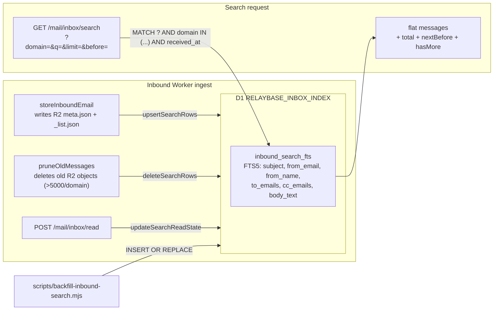

# Server-side inbound search (D1 FTS5)

**Audience:** humans and coding agents changing mail search, list header
counts, Sent pagination, list virtualization, or D1 `RELAYBASE_INBOX_INDEX`.

**Primary code:**

| Area | Paths |
|------|------|
| D1 binding + migration | `server/wrangler.toml` (`RELAYBASE_INBOX_INDEX`), `server/db/inbox-index/migrations/0001_create_inbound_search.sql` |
| Drizzle schema + helper | `server/db/inbox-index/` (`schema.ts`, `search.ts`, `index.ts`) |
| Env type | `server/src/env.ts` (`RELAYBASE_INBOX_INDEX?: D1Database`) |
| FTS5 query builder + sync helpers | `server/src/lib/inbound-search.ts` |
| Sync call sites (ingest / prune / read-state) | `server/src/lib/inbound-store.ts` |
| Counts (`total`/`unread`) from the R2 index | `server/src/lib/inbound-store.ts` (`listInboundEmailsPage`, `listInboundIndexEntries`), `server/src/lib/inbound-counts.ts` |
| Sent pagination + in-memory search | `server/src/lib/sent-store.ts` |
| Desktop routes | `server/src/routes/mail/inbox.ts` (`GET /search`, `GET /counts`, `GET /`), `server/src/routes/mail/sent.ts` |
| API v1 routes | `server/src/routes/v1-inbox.ts` (`GET /messages/search`, `/messages/counts`, `/messages`) |
| Mobile routes (account-scoped) | `server/src/routes/mobile.ts` (`GET /inbox/search`), `server/src/lib/mail/list-inbox.ts` (`searchInboxForDomains`) |
| Backfill script | `server/scripts/backfill-inbound-search.mjs` |
| Client store | `app/src/email/stores/email-mailbox-store.ts` (`searchMail`, `loadMoreSearch`, `clearSearch`, `inboxTotal`/`inboxUnreadTotal`/`sentTotal`) |
| Client search wiring | `app/src/email/components/mailbox/MailListView/MailListView.tsx` (debounce), `app/src/email/components/mailbox/MailListView/useMailListItems.ts` (flat results vs. threaded) |
| List header + virtualization | `app/src/email/components/mailbox/MailListView/MailListPane.tsx` (`react-window` `List`, header counts) |
| Disk cache | `app/src/email/lib/disk/email-disk-store.ts` (`PersistedInboxCache`, `PersistedSentCache`) |

Migration layout and `POST /console/init-db`: **[d1-migrations-and-init-db.md](./d1-migrations-and-init-db.md)**.

Read this before adding a search field, changing the FTS5 schema, changing
how list totals/unread are computed, or touching the virtualized row
component.

---

## Why this exists

Inbound mail bodies live only in per-message R2 `meta.json`. A "search"
that has to open every `meta.json` in a domain to check the body is O(n)
object reads per query — fine for a few hundred messages, unusable at
thousands. `_list.json` (the compact per-domain index used for cursor
pagination) never has body text, so it cannot answer body queries either.

D1 `RELAYBASE_INBOX_INDEX` is an **optional**, best-effort, rebuildable
side index: one FTS5 virtual table synced from R2 writes. R2 stays the
single source of truth. If the D1 binding is missing (customer installs
that opted out) or a sync write fails, nothing about mail delivery,
storage, or read-state breaks — search endpoints return `503` and the
desktop client falls back to local (in-memory, already-loaded) filtering.

Sent mail search does **not** use D1. `sent/{domain}/_list.json` is a single R2 object
per domain that the Worker already loads in full for pagination, so a
plain substring filter over that array (`sentMatchesQuery` in
`sent-store.ts`) is cheap enough without a second index.

---

## Architecture



---

## Schema

`server/db/inbox-index/migrations/0001_create_inbound_search.sql`:

```sql
CREATE VIRTUAL TABLE IF NOT EXISTS inbound_search_fts USING fts5(
  id UNINDEXED,
  domain UNINDEXED,
  subject,
  from_email,
  from_name,
  to_email UNINDEXED,
  to_emails,
  cc_emails,
  recipients UNINDEXED,
  body_text,
  body_preview UNINDEXED,
  received_at UNINDEXED,
  message_id UNINDEXED,
  in_reply_to UNINDEXED,
  refs UNINDEXED,
  size UNINDEXED,
  attachment_count UNINDEXED,
  read_at UNINDEXED
);
```

- **Indexed (searchable):** `subject`, `from_email`, `from_name`,
  `to_emails`, `cc_emails`, `body_text`.
- **`UNINDEXED`:** stored and returned in results, but not matched by
  `MATCH`. This is metadata a search hit needs to render as a list item
  without a second R2 round-trip (`received_at`, `size`,
  `attachment_count`, `read_at`, …).
- **`recipients`** — lowercased `to_email` + `toEmails` + `ccEmails`
  membership, comma-joined. Used only for the mobile account scope filter
  (`(',' || recipients || ',') LIKE '%,{account},%'`), not for full-text
  matching.
- **`refs`** holds the RFC `References` header; the column isn't named
  `references` because that's a SQL reserved word.
- **`body_text`** is capped to `MAX_BODY_TEXT` (100,000 chars) on write —
  full, untruncated bodies still live in R2 `meta.json`.

FTS5 has no primary key / unique constraint, so every "update" is a
delete-by-`id` + insert in the same `db.batch()` call (see
`upsertSearchRows` in `inbound-search.ts`).

Migrations for this database live in `server/db/inbox-index/migrations/`, separate
from `server/db/log/migrations/` (`RELAYBASE_LOGS`) and
`server/db/app/migrations/` (`RELAYBASE_DB`) — never mix migration
directories across D1 databases.

---

## D1 binding setup (operator)

```bash
cd server
wrangler d1 create relaybase-inbox-index
# paste the returned database_id into wrangler.toml's RELAYBASE_INBOX_INDEX entry
wrangler d1 migrations apply relaybase-inbox-index --remote
pnpm run backfill:search   # one-time backfill of existing mail (database_id read from wrangler.toml)
```

`server/wrangler.toml`:

```toml
[[d1_databases]]
binding = "RELAYBASE_INBOX_INDEX"
database_name = "relaybase-inbox-index"
database_id = "<paste after wrangler d1 create>"
migrations_dir = "db/inbox-index/migrations"
```

The binding is **optional** in code (`Env.RELAYBASE_INBOX_INDEX?: D1Database`
in `server/src/env.ts`). Customer-install ZIPs can omit it entirely; the
Worker keeps working, ingest just skips indexing and search endpoints
return `503`.

---

## Sync on write (best-effort, never blocks mail flow)

All three call sites live in `server/src/lib/inbound-store.ts`. Every one
takes an **optional** `searchIndex?: D1Database` parameter and wraps the
D1 call in try/catch + `console.error` — a D1 outage must never fail an
inbound store, a prune sweep, or a mark-read request.

| Trigger | Function | D1 op |
|---------|----------|-------|
| New inbound message stored (`storeInboundEmail`) | `upsertSearchRows(db, [record])` | `DELETE ... WHERE id=?` then `INSERT` (one row) |
| Retention sweep, >5000 messages/domain (`pruneOldMessages`) | `deleteSearchRows(db, staleIds)` | `DELETE ... WHERE id=?` per pruned id |
| Mark read/unread (`setInboundReadState`, called from `POST /mail/inbox/read`) | `updateSearchReadState(db, ids, readAt)` | `UPDATE ... SET read_at=? WHERE id=?` per id |

Callers pass the binding through explicitly — `c.env.RELAYBASE_INBOX_INDEX`
— from every route that touches these functions (`server/src/inbound.ts`
ingest handler, `mail/inbox.ts`, `v1-inbox.ts`, `mobile.ts` /
`lib/mail/list-inbox.ts`). If a route forgets to pass it, that path simply
stops syncing to the index (R2 stays correct; only search goes stale for
messages touched via that path).

---

## Query safety (`buildFtsMatchQuery`)

Never pass raw user input into FTS5 `MATCH` — unescaped quotes or bare
operators (`AND`, `OR`, `NOT`, `NEAR`) break the query syntax or change
its meaning. `server/src/lib/inbound-search.ts`:

```ts
export function buildFtsMatchQuery(raw: string): string | null {
  const tokens = raw
    .trim()
    .split(/\s+/)
    .map((token) => token.replace(/"/g, '""'))
    .filter((token) => /[^\s*]/.test(token));
  if (tokens.length === 0) return null;
  return tokens.map((token) => `"${token}"*`).join(" ");
}
```

Each whitespace-separated token is quoted (embedded `"` doubled per FTS5
string-escaping rules) and given a trailing `*` for prefix matching, e.g.
`hello world` → `"hello"* "world"*`. Space-separated FTS5 phrases are
implicitly ANDed, so a multi-word query requires every token to match
somewhere in an indexed column (not necessarily the same column). A query
that reduces to nothing searchable (empty string, only `*`) returns
`null`, and callers short-circuit to an empty result page rather than
running `MATCH NULL`.

`MIN_SEARCH_QUERY_LENGTH = 2` (desktop/API) and
`MIN_SERVER_SEARCH_LENGTH = 2` (client, `email-mailbox-store.ts`) both
reject 0–1 character queries before hitting D1, since a single letter
would match a huge fraction of any real mailbox.

---

## `searchInboundEmails` — pagination and account scoping

`server/src/lib/inbound-search.ts`. One call does two `db.batch()`
statements (count + page) in a single round trip:

- **Filter:** `inbound_search_fts MATCH ?` AND `domain IN (...)` AND,
  when `account` is set, `(',' || recipients || ',') LIKE '%,{account},%'`
  (used by `/mobile/inbox/search` to scope results to the authenticated
  address's To/Cc membership — desktop/API search is domain-scoped only,
  no account filter).
- **Cursor:** same `{receivedAt}|{id}` shape as the R2 list cursor
  (`before` query param). `ORDER BY received_at DESC, id DESC`; the page
  query fetches `limit + 1` rows to compute `hasMore` without a second
  count query, and `nextBefore` is built from the last row *within* the
  requested `limit`.
- **`total`:** a separate `COUNT(*)` over the same MATCH/domain/account
  filter, ignoring the cursor — this is the total match count, not the
  page size.
- **`rowToMeta`:** deserializes a `SearchRow` back into an
  `InboundEmailMeta`-shaped object for `serializeInboundListItem`. Search
  hits never carry `bodyText`/`bodyHtml` (set to `""`/`null`) — only
  `bodyPreview` — and attachment entries are synthesized placeholders
  (count only, no filename/contentType) since the detail view re-fetches
  real attachment metadata from R2 when a message is opened.

**Known caveat:** `received_at` is `UNINDEXED`, so `ORDER BY received_at
DESC` sorts every matching row per domain in memory inside SQLite. This
is fine at the current retention cap (≤5000 rows/domain) but re-verify if
retention grows.

---

## Endpoints

| Route | Scope | Notes |
|-------|-------|-------|
| `GET /mail/inbox/search?domain=&q=&limit=&before=` | Desktop, admin token | Single domain per call. `400` if `q` < 2 chars, `503` if `RELAYBASE_INBOX_INDEX` unset. |
| `GET /v1/inbox/messages/search?domain=&q=&limit=&before=` | Public API v1, admin token | Same shape as desktop. |
| `GET /mobile/inbox/search?q=&limit=&before=` | Mobile, per-account password auth | Searches every mobile-enabled domain for the caller via `searchInboxForDomains`; always filtered to the authenticated account's `recipients` membership — no cross-account leakage. `503` when the index isn't configured (`searchInboxForDomains` returns `null` in that case, not an exception). |

All three return the same flat shape:

```json
{ "messages": [ /* serializeInboundListItem shape */ ], "total": 123, "nextBefore": "2025-01-01T00:00:00Z|abc123", "hasMore": true }
```

Results are **flat** — never grouped into conversation threads. The
desktop client renders them through the same virtualized list as the
normal inbox/sent views, but bypasses `groupConversations`
(`app/src/email/lib/threading/conversation-threading.ts`) entirely for search mode
(see "Client wiring" below).

Sent search reuses the existing paginated route instead of a dedicated
endpoint: `GET /mail/sent?domain=&q=&limit=&before=` — `q` filters
`listStoredSentPage`'s already-loaded `_list.json` array in memory
(`sentMatchesQuery` over subject/to/cc/from/preview) before applying the
cursor, so `total` reflects the filtered count. `/mobile/sent` stays on
R2 send logs (`sent/_sendlog/*`) and does not support `q`.

---

## Backfill (`server/scripts/backfill-inbound-search.mjs`)

One-time (or re-runnable) script to populate D1 from mail that was
ingested before the index existed, or to rebuild after schema changes.
Talks to the Cloudflare API directly (R2 + D1 REST) rather than going
through the Worker, so it can run standalone with just an API token.

### When to run it

| Situation | Why |
|-----------|-----|
| First time enabling search on an install with existing R2 mail | New inbound mail auto-indexes on ingest, but **messages already in R2 are not retroactively indexed** — search will miss them until backfill runs. |
| After an FTS5 schema migration (`server/db/inbox-index/migrations/000X_*.sql`) | New/changed columns need to be re-populated from R2. |
| After deleting and recreating the D1 database | The index is empty again. |
| After a D1 outage that dropped rows | Re-run is safe (idempotent). |

Without backfill, **new** mail still auto-indexes (see "Sync on write"
above) — only **historical** mail stays unsearchable until the script runs.

### How to run

Preferred entry points (defined in `server/package.json`):

```bash
cd server
pnpm run backfill:search                       # all domains; database_id read from wrangler.toml
pnpm run backfill:search:domain -- wedesk.so  # one domain
pnpm run backfill:search:dry                  # dry-run: counts only, no D1 writes
```

Or invoke the script directly (useful outside `server/`):

```bash
node scripts/backfill-inbound-search.mjs --database-id <uuid>
node scripts/backfill-inbound-search.mjs --database-id <uuid> --domain wedesk.so
node scripts/backfill-inbound-search.mjs --dry-run
```

### `database_id` resolution

The script resolves the D1 database id in this order (first match wins):

1. `--database-id <uuid>` CLI flag
2. `D1_DATABASE_ID` environment variable
3. The `database_id` of the `RELAYBASE_INBOX_INDEX` binding parsed from
   `server/wrangler.toml` (skips placeholder values like
   `REPLACE_WITH_D1_DATABASE_ID`)

So once `wrangler.toml` has the real id pasted in, you can just run
`pnpm run backfill:search` with no flags. The script logs which source it
used (`Database ID source: wrangler.toml`).

### Behavior

- Requires `CLOUDFLARE_API_TOKEN` (or falls back to a local `wrangler`
  OAuth token) and `CLOUDFLARE_ACCOUNT_ID` (defaults to the
  `account_id` parsed from `wrangler.toml`).
- Without `--domain`, auto-discovers every domain by listing R2 prefixes
  under `inbound/`.
- Per domain: loads `_list.json`, then `meta.json` per entry (so
  `body_text` is populated — `_list.json` alone has no body) with
  `CONCURRENCY = 2` parallel fetches (R2 REST 429s at higher
  parallelism; each GET retries with backoff). Missing `meta.json` (rare, e.g. a
  race with a live prune) falls back to indexing just the compact entry.
- Inserts in chunks of `INSERT_CHUNK = 5` rows (18 columns × 5 rows = 90
  bound params, under D1's 100-param limit per statement) and deletes by
  `id` before each insert — safe to re-run or to race against live
  ingest without duplicating rows.
- `MAX_BODY_TEXT = 100_000` matches the cap applied on live ingest in
  `inbound-search.ts`.
- `--dry-run` skips all D1 writes and reports how many rows per domain
  *would* be indexed — useful to sanity-check before a large backfill.
- Per-domain progress is printed to stdout (`{domain}: indexed N/M`)
  and a final summary line (`Done. indexed N message(s).`).

Run once after creating the D1 database and applying migrations, before
relying on search results being complete.

---

## Counts (`total` / `unread`) — not part of D1

Counts are a separate, simpler feature that piggybacks on the R2 list
index and does **not** touch D1:

- `listInboundEmailsPage` (`inbound-store.ts`) already loads the full
  per-domain `_list.json` to build a cursor page, so it also returns
  `total: entries.length` and `unread: entries.filter(e => !e.readAt).length`
  for free — echoed by `GET /mail/inbox`, `GET /v1/inbox/messages`, and
  `GET /mobile/inbox`.
- `listInboundIndexEntries` fetches just the compact index (no body,
  no per-message R2 reads) — used by `GET /mail/inbox/counts`,
  `GET /v1/inbox/messages/counts`, and `/mobile/inbox/counts` via
  `aggregateInboundCounts` (`inbound-counts.ts`) for the sidebar
  per-address unread badge. This replaced an older implementation that
  loaded every `meta.json` per domain.
- `GET /mail/sent` returns `total` from `listStoredSentPage` — the full
  (optionally `q`-filtered) array length, independent of the returned
  page size.
- Client: `EmailMailboxStore.inboxTotal` / `inboxUnreadTotal` /
  `sentTotal` sum `inboxTotalByDomain` / `inboxUnreadByDomain` /
  `sentTotalByDomain` across `enabledDomains`; `inboxCountsForAccount()`
  reads the per-address `/inbox/counts` response for the account-filtered
  header. `refresh()` always calls the counts endpoint even when the mail
  list fetch itself is skipped due to caching, so the header total never
  goes stale just because the list didn't refetch.
- `MailListPane.tsx` renders a header above the toolbar: `Inbox · 1,234
  (3 unread)` / `Sent · 567`, or the search variant (`Searching…` /
  `N results`) when a server search is active.

---

## Client wiring (search)

1. **Debounce** — `MailListView.tsx` debounces the search box 250ms.
   When `folder` is `inbox` or `sent` and the trimmed query is
   `>= MIN_SERVER_SEARCH_LENGTH` (2) chars, it calls
   `store.searchMail(folder, query)`; otherwise (short query, or
   `drafts`/`trash`) it calls `store.clearSearch()`, and local filtering
   in `useMailListItems.ts` takes over unchanged. Folder/account-filter
   changes also call `clearSearch()`.
2. **Store (`email-mailbox-store.ts`)** — `searchMail` fans the query out
   per enabled domain in parallel (`GET /inbox/search` for inbox, the
   existing `fetchSentPage` helper with `q` for sent), merges results,
   and tracks per-domain `searchNextBeforeByDomain`/`searchHasMoreByDomain`
   for pagination. A `searchGeneration` counter discards responses from a
   superseded query (fast typing / folder switch mid-request). Any `503`
   or all-domains-failed response sets `searchUnavailable = true`, which
   makes `searchActiveFor()` return `false` so the UI falls back to local
   filtering instead of showing an empty "no results" state.
3. **`useMailListItems.ts`** — `serverSearch = store.searchActiveFor(folder, search)`
   gates everything: when true, `items` returns the flat, trash/account-filtered
   `searchInboxResults`/`searchSentResults` (`searchItems`) and skips
   `groupConversations` + `threadMatchesSearch` for the inbox case;
   `loadMore()` calls `store.loadMoreSearch()` instead of
   `loadMoreInbox()`/`loadMoreSent()`. Opening a search hit still resolves
   through the normal thread/detail lookup paths (search results are
   included when resolving `detailDomain`).
4. **`MailListPane.tsx`** — search results render through the same
   `react-window` virtualized list as everything else; the header shows
   `Searching…` while `searchLoading`, then `N results` once resolved.

Clearing the query (`clearSearch()`) does **not** refetch anything — it
just drops the search-specific observables so the view reverts to
whatever inbox/sent data was already cached from the normal (non-search)
fetch path.

---

## Rules

- **R2 is authoritative.** D1 is a derived, rebuildable index. Never read
  `bodyText` back from a search hit for anything other than list-row
  rendering — the detail view always loads the real message from R2.
- **All D1 search-index writes are best-effort.** Wrap in try/catch,
  `console.error`, and continue. A D1 outage must never fail an inbound
  store, a prune sweep, or a mark-read request.
- **Never interpolate raw user input into a `MATCH` expression.** Always
  go through `buildFtsMatchQuery`.
- **Migrations for this database live in `server/db/inbox-index/migrations/`
  only.** Do not add rows to `db/app/migrations/` or `db/log/migrations/`.
- **Search results are flat, not threaded.** Do not attempt to run
  `groupConversations` over search results — indexed rows don't carry
  enough Sent-side data to reconstruct a thread reliably. If a hit needs
  to be viewed in-thread, that happens by opening the message ID by the
  normal detail path, not by threading the search page itself.
- **Sent search does not use D1.** Do not add a Sent FTS index unless
  `_list.json` size profiling shows the in-memory filter is a real
  bottleneck.
- **Customer installs must keep working without the binding.** Every
  D1 call site (`inbound-store.ts`, routes) must handle
  `RELAYBASE_INBOX_INDEX` being `undefined`/missing without throwing.

---

## Known gap (closed for compose/API)

Live compose (`/mail/send`), mobile send, and `/v1/send` now upsert into
`sent/{domain}/_list.json`. Broadcasts still write only `sent/_sendlog/*`
(not the mailbox Sent index) so a mass send does not flood the Sent folder.
Takeout import writes the same `_list.json` via `server/scripts/import-mbox.mjs`.

---

## Checklist when changing this area

- [ ] New FTS5-indexed column? Add it to
      `server/db/inbox-index/migrations/000X_*.sql` (new migration file, don't
      edit `0001` in place after it has shipped), `SearchRow` +
      `rowToMeta` in `inbound-search.ts`, `upsertSearchRows`'s
      `INSERT`, and `backfill-inbound-search.mjs`'s insert statement —
      all four must stay in sync.
- [ ] New sync call site touching inbound messages? Thread an optional
      `searchIndex?: D1Database` through and wrap the D1 call in
      try/catch, matching the existing three call sites.
- [ ] New search endpoint or filter? Reject queries below
      `MIN_SEARCH_QUERY_LENGTH` before touching D1, and return `503`
      (not a 500 or empty 200) when the binding is missing.
- [ ] Changed the cursor shape? Keep `{receivedAt}|{id}` consistent
      between the R2 list cursor, the D1 search cursor, and the Sent
      cursor — the client reuses the same `before`/`nextBefore` string
      shape across all three.
- [ ] Ran `wrangler d1 migrations apply relaybase-inbox-index --remote`
      and the backfill script after a schema change, before relying on
      search results being complete.
