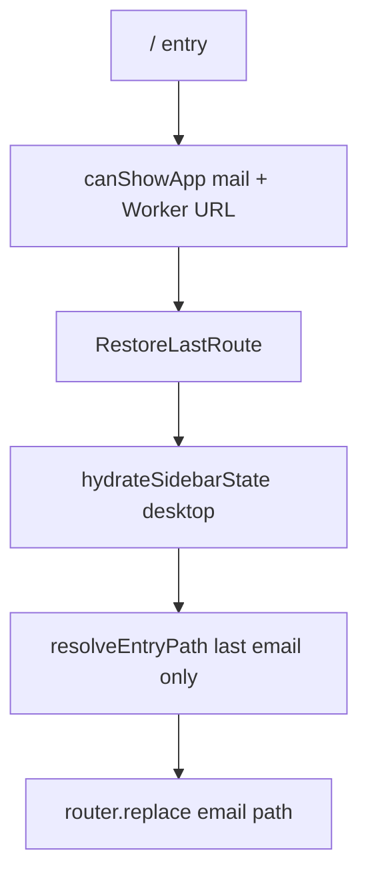

# Last Route Restore (Email / Dashboard)

**Audience:** humans and coding agents changing app entry redirects, sidebar mode switching, or navigation persistence.

**Source of truth:** `app/src/lib/navigation/sidebar-mode.ts`

---

## Purpose

Relaybase remembers the last URL **per sidebar mode** (`email` | `dashboard`). App boot always enters the last **email** path. The last dashboard path is restored only when the user switches to Dashboard (after `ensureConsoleAccess` — silent console refresh, or Touch ID to read the keyring passtoken).

Without entry restore, every open hard-redirected to `/dashboard`, which opened Unlock console when the console token was missing (offline or expired).

---

## Storage

**Desktop source of truth:** `~/.relaybase/mail/desktop/ui/sidebar.json`  
(WebKit / Application Support `localStorage` is only a mirror — do not rely on it across binary renames.)  
Full home-dir contract: [relaybase-home-storage.md](./relaybase-home-storage.md).

Browser / mirror keys (scoped by fixed local operator id `"desktop"`):

| Key pattern | Value |
|-------------|--------|
| `relaybase:sidebar:mode:{userId}` | `"email"` \| `"dashboard"` |
| `relaybase:sidebar:lastPath:email:{userId}` | Full path including query (e.g. `/email/inbox?account=…&m=…`) |
| `relaybase:sidebar:lastPath:dashboard:{userId}` | Full path including query (e.g. `/accounts?email=…`) |
| `relaybase:sidebar-collapsed:{userId}` | `"1"` / `"0"` |

Defaults when nothing is stored:

- Email: `/email/inbox`
- Dashboard: `/dashboard`

---

## API

| Function | Role |
|----------|------|
| `modeFromPathname(pathname)` | Derive mode from URL (`/email…` → email, else dashboard) |
| `readSidebarMode` / `writeSidebarMode` | Persist active mode |
| `readLastPath` / `writeLastPath` | Persist per-mode path (validated) |
| `isRestorablePath(path, mode)` | Reject `/`, auth/setup/api, and cross-mode paths |
| `resolveEntryPath(userId)` | Last **email** path for app entry (ignores `mode` / dashboard last path) |
| `resolveEntryPathAsync(userId)` | Hydrate from `~/.relaybase` then resolve |
| `hydrateSidebarState(userId)` | Disk ↔ localStorage migrate/hydrate |

Only restorable paths are written or returned. Blocked prefixes: `/login`, `/register`, `/setup`, `/api`.

---

## Who writes

`UserSidebar` updates mode and last path whenever `pathname` / search params change:

```text
app/src/components/layout/UserSidebar.tsx
```

---

## Who restores on entry

| Entry point | Behavior |
|-------------|----------|
| `/` (`app/src/app/page.tsx`) | `<RestoreLastRoute userId="desktop" />` — after `canShowApp`, restores last **email** path only. No console unlock / Touch ID on this path. Fail-safe is `/email/inbox`. |
| `/email` (`app/src/app/(shell)/email/page.tsx`) | redirect → `/email/inbox` |

Client gate:

```text
app/src/components/RestoreLastRoute.tsx
```

While resolving, it renders **`AppLoadingScreen`** (same icon + spinner as `BootScreen`) so the boot → restore handoff does not flicker. Do not put a different "Loading…" layout here — [docs/app-loading-screen.md](./app-loading-screen.md).

`RestoreLastRoute` resolves `userId` as: prop → `fallbackUserId` (`"desktop"`). Cookie login is removed.

Packaged Tauri only pre-renders section roots (`/email/inbox`, `/accounts`, …). Deep selection uses query params (`?m=`, `?email=` / `?tab=`). `normalizeEntryPath` rewrites legacy path segments into those query forms before restore.

---

## Flow



Dashboard last path is not used at boot. `UserSidebar.switchMode("dashboard")` calls `ensureConsoleAccess()` and then `readLastPath(..., "dashboard")` when unlocked or when the console gate opens for a **typed** passtoken fallback. Cancelled Touch ID (keyring passtoken not read) and offline stay on mail.
