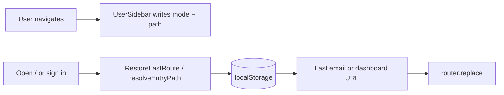

# Last Route Restore (Email / Dashboard)

**Audience:** humans and coding agents changing app entry redirects, sidebar mode switching, or navigation persistence.

**Source of truth:** `app/src/email/sidebar-mode.ts`

---

## Purpose

Relaybase remembers the user’s last **sidebar mode** (`email` | `dashboard`) and the last URL within each mode, then restores that location when they re-enter the app.

Without entry restore, every open/login hard-redirected to `/dashboard`, which also overwrote the stored mode once `UserSidebar` mounted.

---

## Storage (localStorage)

Keys are scoped by `userId` (cookie session id in the browser; `"desktop"` in the Tauri static shell when no cookie is present).

| Key pattern | Value |
|-------------|--------|
| `relaybase:sidebar:mode:{userId}` | `"email"` \| `"dashboard"` |
| `relaybase:sidebar:lastPath:email:{userId}` | Full path including query (e.g. `/email/inbox?account=…`) |
| `relaybase:sidebar:lastPath:dashboard:{userId}` | Full path including query (e.g. `/domains?domain=…`) |

Defaults when nothing is stored:

- Email: `/email/inbox`
- Dashboard: `/dashboard`

---

## API

| Function | Role |
|----------|------|
| `modeFromPathname(pathname)` | Derive mode from URL (`/email…` → email, else dashboard) |
| `readSidebarMode` / `writeSidebarMode` | Persist active mode |
| `readLastPath` / `writeLastPath` | Persist per-mode path (validated) |
| `isRestorablePath(path, mode)` | Reject `/`, auth/setup/api, and cross-mode paths |
| `resolveEntryPath(userId)` | Mode + last path for app entry |

Only restorable paths are written or returned. Blocked prefixes: `/login`, `/register`, `/setup`, `/api`.

---

## Who writes

`UserSidebar` updates mode and last path whenever `pathname` / search params change:

```text
app/src/components/layout/UserSidebar.tsx
```

Sidebar email ↔ dashboard toggles already called `readLastPath` before this entry work; that behavior is unchanged.

---

## Who restores on entry

| Entry point | Behavior |
|-------------|----------|
| `/` (`app/src/app/page.tsx`) | Authenticated → `<RestoreLastRoute />`; else → `/login` |
| Login / register success | `router.replace(resolveEntryPath(id))` |
| Empty panel index (`app/src/app/panel.tsx`) | `resolveEntryPath(userId)` |
| Desktop static home (`build-desktop.mjs` patch) | `<RestoreLastRoute fallbackUserId="desktop" />` |

Client gate:

```text
app/src/components/RestoreLastRoute.tsx
```

Server code cannot read `localStorage`, so entry must use this client component (or an equivalent client `replace`) rather than a server `redirect("/dashboard")`.

`RestoreLastRoute` resolves `userId` as: prop → `relaybase_user` cookie → `fallbackUserId` (`"desktop"`).

---

## Flow



---

## Rules for agents

1. **Do not** hardcode post-auth or home redirects to `/dashboard` (or `/email/inbox`) without going through `resolveEntryPath`.
2. **Reuse** `sidebar-mode.ts` — do not invent a second localStorage scheme for the same purpose.
3. When adding a new app entry (deep link bootstrap, setup completion → app, etc.), restore via `resolveEntryPath` / `RestoreLastRoute` after auth/setup gates.
4. Keep `/setup/*` ahead of restore on desktop until Worker credentials exist (`DesktopDashboardGate`).
5. Path validation belongs in `isRestorablePath`; extend the blocklist there if new non-app routes appear.

---

## Tests

```bash
pnpm --dir app run test:unit
```

Includes `app/src/email/sidebar-mode.test.ts` (`isRestorablePath`, `modeFromPathname`).
