> **ARCHIVED** — pre–console-only bio gate. See [README](./README.md) and
> [../authentication.md](../authentication.md).

# Authentication architecture

**Audience:** humans and coding agents changing owner login, invited (team) login, Worker auth middleware, desktop unlock, or mobile companion auth.

This document is the **map** for authentication across Relaybase. For phase-machine UX details see **[desktop-session-machine.md](./desktop-session-machine.md)**. For secret storage locations see **[storage-architecture.md](./storage-architecture.md)** → *Owner auth* and **[relaybase-home-storage.md](./relaybase-home-storage.md)** → *OS keyring*.

---

## Summary

Relaybase has **four distinct auth surfaces** on the product Worker, plus a separate **Cloudflare OAuth** flow used only for install/recovery infrastructure — not for daily mail access.

| Actor | Credential | Worker routes | Desktop daily unlock |
|-------|------------|---------------|----------------------|
| **Owner** (admin) | Username + **passtoken** → scoped console + mail sessions | `/console/*`, `/mail/*` | Mail: auto-unlock on boot (no bio). Console: Touch ID on dashboard entry |
| **Invited teammate** (desktop) | Per-account **mobile password** | `/mobile/*` (scoped to one email) | Same biometry pattern; password in keyring |
| **Flutter mobile** | Same mobile password as desktop teammate | `/mobile/*` | N/A (password each launch or secure storage) |
| **API integrator** | Product **API key** (`rb-…`) | `/v1/*`, `/v1/send` | N/A |

The desktop app unifies owner and invited entry through one MobX store — **`AppSessionStore`** — and one gate — **`DesktopDashboardGate`**.

---

## Architecture (layers)

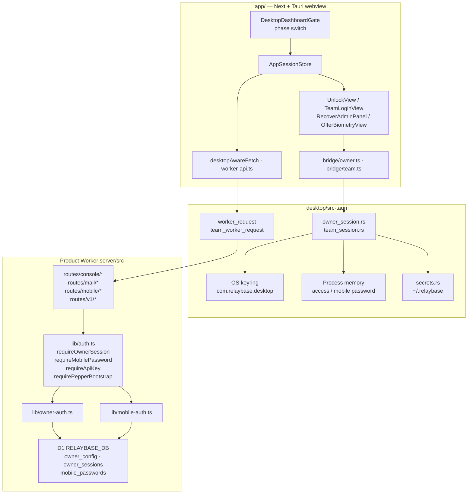

**Rule:** On desktop, **JS never sees** owner access/refresh tokens or the teammate mobile password. Rust attaches Bearer headers in `worker_request` / `team_worker_request`. Browser `pnpm next` uses **`app/src/lib/desktop/auth/owner-session.ts`** (in-memory session only).

---

## Secret storage model

### Owner

| Secret | Where | Lifetime |
|--------|-------|----------|
| Passtoken plaintext | User download only | Until rotated/reset |
| Passtoken hash | D1 `owner_config` (`sha256(AUTH_PEPPER:salt:passtoken)`) | Durable |
| Console refresh token | OS keyring `owner-session` JSON blob | ~14 days, rotates on use |
| Mail refresh token | Same `owner-session` blob (`mailRefreshToken`) | ~90 days, rotates on use; **no biometry** |
| Console access token | Tauri process memory (`owner_session`) | ~10 min, `scope: console` |
| Mail access token | Tauri process memory (`owner_mail_session`) | ~60 min, `scope: mail` |
| `AUTH_PEPPER` | Worker wrangler secret | Install-time; never on disk in app |
| Worker URL | Keyring blob first; `credentials.json` mirror | Durable |

### Invited teammate (desktop)

| Secret | Where | Lifetime |
|--------|-------|----------|
| Mobile password | OS keyring `team-session:{email}` blob | Until owner regenerates on Worker |
| Identity (URL + email) | `~/.relaybase/team-login.json` (no password) | Durable |
| Password in memory | Tauri `TeamMemory` mutex | Process run |

### Mobile (Flutter)

| Secret | Where |
|--------|-------|
| Account email + password | `flutter_secure_storage` |
| Worker URL | Baked into build (`AppConfig.defaultWorkerUrl`) |

See **[mobile-email-companion.md](./mobile-email-companion.md)** for provisioning and scope rules.

---

## File map

### Product Worker (`server/`)

| File | Role |
|------|------|
| `server/src/lib/auth.ts` | Middleware helpers: `requireOwnerSession`, `requirePepperBootstrap`, `requireApiKey` |
| `server/src/lib/owner-auth.ts` | Owner business logic: setup, login, refresh, logout, rotate, reset |
| `server/src/lib/owner-tokens.ts` | Passtoken format, HMAC access tokens, refresh generation |
| `server/src/lib/mobile-auth.ts` | `requireMobilePassword` for `/mobile/*` |
| `server/src/lib/mobile-config.ts` | D1 `mobile_passwords` read/hash/compare |
| `server/src/routes/console/owner-auth.ts` | HTTP: `/console/login`, `/refresh`, `/logout`, `/setup-admin`, `/rotate-passtoken`, `/reset-admin`, `/auth-status` |
| `server/src/routes/console/init-db.ts` | Pepper bootstrap **or** owner session when DB empty / owner exists |
| `server/src/routes/console/migrate-db.ts` | Same auth split as init-db |
| `server/src/routes/console/mailbox.ts` | `GET/POST/DELETE /console/addresses/mobile-password` (owner session) |
| `server/src/routes/mobile.ts` | All `/mobile/*` routes; middleware scopes to one account |
| `server/src/routes/mail/*.ts` | Mail I/O — owner session |
| `server/src/routes/console/*.ts` | Dashboard CRUD — owner session |
| `server/src/routes/v1-inbox.ts`, `send.ts`, `v1-webhooks.ts` | API key auth |
| `server/db/app/owner.ts` | D1 `owner_config` helpers |
| `server/db/app/owner-sessions.ts` | D1 `owner_sessions` (refresh hash only) |
| `server/db/app/schema.ts` | `owner_config`, `owner_sessions`, `mobile_passwords` tables |

### Desktop Tauri (`desktop/src-tauri/`)

| File | Role |
|------|------|
| `owner_session.rs` | Console keyring, login/unlock/logout, path-routing `worker_request`, setup/reset-admin |
| `keyring_store.rs` | OS secret store. macOS: `SecItem` data-protection keychain (signed) or modern login `SecItem` (`tauri dev`) — not the legacy `SecKeychain` API that shows “Always Allow”. One-shot migrate from old `keyring` crate items |
| `owner_mail_session.rs` | Mail access memory; boot `owner_boot_session` |
| `team_session.rs` | Team keyring, login/unlock, legacy migration, `team_worker_request` |
| `secrets.rs` | `credentials.json`, `team-login.json`, CF OAuth in-memory session |
| `lib.rs` | Tauri command surface (`owner_*_cmd`, `team_*_cmd`) |

### App logic (`app/src/`)

| File | Role |
|------|------|
| `lib/desktop/app-session/store.ts` | Phase machine + all unlock/install/recover actions |
| `lib/desktop/app-session/types.ts` | `AppSessionPhase`, `AppSessionDeps` |
| `lib/desktop/app-session/context.tsx` | Boot keyring fetch, 401 listener, DesktopContext wiring |
| `lib/desktop/app-session/defaults.ts` | Default Tauri deps |
| `lib/desktop/app-session/store.test.ts` | Transition tests |
| `lib/desktop/bridge/owner.ts` | JS → Tauri owner commands |
| `lib/desktop/bridge/team.ts` | JS → Tauri team commands |
| `lib/desktop/bridge/worker.ts` | `desktopWorkerRequest` |
| `lib/desktop/auth/owner-session.ts` | Browser-only in-memory owner session |
| `lib/desktop/auth/sign-out.ts` | Sign-out helpers |
| `lib/desktop/auth/unauthorized-grace.ts` | Grace window after passtoken reissue |
| `lib/desktop/api/api-base.ts` | `desktopAwareFetch`, dispatches `relaybase:unauthorized` on 401 |
| `lib/desktop/api/worker-api.ts` | Owner vs team Worker fetch routing |
| `lib/desktop/biometry/` | Touch ID / Windows Hello prompt + dismiss detection |
| `lib/desktop/shell/AppProviders.tsx` | Root `AppSessionProvider` |

### UI components

| File | Phase / use case |
|------|------------------|
| `app/src/app/_shell/DesktopDashboardGate.tsx` | Phase → shell routing |
| `console/components/setup/SessionPhaseScreen.tsx` | Renders phase-specific views on `/` |
| `console/components/setup/BootScreen.tsx` | `boot`, deferred setup redirect |
| `console/components/setup/UnlockView.tsx` | Owner + invited unlock (bio idle / secret form) |
| `console/components/setup/TeamLoginView.tsx` | First-time invited login |
| `console/components/setup/OfferBiometryView.tsx` | One-time biometry opt-in |
| `console/components/setup/RecoverAdminPanel.tsx` | Forgot passtoken → CF OAuth → reset |
| `console/components/setup/SetupCloudflareAuthorizeCard.tsx` | CF OAuth during install |
| `console/components/setup/SetupProgressPanel.tsx` | Install progress |
| `console/pages/accounts/AccountOtherDeviceView.tsx` | Owner provisions mobile password |
| `app/src/app/setup/*` | Install wizard pages (chrome under `/setup`) |
| `app/src/app/login/page.tsx` | Trampoline → `openInvitedLogin()` → `/` |
| `app/src/app/setup/connect/page.tsx` | Trampoline → `openAlreadyInstalled()` → `/` |

### Mobile (Flutter)

| File | Role |
|------|------|
| `mobile/lib/providers/auth_provider.dart` | Login state |
| `mobile/test/auth_provider_test.dart` | Tests |

### Related (not product Worker daily auth)

| File | Role |
|------|------|
| `docs/cf-oauth-install-token.md` | CF OAuth for Worker deploy / install token |
| `kembo/console/src/app/oauth/callback/route.ts` | OAuth callback relay to desktop |
| `app/src/lib/desktop/bridge/oauth.ts` | Desktop PKCE OAuth |

---

## How the pieces connect

### Boot → unlock (desktop)

1. **`AppSessionProvider`** mounts at root layout before any gate.
2. Parallel fetch: **`desktopOwnerSessionStatus()`** + **`desktopTeamSessionStatus()`** + **`DesktopContext.refresh()`** (disk identity).
3. **`AppSessionStore.setStatuses`** → **`reconcileFromStatuses`** picks phase.
4. If keyring secret exists and no in-memory access → **`unlock { mode: "prompting" }`** → **`maybeAutoPrompt()`** → Touch ID → **`owner_unlock`** or **`team_unlock`**.
5. **`DesktopDashboardGate`** switches on `store.phase` — no scattered `hasOwnerSession()` checks.

### API calls after unlock

| Role | JS entry | Rust attach | Worker check |
|------|----------|-------------|--------------|
| Owner | `desktopAwareFetch` → `workerFetch` → `desktopWorkerRequest` | Bearer access from memory | `requireOwnerSession` |
| Invited | `teamWorkerFetch` → `desktopTeamWorkerRequest` | Bearer mobile password + `X-Account-Email` | `requireMobilePassword` |

### 401 handling

1. Worker returns 401 → **`api-base.ts`** fires **`relaybase:unauthorized`**.
2. **`AppSessionStore.handleWorkerUnauthorized()`** re-reads keyring status.
3. If refresh revoked → fall back to secret form; **does not** wipe Worker URL or keyring.

---

## Endpoint auth classification

### Public (no Bearer)

| Endpoint | Purpose |
|----------|---------|
| `GET /health` | Health probe |
| `GET /console/auth-status` | `{ ownerConfigured }` — setup vs login UI |
| `POST /console/login` | Username + passtoken → session (rate-limited) |

### Pepper bootstrap (`X-Auth-Pepper` header = wrangler `AUTH_PEPPER`)

Only while **no owner** is configured (or as documented per route):

| Endpoint | Purpose |
|----------|---------|
| `POST /console/setup-admin` | First owner + issue passtoken once |
| `POST /console/init-db` | Empty D1 migrations |
| `POST /console/migrate-db` | Existing D1 migrations (pre-owner) |

After owner exists, init/migrate require **owner access Bearer** instead.

### Owner session (`Authorization: Bearer <access>`)

HMAC-signed access token (~10 min). Verified by **`requireOwnerSession`** — no D1 read per request except owner-exists check.

| Route group | Examples |
|-------------|----------|
| `/console/*` (management) | domains, addresses, keys, audience, broadcasts, settings, branding, stats, ops-logs, send-logs, rebuild-mail, connect, register-owner |
| `/console/addresses/mobile-password` | Provision teammate mobile password |
| `/console/rotate-passtoken`, `/console/logout` | Session management |
| `/mail/*` | inbox, send, sent, favicon |

Owner auth HTTP handlers (`/console/login`, `/refresh`, etc.) are in **`server/src/routes/console/owner-auth.ts`**.

### Mobile password (`Authorization: Bearer <password>` + `X-Account-Email`)

| Route group | Scope |
|-------------|-------|
| `/mobile/*` | Single authenticated account only |

Used by: Flutter app, desktop invited shell (`team_worker_request`).

### API key (`Authorization: Bearer <api-key>`)

| Route group | Purpose |
|-------------|---------|
| `/v1/inbox/*` | Programmatic inbox |
| `/v1/send` | Send API |
| `/v1/webhooks/*` | Webhook management |

Plaintext keys live in `~/.relaybase/{scopeId}/api-keys.json`; Worker stores hashes only.

### Cloudflare account proof (unauthenticated HTTP; body carries CF token)

| Endpoint | Purpose |
|----------|---------|
| `POST /console/reset-admin` | Forgot passtoken — Cloudflare OAuth access token can GET `/accounts/{CF_ACCOUNT_ID}` |

---

## Use case catalog

Each use case lists **primary files** and a sequence diagram. Phases refer to **`AppSessionPhase`** in **`desktop-session-machine.md`**.

| ID | Use case | Auth mechanism |
|----|----------|----------------|
| O1 | Owner first install | CF OAuth + pepper bootstrap + setup-admin |
| O2 | Owner first login (passtoken) | `/console/login` → keyring |
| O3 | Owner daily biometric unlock | Touch ID → keyring refresh → `/console/refresh` |
| O4 | Owner passtoken fallback | `/console/login` when no keyring / bio dismissed |
| O5 | Owner sign out | Logout + clear memory; keyring may remain |
| O6 | Owner 401 re-prompt | Event → re-unlock without wiping keyring |
| O7 | Owner rotate passtoken | Logged-in owner → new passtoken, all sessions revoked |
| O8 | Owner forgot passtoken | CF OAuth → `/console/reset-admin` |
| T1 | Teammate provision | Owner → `/console/addresses/mobile-password` |
| T2 | Teammate first desktop login | `/mobile/config` verify → keyring |
| T3 | Teammate daily biometric unlock | Touch ID → keyring → memory |
| T4 | Teammate sign out | Clear memory; keyring optional |
| T5 | Flutter mobile login | Secure storage → `/mobile/*` |
| A1 | API key call | `/v1/*` Bearer api key |

---

### O1 — Owner first install

**Goal:** Deploy Worker, init D1, create owner, reveal passtoken once.

**Phases:** `choice` → `install { oauth → progress → createOwner → revealPasstoken }` → `unlock secret`

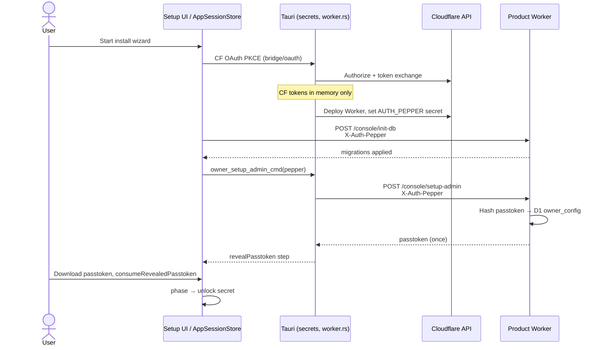

**Key files:** `SetupCloudflareAuthorizeCard.tsx`, `SetupProgressPanel.tsx`, `store.createOwner`, `owner_session.rs` (`owner_setup_admin`), `owner-auth.ts` (`setupOwner`), `init-db.ts`.

---

### O2 — Owner first login (passtoken, no keyring yet)

**Goal:** Exchange passtoken for session; optionally offer biometry.

**Phase:** `unlock { mode: secret }` → optional `offerBiometry` → `ownerReady`

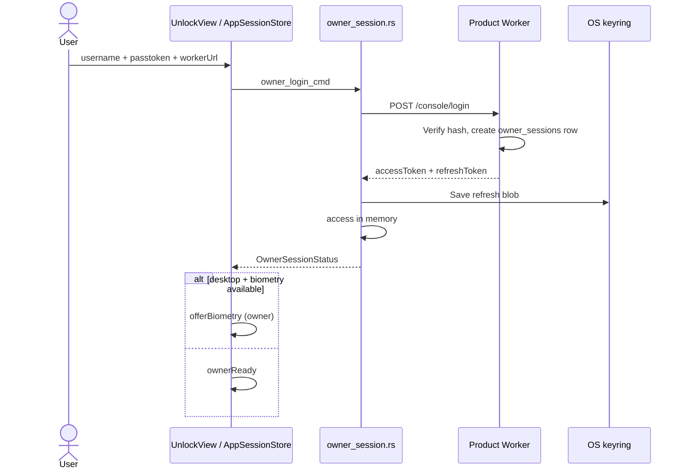

**Key files:** `UnlockView.tsx`, `store.loginWithPasstoken`, `owner-auth.ts` (`loginOwner`).

---

### O3 — Owner daily biometric unlock

**Goal:** Launch app → Touch ID → rotate refresh → enter admin shell.

**Phase:** `boot` → `unlock prompting` → `ownerReady`

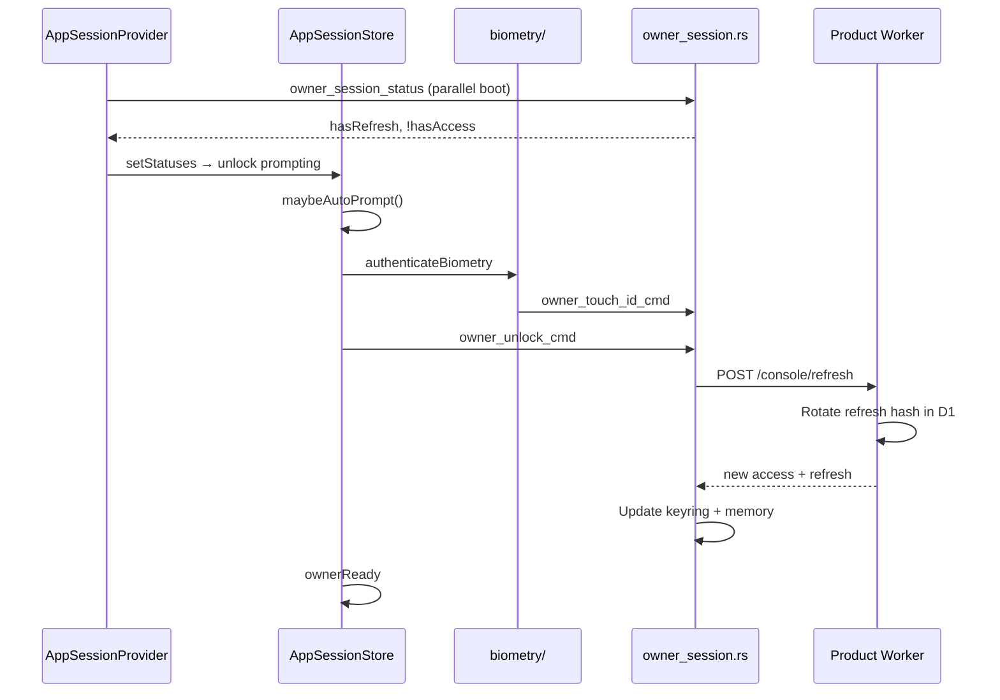

**Key files:** `context.tsx`, `store.promptUnlock`, `owner_session.rs` (`owner_unlock`, `refresh_with_blob`).

---

### O4 — Owner passtoken fallback

**Goal:** User dismisses Touch ID or Linux/unsigned dev — sign in with passtoken again.

**Phase:** `unlock idle` or `unlock secret` → `ownerReady`

Same sequence as **O2**; may re-offer biometry if platform supports it.

---

### O5 — Owner sign out

**Goal:** Lock app; keep keyring if user wants quick re-unlock.

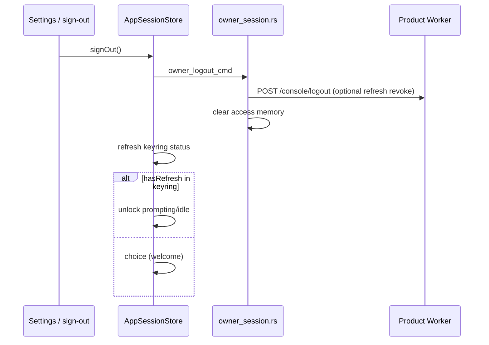

**Key files:** `store.signOut`, `auth/sign-out.ts`, `owner_session.rs` (`owner_logout`).

---

### O6 — Owner 401 re-prompt

**Goal:** Access expired or revoked mid-session — re-unlock in place.

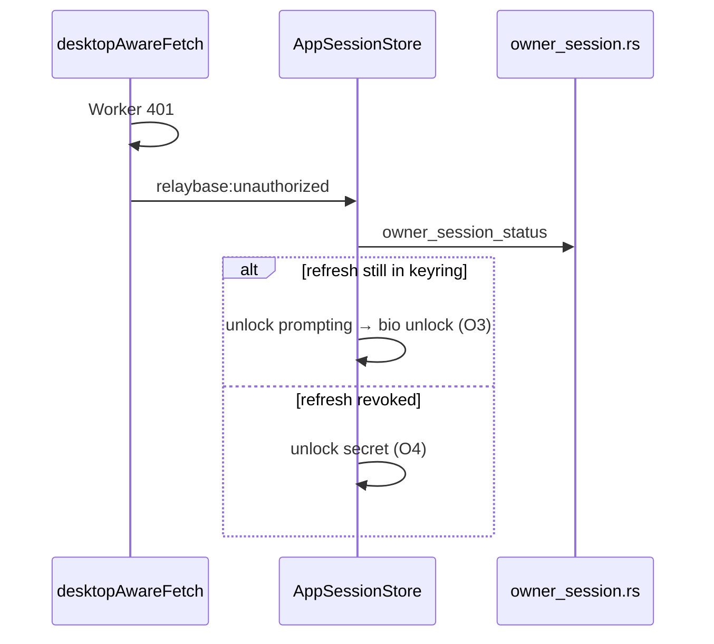

**Key files:** `api-base.ts`, `context.tsx`, `store.handleWorkerUnauthorized`.

---

### O7 — Owner rotate passtoken (logged in)

**Goal:** Issue new passtoken; force all devices to re-login.

```mermaid
sequenceDiagram
  participant UI as Settings
  participant Auth as owner-session.ts (browser) or Tauri
  participant Worker as Product Worker

  UI->>Worker: POST /console/rotate-passtoken<br/>Bearer access
  Worker->>Worker: New passtoken hash, deleteAllOwnerSessions
  Worker-->>UI: passtoken once
  Note over UI: Show once; local session cleared
```

**Key files:** `owner-session.ts` (`ownerRotatePasstoken`), `owner-auth.ts` (`rotatePasstoken`).

---

### O8 — Owner forgot passtoken (reset-admin)

**Goal:** Prove Cloudflare account ownership; re-issue passtoken.

**Phase:** `ownerRecover` → `install revealPasstoken` → `unlock secret`

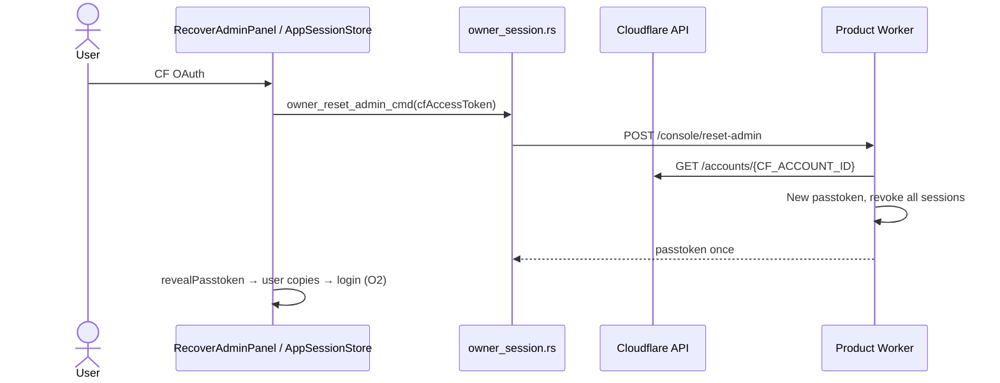

**Key files:** `RecoverAdminPanel.tsx`, `store.recoverOwner`, `owner-auth.ts` (`resetOwner`).

---

### T1 — Teammate mobile password provision

**Goal:** Owner enables mobile access for one mailbox address.

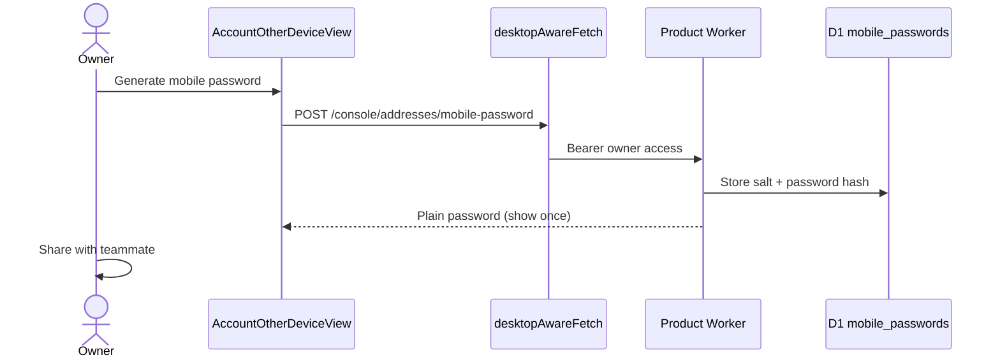

**Key files:** `AccountOtherDeviceView.tsx`, `mailbox.ts`, `mobile-config.ts`.

---

### T2 — Teammate first desktop login

**Goal:** Verify mobile password; store in keyring; offer biometry.

**Phase:** `invitedLogin` → optional `offerBiometry` → `invitedReady`

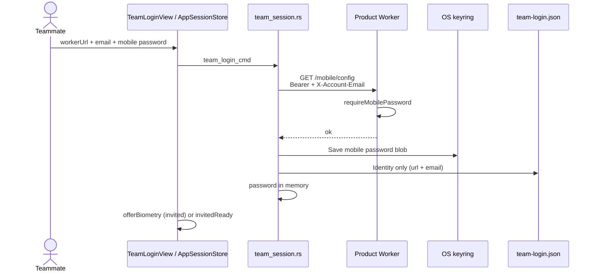

**Key files:** `TeamLoginView.tsx`, `store.loginInvited`, `team_session.rs` (`team_login`).

---

### T3 — Teammate daily biometric unlock

**Goal:** Same as O3 but for team role and static mobile password (no rotation).

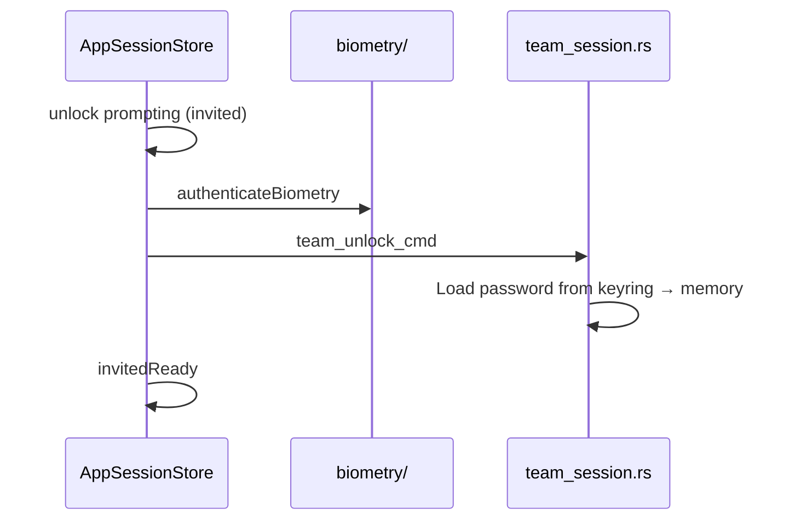

Invited API calls use **`team_worker_request`** → `/mobile/*` only (mailbox-scoped shell).

---

### T4 — Teammate sign out / switch to owner

**Sign out:** `team_logout` → clear memory; if keyring remains → `unlock` or `invitedLogin`.

**Switch to owner:** `switchToOwnerLogin()` → `team_forget_session` + drop `team-login.json` → owner unlock flow (owner keyring untouched).

**Key files:** `UnlockView.tsx`, `store.switchToOwnerLogin`, `store.signOut`.

---

### T5 — Flutter mobile login

**Goal:** Teammate inbox on phone — same Worker auth as desktop invited, no dashboard.

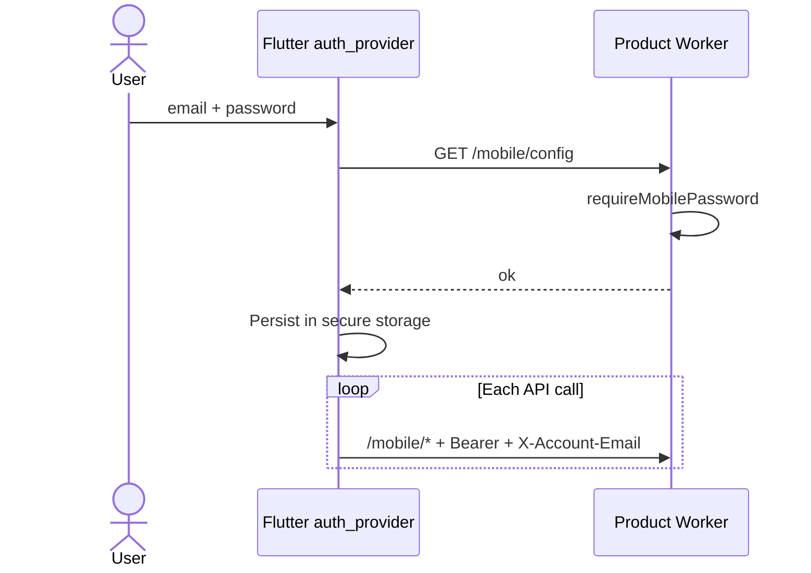

See **[mobile-email-companion.md](./mobile-email-companion.md)**.

---

### A1 — API key authentication

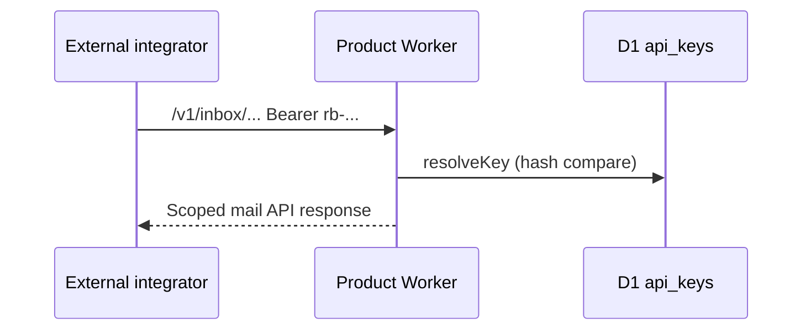

**Key files:** `lib/auth.ts` (`requireApiKey`), `lib/keys.ts`, `routes/v1-inbox.ts`.

---

## Owner vs invited comparison

| | Owner | Invited teammate |
|---|--------|------------------|
| Phase kinds | `ownerReady`, `ownerRecover`, `install` | `invitedLogin`, `invitedReady` |
| Keyring account | `owner-session` | `team-session:{email}` |
| Keyring secret | `refreshToken` (rotates) | `mobilePassword` (static) |
| Unlock command | `owner_unlock_cmd` | `team_unlock_cmd` |
| Worker routes | `/console/*`, `/mail/*` | `/mobile/*` |
| Shell | Full dashboard + mail | Mailbox-only (`teamMode`) |
| Recovery | CF OAuth `/console/reset-admin` | Owner regenerates mobile password |
| First-time auth | Install / passtoken | `/mobile/config` probe |

Both share **`UnlockView`**, **`offerBiometry`**, and the same **`unlock`** phase shape (`role` + `mode`).

---

## D1 schema (auth tables)

```text
owner_config          — singleton: adminUsername, passtokenSalt, passtokenHash, passtokenPrefix, failedAttempts, lockedUntil
owner_sessions        — refresh token SHA-256 hash, family id, label, expiresAt
mobile_passwords      — per account email: salt, passwordHash, mobileEnabled flag on catalog row
```

Access tokens are **not** stored in D1 — HMAC self-contained JWT-like tokens signed with `AUTH_PEPPER`.

---

## Related documentation

| Topic | Doc |
|-------|-----|
| Phase state diagram | [desktop-session-machine.md](./desktop-session-machine.md) |
| Launch race / Touch ID | [desktop-unlock-unresolved.md](./desktop-unlock-unresolved.md) |
| Local file layout | [relaybase-home-storage.md](./relaybase-home-storage.md) |
| Remote storage + owner auth summary | [storage-architecture.md](./storage-architecture.md) |
| CF OAuth install token | [cf-oauth-install-token.md](./cf-oauth-install-token.md) |
| Mobile companion policy | [mobile-email-companion.md](./mobile-email-companion.md) |
| D1 migrations at install | [d1-migrations-and-init-db.md](./d1-migrations-and-init-db.md) |

---

## Agent checklist (changing auth)

1. Read this doc + **desktop-session-machine.md** before touching unlock flow.
2. Never persist passtoken, access, refresh, or mobile password in `~/.relaybase`, cookies, or localStorage.
3. New `/console/*` or `/mail/*` routes → **`requireOwnerSession`**.
4. New `/mobile/*` routes → register under **`mobile.ts`** middleware (inherits `requireMobilePassword`).
5. New desktop entry paths → trampoline through **`AppSessionStore`** actions, not standalone routes that bypass the phase machine.
6. After Worker auth route changes → **`cd server && pnpm run build:bundle`** (see **AGENTS.md**).
