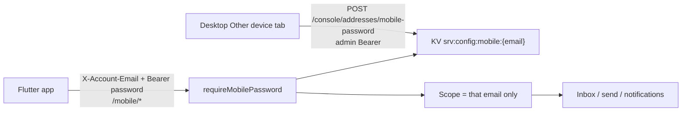

# Mobile email companion — policy

**Audience:** humans and coding agents changing the Flutter app under `mobile/`, Worker `/mobile/*`, desktop Other device / mobile-password UI, or per-account mobile auth.

**Primary code:**

| Area | Path |
|------|------|
| Flutter app | `mobile/lib/**` |
| Worker mobile routes | `server/src/routes/mobile.ts` |
| Mobile password auth | `server/src/lib/mobile-auth.ts`, `server/src/lib/mobile-config.ts` |
| Console password APIs | `server/src/routes/console/mailbox.ts` (`/console/addresses/mobile-password`) |
| Desktop Other device tab | `app/src/console/pages/accounts/AccountOtherDeviceView.tsx` |
| Desktop API helpers / deep link | `app/src/lib/desktop/mobile-config.ts` |
| Desktop → Worker map | `app/src/lib/desktop/email-api-map.ts` (`/api/email/mobile-password`) |
| Address `mobileEnabled` | `server/src/lib/catalog-store.ts`, `app/src/lib/dashboard/accounts-store.ts` |

Setup / run notes: **[mobile/README.md](../mobile/README.md)**.  
Storage map: **[storage-architecture.md](./storage-architecture.md)**.

---

## Product intent

The mobile app is a **team-member email companion**, not a second desktop:

- **Email only** — Inbox / Sent / Drafts / Trash / Compose. No Domains, Audience, Broadcasts, API Keys, or Logs.
- **Gmail-like UX** — hamburger drawer, thread list → thread detail → compose, FAB, swipe actions. No bottom tab bar.
- **iOS first** — Android can share the same code later.
- **Handed to teammates** — each person signs into **one** mailbox address. They must never see or send as another address on the same Worker.

Dashboard / operator work stays on the **desktop** Tauri app.

---

## Non‑negotiable policies

These override older plan drafts (global mobile password, Worker URL login, “all inboxes” for mobile).

| Policy | Rule |
|--------|------|
| **Auth credential** | Per-account mobile password (12-char alphanumeric). **Not** the desktop admin token. **Not** a single global mobile password. |
| **Login fields** | Account email + password only. Users never enter a Worker URL. |
| **Worker URL** | Baked into the Flutter build as `AppConfig.defaultWorkerUrl` (`https://relaybase-api.gssisaac.worker.dev` for the dogfood build; customer builds bake in the customer's own Worker URL). Change the constant + rebuild to retarget. |
| **Account scope** | Every `/mobile/*` request is scoped to the authenticated email only. No full mailbox catalog, no “All inboxes”, no account switcher across other addresses. |
| **Desktop provisioning** | Owner enables the address + generates the password in Accounts → account detail → **Other device**. |
| **Secrets** | Plain password shown once on desktop after generate/regenerate; stored on Worker as salted SHA-256 under `srv:config:mobile:{email}`. Mobile stores email + password in `flutter_secure_storage`. |
| **Dashboard on mobile** | Out of scope. Do not add management UIs to `mobile/`. |

### Forbidden (do not reintroduce)

- Global `srv:config:mobile` / Settings “Mobile access” card that gates all devices with one password.
- Asking the end user for Worker URL on the Connect screen.
- Returning all `mobileEnabled` addresses from `/mobile/mailbox` to a logged-in teammate.
- Putting the admin Bearer token on the phone.
- Building Domains / Audience / Broadcasts into the Flutter app.
- Treating QR pairing as required for sign-in.

---

## Auth model



1. Desktop (admin token) generates or rotates a password for one address via `/console/addresses/mobile-password`.
2. Mobile sends:
   - `Authorization: Bearer {plainPassword}`
   - `X-Account-Email: {email}`
3. Worker loads `srv:config:mobile:{email}`, re-hashes with stored salt, constant-time compares.
4. Middleware sets `mobileAddresses` / `mobileDomains` to **that account only** (still respecting `mobileEnabled !== false` on the catalog row).

Catalog flag `mobileEnabled` (omit/true = allowed, `false` = hidden) is separate from “password set”. Toggle lives on the Other device tab; password generate/clear is the credential.

---

## Desktop provisioning UX

| Surface | Role |
|---------|------|
| Accounts → detail sheet → **Other device** | Toggle `mobileEnabled`, generate / regenerate / clear / copy password, optional pairing QR |
| Settings | **No** global mobile-password card (removed) |

Password format: **12 characters**, human-friendly alphabet (ambiguous `O/0/1/l` omitted). Copy button required next to the one-time reveal.

API map: `/api/email/mobile-password` → `/console/addresses/mobile-password` (`email` query or JSON body).

Optional deep link / QR (convenience only, not required for login):

```text
relaybase://connect?workerUrl=…&email=…&password=…
```

QR may be removed later; Connect screen must keep working with email + password alone.

---

## Worker HTTP surface (`/mobile/*`)

Mounted as a peer to `/v1/*` (mobile-password auth, not admin token).

| Method | Path | Notes |
|--------|------|-------|
| GET | `/mobile/config` | Session check; returns `{ ok, mobile, email }` |
| GET | `/mobile/mailbox` | **Only** the authenticated address |
| GET | `/mobile/inbox` | Scoped to that account’s domain + account filter |
| GET | `/mobile/inbox/counts` | Same scope |
| POST | `/mobile/inbox/read` | Mark read/unread |
| GET | `/mobile/inbox/:id` | Message detail |
| GET | `/mobile/inbox/:id/attachments/:attachmentId` | Attachment |
| GET | `/mobile/sent` | Sent history (send logs; still subject to product rules) |
| POST | `/mobile/send` | `from` must be the authenticated address |
| GET | `/mobile/notifications` | Poll new mail |
| POST | `/mobile/notifications/ack` | Ack events |

Shared mail helpers: `server/src/lib/mail/list-inbox.ts`, `send-message.ts` (also used by `/mail/*`).

Console (admin token):

| Method | Path | Notes |
|--------|------|-------|
| GET | `/console/addresses/mobile-password?email=` | `{ hasPassword, updatedAt }` |
| POST | `/console/addresses/mobile-password` | Body `{ email }` → returns plain password once |
| DELETE | `/console/addresses/mobile-password?email=` | Clears credential |
| PATCH | `/console/addresses` | May set `mobileEnabled` |

Ops log source may include `"mobile"` for mobile-originated sends.

---

## Flutter app policies

| Topic | Policy |
|-------|--------|
| Stack | Riverpod, Hive (JSON strings), `flutter_secure_storage`, `http`, Cupertino-first |
| Connect | Email + password; last email remembered in Hive prefs; Worker URL = `defaultWorkerUrl` |
| After login | `authProvider.state.config` must be set so `isConfigured` becomes true and the shell advances to Inbox |
| Drawer | Single-account header (no expand / no “All inboxes” when only one address) |
| Offline | Hive caches inbox/accounts/drafts; secrets never in Hive |
| Sync | Poll `/mobile/notifications` (no push/APNS in v1) |
| Icons | Sync from desktop via `mobile/scripts/sync-icons.sh` |

### Connect / auth state pitfalls (do not regress)

- Do **not** swap the entire `home` to a loading splash while `auth.loading` is true during sign-in — that remounts `ConnectScreen` and clears inputs. Use `bootstrapped` for first boot only.
- On successful `connect()`, set **`state.config`** on `AuthNotifier` (not only `appConfigProvider`).
- Surface validation errors (empty email/password) and API failures with a dialog; never silent `return`.

---

## KV keys

| Key | Contents |
|-----|----------|
| `srv:config:mobile:{email}` | `{ passwordHash, salt, updatedAt }` — per-account mobile password |
| `srv:catalog:mailbox` | Addresses may include `mobileEnabled: false` |

Legacy global `srv:config:mobile` (no email suffix) is **obsolete**; do not restore it.

---

## Out of scope (for now)

- Push notifications (APNS / FCM)
- Real-time WebSocket sync
- Pixel-perfect Gmail cloning
- Windows / macOS Flutter shells

## Multi-account on one phone

A teammate may store more than one mailbox address on the same device and switch between them from the drawer. Rules:

- Each account keeps its **own** per-account mobile password (`srv:config:mobile:{email}`); nothing is shared across accounts.
- Credentials for every stored account live in `flutter_secure_storage` under `relaybase.managedAccounts` (a JSON list). The active account is also mirrored into the legacy `relaybase.workerUrl` / `relaybase.accountEmail` / `relaybase.mobilePassword` keys so `MobileApiService` can keep reading the active config directly.
- `/mobile/*` is still scoped to the **active** account only. Switching accounts re-applies that account's config and re-scopes all requests — there is never an "All inboxes" view and a teammate never sees another address's mail.
- Offline Hive cache is namespaced per account (`relaybase_threads::<email>`, `…_messages::`, `…_sent::`, `…_drafts::`) so switching accounts never leaks another address's cached mail into the inbox.
- Removing the last stored account signs the user out (returns to the Connect screen).

---

## Checklist when changing mobile

1. Does this leak another address to a teammate? If yes, reject.
2. Does login still work with **email + password only** (no Worker URL field)?
3. Is the password still per-account (`srv:config:mobile:{email}`)?
4. Did you update `email-api-map` / Other device UI if console paths changed?
5. After auth success, does the UI leave Connect and enter the mail shell?
6. Read this doc + [storage-architecture.md](./storage-architecture.md) before adding durable fields.
