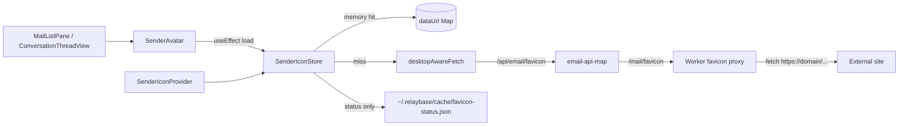

# Sender favicon cache (inbox avatars)

**Audience:** humans and coding agents changing inbox/sent/drafts sender avatars, favicon fetching, or the Worker favicon proxy.

**Primary code:**

| Area | Path |
|------|------|
| Avatar UI | `app/src/email/components/sender/SenderAvatar.tsx` |
| MobX cache store | `app/src/email/stores/sender-icon-store.ts` |
| React context | `app/src/email/components/sender/SenderIconContext.tsx` |
| Provider wiring | `app/src/app/_shell/DesktopDashboardGate.tsx` |
| Account switch clear | `app/src/email/components/mailbox/EmailMailboxContext.tsx` |
| API map | `app/src/lib/desktop/api/email-api-map.ts` (`/api/email/favicon` → `/mail/favicon`) |
| Worker proxy | `../relaybase-worker/src/routes/mail/favicon.ts`, mounted in `../relaybase-worker/src/app.ts` |
| Initials fallback | `app/src/lib/email/format-sender.ts` (`senderInitials`) |
| Persisted status (desktop) | `~/.relaybase/cache/favicon-status.json` via `desktopGetCacheJson` / `desktopSaveCacheJson` |

Related: **[bimi-vmc-do-not-build.md](./bimi-vmc-do-not-build.md)** (do **not** build BIMI/VMC inbox logos), **[relaybase-home-storage.md](./relaybase-home-storage.md)** (local cache layout), **[storage-architecture.md](./storage-architecture.md)** (Worker `/mail/*` routes).

---

## Problem this solves

Before the cache, `SenderAvatar` rendered a plain `/favicon.ico">` in every virtualized mail row. `react-window` unmounts off-screen rows, so scrolling remounted avatars and re-issued image loads. There was no shared in-memory cache, and cross-origin favicons could not be read into JS because of CORS.

The fix: **one fetch per sender domain per session**, image bytes kept in memory as data URLs, with a Worker proxy so the client always receives a readable JSON payload.

---

## Architecture



**Not used:** Gravatar, Google favicon mirrors, BIMI/VMC, R2/KV persistence of image bytes, or mobile Flutter avatars (mobile uses initials + color only — see **[mobile-email-companion.md](./mobile-email-companion.md)**).

---

## Worker favicon proxy

**Route:** `GET /mail/favicon?domain=<domain>`  
**Auth:** admin Bearer token (`requireAdmin`) — same as other `/mail/*` desktop routes.  
**App path:** `/api/email/favicon?domain=…` → mapped by `email-api-map.ts`.

### Behavior

1. Sanitize `domain`: lowercase, must contain `.`, hostname characters only (`a-z0-9.-`), no `..`.
2. Probe in order until one succeeds:
   - `/favicon.ico`
   - `/apple-touch-icon.png`
   - `/favicon.svg`
3. Each probe: `fetch` with 5s timeout, follow redirects, `Accept: image/*`, max **256 KiB** body.
4. Response must look like an image (`Content-Type` starts with `image/`, with `.ico` / `.svg` fallbacks for bad servers).
5. Return JSON:

```json
{ "domain": "example.com", "dataUrl": "data:image/x-icon;base64,..." }
```

When no icon is found: `{ "domain": "example.com", "dataUrl": null }` (HTTP 200).

**Headers:** `Cache-Control: private, max-age=86400` on success and on `dataUrl: null`.

### Why a proxy (not direct ``)

| Approach | Issue |
|----------|--------|
| Direct `https://domain/favicon.ico` in `` | Every row remount can re-fetch; no shared JS cache; CORS blocks reading bytes |
| Google `s2/favicons` mirror | Returns HTTP 200 with a generic globe for missing icons — `onError` never fires |
| Worker proxy → JSON data URL | One fetch per domain; client stores bytes in MobX; definitive absent vs present |

---

## Client — `SenderIconStore`

MobX store (`makeAutoObservable`) scoped by `SenderIconProvider` (one instance per dashboard shell — normal operator and team mode).

### Memory cache (session-only)

| Field | Role |
|-------|------|
| `icons: Map<domain, SenderIconEntry>` | `status` (`loading` \| `ready` \| `error`), `dataUrl`, `lastAccessed` |
| `maxMemoryEntries` | **200** — LRU eviction by `lastAccessed` when exceeded |
| `inFlight: Map<domain, Promise>` | De-dupe concurrent loads for the same domain |

`load(domain)` is safe to call on every `SenderAvatar` mount:

- Memory hit → touch `lastAccessed`, return.
- In-flight → return.
- Otherwise → fetch via `desktopAwareFetch(\`${apiBase}/favicon?domain=…\`)`.

Rendered icons use `` where `dataUrl` is already a `data:…;base64,…` string — **no network on remount** while the entry stays in the Map.

### Persisted status (not image bytes)

Only **ok / failed + timestamp** is written to disk — never the base64 payload.

| Location | Key / path |
|----------|------------|
| Desktop (Tauri) | `~/.relaybase/cache/favicon-status.json` |
| Browser dev | `localStorage` key `relaybase:favicon-status:v1` |

Schema:

```json
{
  "version": 1,
  "domains": {
    "example.com": { "ok": true, "at": 1710000000000 },
    "no-icon.test": { "ok": false, "at": 1710000000000 }
  }
}
```

| Status | Retry policy |
|--------|----------------|
| `ok: false` from a **definitive** proxy response (`dataUrl: null`) | Do not re-fetch for **24 hours** (`FAILED_RETRY_AFTER_MS`) |
| Transient network / 5xx (catch block) | **Not** persisted — retries next `load()` / next session |
| `ok: true` | Memory holds data URL; status on disk avoids redundant proxy calls after restart until memory is cold |

Writes are batched (1s debounce) because many rows resolve favicons at once when a list mounts.

### Account / product switch

`EmailMailboxProvider` calls `senderIconStore.clear()` when `productId` changes (cleanup on switch). This drops **in-memory** images and in-flight requests. Persisted `favicon-status.json` is **kept** — sender domains overlap across products.

---

## UI — `SenderAvatar`

Used in:

- `MailListPane` — inbox (sender + unread dot), sent/drafts/trash (first `to` address)
- `ConversationThreadView` — per-message sender in thread detail

Flow:

1. `senderIconDomain(fromEmail)` — domain part of address; skip bare hosts without `.`.
2. `useEffect` → `store.load(domain)`.
3. `observer` reads `store.getIcon(domain)`.
4. `status === 'ready' && dataUrl` → show favicon; else → two-letter initials (`senderInitials`).

Wrapped in `memo(observer(...))` to limit re-renders when unrelated row props change.

---

## Agent checklist

When changing sender avatars:

1. **Do not** revert to per-row `https://<domain>/favicon.ico` `` loads.
2. **Do not** add Gravatar, favicon mirrors, or BIMI — see **[bimi-vmc-do-not-build.md](./bimi-vmc-do-not-build.md)**.
3. Keep fetch logic in `SenderIconStore` — not scattered in list components.
4. New mail surfaces that show a sender avatar should use `SenderAvatar` (or call `useSenderIconStore().load(domain)` if a custom layout is required).
5. Worker changes stay on `/mail/favicon` with `requireAdmin`; update `email-api-map.ts` if the app path changes.
6. If adding persistence, extend **status only** under `cache/favicon-status.json` — do not write image bytes to `~/.relaybase` or KV/R2.
7. Mobile (`mobile/`) is out of scope — keep initials-only avatars there.

---

## Local verification

```bash
# Worker (from server/)
echo 'AUTH_PEPPER=test-auth-pepper' > .dev.vars
pnpm exec wrangler dev --local --port 8787

# Success
curl -H "Authorization: Bearer test-admin-token" \
  'http://127.0.0.1:8787/mail/favicon?domain=github.com'

# No icon
curl -H "Authorization: Bearer test-admin-token" \
  'http://127.0.0.1:8787/mail/favicon?domain=nonexistent-domain-xyz123.example'
```

In the desktop app: open Inbox, scroll the virtualized list — Network tab should show **one** `/api/email/favicon?domain=…` request per unique sender domain, not one per visible row remount.
