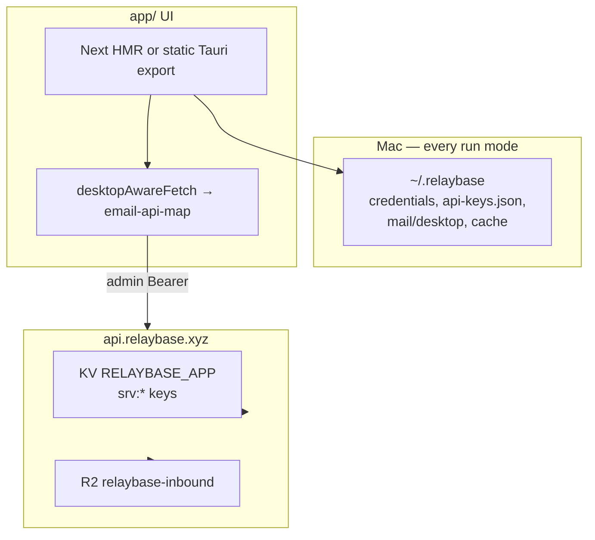

# Storage architecture — Worker KV + `~/.relaybase`

**Audience:** humans and coding agents changing where product data lives, API routing, KV bindings, or desktop persistence.

**Rule:** Relaybase has **two** durable layers. Do not reintroduce Next userdata, cookie multi-tenant stores, or a second Worker KV namespace for app data.

| Layer | Where | Role |
|-------|--------|------|
| **Remote** | Cloudflare Worker `RELAYBASE_APP` KV (+ R2 inbound) | Domains, addresses, audience, broadcasts, API key hashes, send logs, licenses, webhooks |
| **Local** | `~/.relaybase` | Credentials, API key plaintext vault, mail/UI cache, dashboard cache |

Marketing waitlist stays on D1 `RELAYBASE_WAITLIST` (website only) — **out of scope** for this doc.

Local Mac layout and Tauri commands: **[relaybase-home-storage.md](./relaybase-home-storage.md)**.  
Audience/broadcast product rules: **[audience-and-broadcasts.md](./audience-and-broadcasts.md)**.

---

## Architecture



All run modes (`pnpm next`, `tauri dev`, packaged `.app`) use the **same** path: map `/api/email/*` → Worker `/admin/*` via [`app/src/lib/desktop/email-api-map.ts`](../app/src/lib/desktop/email-api-map.ts) and [`desktopAwareFetch`](../app/src/lib/desktop/api-base.ts). There is no Next `/api/email` product store and no cookie `relaybase_user` login.

Local operator id is always `"desktop"` → `~/.relaybase/mail/desktop/`.

---

## Remote — Worker KV `RELAYBASE_APP`

Binding: `server/wrangler.toml` → `RELAYBASE_APP` (single namespace).  
Env type: `server/src/env.ts`.

Every key is prefixed with `srv:` so app/catalog data never collides with other uses of the same namespace.

| Key pattern | Module | Contents |
|-------------|--------|----------|
| `srv:config:admin` | `lib/auth.ts` | Legacy admin token JSON `{ token }` (secret preferred) |
| `srv:config:cloudflare` | `lib/cloudflare-config.ts` | CF account id + API token for Email Sending |
| `srv:catalog:mailbox` | `lib/catalog-store.ts` | `{ domains[], addresses[] }` — each address: `email`, `domain`, optional `displayName`, optional `inboundEnabled` (`false` = CF Email Routing `drop`; omit/true = Worker receive) |
| `srv:catalog:audience` | `lib/catalog-audience.ts` | Flat contacts |
| `srv:catalog:audience-groups` | `lib/catalog-audience.ts` | Groups, dataSource, sync progress/history |
| `srv:catalog:broadcasts` | `lib/catalog-broadcasts.ts` | Drafts + send progress/history |
| `srv:key:{sha256}` / `srv:id:{uuid}` | `lib/keys.ts` | API key records (**hash only**, no plaintext) |
| `srv:license:key:{hash}` / `srv:license:id:{uuid}` | `lib/licenses.ts` | License records |
| `srv:sendlog:_index` / `srv:sendlog:{uuid}` | `lib/send-logs.ts` | Send history (authoritative “sent”) |
| `srv:event:pending:{domain}:{id}` | `lib/inbound-events.ts` | Inbox notification queue |
| `srv:webhook:*` | `lib/webhooks.ts` | Webhook regs / secrets / fail markers |

### Admin HTTP surface (Bearer admin token)

| Route | Purpose |
|-------|---------|
| `/admin/mailbox`, `/admin/domains`, `/admin/addresses` | Catalog mailbox CRUD |
| `/admin/audience-groups` (+ contacts/sync/progress) | Audience |
| `/admin/broadcasts` (+ send/progress) | Broadcasts |
| `/admin/keys` (+ rotate, PATCH active) | API keys |
| `/admin/stats`, `/admin/stats/account-*` | Dashboard stats / per-account |
| `/admin/inbox`, `/admin/send`, … | Mail I/O |

Cron: `server/wrangler.toml` `*/15 * * * *` → `runAudienceCron` in `server/src/index.ts` (single catalog, no per-user fan-out).

### R2 `INBOUND`

```text
inbound/{domain}/{messageId}/meta.json | raw.eml | attachments/…
```

Inbound message body + `readAt` live here. `~/.relaybase/mail/desktop/inbox.json` is cache only.

### Forbidden (do not reintroduce)

- Second KV binding for app data (`KEYS`, `RELAYBASE_API` on the mail Worker)
- Unprefixed legacy keys (`config:mailbox`, bare `id:`, `key:`) — use `srv:` + migration script `server/scripts/migrate-kv-prefix.mjs`
- Next `userdata:{userId}` / `data/users/*.json` / `DevUserEmailData`
- Hosted OpenNext `app.relaybase.xyz` as a product API (removed)
- Cookie multi-tenant sessions for the Mac product

Customer install template: one KV `relaybase-app` bound as `RELAYBASE_APP` — see `server/customer-install/`.

---

## Local — `~/.relaybase`

See **[relaybase-home-storage.md](./relaybase-home-storage.md)** for the full tree and Tauri commands.

Highlights for the consolidated model:

| Path | Purpose |
|------|---------|
| `credentials.json` | Worker URL + admin token (+ CF account fields) |
| `api-keys.json` | Plaintext API secrets (Worker has hashes only) |
| `email.json` | Account colors |
| `mail/desktop/**` | Mail + UI cache; fixed userId |
| `cache/dashboard/**` | Dashboard + TTL API caches |

Browser `pnpm next` (no Tauri): credentials via `/api/local-credentials` reading the same `credentials.json`. Still not a second product database.

`localStorage` = hydrate mirror only.

---

## Client mapping checklist

When adding a dashboard/email feature that needs durable remote data:

1. Persist in Worker under `srv:catalog:*` or an existing `srv:` family — **not** under `app/` FS/KV.
2. Expose `/admin/…` with `requireAdmin` + CORS (`server/src/lib/cors.ts`).
3. Map `/api/email/…` → that route in `email-api-map.ts`.
4. Call through `desktopAwareFetch` / `readResponseJson` — never raw `fetch` to Next `/api/email` in the UI.
5. Cache on disk under `~/.relaybase/cache/…` if the UI needs offline/stale-while-revalidate.

When adding local-only UX state (sidebar, enabled accounts, drafts cache): use `~/.relaybase` Tauri facades — see home-storage doc.

---

## Data → source of truth

| Concern | Source of truth | Local cache |
|---------|-----------------|-------------|
| Worker connection | `~/.relaybase/credentials.json` | window globals |
| Domains / addresses | `srv:catalog:mailbox` | `cache/dashboard/addresses-*` |
| Enabled mail accounts | `mail/desktop/ui/enabled-accounts.json` | localStorage mirror |
| Accounts domain card expand | `mail/desktop/ui/accounts.json` | localStorage mirror |
| Inbox / unread | R2 `meta.json` (`readAt`) | `mail/desktop/inbox.json`, `ui/read.json` |
| Audience / broadcasts | `srv:catalog:audience*` / `broadcasts` | — |
| Sent history | `srv:sendlog:*` | mail sent JSON optional |
| API key existence | `srv:id:` / `srv:key:` | `cache/dashboard/api-keys-*` |
| API key plaintext | `~/.relaybase/api-keys.json` | — |
| Waitlist | D1 `RELAYBASE_WAITLIST` (website) | — |

---

## Agent checklist

1. Do **not** add `DevUser*` / `userdata:` / repo `data/users` for product state.
2. Do **not** add a new Cloudflare KV binding beside `RELAYBASE_APP` for the mail Worker (waitlist D1 excluded).
3. New KV keys must start with `srv:` (or live under `srv:catalog:` for catalog blobs).
4. Packaged and `next`/Tauri must share one fetch path — no `isPackagedDesktopShell`-only product API.
5. Plaintext secrets that the Worker cannot store → `~/.relaybase` only (`credentials.json`, `api-keys.json`).
