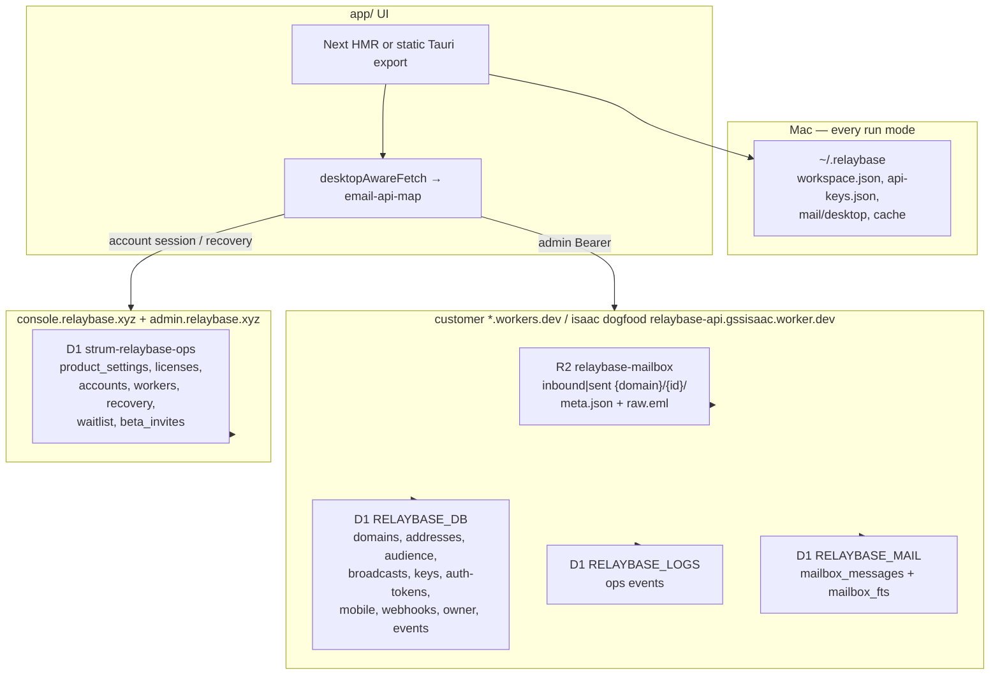

# Storage architecture — D1 + R2 + `~/.relaybase`

**Audience:** humans and coding agents changing where product data lives, API routing, D1/R2 bindings, or desktop persistence.

**Rule:** Relaybase has **two** durable layers. Do not reintroduce Next userdata, cookie multi-tenant stores, or a Cloudflare KV binding on the product Worker. The product Worker's durable product state lives in D1 `relaybase-db` (binding `RELAYBASE_DB`).

| Layer | Where | Role |
|-------|--------|------|
| **Remote** | D1 `RELAYBASE_DB` (binding in `../relaybase-worker/wrangler.toml`; Drizzle in `../relaybase-worker/db/app/`) | All durable product state: `domains`, `addresses`, `audience_groups`, `audience_contacts`, `broadcasts`, `domain_branding`, `api_keys`, `mobile_passwords`, `webhooks` / `webhook_secrets` / `webhook_fails`, `owner_config` (passtoken hash), `owner_sessions`, `app_settings` (product options such as inbound retain-per-domain), `inbound_events` (TTL replaced by `expires_at`). See **[audience-and-broadcasts.md](./audience-and-broadcasts.md)**. |
| **Remote** | Product Worker R2 `relaybase-mailbox` (binding `INBOUND`) | Mail atoms: `inbound/{domain}/{id}/` and `sent/{domain}/{id}/` (thin `meta.json` + `raw.eml` + attachments) and send logs (`sent/_sendlog/{id}.json`, no `_index.json`). R2 is the source of truth. See **[mailbox-r2.md](./mailbox-r2.md)**. |
| **Remote** | D1 `RELAYBASE_LOGS` (hosted only) | Product ops-event log: compose, API, broadcast sends and inbound bounces. R2 `sent/_sendlog/*` remains authoritative for send history. Drizzle schema/helper: `../relaybase-worker/db/log/`. |
| **Remote** | D1 `RELAYBASE_MAIL` | Unified mail index: `mailbox_messages` (list/count/cursor, inbound **and** sent) + `mailbox_fts` (FTS5 search). Derived from R2 thin `meta.json` + `raw.eml`; fully rebuildable via `POST /console/rebuild-mail`. Drizzle schema/helper: `../relaybase-worker/db/mail/`. See **[mailbox-d1.md](./mailbox-d1.md)**. **Replaces** the old `RELAYBASE_INBOX_INDEX` / `inbound_search_fts`. |
| **Remote** | D1 `strum-relaybase-ops` (binding `DB` on `strum-relaybase-admin` + `strum-relaybase-console` + `strum-relaybase-website`) | Shared HQ store: `product_settings` (optional operator `workerUrl` only), `licenses`, `accounts`, `account_workers`, `account_recovery`, `waitlist`, `beta_invites`. See **[hq-ops-d1.md](./hq-ops-d1.md)**. |
| **Local** | `~/.relaybase` | Workspace config (`workspace.json`), API key plaintext vault (`api-keys.json`), mail/UI cache, dashboard cache, team login |

Account, license, billing, and recovery live on the central `console.relaybase.xyz` Next.js app (OpenNext on Cloudflare Workers), **not** on the product Worker. The product Worker no longer serves `/v1/license/*` or `/v1/waitlist` — those moved to the console.

Local Mac layout and Tauri commands: **[relaybase-home-storage.md](./relaybase-home-storage.md)**.  
Audience/broadcast product rules: **[audience-and-broadcasts.md](./audience-and-broadcasts.md)**.

---

## Architecture



All run modes (`pnpm next`, `tauri dev`, packaged `.app`) use the **same** product path: map `/api/email/*` → product Worker `/console/*` (management) and `/mail/*` (mail operations) via [`app/src/lib/desktop/api/email-api-map.ts`](../app/src/lib/desktop/api/email-api-map.ts) and [`desktopAwareFetch`](../app/src/lib/desktop/api/api-base.ts). Account/license/billing calls go to `console.relaybase.xyz` (`/api/v1/account`, `/api/v1/license`, `/api/v1/billing`). There is no Next `/api/email` product store and no cookie `relaybase_user` login.

Local operator id is always `"desktop"` → `~/.relaybase/mail/desktop/`.

---

## Remote — D1 `RELAYBASE_DB` (durable product state)

Binding: `../relaybase-worker/wrangler.toml` → `RELAYBASE_DB` (database `relaybase-db`).  
Env type: `../relaybase-worker/src/env.ts`.  
Drizzle schema + helpers: `../relaybase-worker/db/app/` (`schema.ts`, `index.ts`, and one helper per table: `mailbox.ts`, `audience.ts`, `broadcasts.ts`, `keys.ts`, `auth-tokens.ts`, `branding.ts`, `mobile.ts`, `webhooks.ts`, `owner.ts`, `settings.ts`, `inbound-events.ts`).  
Migrations: `../relaybase-worker/db/app/migrations/` — applied by the Worker via **`POST /console/init-db`** (empty D1 only) or **`POST /console/migrate-db`** (existing D1 / Worker update). The desktop never runs SQL. Ledger + baseline catch-up policy: **[d1-migrations-and-init-db.md](./d1-migrations-and-init-db.md)**.

This is the **sole source of truth** for product catalog state. No KV binding on the product Worker.

### Owner auth

The desktop **god token is retired**. Owner auth is now a **Worker-issued passtoken + session** model — the customer `worker.js` is the authentication authority for its own resources.

- The Worker issues a **random passtoken** (`rb_pass_…`, API-key-style) once. The plaintext is shown **once** and the user downloads it; the Worker stores only `sha256(AUTH_PEPPER || salt || passtoken)`.
- After first enrollment the desktop **stores the passtoken in the OS keyring** (`owner-passtoken`). The app **never writes** the passtoken, access, or refresh tokens to `~/.relaybase`, cookies, localStorage, or sessionStorage. The download is a backup / other-Mac copy — not the daily input surface.
- Desktop session storage: **dual refresh** in OS keyring `owner-session` (`mailRefreshToken` ~90d, console `refreshToken` ~30m); **passtoken** in a **separate** `owner-passtoken` item; **split access** in Tauri memory (mail ~60m, console ~30m). Mail boot is **silent** (`owner_boot_mail`). Touch ID / Windows Hello **only** decides whether Rust may **read** `owner-passtoken` for a new `/console/login`. Valid scoped refresh unlocks silently — no Touch ID. Typed passtoken is first-login and bio-fail / decline only. Teammate desktop unlock is silent from keyring — no biometry. Linux / unsigned `tauri dev` read `owner-passtoken` without a prompt if the item exists. JS never sees tokens — Rust `worker_request` picks scope by path prefix.
- `POST /console/login` returns mail + console refresh tokens and mail access immediately; console access is minted at gate time via scoped refresh.
- All `/console/*` routes require **console-scoped** access; `/mail/*` require **mail-scoped** access (`requireOwnerSession(c, scope)`).
- Lost passtoken: `POST /console/reset-admin` proves a Cloudflare OAuth access token can list Secrets Store on the pinned CF account (env `CF_ACCOUNT_ID`, D1 `owner_config.cf_account_id`, body `cfAccountId`, or `GET /accounts`), then re-issues a passtoken once (download + write `owner-passtoken`) and revokes all sessions. No console email, no central god token. Worker `CF_ACCOUNT_ID` is optional.
- `AUTH_PEPPER` (random, set once at install) replaces the retired `ADMIN_TOKEN` wrangler secret. The product baseline schema has no `owner_config.admin_token`, `auth_tokens`, or dashboard god tokens.
- **Install/Reinstall passtoken guarantee**: When creating or reinstalling a Worker via Setup, `POST /console/setup-admin` verified with `AUTH_PEPPER` always overwrites any existing owner in D1 and issues a fresh passtoken without throwing `OWNER_ALREADY_CONFIGURED`, guaranteeing recovery even from broken/legacy workers.

The desktop **unlock flow** — silent mail boot, keyring passtoken + Touch ID
as the read-gate, owner/invited phase machine, team keyring, scoped 401 — is
documented in **[desktop-session-machine.md](./desktop-session-machine.md)**
and **[authentication.md](./authentication.md)** → *Owner passtoken in the
keyring*.
Invited (team) mobile passwords live in the OS keyring
(`team-session:{email}`), mirroring the owner keyring; see
**[relaybase-home-storage.md](./relaybase-home-storage.md)** → *OS keyring*.

Mobile passwords (`/mobile/*`) and product API keys (`/v1/*`, `~/.relaybase/{scopeId}/api-keys.json`) are unchanged and separate from the owner passtoken.

### What stays in R2 (source of truth for mail atoms)

- Mail atoms (`inbound/{domain}/{id}/` and `sent/{domain}/{id}/`: thin `meta.json` + `raw.eml` + attachments) — see **[mailbox-r2.md](./mailbox-r2.md)**.
- Send logs (`sent/_sendlog/{id}.json`, no `_index.json`) — authoritative for Account Logs and admin send-log reads.

### HTTP surface (Bearer owner access token)

The product Worker manages domains / inbox routing / DNS with wrangler secret `CF_API_TOKEN` (set after install). `CF_ACCOUNT_ID` is **optional** — not required for mail API readiness. Listing, importing, and resolving zones uses only the pinned account (caller `accountId` → env → D1). Other Cloudflare accounts on the same token are never listed. Policy: **[cf-oauth-install-token.md](./cf-oauth-install-token.md)** → *Worker CF_ACCOUNT_ID*. Owner auth uses `AUTH_PEPPER` (passtoken hashing + access-token HMAC) — see **Owner auth** above. The Worker exposes:

| Route | Purpose |
|-------|---------|
| `/console/mailbox`, `/console/domains`, `/console/addresses` | Catalog mailbox CRUD |
| `/console/zones` | List Cloudflare zones on the pinned account via Worker `CF_API_TOKEN` (Domains → Refresh). |
| `/console/audience-groups` (+ contacts/sync/progress) | Audience |
| `/console/broadcasts` (+ send/progress) | Broadcasts |
| `/console/keys` (+ rotate, PATCH active) | API keys |
| `/console/ops-logs` | Ops event log (D1 `RELAYBASE_LOGS`) |
| `/console/send-logs` | Send history read from R2 `sent/_sendlog/*` (admin Logs page / Sent tab) |
| `/console/rebuild-mail` | One-time backfill: thin inbound metas, materialize sent folders, fill `mailbox_messages` + `mailbox_fts`, delete legacy array JSON keys |
| `/console/mailbox-health` | Per-domain last inbound/sent freshness + stale flag (D1 `RELAYBASE_MAIL`) |
| `/console/settings` (GET / PUT) | Product options in D1 `app_settings` (inbound retain-per-domain; `null` = unlimited) |
| `/console/branding` (GET status / PUT merge / POST apply DNS) | Per-domain DMARC config in D1 `domain_branding` + DMARC TXT via the Worker's Cloudflare client |
| `/console/connect` | Desktop self-install probe (owner access token) |
| `/console/register-owner` | Record the console account that owns this Worker (owner session) |
| `/console/setup-admin` | Owner setup / reinstall: issue passtoken once (AUTH_PEPPER bootstrap) |
| `/console/login` / `/console/refresh` / `/console/logout` | Owner session create / rotate / revoke |
| `/console/rotate-passtoken` | Re-issue passtoken once (owner session); revokes all sessions |
| `/console/reset-admin` | Re-issue passtoken once via CF OAuth (Secrets Store on the pinned CF account — env, D1 `owner_config.cf_account_id`, or `GET /accounts`) |
| `/console/auth-status` | Public probe: is an owner configured yet? |
| `/console/stats`, `/console/stats/account-*` | Dashboard stats / per-account |
| `/console/addresses/mobile-password` | Per-account mobile password (owner session) |
| `/mail/inbox`, `/mail/send`, `/mail/favicon`, … | Mail I/O (desktop / owner access token). Favicon proxy: **[sender-favicon-cache.md](./sender-favicon-cache.md)** |
| `/mobile/*` | Flutter companion + desktop team-user login (mobile-password auth; single-account scope) — **[mobile-email-companion.md](./mobile-email-companion.md)** |

Account / license / billing are on `console.relaybase.xyz` (`/api/v1/account`, `/api/v1/license`, `/api/v1/billing`), not on the product Worker. The console no longer holds or verifies an admin token.

Cron: `../relaybase-worker/wrangler.toml` `*/15 * * * *` → `runAudienceCron` + `runInboundIndexCron` in `../relaybase-worker/src/index.ts` (index reconcile + optional inbound prune; single catalog, no per-user fan-out).

### R2 `INBOUND` (bucket `relaybase-mailbox`)

Bucket name, key prefixes, send-log move, and copy scripts: **[mailbox-r2.md](./mailbox-r2.md)**.

```text
inbound/{domain}/{id}/meta.json | raw.eml | attachments/{aid}-{name}
inbound/{domain}/by-message-id/{encodedMessageId}     # pointer → id

sent/{domain}/{id}/meta.json | raw.eml | attachments/{aid}-{name}
sent/{domain}/by-message-id/{encodedMessageId}

sent/_sendlog/{uuid}.json                            # no _index.json
```

R2 holds **one folder per mail**. `meta.json` is THIN (headers + `bodyPreview` ≤500 chars + attachments + `readAt`/`occurredAt` + `hasText`/`hasHtml`); it **never** contains `bodyText`/`bodyHtml` — detail APIs parse `raw.eml` on demand. There is **no per-domain array JSON** (`_list.json` / `_sent.json`) anymore — list/counts/search come from D1 `RELAYBASE_MAIL`. Message-ID dedupe uses the single-key `by-message-id/{id}` pointer (no full-domain scan). Inbound retention is optional (`app_settings.inbound_retain_per_domain`; default unlimited). When set, cron prunes oldest inbound per domain in batches. Sent is not auto-pruned. `~/.relaybase/mail/desktop/inbox.json` is cache only.

`sent/{domain}/{id}/` is the per-message stored-sent atom (compose, API send). Historical sent imported from legacy `_list.json` has no `raw.eml` (preview-only). Operational send history (ok/fail, API key, bounce) lives at `sent/_sendlog/*` and is read by `/console/send-logs`. The Worker binding name stays `INBOUND`; the Cloudflare bucket is `relaybase-mailbox`.

`RELAYBASE_LOGS`.`ops_log` (`lib/ops-logs.ts`) is the dashboard Log page event stream (compose/API/broadcast sends + inbound bounces).

### D1 `RELAYBASE_MAIL` (mail index — list / counts / search)

Binding `RELAYBASE_MAIL` (database `relaybase-mail`), Drizzle in `../relaybase-worker/db/mail/`. Two tables: `mailbox_messages` (list/count/cursor, inbound **and** sent) and `mailbox_fts` (FTS5 over subject/from/to/cc/body). Derived from R2 thin `meta.json` + `raw.eml`; synced best-effort on ingest/prune/read-state and fully rebuildable via `POST /console/rebuild-mail`. Queried by `GET /mail/inbox`, `/mail/inbox/counts`, `/mail/inbox/search`, `/mail/sent`, `/v1/inbox/messages*`, and `/mobile/inbox*` (account-scoped via the `recipients` column). Without the binding those endpoints return **503** (no silent `_list.json` fallback).

Full design (schema, query safety, sync model, backfill, freshness): **[mailbox-d1.md](./mailbox-d1.md)**. R2 layout: **[mailbox-r2.md](./mailbox-r2.md)**.

### Forbidden (do not reintroduce)

- Cloudflare KV binding on the product Worker for app data
- Cloudflare credentials (`CF_API_TOKEN` / optional `CF_ACCOUNT_ID`) stored in HQ ops — the Worker reads `CF_API_TOKEN` from wrangler secrets; D1 `strum-relaybase-ops` `product_settings` holds only an optional `workerUrl`
- End-user dashboard auth tokens (`rb-auth-…`) or plaintext API keys stored in `strum-relaybase-ops` — owner sessions live in the product Worker's D1 `owner_sessions` (hash-only); plaintext API keys live only in `~/.relaybase/{scopeId}/api-keys.json`
- Global mobile password (no per-account row) — use the per-account row in D1 `mobile_passwords` only
- Next `userdata:{userId}` / `data/users/*.json` / `DevUserEmailData`
- Hosted OpenNext `app.relaybase.xyz` as a product API (removed)
- Cookie multi-tenant sessions for the Mac product

Customer install template: three D1 databases (`relaybase-db`, `relaybase-logs`, `relaybase-mail`) bound as `RELAYBASE_DB` / `RELAYBASE_LOGS` / `RELAYBASE_MAIL` — no KV. See `../relaybase-worker/customer-install/`.

---

## Remote — D1 `strum-relaybase-ops` (console + admin)

Binding: `DB` on `hq/console/wrangler.jsonc`, `hq/admin/wrangler.jsonc`, and `hq/website/wrangler.jsonc` (database `strum-relaybase-ops`). Drizzle schema: `hq/console/src/db/schema.ts`. Full rules: **[hq-ops-d1.md](./hq-ops-d1.md)**.

Operator config lives in `product_settings` (`service_id=relaybase`, `filename=settings.json`):

| Field | Purpose |
|-------|---------|
| `workerUrl` | Optional product Worker URL for display / public `/health`. HQ does not call `/console/*` with a stored credential. |

Licenses, console accounts, worker registration, recovery tokens, the legacy waitlist, and public beta invites (`beta_invites`) are the other tables in the same database. The marketing site Worker reads/writes `beta_invites` only. HQ ops is D1 `strum-relaybase-ops` only — no KV.

Cloudflare credentials, DMARC branding, and send logs are **not** stored here:

- CF credentials → Worker wrangler secret `CF_API_TOKEN` (required for domain / routing / DNS). `CF_ACCOUNT_ID` is optional. The install token is obtained via Cloudflare OAuth (PKCE; callback on `console.relaybase.xyz`); the `refresh_token` lives in the OS Keyring (`cf-oauth-install`) for silent background updates, while short-lived `access_token` lives in Tauri process memory only, never in `workspace.json`. See **[cf-oauth-install-token.md](./cf-oauth-install-token.md)**.
- DMARC branding → Worker D1 `domain_branding` via `/console/branding`.
- Send logs → Worker R2 `sent/_sendlog/*` via `/console/send-logs`.

Legacy settings fields (`workerScriptName`, `cloudflareAccountId`, `cloudflareApiToken`, …) are still read for migration but never written back.

---

## Local — `~/.relaybase`

See **[relaybase-home-storage.md](./relaybase-home-storage.md)** for the full tree and Tauri commands.

Highlights for the consolidated model:

| Path | Purpose |
|------|---------|
| `workspace.json` | Workspace config: Worker URL, CF account id, Worker script/version. Optional console login fields (`relaybaseAccountId` / `Email` / `Session`) when signed in. No passtoken, admin token, or API tokens. (Older builds used `credentials.json`; first load rewrites.) |
| `api-keys.json` | Plaintext API secrets (Worker has hashes only) |
| `email.json` | Account colors |
| `mail/desktop/**` | Mail + UI cache; fixed userId |
| `cache/dashboard/**` | Dashboard + TTL API caches |

Browser `pnpm next` (no Tauri): workspace via `/api/local-credentials` reading the same `workspace.json`. Still not a second product database.

`localStorage` = hydrate mirror only.

---

## Client mapping checklist

When adding a dashboard/email feature that needs durable remote data:

1. Persist in D1 `RELAYBASE_DB` under `../relaybase-worker/db/app/` (new Drizzle table + helper module) — **not** under `app/` FS and **not** in Cloudflare KV.
2. Expose `/console/…` (management) or `/mail/…` (mail ops) with `requireAdmin` + CORS (`../relaybase-worker/src/lib/cors.ts`). Operator-only endpoints belong in the admin Next.js server, not the worker.
3. Map `/api/email/…` → that route in `email-api-map.ts`.
4. Call through `desktopAwareFetch` / `readResponseJson` — never raw `fetch` to Next `/api/email` in the UI.
5. Cache on disk under `~/.relaybase/cache/…` if the UI needs offline/stale-while-revalidate.

When adding local-only UX state (sidebar, enabled accounts, drafts cache): use `~/.relaybase` Tauri facades — see home-storage doc.

---

## Data → source of truth

| Concern | Source of truth | Local cache |
|---------|-----------------|-------------|
| Worker connection | OS keyring (`owner-session` / `team-session` `workerUrl`) → optional `~/.relaybase/workspace.json` / `team-login.json` | window globals |
| Domains / addresses | D1 `RELAYBASE_DB` (`domains`, `addresses`) | `cache/dashboard/addresses-*` |
| Enabled mail accounts | `mail/desktop/ui/enabled-accounts.json` | localStorage mirror |
| Accounts domain card expand | `mail/desktop/ui/accounts.json` | localStorage mirror |
| Inbox / unread | R2 thin `meta.json` (`readAt`) + D1 `mailbox_messages` | `mail/desktop/inbox.json`, `ui/read.json` |
| Audience / broadcasts | D1 `RELAYBASE_DB` (`audience_groups`, `audience_contacts`, `broadcasts`) | — |
| Sent history | R2 `sent/{domain}/{id}/` + `sent/_sendlog/{id}.json`, indexed by D1 `mailbox_messages` `kind=sent` | mail sent JSON optional |
| Mail list / search / counts | D1 `RELAYBASE_MAIL` (`mailbox_messages`, `mailbox_fts`) | `mail/desktop/inbox.json` |
| API key existence | D1 `RELAYBASE_DB` (`api_keys`) | `cache/dashboard/api-keys-*` |
| API key plaintext | `~/.relaybase/api-keys.json` | — |
| Owner sessions | D1 `RELAYBASE_DB` (`owner_sessions`, refresh hash-only) | OS keyring `owner-session` (refresh plaintext) |
| Owner passtoken plaintext | OS keyring `owner-passtoken` (Touch ID to read) | one-time user download (backup) |
| CF OAuth install refresh token | OS keyring `cf-oauth-install` (silent background refresh for Worker updates) | — |
| Webhooks | D1 `RELAYBASE_DB` (`webhooks`, `webhook_secrets`, `webhook_fails`) | — |
| Mobile passwords | D1 `RELAYBASE_DB` (`mobile_passwords`) | OS keyring `team-session:{email}` (desktop teammate) |
| Owner config / passtoken hash | D1 `RELAYBASE_DB` (`owner_config`) | — |
| Product options (inbound retain) | D1 `RELAYBASE_DB` (`app_settings`) | — |
| Pending inbound events | D1 `RELAYBASE_DB` (`inbound_events`, `expires_at`) | — |
| Waitlist | D1 `strum-relaybase-ops` (`waitlist`) | — |
| Beta invites | D1 `strum-relaybase-ops` (`beta_invites`) | — |
| Console accounts / licenses | D1 `strum-relaybase-ops` (`accounts`, `licenses`, …) | — |

---

## Agent checklist

1. Do **not** add `DevUser*` / `userdata:` / repo `data/users` for product state.
2. Do **not** add a Cloudflare KV binding on the product Worker for app data.
3. New durable product fields go in D1 `RELAYBASE_DB` (`../relaybase-worker/db/app/` Drizzle schema + helper).
4. Packaged and `next`/Tauri must share one fetch path — no `isPackagedDesktopShell`-only product API.
5. Plaintext secrets that the Worker cannot store → `~/.relaybase` only (`api-keys.json`). Workspace config is `workspace.json` (no secrets).
