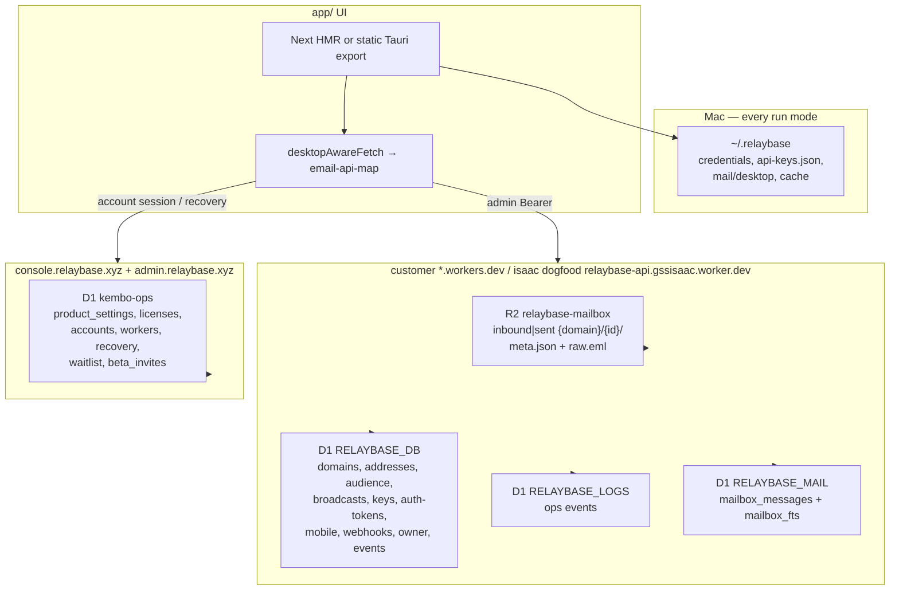

# Storage architecture — D1 + R2 + `~/.relaybase`

**Audience:** humans and coding agents changing where product data lives, API routing, D1/KV/R2 bindings, or desktop persistence.

**Rule:** Relaybase has **two** durable layers. Do not reintroduce Next userdata, cookie multi-tenant stores, or a Cloudflare KV binding on the product Worker. The product Worker's durable product state lives in D1 `relaybase-db` (binding `RELAYBASE_DB`).

| Layer | Where | Role |
|-------|--------|------|
| **Remote** | D1 `RELAYBASE_DB` (binding in `server/wrangler.toml`; Drizzle in `server/db/app/`) | All durable product state: `domains`, `addresses`, `audience_groups`, `audience_contacts`, `broadcasts`, `domain_branding`, `api_keys`, `auth_tokens`, `mobile_passwords`, `webhooks` / `webhook_secrets` / `webhook_fails`, `owner_config` (including recovered `admin_token`), `inbound_events` (TTL replaced by `expires_at`). See **[audience-and-broadcasts.md](./audience-and-broadcasts.md)**. |
| **Remote** | Product Worker R2 `relaybase-mailbox` (binding `INBOUND`) | Mail atoms: `inbound/{domain}/{id}/` and `sent/{domain}/{id}/` (thin `meta.json` + `raw.eml` + attachments) and send logs (`sent/_sendlog/{id}.json`, no `_index.json`). R2 is the source of truth. See **[mailbox-r2.md](./mailbox-r2.md)**. |
| **Remote** | D1 `RELAYBASE_LOGS` (hosted only) | Product ops-event log: compose, API, broadcast sends and inbound bounces. R2 `sent/_sendlog/*` remains authoritative for send history. Drizzle schema/helper: `server/db/log/`. |
| **Remote** | D1 `RELAYBASE_MAIL` | Unified mail index: `mailbox_messages` (list/count/cursor, inbound **and** sent) + `mailbox_fts` (FTS5 search). Derived from R2 thin `meta.json` + `raw.eml`; fully rebuildable via `POST /console/rebuild-mail`. Drizzle schema/helper: `server/db/mail/`. See **[mailbox-d1.md](./mailbox-d1.md)**. **Replaces** the old `RELAYBASE_INBOX_INDEX` / `inbound_search_fts`. |
| **Remote** | D1 `kembo-ops` (binding `DB` on `kembo-admin` + `kembo-console` + `kembo-website`) | Shared Kembo store: `product_settings` (operator `workerUrl` + `adminToken` only), `licenses`, `accounts`, `account_workers`, `account_recovery`, `waitlist`, `beta_invites`. See **[kembo-ops-d1.md](./kembo-ops-d1.md)**. |
| **Local** | `~/.relaybase` | Credentials, API key plaintext vault (`api-keys.json`), mail/UI cache, dashboard cache, team login |

Account, license, billing, and recovery live on the central `console.relaybase.xyz` Next.js app (OpenNext on Cloudflare Workers), **not** on the product Worker. The product Worker no longer serves `/v1/license/*` or `/v1/waitlist` — those moved to the console.

Local Mac layout and Tauri commands: **[relaybase-home-storage.md](./relaybase-home-storage.md)**.  
Audience/broadcast product rules: **[audience-and-broadcasts.md](./audience-and-broadcasts.md)**.

---

## Architecture



All run modes (`pnpm next`, `tauri dev`, packaged `.app`) use the **same** product path: map `/api/email/*` → product Worker `/console/*` (management) and `/mail/*` (mail operations) via [`app/src/lib/desktop/email-api-map.ts`](../app/src/lib/desktop/email-api-map.ts) and [`desktopAwareFetch`](../app/src/lib/desktop/api-base.ts). Account/license/billing calls go to `console.relaybase.xyz` (`/api/v1/account`, `/api/v1/license`, `/api/v1/billing`). There is no Next `/api/email` product store and no cookie `relaybase_user` login.

Local operator id is always `"desktop"` → `~/.relaybase/mail/desktop/`.

---

## Remote — D1 `RELAYBASE_DB` (durable product state)

Binding: `server/wrangler.toml` → `RELAYBASE_DB` (database `relaybase-db`).  
Env type: `server/src/env.ts`.  
Drizzle schema + helpers: `server/db/app/` (`schema.ts`, `index.ts`, and one helper per table: `mailbox.ts`, `audience.ts`, `broadcasts.ts`, `keys.ts`, `auth-tokens.ts`, `branding.ts`, `mobile.ts`, `webhooks.ts`, `owner.ts`, `inbound-events.ts`).  
Migrations: `server/db/app/migrations/` — applied by the Worker via **`POST /console/init-db`** (empty D1 only) or **`POST /console/migrate-db`** (existing D1 / Worker update). The desktop never runs SQL. Ledger + baseline catch-up policy: **[d1-migrations-and-init-db.md](./d1-migrations-and-init-db.md)**.

This is the **sole source of truth** for product catalog state. No KV binding on the product Worker.

### Admin auth

Admin auth is the `ADMIN_TOKEN` wrangler secret, plus an optional D1 `owner_config.admin_token` override written by `/console/recover-admin` when the owner resets a lost token without Wrangler.

### What stays in R2 (source of truth for mail atoms)

- Mail atoms (`inbound/{domain}/{id}/` and `sent/{domain}/{id}/`: thin `meta.json` + `raw.eml` + attachments) — see **[mailbox-r2.md](./mailbox-r2.md)**.
- Send logs (`sent/_sendlog/{id}.json`, no `_index.json`) — authoritative for Account Logs and admin send-log reads.

### HTTP surface (Bearer admin token)

The product Worker resolves Cloudflare credentials and the admin token from wrangler secrets (`CF_ACCOUNT_ID`, `CF_API_TOKEN`, `ADMIN_TOKEN`), set via the desktop install flow. The admin Next.js server proxies to the Worker's `/console/*` routes. The Worker exposes:

| Route | Purpose |
|-------|---------|
| `/console/mailbox`, `/console/domains`, `/console/addresses` | Catalog mailbox CRUD |
| `/console/audience-groups` (+ contacts/sync/progress) | Audience |
| `/console/broadcasts` (+ send/progress) | Broadcasts |
| `/console/keys` (+ rotate, PATCH active) | API keys |
| `/console/auth-tokens` (POST issue / GET list / DELETE revoke / POST verify) | Dashboard auth tokens (`rb-auth-…`) — stored hash-only in D1 `auth_tokens`; plaintext returned once at issue |
| `/console/ops-logs` | Ops event log (D1 `RELAYBASE_LOGS`) |
| `/console/send-logs` | Send history read from R2 `sent/_sendlog/*` (admin Logs page / Sent tab) |
| `/console/rebuild-mail` | One-time backfill: thin inbound metas, materialize sent folders, fill `mailbox_messages` + `mailbox_fts`, delete legacy array JSON keys |
| `/console/mailbox-health` | Per-domain last inbound/sent freshness + stale flag (D1 `RELAYBASE_MAIL`) |
| `/console/branding` (GET status / PUT merge / POST apply DNS) | Per-domain DMARC config in D1 `domain_branding` + DMARC TXT via the Worker's Cloudflare client |
| `/console/connect` | Desktop self-install probe (admin-token proof) |
| `/console/register-owner` | Record the console account that owns this Worker (admin token; for ADMIN_TOKEN recovery) |
| `/console/recover-admin` | Reset ADMIN_TOKEN via a one-time console recovery token (unauth by design; verifies with `console.relaybase.xyz`) |
| `/console/stats`, `/console/stats/account-*` | Dashboard stats / per-account |
| `/console/addresses/mobile-password` | Per-account mobile password (admin token) |
| `/mail/inbox`, `/mail/send`, `/mail/favicon`, … | Mail I/O (desktop / admin token). Favicon proxy: **[sender-favicon-cache.md](./sender-favicon-cache.md)** |
| `/mobile/*` | Flutter companion + desktop team-user login (mobile-password auth; single-account scope) — **[mobile-email-companion.md](./mobile-email-companion.md)** |

Account / license / billing / recovery-token issuance are on `console.relaybase.xyz` (`/api/v1/account`, `/api/v1/license`, `/api/v1/billing`, `/api/v1/recovery/verify-admin-token`), not on the product Worker.

Cron: `server/wrangler.toml` `*/15 * * * *` → `runAudienceCron` in `server/src/index.ts` (single catalog, no per-user fan-out).

### R2 `INBOUND` (bucket `relaybase-mailbox`)

Bucket name, key prefixes, send-log move, and copy scripts: **[mailbox-r2.md](./mailbox-r2.md)**.

```text
inbound/{domain}/{id}/meta.json | raw.eml | attachments/{aid}-{name}
inbound/{domain}/by-message-id/{encodedMessageId}     # pointer → id

sent/{domain}/{id}/meta.json | raw.eml | attachments/{aid}-{name}
sent/{domain}/by-message-id/{encodedMessageId}

sent/_sendlog/{uuid}.json                            # no _index.json
```

R2 holds **one folder per mail**. `meta.json` is THIN (headers + `bodyPreview` ≤500 chars + attachments + `readAt`/`occurredAt` + `hasText`/`hasHtml`); it **never** contains `bodyText`/`bodyHtml` — detail APIs parse `raw.eml` on demand. There is **no per-domain array JSON** (`_list.json` / `_sent.json`) anymore — list/counts/search come from D1 `RELAYBASE_MAIL`. Message-ID dedupe uses the single-key `by-message-id/{id}` pointer (no full-domain scan). Retention is the most recent 5000 messages per (kind, domain), pruned via D1. `~/.relaybase/mail/desktop/inbox.json` is cache only.

`sent/{domain}/{id}/` is the per-message stored-sent atom (compose, API send). Historical sent imported from legacy `_list.json` has no `raw.eml` (preview-only). Operational send history (ok/fail, API key, bounce) lives at `sent/_sendlog/*` and is read by `/console/send-logs`. The Worker binding name stays `INBOUND`; the Cloudflare bucket is `relaybase-mailbox`.

`RELAYBASE_LOGS`.`ops_log` (`lib/ops-logs.ts`) is the dashboard Log page event stream (compose/API/broadcast sends + inbound bounces).

### D1 `RELAYBASE_MAIL` (mail index — list / counts / search)

Binding `RELAYBASE_MAIL` (database `relaybase-mail`), Drizzle in `server/db/mail/`. Two tables: `mailbox_messages` (list/count/cursor, inbound **and** sent) and `mailbox_fts` (FTS5 over subject/from/to/cc/body). Derived from R2 thin `meta.json` + `raw.eml`; synced best-effort on ingest/prune/read-state and fully rebuildable via `POST /console/rebuild-mail`. Queried by `GET /mail/inbox`, `/mail/inbox/counts`, `/mail/inbox/search`, `/mail/sent`, `/v1/inbox/messages*`, and `/mobile/inbox*` (account-scoped via the `recipients` column). Without the binding those endpoints return **503** (no silent `_list.json` fallback).

Full design (schema, query safety, sync model, backfill, freshness): **[mailbox-d1.md](./mailbox-d1.md)**. R2 layout: **[mailbox-r2.md](./mailbox-r2.md)**.

### Forbidden (do not reintroduce)

- Cloudflare KV binding on the product Worker for app data
- Cloudflare credentials (`CF_ACCOUNT_ID` / `CF_API_TOKEN`) stored in Kembo ops — the Worker reads them from wrangler secrets; D1 `kembo-ops` `product_settings` holds only `workerUrl` + `adminToken` (operator config)
- End-user dashboard auth tokens (`rb-auth-…`) or plaintext API keys stored in `kembo-ops` — tokens live in the product Worker's D1 `auth_tokens` (hash-only); plaintext API keys live only in `~/.relaybase/api-keys.json`
- Global mobile password (no per-account row) — use the per-account row in D1 `mobile_passwords` only
- Next `userdata:{userId}` / `data/users/*.json` / `DevUserEmailData`
- Hosted OpenNext `app.relaybase.xyz` as a product API (removed)
- Cookie multi-tenant sessions for the Mac product

Customer install template: three D1 databases (`relaybase-db`, `relaybase-logs`, `relaybase-mail`) bound as `RELAYBASE_DB` / `RELAYBASE_LOGS` / `RELAYBASE_MAIL` — no KV. See `server/customer-install/`.

---

## Remote — D1 `kembo-ops` (console + admin)

Binding: `DB` on `kembo/console/wrangler.jsonc`, `kembo/admin/wrangler.jsonc`, and `kembo/website/wrangler.jsonc` (database `kembo-ops`). Drizzle schema: `kembo/console/src/db/schema.ts`. Full rules: **[kembo-ops-d1.md](./kembo-ops-d1.md)**.

Operator config lives in `product_settings` (`service_id=relaybase`, `filename=settings.json`):

| Field | Purpose |
|-------|---------|
| `workerUrl` | Product Worker URL — admin proxies `/console/*` and `/mail/send` here |
| `adminToken` | Service admin token. Must match the Worker's `ADMIN_TOKEN` wrangler secret. Also authorizes the console license proxy (`kembo/admin/src/app/api/licenses/route.ts`) |

Licenses, console accounts, worker registration, recovery tokens, the legacy waitlist, and public beta invites (`beta_invites`) are the other tables in the same database. The marketing site Worker reads/writes `beta_invites` only. Legacy KV `KEMBO_OPS` / `KEMBO_LICENSES` and D1 `kembo-accounts` are not bound anymore.

Cloudflare credentials, DMARC branding, and send logs are **not** stored here:

- CF credentials → Worker wrangler secrets `CF_ACCOUNT_ID` / `CF_API_TOKEN` (set by the desktop install flow). The install token is obtained via Cloudflare OAuth (PKCE; callback on `console.relaybase.xyz`); access + refresh tokens live only in `~/.relaybase/credentials.json`. See **[cf-oauth-install-token.md](./cf-oauth-install-token.md)**.
- DMARC branding → Worker D1 `domain_branding` via `/console/branding`.
- Send logs → Worker R2 `sent/_sendlog/*` via `/console/send-logs`.

Legacy settings fields (`workerScriptName`, `cloudflareAccountId`, `cloudflareApiToken`, …) are still read for migration but never written back.

---

## Local — `~/.relaybase`

See **[relaybase-home-storage.md](./relaybase-home-storage.md)** for the full tree and Tauri commands.

Highlights for the consolidated model:

| Path | Purpose |
|------|---------|
| `credentials.json` | Worker URL + admin token (+ CF account id + install token, now sourced from CF OAuth; + server token pushed to the Worker as `CF_API_TOKEN` during install/Settings) |
| `api-keys.json` | Plaintext API secrets (Worker has hashes only) |
| `email.json` | Account colors |
| `mail/desktop/**` | Mail + UI cache; fixed userId |
| `cache/dashboard/**` | Dashboard + TTL API caches |

Browser `pnpm next` (no Tauri): credentials via `/api/local-credentials` reading the same `credentials.json`. Still not a second product database.

`localStorage` = hydrate mirror only.

---

## Client mapping checklist

When adding a dashboard/email feature that needs durable remote data:

1. Persist in D1 `RELAYBASE_DB` under `server/db/app/` (new Drizzle table + helper module) — **not** under `app/` FS and **not** in Cloudflare KV.
2. Expose `/console/…` (management) or `/mail/…` (mail ops) with `requireAdmin` + CORS (`server/src/lib/cors.ts`). Operator-only endpoints belong in the admin Next.js server, not the worker.
3. Map `/api/email/…` → that route in `email-api-map.ts`.
4. Call through `desktopAwareFetch` / `readResponseJson` — never raw `fetch` to Next `/api/email` in the UI.
5. Cache on disk under `~/.relaybase/cache/…` if the UI needs offline/stale-while-revalidate.

When adding local-only UX state (sidebar, enabled accounts, drafts cache): use `~/.relaybase` Tauri facades — see home-storage doc.

---

## Data → source of truth

| Concern | Source of truth | Local cache |
|---------|-----------------|-------------|
| Worker connection | `~/.relaybase/credentials.json` | window globals |
| Domains / addresses | D1 `RELAYBASE_DB` (`domains`, `addresses`) | `cache/dashboard/addresses-*` |
| Enabled mail accounts | `mail/desktop/ui/enabled-accounts.json` | localStorage mirror |
| Accounts domain card expand | `mail/desktop/ui/accounts.json` | localStorage mirror |
| Inbox / unread | R2 thin `meta.json` (`readAt`) + D1 `mailbox_messages` | `mail/desktop/inbox.json`, `ui/read.json` |
| Audience / broadcasts | D1 `RELAYBASE_DB` (`audience_groups`, `audience_contacts`, `broadcasts`) | — |
| Sent history | R2 `sent/{domain}/{id}/` + `sent/_sendlog/{id}.json`, indexed by D1 `mailbox_messages` `kind=sent` | mail sent JSON optional |
| Mail list / search / counts | D1 `RELAYBASE_MAIL` (`mailbox_messages`, `mailbox_fts`) | `mail/desktop/inbox.json` |
| API key existence | D1 `RELAYBASE_DB` (`api_keys`) | `cache/dashboard/api-keys-*` |
| API key plaintext | `~/.relaybase/api-keys.json` | — |
| Dashboard auth tokens | D1 `RELAYBASE_DB` (`auth_tokens`, hash-only) | — |
| Webhooks | D1 `RELAYBASE_DB` (`webhooks`, `webhook_secrets`, `webhook_fails`) | — |
| Mobile passwords | D1 `RELAYBASE_DB` (`mobile_passwords`) | — |
| Owner config / recovered admin token | D1 `RELAYBASE_DB` (`owner_config`) | — |
| Pending inbound events | D1 `RELAYBASE_DB` (`inbound_events`, `expires_at`) | — |
| Waitlist | D1 `kembo-ops` (`waitlist`) | — |
| Beta invites | D1 `kembo-ops` (`beta_invites`) | — |
| Console accounts / licenses | D1 `kembo-ops` (`accounts`, `licenses`, …) | — |

---

## Agent checklist

1. Do **not** add `DevUser*` / `userdata:` / repo `data/users` for product state.
2. Do **not** add a Cloudflare KV binding on the product Worker for app data.
3. New durable product fields go in D1 `RELAYBASE_DB` (`server/db/app/` Drizzle schema + helper).
4. Packaged and `next`/Tauri must share one fetch path — no `isPackagedDesktopShell`-only product API.
5. Plaintext secrets that the Worker cannot store → `~/.relaybase` only (`credentials.json`, `api-keys.json`).
