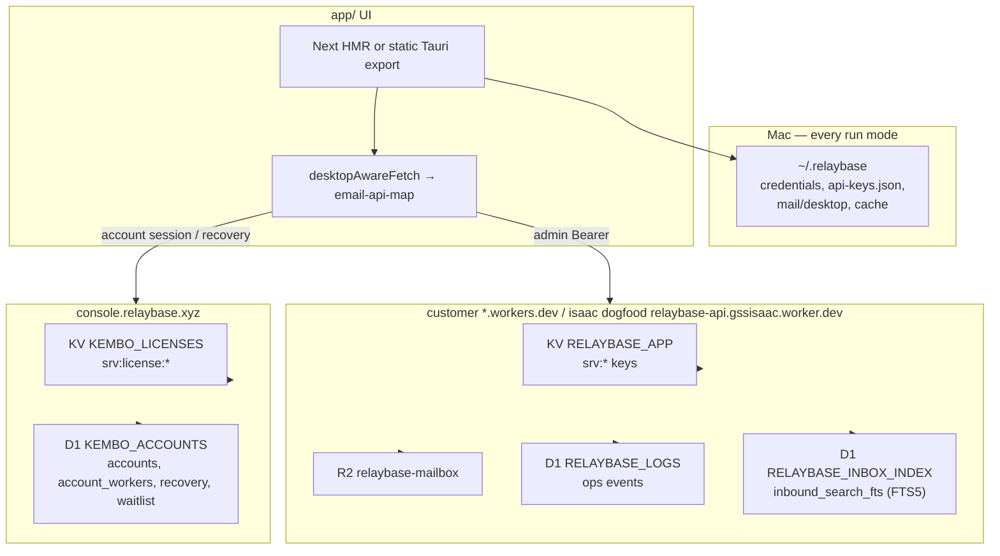

# Storage architecture — Worker KV + `~/.relaybase`

**Audience:** humans and coding agents changing where product data lives, API routing, KV bindings, or desktop persistence.

**Rule:** Relaybase has **two** durable layers. Do not reintroduce Next userdata, cookie multi-tenant stores, or a second Worker KV namespace for app data.

| Layer | Where | Role |
|-------|--------|------|
| **Remote** | Product Worker `RELAYBASE_APP` KV (+ R2 mailbox) | Domains, addresses, audience, broadcasts, API key hashes, dashboard auth token hashes (`srv:authtoken:*`), webhooks |
| **Remote** | D1 `RELAYBASE_LOGS` (hosted only) | Product ops-event log: compose, API, broadcast sends and inbound bounces. R2 `sent/_sendlog/*` remains authoritative for send history. |
| **Remote** | D1 `RELAYBASE_INBOX_INDEX` (optional) | FTS5 full-text search index over inbound mail (`inbound_search_fts`). Derived from R2 — R2 `meta.json` stays authoritative; the index is rebuildable via `server/scripts/backfill-inbound-search.mjs`. See **[inbound-search-d1-fts5.md](./inbound-search-d1-fts5.md)**. |
| **Remote** | Kembo operations KV `KEMBO_OPS` (`kembo/admin`, worker `kembo-admin`) | Operator config only: product Worker URL + service admin token (`workerUrl`, `adminToken`). **Never** Cloudflare credentials, end-user tokens, or plaintext API keys. |
| **Remote** | Console `KEMBO_ACCOUNTS` D1 (`kembo-accounts`) + `KEMBO_LICENSES` KV (`kembo-licenses`) (`console.relaybase.xyz`, worker `kembo-console`) | Accounts, account_workers, account_recovery, waitlist; license records (tier/stripe/subscription) |
| **Local** | `~/.relaybase` | Credentials, API key plaintext vault (`api-keys.json`), mail/UI cache, dashboard cache, team login |

Account, license, billing, and recovery live on the central `console.relaybase.xyz` Next.js app (OpenNext on Cloudflare Workers), **not** on the product Worker. The product Worker no longer serves `/v1/license/*` or `/v1/waitlist` — those moved to the console.

Local Mac layout and Tauri commands: **[relaybase-home-storage.md](./relaybase-home-storage.md)**.  
Audience/broadcast product rules: **[audience-and-broadcasts.md](./audience-and-broadcasts.md)**.

---

## Architecture



All run modes (`pnpm next`, `tauri dev`, packaged `.app`) use the **same** product path: map `/api/email/*` → product Worker `/console/*` (management) and `/mail/*` (mail operations) via [`app/src/lib/desktop/email-api-map.ts`](../app/src/lib/desktop/email-api-map.ts) and [`desktopAwareFetch`](../app/src/lib/desktop/api-base.ts). Account/license/billing calls go to `console.relaybase.xyz` (`/api/v1/account`, `/api/v1/license`, `/api/v1/billing`). There is no Next `/api/email` product store and no cookie `relaybase_user` login.

Local operator id is always `"desktop"` → `~/.relaybase/mail/desktop/`.

---

## Remote — Worker KV `RELAYBASE_APP`

Binding: `server/wrangler.toml` → `RELAYBASE_APP` (single namespace).  
Env type: `server/src/env.ts`.

Every key is prefixed with `srv:` so app/catalog data never collides with other uses of the same namespace.

| Key pattern | Module | Contents |
|-------------|--------|----------|
| `srv:config:admin` | `lib/auth.ts` | Legacy admin token JSON `{ token }` — superseded by the `ADMIN_TOKEN` wrangler secret; cleared by `scripts/clear-worker-bootstrap-kv.mjs` |
| `srv:config:cloudflare` | `lib/cloudflare-config.ts` | Legacy CF account id + API token — superseded by `CF_ACCOUNT_ID` / `CF_API_TOKEN` wrangler secrets; cleared by `scripts/clear-worker-bootstrap-kv.mjs` |
| `srv:catalog:branding` | `lib/branding.ts` | Per-domain DMARC config `{ dmarcPolicy, dmarcRua }` (managed via `/console/branding`) |
| `srv:catalog:mailbox` | `lib/catalog-store.ts` | `{ domains[], addresses[] }` — each address: `email`, `domain`, optional `displayName`, optional `inboundEnabled` (`false` = CF Email Routing `drop`; omit/true = Worker receive), optional `mobileEnabled` (`false` = hide from mobile; omit/true = allowed when password set) |
| `srv:config:mobile:{email}` | `lib/mobile-config.ts` | Per-account mobile password `{ passwordHash, salt, updatedAt }` — see **[mobile-email-companion.md](./mobile-email-companion.md)** |
| `srv:catalog:audience` | `lib/catalog-audience.ts` | Flat contacts |
| `srv:catalog:audience-groups` | `lib/catalog-audience.ts` | Groups, dataSource, sync progress/history |
| `srv:catalog:broadcasts` | `lib/catalog-broadcasts.ts` | Drafts + send progress/history |
| `srv:key:{sha256}` / `srv:id:{uuid}` | `lib/keys.ts` | API key records (**hash only**, no plaintext) |
| `srv:authtoken:{id}` / `srv:authtoken:hash:{sha256}` / `srv:authtoken:_index` | `lib/auth-tokens.ts` | Dashboard auth token records (**hash only**; plaintext returned once at issue via `POST /console/auth-tokens`) |
| `srv:config:owner:email` / `srv:config:owner:worker_url` | `routes/console/register-owner.ts` | Console account that owns this Worker (for ADMIN_TOKEN recovery) |
| `srv:event:pending:{domain}:{id}` | `lib/inbound-events.ts` | Inbox notification queue |
| `srv:webhook:*` | `lib/webhooks.ts` | Webhook regs / secrets / fail markers |

### HTTP surface (Bearer admin token)

The product Worker resolves Cloudflare credentials and the admin token from wrangler secrets (`CF_ACCOUNT_ID`, `CF_API_TOKEN`, `ADMIN_TOKEN`), set via the desktop install flow. The legacy `srv:config:cloudflare` / `srv:config:admin` KV bootstrap keys are cleared by `scripts/clear-worker-bootstrap-kv.mjs`. The admin Next.js server no longer writes the Worker's KV directly — it proxies to the Worker's `/console/*` routes. The Worker exposes:

| Route | Purpose |
|-------|---------|
| `/console/mailbox`, `/console/domains`, `/console/addresses` | Catalog mailbox CRUD |
| `/console/audience-groups` (+ contacts/sync/progress) | Audience |
| `/console/broadcasts` (+ send/progress) | Broadcasts |
| `/console/keys` (+ rotate, PATCH active) | API keys |
| `/console/auth-tokens` (POST issue / GET list / DELETE revoke / POST verify) | Dashboard auth tokens (`rb-auth-…`) — stored hash-only at `srv:authtoken:*`; plaintext returned once at issue |
| `/console/ops-logs` | Ops event log (D1 `RELAYBASE_LOGS`) |
| `/console/send-logs` | Send history read from R2 `sent/_sendlog/*` (admin Logs page / Sent tab) |
| `/console/branding` (GET status / PUT merge / POST apply DNS) | Per-domain DMARC config at `srv:catalog:branding` + DMARC TXT via the Worker's Cloudflare client |
| `/console/connect` | Desktop self-install probe (admin-token proof) |
| `/console/register-owner` | Record the console account that owns this Worker (admin token; for ADMIN_TOKEN recovery) |
| `/console/recover-admin` | Reset ADMIN_TOKEN via a one-time console recovery token (unauth by design; verifies with `console.relaybase.xyz`) |
| `/console/stats`, `/console/stats/account-*` | Dashboard stats / per-account |
| `/console/addresses/mobile-password` | Per-account mobile password (admin token) |
| `/mail/inbox`, `/mail/send`, `/mail/favicon`, … | Mail I/O (desktop / admin token). Favicon proxy: **[sender-favicon-cache.md](./sender-favicon-cache.md)** |
| `/mobile/*` | Flutter companion + desktop team-user login (mobile-password auth; single-account scope) — **[mobile-email-companion.md](./mobile-email-companion.md)** |

Account / license / billing / recovery-token issuance are on `console.relaybase.xyz` (`/api/v1/account`, `/api/v1/license`, `/api/v1/billing`, `/api/v1/recovery/verify-admin-token`), not on the product Worker.

Cron: `server/wrangler.toml` `*/15 * * * *` → `runAudienceCron` in `server/src/index.ts` (single catalog, no per-user fan-out).

### R2 `INBOUND` (bucket `relaybase-mailbox`)

Bucket rename, key prefixes, KV → R2 send-log move, and copy scripts: **[mailbox-r2.md](./mailbox-r2.md)**.

```text
inbound/{domain}/_list.json
inbound/{domain}/{messageId}/meta.json | raw.eml | attachments/…
inbound/{domain}/by-message-id/{encodedMessageId}

sent/{domain}/_list.json
sent/_sendlog/_index.json
sent/_sendlog/{uuid}.json
```

Inbound message body + `readAt` live under `inbound/`. `_list.json` is the compact per-domain list index (no bodyText/bodyHtml) used by `GET /mail/inbox` cursor pages — it also drives the `total`/`unread` counts echoed on list responses and the `/mail/inbox/counts` aggregate. `~/.relaybase/mail/desktop/inbox.json` is cache only. Retention is the most recent 5000 messages per domain.

`sent/{domain}/_list.json` is the per-domain stored-sent index (compose, API send, Takeout import). `GET /mail/sent` serves cursor pages (`limit`/`before`) and substring search (`q`) from it. Operational send history (ok/fail, API key, bounce) lives at `sent/_sendlog/*` and is read by `/console/send-logs`. The Worker binding name stays `INBOUND`. The Cloudflare bucket is `relaybase-mailbox` (new installs and this dogfood account). Legacy installs may still use `relaybase-inbound` until copied. Both use the same `inbound/` and `sent/` key prefixes. Legacy `inbound/{domain}/_sent.json` is still read if the new key is missing.

`RELAYBASE_LOGS`.`ops_log` (`lib/ops-logs.ts`) is the dashboard Log page event stream (compose/API/broadcast sends + inbound bounces).

### D1 `RELAYBASE_INBOX_INDEX` (search index)

Optional binding (`server/wrangler.toml`, `migrations-inbox/`). One FTS5 table `inbound_search_fts`; indexed columns: subject, from, to, cc, body text. Synced best-effort by `server/src/lib/inbound-store.ts` (insert on ingest, delete on prune, `read_at` on mark-read) — R2 stays the source of truth, so the index can always be rebuilt with `server/scripts/backfill-inbound-search.mjs`. Queried by `GET /mail/inbox/search`, `/v1/inbox/messages/search`, and `/mobile/inbox/search` (account-scoped) via `server/src/lib/inbound-search.ts`. Without the binding those endpoints return 503 and the desktop falls back to local filtering.

Full design (schema, query safety, sync call sites, backfill, client wiring, list-header counts, Sent pagination): **[inbound-search-d1-fts5.md](./inbound-search-d1-fts5.md)**.

### Forbidden (do not reintroduce)

- Second KV binding for app data (`KEYS`, `RELAYBASE_API` on the mail Worker)
- Cloudflare credentials (`CF_ACCOUNT_ID` / `CF_API_TOKEN`) or the admin token stored in `KEMBO_OPS` — the Worker reads them from wrangler secrets; `KEMBO_OPS` holds only `workerUrl` + `adminToken` (operator config)
- End-user dashboard auth tokens (`rb-auth-…`) or plaintext API keys stored in `KEMBO_OPS` (kembo operations KV) — tokens live in the product Worker's `RELAYBASE_APP` KV (`srv:authtoken:*`, hash-only); plaintext API keys live only in `~/.relaybase/api-keys.json`
- Unprefixed legacy keys (`config:mailbox`, bare `id:`, `key:`) — use `srv:` + migration script `server/scripts/migrate-kv-prefix.mjs`
- Global mobile password at `srv:config:mobile` (no email suffix) — use `srv:config:mobile:{email}` only
- Next `userdata:{userId}` / `data/users/*.json` / `DevUserEmailData`
- Hosted OpenNext `app.relaybase.xyz` as a product API (removed)
- Cookie multi-tenant sessions for the Mac product

Customer install template: one KV `relaybase-app` bound as `RELAYBASE_APP` — see `server/customer-install/`.

---

## Remote — Kembo operations KV `KEMBO_OPS`

Binding: `kembo/admin/wrangler.jsonc` → `KEMBO_OPS`. The admin Next.js server reads/writes one key: `product:relaybase:settings.json` (store id `relaybase`, file `settings.json`), holding only operator config:

| Field | Purpose |
|-------|---------|
| `workerUrl` | Product Worker URL (e.g. `https://relaybase-api.<subdomain>.workers.dev`) — admin proxies `/console/*` and `/mail/send` here |
| `adminToken` | Service admin token. Must match the Worker's `ADMIN_TOKEN` wrangler secret. Also authorizes the console license proxy (`kembo/admin/src/app/api/licenses/route.ts`) |

Cloudflare credentials, DMARC branding, and send logs are **not** stored here:

- CF credentials → Worker wrangler secrets `CF_ACCOUNT_ID` / `CF_API_TOKEN` (set by the desktop install flow).
- DMARC branding → Worker KV `srv:catalog:branding` via `/console/branding`.
- Send logs → Worker R2 `sent/_sendlog/*` via `/console/send-logs`.

Legacy fields (`workerScriptName`, `cloudflareAccountId`, `cloudflareApiToken`, `cloudflareZoneId`, `cloudflareDnsApiToken`, `inboundR2BucketName`, `domainBranding`, `sentEmails`, `dashboardAuthTokens`, `apiKeyVault`) are still read for migration but never written back. Strip them from existing settings.json files on save.

---

## Local — `~/.relaybase`

See **[relaybase-home-storage.md](./relaybase-home-storage.md)** for the full tree and Tauri commands.

Highlights for the consolidated model:

| Path | Purpose |
|------|---------|
| `credentials.json` | Worker URL + admin token (+ CF account id + API token, pushed to the Worker as `CF_ACCOUNT_ID` / `CF_API_TOKEN` secrets during install) |
| `api-keys.json` | Plaintext API secrets (Worker has hashes only) |
| `email.json` | Account colors |
| `mail/desktop/**` | Mail + UI cache; fixed userId |
| `cache/dashboard/**` | Dashboard + TTL API caches |

Browser `pnpm next` (no Tauri): credentials via `/api/local-credentials` reading the same `credentials.json`. Still not a second product database.

`localStorage` = hydrate mirror only.

---

## Client mapping checklist

When adding a dashboard/email feature that needs durable remote data:

1. Persist in Worker under `srv:catalog:*` or an existing `srv:` family — **not** under `app/` FS/KV.
2. Expose `/console/…` (management) or `/mail/…` (mail ops) with `requireAdmin` + CORS (`server/src/lib/cors.ts`). Operator-only endpoints belong in the admin Next.js server, not the worker.
3. Map `/api/email/…` → that route in `email-api-map.ts`.
4. Call through `desktopAwareFetch` / `readResponseJson` — never raw `fetch` to Next `/api/email` in the UI.
5. Cache on disk under `~/.relaybase/cache/…` if the UI needs offline/stale-while-revalidate.

When adding local-only UX state (sidebar, enabled accounts, drafts cache): use `~/.relaybase` Tauri facades — see home-storage doc.

---

## Data → source of truth

| Concern | Source of truth | Local cache |
|---------|-----------------|-------------|
| Worker connection | `~/.relaybase/credentials.json` | window globals |
| Domains / addresses | `srv:catalog:mailbox` | `cache/dashboard/addresses-*` |
| Enabled mail accounts | `mail/desktop/ui/enabled-accounts.json` | localStorage mirror |
| Accounts domain card expand | `mail/desktop/ui/accounts.json` | localStorage mirror |
| Inbox / unread | R2 `meta.json` (`readAt`) | `mail/desktop/inbox.json`, `ui/read.json` |
| Audience / broadcasts | `srv:catalog:audience*` / `broadcasts` | — |
| Sent history | R2 `sent/{domain}/_list.json` + `sent/_sendlog/*` | mail sent JSON optional |
| API key existence | `srv:id:` / `srv:key:` | `cache/dashboard/api-keys-*` |
| API key plaintext | `~/.relaybase/api-keys.json` | — |
| Waitlist | D1 `KEMBO_ACCOUNTS` (`kembo-accounts`, table `waitlist`) | — |

---

## Agent checklist

1. Do **not** add `DevUser*` / `userdata:` / repo `data/users` for product state.
2. Do **not** add a new Cloudflare KV binding beside `RELAYBASE_APP` for the mail Worker.
3. New KV keys must start with `srv:` (or live under `srv:catalog:` for catalog blobs).
4. Packaged and `next`/Tauri must share one fetch path — no `isPackagedDesktopShell`-only product API.
5. Plaintext secrets that the Worker cannot store → `~/.relaybase` only (`credentials.json`, `api-keys.json`).
